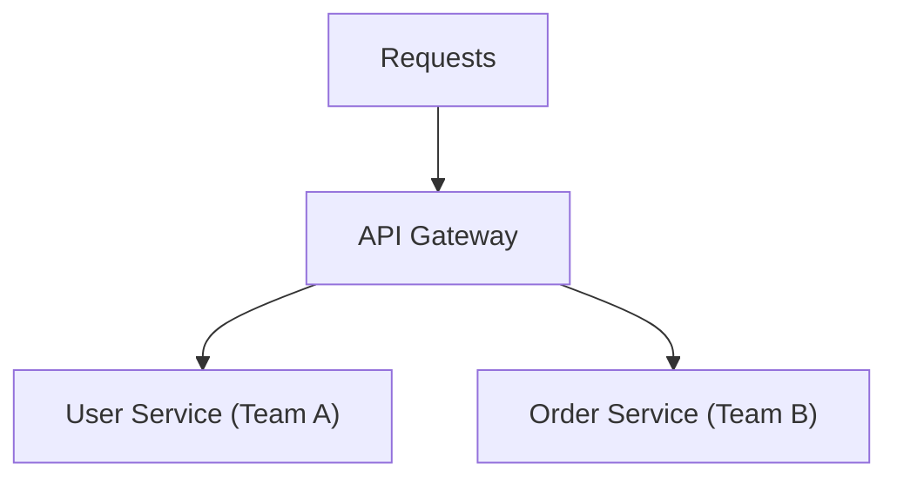
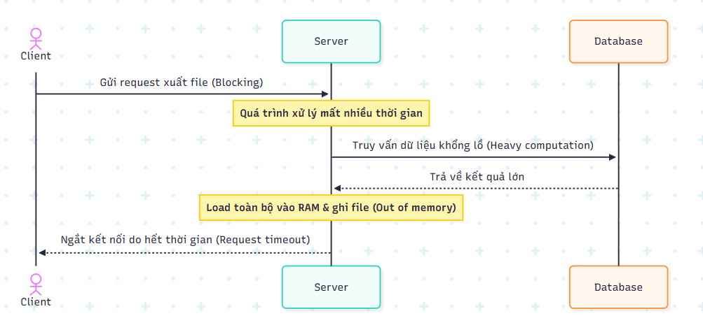
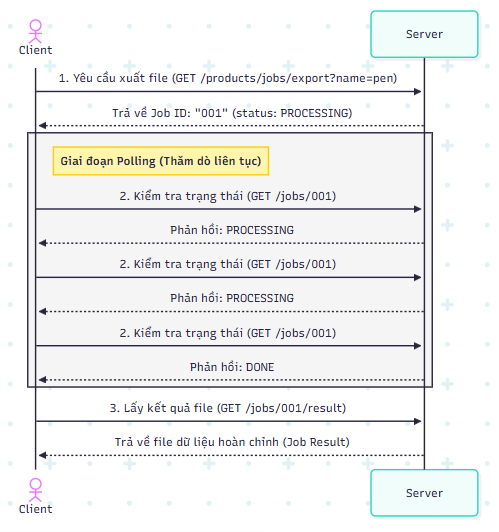
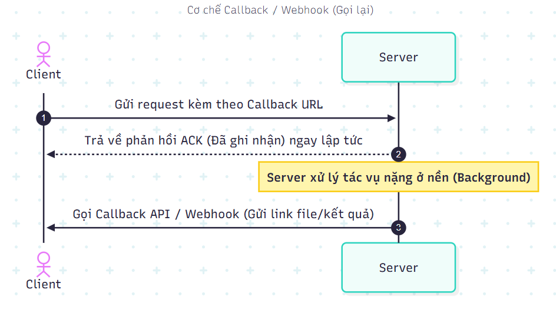
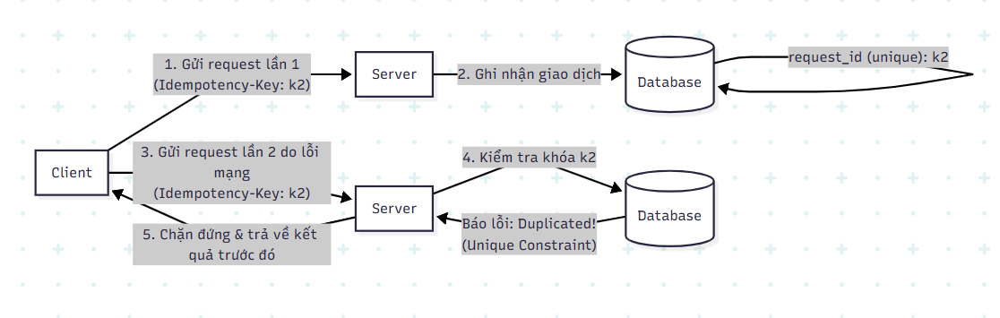

# Tài liệu Thiết kế RESTful API (RESTful API Design Guide)

<details open>
<summary><b>Mục lục (Table of Contents)</b></summary>

- [1. Tư duy Thiết kế (Mindset)](#1-tư-duy-thiết-kế-mindset)
  - [1.1. Tại sao cần Thiết kế Trước (Why Design First?)](#11-tại-sao-cần-thiết-kế-trước-why-design-first)
  - [1.2. Tư duy khi thiết kế (Mindset)](#12-tư-duy-khi-thiết-kế-mindset)
- [2. Quy chuẩn REST (REST Conventions)](#2-quy-chuẩn-rest-rest-conventions)
  - [2.1. Phương thức HTTP (HTTP Methods)](#21-phương-thức-http-http-methods)
  - [2.2. Quy ước Thiết kế RESTful API (RESTful API Conventions)](#22-quy-ước-thiết-kế-restful-api-restful-api-conventions)
  - [2.3. Bài tập Thực hành 1 (Exercise 1)](#23-bài-tập-thực-hành-1-exercise-1)
  - [2.4. Phân trang (Pagination)](#24-phân-trang-pagination)
  - [2.5. Sắp xếp dữ liệu (Sorting)](#25-sắp-xếp-dữ-liệu-sorting)
  - [2.6. Thiết kế Mối quan hệ Tài nguyên (Relations)](#26-thiết-kế-mối-quan-hệ-tài-nguyên-relations)
- [3. Nghiên cứu tình huống (Case Studies)](#3-nghiên-cứu-tình-huống-case-studies)
  - [3.1. Bài toán 2: Xuất file dữ liệu lớn (Problem 02: Exporting a Large File)](#31-bài-toán-2-xuất-file-dữ-liệu-lớn-problem-02-exporting-a-large-file)
    - [3.1.1. Vấn đề của phương pháp đồng bộ (Synchronous Issues)](#311-vấn-đề-của-phương-pháp-đồng-bộ-synchronous-issues)
    - [3.1.2. Giải pháp: Thăm dò trạng thái - Polling (Async API)](#312-giải-pháp-thăm-dò-trạng-thái---polling-async-api)
  - [3.2. So sánh các cơ chế API Bất đồng bộ (Types of Async API)](#32-so-sánh-các-cơ-chế-api-bất-đồng-bộ-types-of-async-api)
  - [3.3. Bài toán 3: Tránh trùng lặp yêu cầu - Tính bất biến (Idempotency)](#33-bài-toán-3-tránh-trùng-lặp-yêu-cầu---tính-bất-biến-idempotency)
- [4. Viết Tài liệu API (Writing API Document)](#4-viết-tài-liệu-api-writing-api-document)
  - [4.1. Tài nguyên Tham khảo (Resources)](#41-tài-nguyên-tham-khảo-resources)
  - [4.2. Các lưu ý quan trọng khi viết Tài liệu (Guidelines)](#42-các-lưu-ý-quan-trọng-khi-viết-tài-liệu-guidelines)
- [5. Tổng kết (Recap)](#5-tổng-kết-recap)

</details>

---

# 1. Tư duy Thiết kế (Mindset)

## 1.1. Tại sao cần Thiết kế Trước (Why Design First?)

*   **Hình dung cách hệ thống hoạt động ở mức tổng quan (high-level):**
    *   Giúp bao quát và xử lý hầu hết các trường hợp có thể xảy ra (use cases/edge cases).
    *   Giảm thiểu lãng phí tài nguyên và công sức lập trình (tránh việc phải lập trình lại nhiều lần do sai lệch thiết kế gốc).
*   **Phối hợp tốt hơn giữa các đội ngũ (Better coordination among other teams):**
    *   Giúp các nhóm Frontend, Backend, QA/Tester và các bên liên quan thống nhất về giao tiếp, cấu trúc dữ liệu và luồng nghiệp vụ ngay từ đầu.
*   **Một thiết kế tốt định hình năng lực của bạn:**
    *   Thiết kế tốt giúp bạn trở thành một kỹ sư giỏi (good engineer) và là một ứng viên tiềm năng đầy giá trị trong mắt nhà tuyển dụng (potential employee).

## 1.2. Tư duy khi thiết kế (Mindset)

*   **Khả năng mở rộng (Scalable):** Đảm bảo thiết kế API có khả năng chịu tải tốt và dễ dàng mở rộng khi hệ thống phát triển mà không làm phá vỡ cấu trúc cũ.
*   **Tính nhất quán (Consistency):** Đạt sự đồng bộ cao trong cách đặt tên endpoint, định dạng dữ liệu (date, time, currency), cấu trúc request/response body và cách quản lý mã lỗi.
*   **Xem xét tỉ mỉ mọi khía cạnh (Inspect every single aspect):** Từ bảo mật (authentication, authorization), xử lý lỗi (error handling) cho đến hiệu năng (caching, pagination, rate limiting).
*   **Không có giải pháp vạn năng (No one fits all - Trade-offs):** Mọi lựa chọn thiết kế đều đi kèm với sự đánh đổi (trade-offs). Kỹ sư cần phân tích kỹ lưỡng và đưa ra giải pháp cân bằng, phù hợp nhất với bài toán thực tế.

---

# 2. Quy chuẩn REST (REST Conventions)

## 2.1. Phương thức HTTP (HTTP Methods)

### Đặc tính quan trọng (Properties):
*   **Safety (An toàn):** Các phương thức không làm thay đổi trạng thái hoặc dữ liệu trên server (chỉ thực hiện đọc thông tin).
*   **Idempotency (Tính bất biến/Đồng nhất):** Gửi cùng một yêu cầu một lần hay nhiều lần liên tiếp đều mang lại kết quả giống nhau trên server (trạng thái tài nguyên trên server không bị thay đổi thêm sau lần gọi đầu tiên thành công).

### Các thao tác nghiệp vụ tương ứng (Operations):
*   **Tạo mới (Create):** Sử dụng `POST`
*   **Đọc dữ liệu (Read):** Sử dụng `GET`
*   **Cập nhật toàn bộ (Update Totally):** Sử dụng `PUT`
*   **Xóa/Vô hiệu hóa (Delete/Disable):** Sử dụng `DELETE`
*   **Cập nhật một phần (Update Partially):** Sử dụng `PATCH`

### Bảng tổng hợp đặc tính các Phương thức HTTP:

| HTTP Method | Safe | Idempotent | Mô tả thao tác |
| :--- | :---: | :---: | :--- |
| **GET** | **Yes** | **Yes** | Lấy thông tin tài nguyên mà không làm thay đổi trạng thái/dữ liệu trên server. |
| **HEAD** | **Yes** | **Yes** | Tương tự `GET` nhưng chỉ trả về HTTP Headers (không kèm theo response body). |
| **OPTIONS** | **Yes** | **Yes** | Truy vấn các phương thức HTTP được hỗ trợ cho tài nguyên chỉ định. |
| **TRACE** | **Yes** | **Yes** | Kiểm tra loop-back dọc theo đường dẫn truyền tới tài nguyên. |
| **PUT** | **No** | **Yes** | Ghi đè/thay thế toàn bộ tài nguyên hiện tại bằng dữ liệu mới. |
| **DELETE** | **No** | **Yes** | Xóa hoặc vô hiệu hóa trạng thái của tài nguyên cụ thể. |
| **POST** | **No** | **No** | Tạo mới một tài nguyên hoặc thực hiện một hành động làm thay đổi dữ liệu trên server. |
| **PATCH** | **No** | **No** | Cập nhật một phần của tài nguyên hiện có. |

---

## 2.2. Quy ước Thiết kế RESTful API (RESTful API Conventions)

*   **Sử dụng danh từ thay vì động từ (Use Nouns Instead of Verbs):** API Endpoint đại diện cho tài nguyên nên phải là danh từ. Không dùng động từ trên đường dẫn URL.
    *   *Không nên:* `/get-posts`, `/create-post`
    *   *Nên dùng:* `/posts`
*   **Sử dụng danh từ số nhiều (Plural Nouns):** Luôn dùng dạng số nhiều cho các tài nguyên để giữ tính đồng bộ.
    *   *Ví dụ:* `/users`, `/orders`, `/comments`
*   **Sử dụng lồng nhau để thể hiện mối quan hệ (Use Nesting to Show Relationships):** Khi tài nguyên con trực thuộc trực tiếp hoặc có liên kết chặt chẽ với tài nguyên cha.
    *   *Ví dụ:* `/posts/<post_id>/comments` (Comment thuộc bài viết có ID tương ứng)
*   **Đánh số phiên bản (Versioning):** Sử dụng phiên bản trên đường dẫn để dễ dàng bảo trì và tránh gây ảnh hưởng tới các hệ thống cũ (backward compatibility).
    *   *Ví dụ:* `/api/v1/...`
*   **Slug-case (kebab-case) cho URL:** Chữ thường, ngăn cách các từ bằng dấu gạch ngang `-`.
    *   *Ví dụ:* `/user-profiles`, `/order-items`
*   **Snake_case cho Request/Response body:** Định dạng thuộc tính trong cấu trúc JSON gửi lên và nhận về bằng chữ thường, ngăn cách bởi dấu gạch dưới `_`.
    *   *Ví dụ:* `{"created_at": "...", "post_id": 123}`

> **Ví dụ cấu trúc URL chuẩn:** `https://ronin-engineer.com/api/v1/posts/<post_id>/comments`

---

## 2.3. Bài tập Thực hành 1 (Exercise 1)

**Yêu cầu:** Hãy thiết kế Phương thức HTTP + URL tương ứng cho các thao tác nghiệp vụ sau:
1. Tạo mới đơn hàng (Create Order).
2. Lấy chi tiết đơn hàng số 145 (Get the detail of order 145).
3. Chỉ cập nhật tuổi của người dùng số 34 (Update age of user 34 only).
4. Vô hiệu hóa người dùng số 34 (Disable user 34).

**Mô hình luồng đi của Request thông qua Gateway:**


**Đáp án đề xuất:**

*   **Tạo mới đơn hàng (Create Order):**
    *   `POST /order-service/api/v1/orders`
*   **Lấy chi tiết đơn hàng 145 (Get the detail of order 145):**
    *   `GET /order-service/api/v1/orders/145`
*   **Chỉ cập nhật tuổi của người dùng số 34 (Update age of user 34 only):**
    *   `PATCH /user-service/api/v1/users/34`
*   **Vô hiệu hóa người dùng số 34 (Disable user 34):**
    *   `DELETE /user-service/api/v1/users/34`

> [!NOTE]
> **Lưu ý:** Việc thêm tiền tố như `/order-service` hay `/user-service` ở đầu URL (prefix path) giúp API Gateway dễ dàng nhận diện và định tuyến (routing) chính xác request tới microservice tương ứng phía sau.

---

## 2.4. Phân trang (Pagination)

Có **2 phương pháp** phổ biến để triển khai phân trang cho API:

### 1. Phân trang theo Page và Size (Page & Size parameters)
*   **Tham số sử dụng:** `page` (chỉ số trang) và `size` (kích thước của trang).
*   **Ví dụ:** `GET /users?page=0&size=10`
*   **Trường hợp sử dụng:** Các hệ thống quản trị, trang Admin (management portal) nơi người dùng cần hiển thị số trang cụ thể và có khả năng nhảy tới bất kỳ trang nào.
*   **Lưu ý bắt buộc:** Cần ghi chú tài liệu rõ ràng chỉ số trang `page` bắt đầu đếm từ `0` hay từ `1` để đảm bảo sự thống nhất giữa Frontend và Backend.

### 2. Phân trang theo Offset và Limit (Offset & Limit parameters)
*   **Tham số sử dụng:** `offset` (số bản ghi cần bỏ qua) và `limit` (số bản ghi tối đa cần lấy).
*   **Ví dụ:** `GET /users?offset=0&limit=10`
*   **Trường hợp sử dụng:** Các danh sách cuộn vô hạn (infinite scrollable list), dòng thời gian mạng xã hội (newsfeed), ghi log sự kiện (logging events)...

---

### Các Vấn đề và Giải pháp nâng cao khi Phân trang:

Khi thiết kế API phân trang trong môi trường thực tế với tập dữ liệu lớn và lượng truy cập đồng thời cao, bạn sẽ đối mặt với **2 vấn đề nghiêm trọng** sau:

#### Vấn đề 1: Hiệu năng giảm sâu khi dữ liệu lớn (Performance Issue)
*   **Nguyên nhân:**
    1.  Việc đếm tổng số dòng (`COUNT(*)`) để hiển thị tổng số trang tiêu tốn rất nhiều tài nguyên đĩa và CPU của Database khi bảng có hàng triệu bản ghi.
    2.  Cơ chế `OFFSET` yêu cầu DBMS phải quét (scan) qua toàn bộ các dòng trước đó để biết cần bỏ qua bao nhiêu bản ghi trước khi lấy ra các dòng cần thiết.
*   **Giải pháp - Deferred Join (Liên kết trì hoãn):**
    *   Thay vì quét toàn bộ dữ liệu (gồm các cột lớn như `VARCHAR`, `TEXT`) trong quá trình duyệt qua `OFFSET`, chúng ta chỉ quét trên Index của khóa chính (`id`) để lấy ra danh sách các ID cần thiết, sau đó mới thực hiện `JOIN` ngược lại bảng chính để lấy dữ liệu chi tiết của các ID đó.
    *   **Truy vấn tối ưu:**
        ```sql
        SELECT * FROM
        (SELECT id FROM users ORDER BY id LIMIT 100, 10) a USING id
        JOIN users b ON a.id = b.id;
        ```

#### Vấn đề 2: Trôi/Trùng lặp dữ liệu do cập nhật đồng thời (Resource Skipping / Data Drifting)
*   **Nguyên nhân:**
    *   Giả sử Client lấy Trang 1 gồm các bản ghi `[1 ... 10]`.
    *   Ngay sau đó, có `X` bản ghi ở Trang 1 bị xóa đi (hoặc có bản ghi mới được chèn thêm vào). Khi đó các bản ghi cũ ở Trang 2 bị dịch chuyển (shift) lên Trang 1.
    *   Khi Client yêu cầu Trang 2 (`OFFSET 10`), Database sẽ bỏ qua 10 dòng đầu tiên (lúc này đã chứa một số bản ghi dịch chuyển từ Trang 2 lên). Hệ quả là Client sẽ bị **bỏ sót (skip)** các bản ghi đó hoặc thấy dữ liệu bị trùng lặp.
    *   *Minh họa:*
        *   Trang 1 ban đầu: `[1 ... 10]`
        *   Xóa 2 bản ghi đầu của Trang 1 -> Trang 1 hiện tại chứa: `[3 ... 10, 11, 12]`
        *   Client lấy Trang 2 (`OFFSET 10`) -> Kết quả trả về: `[13 ... 24]` (Bản ghi `11, 12` đã bị trôi và bị bỏ sót hoàn toàn).
*   **Giải pháp - Phân trang dạng Con trỏ (Cursor-based Pagination):**
    *   Thay vì dùng `OFFSET`, Client gửi kèm giá trị khóa chính (`id`) của bản ghi cuối cùng đã xem (`last_seen_id`).
    *   **Truy vấn tối ưu:**
        ```sql
        SELECT * FROM users WHERE id > last_seen_id ORDER BY id LIMIT 10;
        ```
    *   Giải pháp này loại bỏ hoàn toàn hiện tượng trôi dữ liệu và tối ưu tốc độ truy vấn ở mức tuyệt đối nhờ tận dụng Index trên cột `id`.

> [!IMPORTANT]
> **Lưu ý đánh đổi (Trade-offs):**
> * Mỗi giải pháp đều có ưu và nhược điểm riêng, lập trình viên cần dựa vào yêu cầu nghiệp vụ thực tế để lựa chọn.
> * Giải pháp **Cursor** không phù hợp nếu hệ thống sử dụng ID ngẫu nhiên không có thứ tự (Random UUID) hoặc khi nghiệp vụ bắt buộc phải hỗ trợ nhảy trang bất kỳ (Random Page Access).

---

## 2.5. Sắp xếp dữ liệu (Sorting)

Khi thiết kế API hỗ trợ sắp xếp, có một số định dạng truyền tham số phổ biến trên URL Query Parameters:

*   **Ví dụ các định dạng phổ biến:**
    1.  `GET /products?sort=price:asc,name:desc`
    2.  `GET /products?sort=+price,-name` *(Lưu ý: dấu `+` thường được mã hóa URL thành khoảng trắng nên cần cẩn thận khi parse ở Backend).*
    3.  `GET /products?sort=price asc,name desc`

> [!WARNING]
> **Thực hành bảo mật quan trọng (White-list):**
> Luôn thiết lập một **White-list** (danh sách trắng) chứa các trường dữ liệu được phép sắp xếp ở Backend. Việc này giúp:
> * Ngăn chặn lỗi bảo mật nguy hiểm **SQL Injection** thông qua tham số `sort`.
> * Tránh việc người dùng cố tình sắp xếp theo các trường không được đánh chỉ mục (Index), gây sụt giảm nghiêm trọng hiệu năng cơ sở dữ liệu.

---

## 2.6. Thiết kế Mối quan hệ Tài nguyên (Relations)

Cách tổ chức đường dẫn URL cho các mối quan hệ giữa các tài nguyên trong RESTful API:

### 1. Quan hệ Một - Nhiều (One-To-Many)
*   **Yêu cầu:** Lấy danh sách tất cả các bình luận (comments) thuộc về bài viết số 123.
*   **Thiết kế URL:**
    *   `GET /articles/123/comments`

### 2. Quan hệ Nhiều - Nhiều (Many-To-Many)
*   **Yêu cầu 1:** Lấy danh sách học sinh thuộc lớp học `<class_id>`.
    *   `GET /classes/<class_id>/students`
*   **Yêu cầu 2:** Thêm một học sinh vào một lớp học.
    *   `POST /classes/<class_id>/students/<student_id>`
    *   *Mẹo nhỏ:* Sử dụng `PUT` ở đây cũng hoàn toàn hợp lý vì hành động này có tính bất biến (Idempotency) - nếu gọi lại nhiều lần, học sinh đó vẫn chỉ được thêm vào lớp học đó một lần duy nhất.
*   **Yêu cầu 3:** Thêm đồng thời nhiều học sinh vào một lớp học.
    *   `POST /classes/<class_id>/students`
    *   **JSON Request Body gửi kèm:**
        ```json
        {
          "student_ids": [
            "s1",
            "s2",
            "s3"
          ]
        }
        ```

---

# 3. Nghiên cứu tình huống (Case Studies)

## 3.1. Bài toán 2: Xuất file dữ liệu lớn (Problem 02: Exporting a Large File)

### 3.1.1. Vấn đề của phương pháp đồng bộ (Synchronous Issues)

#### Quy trình xử lý thông thường:
1.  **Query DB:** Server thực hiện câu lệnh truy vấn để lấy ra lượng dữ liệu khổng lồ từ DB.
2.  **Write file:** Server xử lý dữ liệu và ghi trực tiếp ra file trên ổ cứng.
3.  **Response file:** Server truyền trực tiếp dữ liệu file về cho Client.

#### Sơ đồ Sequence:


#### Các vấn đề nghiêm trọng gặp phải:
*   **Request timeout:** Quá trình truy vấn và truyền tải file dung lượng 500MB tốn rất nhiều thời gian. Các API Gateway, Load Balancer (như Nginx, Cloudflare) hoặc bản thân trình duyệt Client sẽ ngắt kết nối giữa chừng do quá hạn thời gian chờ phản hồi (timeout).
*   **Client bị treo (Client is blocked):** Khách hàng phải treo giao diện hoặc không thể thực hiện các thao tác khác trong lúc chờ file tải về, đem lại trải nghiệm người dùng cực kỳ tồi tệ.
*   **Tràn bộ nhớ Server (Out of Memory - OOM):** Nếu Server cố gắng tải toàn bộ 500MB dữ liệu vào bộ nhớ RAM trước khi ghi xuống file hoặc trước khi truyền đi, Server rất dễ bị crash và làm ảnh hưởng đến toàn bộ hệ thống.
*   **Quá tải Database (Heavy DB computation):** Câu truy vấn lượng dữ liệu cực lớn chiếm dụng toàn bộ tài nguyên CPU/RAM của Database, làm tắc nghẽn toàn bộ các giao dịch thông thường khác trong hệ thống.

---

### 3.1.2. Giải pháp: Thăm dò trạng thái - Polling (Async API)

Khi xuất file dữ liệu lớn, ta chuyển quy trình sang chế độ **xử lý bất đồng bộ (Asynchronous)**.

#### Quy trình thực hiện qua 3 bước (3-Step Process):

1.  **Khởi tạo yêu cầu xuất file (API Request to export):**
    *   **Endpoint:** `GET /products/jobs/export?name=pen` (hoặc `POST /products/jobs/export`)
    *   **Hành vi:** Server nhận yêu cầu, đẩy tác vụ vào hàng đợi xử lý ngầm (Background Job Queue) và trả về một **Job ID** cùng trạng thái `PROCESSING` ngay lập tức cho Client (trong vòng vài mili-giây).
    *   **Cấu trúc JSON phản hồi mẫu:**
        ```json
        {
          "job_id": "001",
          "status": "PROCESSING",
          "issued_at": 1692163008000
        }
        ```

2.  **Kiểm tra trạng thái của tác vụ ngầm (API Check Status):**
    *   **Endpoint:** `GET /jobs/001`
    *   **Hành vi:** Client thực hiện gửi các yêu cầu kiểm tra định kỳ (ví dụ: mỗi 2-5 giây) để xem tác vụ đã chạy xong chưa.
    *   **Cấu trúc JSON phản hồi khi DONE:**
        ```json
        {
          "job_id": "001",
          "status": "DONE",
          "issued_at": 1692163008000,
          "updated_at": 1692163012000
        }
        ```

3.  **Lấy kết quả file đã xuất xong (API Get Job Result):**
    *   **Endpoint:** `GET /jobs/001/result`
    *   **Hành vi:** Khi trạng thái phản hồi ở bước 2 là `DONE`, Client thực hiện gọi API này để tải file báo cáo đã được lưu trữ sẵn (ví dụ trên AWS S3 hoặc ổ đĩa tĩnh của server).

#### Sơ đồ Sequence của cơ chế Polling:


---

## 3.2. So sánh các cơ chế API Bất đồng bộ (Types of Async API)

Khi hiện thực API bất đồng bộ, chúng ta có hai cách thiết kế chính để đồng bộ hóa trạng thái giữa Client và Server: **Polling** (Client chủ động hỏi) và **Callback / Webhook** (Server chủ động gọi lại).

### Sơ đồ so sánh cơ chế hoạt động:




### So sánh ưu & nhược điểm:

| Đặc tính | Cơ chế Polling (Thăm dò liên tục) | Cơ chế Callback / Webhook (Gọi lại) |
| :--- | :--- | :--- |
| **Ưu điểm (Pros)** | * **Rất dễ dàng để triển khai** cả ở phía Client và Backend.<br>* Client nằm hoàn toàn trong vùng kiểm soát lưu lượng request. | * **Tối ưu hóa tài nguyên cực tốt** cho hệ thống vì không có request thừa.<br>* Nhận dữ liệu tức thời ngay khi tác vụ hoàn thành. |
| **Nhược điểm (Cons)** | * **Lãng phí tài nguyên hệ thống (Waste resource)** do Client liên tục gửi các request thăm dò trạng thái không có kết quả. | * **Triển khai rất phức tạp (Complex)** ở cả Client và Server.<br>* Client phải cung cấp một URL công khai và có khả năng nhận request từ ngoài hệ thống. |
| **Trường hợp sử dụng phù hợp (Use case)** | * Hệ thống tải nhỏ (Small load).<br>* Tính năng import/export file thông thường. | * Hệ thống tải cực lớn (Large load).<br>* Nghiệp vụ thanh toán qua cổng trung gian (Payment gateway). |

---

## 3.3. Bài toán 3: Tránh trùng lặp yêu cầu - Tính bất biến (Idempotency)

### Bối cảnh bài toán (Problem):
Do các vấn đề về đường truyền mạng bất ổn (gửi request đi nhưng bị mất kết nối lúc nhận phản hồi) hoặc các cuộc tấn công phát lại (**Replay Attack**), một request có thể **bị gửi lặp lại hai hoặc nhiều lần** tới Server.
*   **Mức độ nhạy cảm:** Vấn đề này đặc biệt nguy hiểm và nhạy cảm đối với các nghiệp vụ tài chính như **Thanh toán (Payment)** hoặc **Đặt hàng (Order)**, nơi việc lặp request có thể dẫn đến việc khách hàng bị trừ tiền nhiều lần cho cùng một giao dịch.

### Giải pháp kỹ thuật (Solution):
Để đảm bảo tính bất biến (**Idempotency**), chúng ta kết hợp cơ chế giữa Client và Database của Server:

1.  **Phía Client:**
    *   Tạo ra và đính kèm một mã định danh duy nhất gọi là **Idempotency Key** vào HTTP Request Header trước khi gửi yêu cầu.
    *   *Ví dụ Header:* `Idempotency-Key: k2`
2.  **Phía Server & Database:**
    *   Database thiết lập một bảng ghi nhận các giao dịch đã xử lý với ràng buộc duy nhất (**Unique Constraint**) trên trường khóa chính hoặc trường `request_id`.
    *   Khi nhận được request, Server cố gắng ghi nhận `Idempotency Key` này vào DB trước khi tiến hành xử lý thanh toán/đơn hàng.
    *   Nếu đó là request trùng lặp (trùng `Idempotency Key`), database sẽ lập tức ném ra lỗi trùng lặp ràng buộc (Unique Constraint violation) và chặn đứng hành động xử lý trùng lắp ngay tại tầng dữ liệu.

### Mô hình kiến trúc giải pháp chống trùng lặp:



---

# 4. Viết Tài liệu API (Writing API Document)

Tài liệu API (API Documentation) là cầu nối quan trọng nhất giữa Backend và Frontend hoặc bên tích hợp thứ ba. Một tài liệu tốt giúp giảm thiểu hiểu lầm và tăng tốc độ phát triển dự án.

## 4.1. Tài nguyên Tham khảo (Resources)
*   **REST API Document (Tài liệu mẫu):** Cung cấp các file đặc tả API (ví dụ: OpenAPI/Swagger, Postman collection) mô tả chi tiết tất cả các endpoint hiện có.
*   **REST API Map (Bản đồ API):** Bản đồ/Sơ đồ trực quan hóa mối liên hệ, thứ tự gọi và các luồng nghiệp vụ giữa các API trong hệ thống để Frontend dễ hình dung luồng dữ liệu tổng thể.

## 4.2. Các lưu ý quan trọng khi viết Tài liệu (Guidelines)
*   **Mô tả rõ ràng Request và Response Body (Describe request, response body clearly):**
    *   Nêu rõ kiểu dữ liệu của từng thuộc tính JSON (`string`, `number`, `boolean`, `array`, `object`).
    *   Chỉ rõ trường nào là bắt buộc (`required`), trường nào không bắt buộc (`optional`), kèm theo các điều kiện ràng buộc như độ dài chuỗi, định dạng regex hoặc giá trị mặc định (default).
*   **Liệt kê đầy đủ mã lỗi và ý nghĩa của chúng (Show all errors and their meanings):**
    *   Không chỉ viết tài liệu cho mã thành công `200 OK` hay `201 Created`.
    *   Phải liệt kê mọi mã lỗi HTTP có thể trả về kèm theo mô tả nguyên nhân cụ thể (ví dụ: `400 Bad Request` do thiếu dữ liệu, `401 Unauthorized` do hết hạn token, `403 Forbidden` do thiếu quyền hạn, `404 Not Found` do bản ghi không tồn tại) cùng các mã lỗi nghiệp vụ tùy chỉnh (custom error codes) trong response body.
*   **Cung cấp ví dụ mẫu bằng cURL (Nice to have cURL samples):**
    *   Cung cấp các lệnh `cURL` mẫu hoàn chỉnh bao gồm Header, Method và Body để các lập trình viên khác có thể sao chép trực tiếp vào Terminal/Command Line chạy thử và kiểm tra hoạt động phản hồi của API một cách nhanh chóng.

---

# 5. Tổng kết (Recap)

Khi thiết kế và phát triển bất kỳ hệ thống RESTful API nào, hãy luôn ghi nhớ 4 tư duy cốt lõi để tạo nên sản phẩm chất lượng cao:

*   **Khả năng mở rộng (Scalable):** Thiết kế API không chỉ phục vụ cho nhu cầu hiện tại, mà phải có tầm nhìn tương lai khi dữ liệu phình to và lưu lượng truy cập (traffic) tăng gấp hàng trăm lần.
*   **Tính nhất quán (Consistency):** Sự đồng bộ trong từng chi tiết nhỏ (cách đặt tên endpoints, quy chuẩn thuộc tính JSON, định dạng thời gian, cấu trúc dữ liệu trả về và mã lỗi) là chìa khóa giúp API dễ tiếp cận, dễ tích hợp và chuyên nghiệp.
*   **Xem xét tỉ mỉ mọi khía cạnh (Inspect every single aspect):** Đừng chỉ quan tâm đến Happy Case. Hãy đánh giá kỹ lưỡng các khía cạnh bảo mật, tối ưu hiệu năng cơ sở dữ liệu, phân trang tối ưu, phòng chống trùng lặp request và giới hạn an toàn khi sắp xếp dữ liệu.
*   **Không có giải pháp vạn năng - Luôn có sự đánh đổi (No one fits all - Trade-offs):** Mọi lựa chọn thiết kế đều đi kèm với sự đánh đổi. Hãy hiểu rõ bản chất, ưu và nhược điểm của các phương án (ví dụ: Offset vs Cursor Pagination, Polling vs Webhook) để đưa ra quyết định phù hợp nhất cho dự án của bạn.
