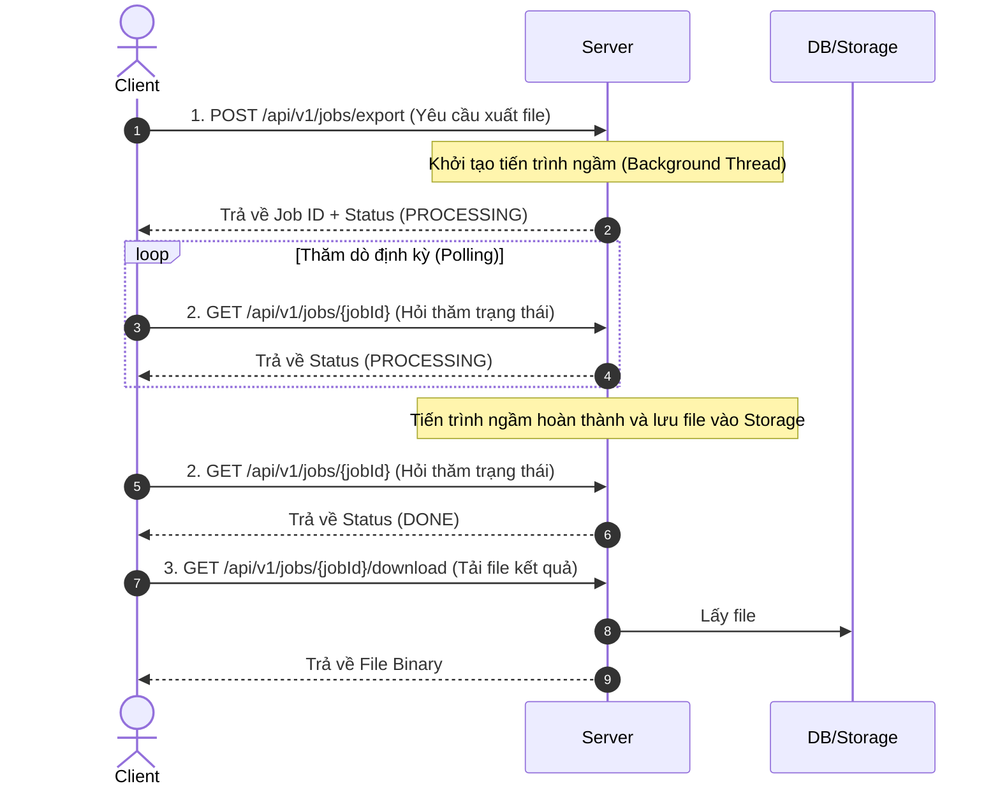

# Thiết kế API Bất đồng bộ với Cơ chế Polling (Async API with Polling)

---

Khi hệ thống cần thực hiện các tác vụ tốn nhiều thời gian xử lý (như xuất file báo cáo dữ liệu lớn, xử lý hình ảnh/video, chạy báo cáo thống kê phức tạp), việc bắt Client phải đợi đồng bộ (Synchronous) sẽ dẫn đến lỗi **Gateway Timeout (504)** và làm nghẽn luồng xử lý của Server.

Giải pháp tối ưu là chuyển quy trình sang **Xử lý bất đồng bộ (Asynchronous)** kết hợp với cơ chế **Thăm dò trạng thái (Polling)**.

---

## 1. Quy trình xử lý Polling qua 3 bước (3-Step Process)

Quy trình hoạt động được mô tả cụ thể như sau:



### Bước 1: Khởi tạo tác vụ (Trigger Job)
*   **API:** `POST /api/v1/jobs/export`
*   **Hành vi:** Server nhận yêu cầu, tạo một luồng xử lý ngầm (Background Job) và trả về một **Job ID** cùng trạng thái `PROCESSING` ngay lập tức.
*   **Response mẫu:**
    ```json
    {
      "jobId": "a90df2b7-84bc-4402-a1f9-90d5656c12b9",
      "status": "PROCESSING",
      "issuedAt": "2026-05-26T00:30:00Z"
    }
    ```

### Bước 2: Thăm dò trạng thái (Check Status)
*   **API:** `GET /api/v1/jobs/{jobId}`
*   **Hành vi:** Client thực hiện gửi yêu cầu kiểm tra định kỳ (ví dụ: mỗi 2-3 giây). Server chỉ cần đọc nhanh thông tin trạng thái từ bộ nhớ (hoặc H2 Database) để phản hồi trạng thái hiện tại (`PROCESSING`, `DONE`, hoặc `FAILED`).
*   **Response mẫu khi hoàn thành (`DONE`):**
    ```json
    {
      "jobId": "a90df2b7-84bc-4402-a1f9-90d5656c12b9",
      "status": "DONE",
      "issuedAt": "2026-05-26T00:30:00Z",
      "completedAt": "2026-05-26T00:30:05Z"
    }
    ```

### Bước 3: Tải xuống kết quả (Download Result)
*   **API:** `GET /api/v1/jobs/{jobId}/download`
*   **Hành vi:** Khi nhận trạng thái `DONE`, Client gọi API này để tải file báo cáo về.

---

## 2. Polling vs Webhook/Callback: Nên dùng khi nào?

| Đặc tính | Cơ chế Polling (Thăm dò) | Cơ chế Webhook / Callback |
| :--- | :--- | :--- |
| **Bản chất** | Client chủ động gửi request hỏi thăm theo chu kỳ. | Server chủ động gọi lại Client qua URL Callback đăng ký trước. |
| **Độ khó triển khai** | **Rất dễ.** Không yêu cầu hạ tầng phức tạp. | **Phức tạp.** Client cần mở API Public đón nhận Callback, Server cần cơ chế Retry và bảo mật. |
| **Độ trễ nhận tin** | Có độ trễ (phụ thuộc vào tần suất polling của client). | Tức thời (Ngay khi Server chạy xong). |
| **Tải tài nguyên** | Gây lãng phí tài nguyên do nhiều request kiểm tra trạng thái vô ích. | Tối ưu tài nguyên hệ thống tốt hơn. |
| **Use Case phù hợp** | Tác vụ tải file/nhập dữ liệu trung bình nội bộ, ứng dụng WebSPA thông thường. | Cổng thanh toán (Payment Gateway), Tích hợp hệ thống bên thứ ba (Third-party Integration). |

*Tại sao dùng Polling cho chức năng Export File thay vì Webhook?* 
* Trình duyệt Web của người dùng (Client) **không thể mở một Endpoint API Public** để lắng nghe Callback từ Server. Do đó, Polling là giải pháp phù hợp và đơn giản nhất cho các ứng dụng web SPA thông thường.

---

## 3. Hướng dẫn Triển khai Code trong Java Spring Boot

Chúng ta sẽ giả lập một tác vụ xuất file ngầm chạy trong 5 giây sử dụng tính năng **`@Async`** của Spring Boot.

### 3.1. Kích hoạt tính năng Async trong Spring Boot
Ta thêm cấu hình `@EnableAsync` vào Class khởi tạo ứng dụng:

```java
@SpringBootApplication
@EnableAsync
public class RestfulApiDesignApplication {
    public static void main(String[] args) {
        SpringApplication.run(RestfulApiDesignApplication.class, args);
    }
}
```

### 3.2. Cấu trúc Job Entity (Lưu trữ thông tin tiến trình)
Chúng ta lưu thông tin công việc vào Database (ở đây là H2 Database) để theo dõi trạng thái.

```java
@Entity
@Table(name = "export_jobs")
@Getter
@Setter
public class ExportJob {
    @Id
    private String jobId; // UUID
    
    private String status; // PROCESSING, DONE, FAILED
    
    private String downloadUrl; // Đường dẫn tải file sau khi xuất xong
    
    private LocalDateTime issuedAt;
    private LocalDateTime completedAt;
}
```

### 3.3. Xử lý logic nghiệp vụ ngầm (Background Work)
Sử dụng annotation `@Async` để Spring tự động đẩy logic này vào một Thread Pool chạy độc lập dưới nền.

```java
@Service
public class ExportJobService {

    @Autowired
    private ExportJobRepository jobRepository;

    @Async
    public void executeExportTask(String jobId) {
        try {
            // Giả lập tác vụ nặng (ví dụ: tạo dữ liệu, build file Excel) tốn 5 giây
            Thread.sleep(5000);

            ExportJob job = jobRepository.findById(jobId).orElseThrow();
            job.setStatus("DONE");
            job.setDownloadUrl("/api/v1/jobs/" + jobId + "/download");
            job.setCompletedAt(LocalDateTime.now());
            jobRepository.save(job);
            
        } catch (InterruptedException e) {
            ExportJob job = jobRepository.findById(jobId).orElseThrow();
            job.setStatus("FAILED");
            jobRepository.save(job);
        }
    }
}
```
