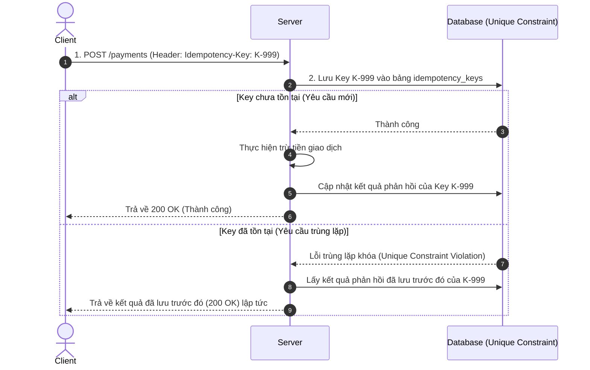

# Tính bất biến trong RESTful API (Idempotency)

---

## 1. Bối cảnh bài toán (Problem)

Trong hệ thống phân tán, sự cố mạng chập chờn là điều không thể tránh khỏi. Một kịch bản lỗi kinh điển thường xảy ra như sau:
1. Client gửi yêu cầu thanh toán `$10` lên Server.
2. Server xử lý thành công, trừ tiền của User trong database.
3. Tuy nhiên, trên đường phản hồi về Client, kết nối mạng bị đứt đột ngột. Client không nhận được phản hồi `200 OK`.
4. Người dùng (hoặc mã code tự động của Client) bấm nút gửi lại yêu cầu một lần nữa.
5. Nếu hệ thống **không thiết kế Idempotency**, Server sẽ nhận đây là một giao dịch mới và tiếp tục trừ tiền thêm một lần nữa. Khách hàng bị trừ tiền gấp đôi.

**Tính bất biến (Idempotency)** định nghĩa rằng: *Cho dù một API có được gọi thành công lặp lại bao nhiêu lần đi chăng nữa với cùng một tham số, kết quả trạng thái hệ thống ở phía Server vẫn không thay đổi so với lần gọi đầu tiên.*

---

## 2. Giải pháp kỹ thuật (Solution)

Giải pháp tối ưu và chuẩn hóa nhất trong thiết kế RESTful API hiện nay là sử dụng **Idempotency Key**.



### Cơ chế hoạt động:
1. **Phía Client:** 
   * Sinh ra một chuỗi ngẫu nhiên không trùng lặp (thường là UUID) đại diện cho giao dịch đó, gọi là **Idempotency Key**.
   * Đính kèm key này vào HTTP Header của request: `Idempotency-Key: 9283f3a9-e82b-4560-bf8f-8d23e59b9c99`.
2. **Phía Server & Database:**
   * Tạo bảng `idempotency_records` trong database có thiết lập **Unique Constraint** (Ràng buộc duy nhất) trên cột `idempotency_key`.
   * Khi nhận request, Server cố gắng `INSERT` record chứa key này vào database.
     * **Trường hợp 1 (Giao dịch mới):** Ghi key vào DB thành công -> Server chạy logic xử lý -> Lưu kết quả phản hồi của logic đó vào DB -> Trả về Client.
     * **Trường hợp 2 (Giao dịch lặp lại):** Ghi key vào DB thất bại do trùng lặp (Unique Constraint violation) -> Server biết ngay đây là request lặp -> Trích xuất kết quả phản hồi cũ đã lưu trong DB ra và trả ngay về cho Client mà không chạy lại logic xử lý.

---

## 2.1. So sánh giải pháp lưu trữ: Redis vs Database (RDBMS)

Trong thực tế doanh nghiệp, người ta có 2 hướng thiết kế lưu trữ bản ghi Idempotency: dùng **Database (RDBMS)** hoặc dùng **Redis**. Cả hai đều có ưu nhược điểm riêng và thường được kết hợp phối hợp:

### 1. Dùng Database (RDBMS) làm kho lưu trữ chính (Single Source of Truth)
* **Cách hoạt động:** Dùng Unique Constraint trên bảng `idempotency_records` của DB chính để kiểm soát.
* **Ưu điểm:**
  * **Độ tin cậy tuyệt đối (ACID Transaction):** Đảm bảo tính nhất quán dữ liệu. Khi thực hiện giao dịch chuyển tiền, việc trừ tiền và ghi nhận idempotency key nằm trong cùng 1 Transaction. Nếu lỗi, cả hai đều Rollback. Không bao giờ xảy ra lỗi "Trừ tiền thành công nhưng mất Idempotency Key".
  * **Lưu trữ vĩnh viễn:** Thích hợp cho các giao dịch tài chính cần lưu vết lâu dài để đối soát dòng tiền.
* **Nhược điểm:** Tốc độ ghi/đọc chậm hơn Redis và gây tải cho Database chính khi lưu lượng request lớn.

### 2. Dùng Redis (In-memory Storage)
* **Cách hoạt động:** Dùng câu lệnh `SET key value NX PX 86400000` (Set if Not Exists với thời gian hết hạn TTL 24 giờ).
* **Ưu điểm:**
  * **Hiệu năng cực cao:** Xử lý hàng trăm nghìn request/giây tốn rất ít tài nguyên.
  * **Tự động dọn dẹp:** Sử dụng cơ chế TTL để tự động xóa các Key hết hạn sau 24h hoặc 48h, tránh làm phình to dung lượng ổ đĩa.
* **Nhược điểm:**
  * **Không đảm bảo ACID 100%:** Nếu Server trừ tiền xong nhưng lúc ghi nhận kết quả vào Redis bị sập (hoặc Redis mất điện đột ngột), dữ liệu sẽ mất tính nhất quán.
  * **Mất dữ liệu:** Nếu Redis bị đầy ram (Eviction) hoặc khởi động lại, các key idempotency biến mất dẫn đến nguy cơ trùng lặp giao dịch cũ vẫn xảy ra.

### 💡 Mô hình chuẩn trong thực tế (Hybrid Model)
Đối với các hệ thống tài chính lớn (Fintech/E-commerce), người ta thường kết hợp cả hai:
1. **Tầng phân tán (Distributed Lock - Redis):** Dùng Redis để làm màng lọc bảo vệ đầu tiên (Lock) cực nhanh trong vòng 5-10 giây để chặn ngay các request bấm đúp song song (Double Submit).
2. **Tầng dữ liệu (RDBMS):** Dùng Database chính để lưu trữ kết quả phản hồi giao dịch cuối cùng để đảm bảo tính ACID và phục vụ đối soát lâu dài.

---

## 3. Triển khai Code trong Java Spring Boot

Chúng ta sẽ xây dựng một API thanh toán giả lập có áp dụng cơ chế Idempotency bằng H2 Database.

### 3.1. Cấu trúc bảng Lưu trữ Idempotency Record
Bảng lưu trữ thông tin request và phản hồi tương ứng của từng key.

```java
@Entity
@Table(name = "idempotency_records")
@Getter
@Setter
public class IdempotencyRecord {
    @Id
    private String idempotencyKey; // Unique Key từ Header

    private String responseBody; // JSON phản hồi của giao dịch lần đầu
    
    private int responseStatus; // HTTP Code (ví dụ: 200, 400)

    private LocalDateTime createdAt;
}
```

### 3.2. Triển khai Service & Controller theo Mô hình Lai (Redis Lock + DB Storage)

#### 1. File Service: `IdempotencyService.java`
Dùng `StringRedisTemplate` của Spring Boot để thực hiện SETNX làm Lock phân tán, và JPA để lưu trữ thông tin phản hồi chính thức xuống RDBMS (H2/MySQL).

```java
@Service
public class IdempotencyService {

    @Autowired
    private IdempotencyRecordRepository repository;

    @Autowired
    private StringRedisTemplate redisTemplate;

    private static final String REDIS_LOCK_PREFIX = "lock:idempotency:";

    // Bước 1: Tìm kết quả giao dịch chính thức trong DB RDBMS
    public Optional<IdempotencyRecord> findRecord(String key) {
        return repository.findById(key);
    }

    // Bước 2: Giành khóa trên Redis (SETNX với TTL 10 giây)
    public boolean lockKey(String key) {
        if (repository.existsById(key)) {
            return false;
        }
        String redisKey = REDIS_LOCK_PREFIX + key;
        Boolean success = redisTemplate.opsForValue().setIfAbsent(redisKey, "PROCESSING", Duration.ofSeconds(10));
        return success != null && success;
    }

    // Bước 3: Lưu trữ kết quả vĩnh viễn và xoá khoá Lock
    public void saveResult(String key, int status, String responseBody) {
        IdempotencyRecord record = new IdempotencyRecord();
        record.setIdempotencyKey(key);
        record.setResponseStatus(status);
        record.setResponseBody(responseBody);
        record.setCreatedAt(LocalDateTime.now());
        
        repository.save(record); // Lưu RDBMS
        redisTemplate.delete(REDIS_LOCK_PREFIX + key); // Giải phóng Lock trên Redis
    }

    // Giải phóng khoá Lock nếu gặp lỗi hệ thống
    public void unlockKey(String key) {
        redisTemplate.delete(REDIS_LOCK_PREFIX + key);
    }
}
```

#### 2. File Controller: `PaymentController.java`
```java
@RestController
@RequestMapping("/api/v1/payments")
public class PaymentController {

    @Autowired
    private IdempotencyService idempotencyService;

    @PostMapping
    public ResponseEntity<String> processPayment(
            @RequestHeader("Idempotency-Key") String idempotencyKey,
            @RequestBody Map<String, Object> payload) {

        // 1. Tìm bản ghi thành công cũ
        Optional<IdempotencyRecord> existing = idempotencyService.findRecord(idempotencyKey);
        if (existing.isPresent()) {
            return ResponseEntity.status(existing.get().getResponseStatus()).body(existing.get().getResponseBody());
        }

        // 2. Tranh chấp Lock trên Redis
        boolean locked = idempotencyService.lockKey(idempotencyKey);
        if (!locked) {
            return ResponseEntity.status(HttpStatus.CONFLICT).body("{\"error\":\"Giao dịch đang được xử lý!\"}");
        }

        try {
            // Nghiệp vụ trừ tiền... (Sleep 2s)
            Thread.sleep(2000);

            String responseBody = "{\"status\":\"SUCCESS\",\"amount\":100.0}";
            
            // 3. Lưu kết quả RDBMS & Xoá Lock Redis
            idempotencyService.saveResult(idempotencyKey, 200, responseBody);
            return ResponseEntity.ok(responseBody);

        } catch (Exception e) {
            idempotencyService.unlockKey(idempotencyKey);
            return ResponseEntity.status(500).body("{\"error\":\"Lỗi hệ thống\"}");
        }
    }
}
```

