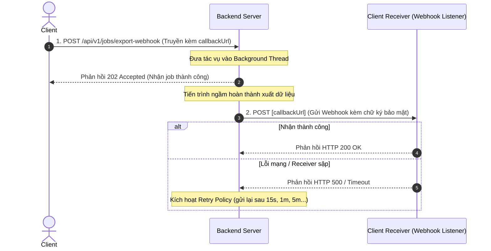

# Cơ chế Webhook / Callback trong RESTful API (Webhook Async API)

---

Khi hệ thống cần thực hiện các tác vụ bất đồng bộ tốn nhiều thời gian (như tích hợp cổng thanh toán, xử lý file dữ liệu cực lớn, giao tiếp giữa các hệ thống Microservices), thay vì bắt Client phải gửi liên tục hàng nghìn request vô nghĩa để hỏi trạng thái (Polling), chúng ta sử dụng **Webhook / Callback**.

Với Webhook, Client sẽ đăng ký trước một URL (gọi là Webhook Endpoint). Khi Server xử lý xong tác vụ chạy ngầm, Server sẽ chủ động gửi một request HTTP `POST` mang theo kết quả đến URL của Client.

---

## 1. So sánh chi tiết Webhook vs Polling

| Đặc tính | Cơ chế Polling (Thăm dò) | Cơ chế Webhook / Callback (Gọi lại) |
| :--- | :--- | :--- |
| **Chiều truyền tin** | **Client** chủ động gửi request hỏi thăm theo chu kỳ. | **Server** chủ động gửi request đẩy kết quả về cho Client. |
| **Giao thức** | HTTP Request thông thường. | HTTP Request (đóng vai trò Server gửi tới Endpoint của Client). |
| **Lãng phí tài nguyên** | **Rất lớn.** Hàng trăm request thăm dò trạng thái `PROCESSING` vô ích. | **Tối ưu cực tốt.** Chỉ có duy nhất 1 request đẩy dữ liệu khi xong. |
| **Độ trễ (Latency)** | Phụ thuộc thời gian chu kỳ lặp (ví dụ lặp mỗi 5 giây thì trễ max 5s). | **Gần như bằng 0.** Dữ liệu được đẩy về ngay khi tác vụ xong. |
| **Độ phức tạp** | **Rất thấp.** Dễ viết code ở cả Frontend và Backend. | **Cao.** Cần cơ chế đăng ký URL, xác thực chữ ký (Security), cơ chế gửi lại khi lỗi (Retry Mechanism). |
| **Trường hợp sử dụng** | Phù hợp cho Web/App giao diện người dùng (Browser không thể làm server nhận webhook). | Giao tiếp giữa 2 hệ thống Backend với nhau (Server-to-Server), cổng thanh toán (Payment Gateway). |

---

## 2. Quy trình hoạt động của Webhook (Sequence Diagram)

Quy trình Webhook bao gồm 3 thực thể: **Client (người gửi yêu cầu)**, **Server chính (xử lý tác vụ ngầm)** và **Client Receiver Endpoint (hệ thống nhận Webhook của Client)**.



---

## 3. Các thực hành tốt nhất về Bảo mật khi thiết kế Webhook

Vì Webhook Endpoint của Client phải mở công khai ra Internet để Server gọi vào, nó có nguy cơ bị tấn công giả mạo dữ liệu. Khi thiết kế Webhook, bắt buộc phải áp dụng các cơ chế bảo mật sau:

1. **Webhook Signature (Xác thực chữ ký):**
   * Server và Client chia sẻ một mã bí mật chung (`Webhook Secret Key`).
   * Khi gửi Webhook, Server băm nội dung payload cùng Secret Key bằng thuật toán `HMAC-SHA256` tạo ra chữ ký (Signature) và đính kèm trên HTTP Header (ví dụ: `X-Webhook-Signature`).
   * Client khi nhận request sẽ băm lại payload và so sánh chữ ký. Nếu trùng khớp mới xử lý.
2. **Cơ chế Retry (Retry Policy):**
   * Do mạng chập chờn hoặc Server của Client bị sập đột ngột, Server gửi Webhook phải có cơ chế gửi lại (Exponential Backoff) nếu Client không trả về HTTP Status `200 OK`.
3. **Idempotency (Kiểm trùng trùng lặp):**
   * Đôi khi Server gửi Webhook nhiều lần cho cùng một sự kiện do lỗi timeout ảo. Client nhận Webhook phải kiểm tra `event_id` hoặc `job_id` trong payload để tránh xử lý trùng lặp dữ liệu.

---

## 4. Hướng dẫn Triển khai Code trong Java Spring Boot

Chúng ta sẽ triển khai **cả hai vai trò** trên cùng một project Spring Boot:
1. **Webhook Provider (Server):** Nhận job xuất file bất đồng bộ kèm tham số `callbackUrl`, sau khi xuất xong sẽ gọi POST ngược lại `callbackUrl` có kèm chữ ký bảo mật HMAC-SHA256.
2. **Webhook Consumer (Client Receiver):** Cung cấp Endpoint giả lập nhận Webhook, thực hiện kiểm tra chữ ký trước khi chấp nhận dữ liệu.

### 4.1. Xử lý logic tại Webhook Provider (Server)

#### Cập nhật Service xuất file gửi Webhook kèm Chữ ký:
```java
// Logic tạo Signature HMAC-SHA256
private String calculateHmacSha256(String data, String secret) {
    try {
        byte[] hash = javax.crypto.Mac.getInstance("HmacSHA256").getAlgorithm().getBytes();
        javax.crypto.spec.SecretKeySpec secretKey = new javax.crypto.spec.SecretKeySpec(secret.getBytes(), "HmacSHA256");
        javax.crypto.Mac mac = javax.crypto.Mac.getInstance("HmacSHA256");
        mac.init(secretKey);
        byte[] hmacBytes = mac.doFinal(data.getBytes());
        
        // Convert sang Hex String
        StringBuilder hexString = new StringBuilder();
        for (byte b : hmacBytes) {
            String hex = Integer.toHexString(0xff & b);
            if (hex.length() == 1) hexString.append('0');
            hexString.append(hex);
        }
        return hexString.toString();
    } catch (Exception e) {
        throw new RuntimeException("Lỗi tạo chữ ký HMAC-SHA256", e);
    }
}
```
