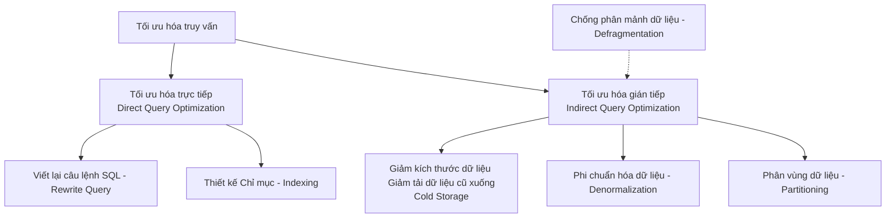
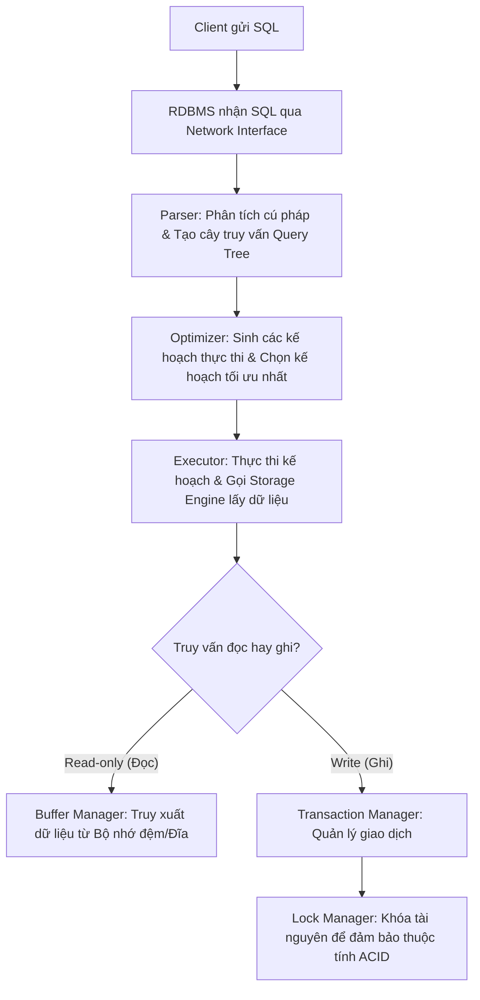
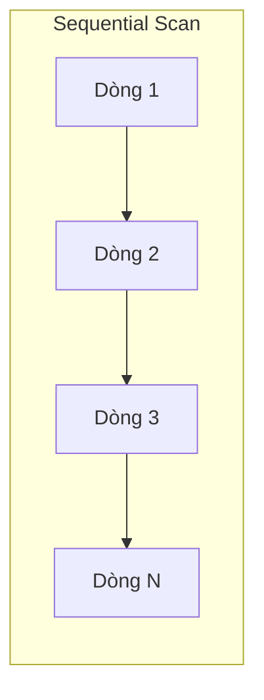
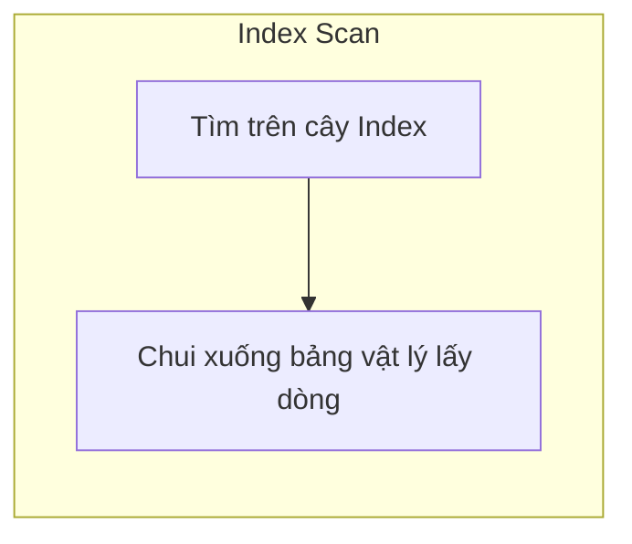
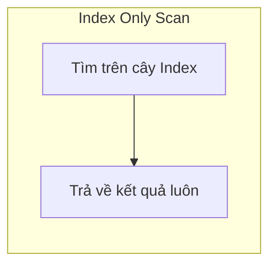

# Tài liệu Tối ưu hóa Truy vấn & Kế hoạch Thực thi (Query Optimization & Execution Plan)

> *“Ego kills knowledge, as knowledge requires learning, and learning requires humility”*  
> — **Rolsey**

<details open>
<summary><b>Mục lục (Table of Contents)</b></summary>

- [1. Tối ưu hóa truy vấn (Query Optimization)](#1-tối-ưu-hóa-truy-vấn-query-optimization)
  - [1.1. Tối ưu hóa trực tiếp (Direct Query Optimization)](#11-tối-ưu-hóa-trực-tiếp-direct-query-optimization)
  - [1.2. Tối ưu hóa gián tiếp (Indirect Query Optimization)](#12-tối-ưu-hóa-gián-tiếp-indirect-query-optimization)
  - [1.3. Nguyên tắc ưu tiên tối ưu hóa](#13-nguyên-tắc-ưu-tiên-tối-ưu-hóa)
- [2. Quá trình thực thi truy vấn (Query Execution)](#2-quá-trình-thực-thi-truy-vấn-query-execution)
  - [2.1. Quá trình thực thi SQL (SQL Execution)](#21-quá-trình-thực-thi-sql-sql-execution)
    - [2.1.1. Luồng xử lý một câu lệnh SQL trong DB](#211-luồng-xử-lý-một-câu-lệnh-sql-trong-db)
    - [2.1.2. Thứ tự thực thi logic của câu lệnh SQL (SQL Execution Order)](#212-thứ-tự-thực-thi-logic-của-câu-lệnh-sql-sql-execution-order)
  - [2.2. Kế hoạch thực thi (Execution Plan)](#22-kế-hoạch-thực-thi-execution-plan)
    - [2.2.1. Kế hoạch thực thi trong PostgreSQL](#221-kế-hoạch-thực-thi-trong-postgresql)
    - [2.2.2. Các kiểu quét dữ liệu trong Database (Types of Scanning)](#222-các-kiểu-quét-dữ-liệu-trong-database-types-of-scanning)
  - [2.3. Cách đọc hiểu Kế hoạch thực thi (Reading Execution Plan)](#23-cách-đọc-hiểu-kế-hoạch-thực-thi-reading-execution-plan)
    - [2.3.1. Các loại nút thao tác (Node Types)](#231-các-loại-nút-thao-tác-node-types)
    - [2.3.2. Các trường thông tin ước lượng (Estimate Fields)](#232-các-trường-thông-tin-ước-lượng-estimate-fields)
    - [2.3.3. Các trường thông tin thực tế (Actual Value Fields)](#233-các-trường-thông-tin-thực-tế-actual-value-fields)
    - [2.3.4. Các trường thông tin bộ đệm (Buffer Fields)](#234-các-trường-thông-tin-bộ-đệm-buffer-fields)
- [3. Thực tế triển khai & Các điểm lưu ý cốt lõi (Practices)](#3-thực-tế-triển-khai--các-điểm-lưu-ý-cốt-lõi-practices)
  - [3.1. Điểm lưu ý trước khi thực hành](#31-điểm-lưu-ý-trước-khi-thực-hành)
  - [3.2. Các bài học rút ra cốt lõi (Key Takeaways)](#32-các-bài-học-rút-ra-cốt-lõi-key-takeaways)
- [4. Tổng kết & Bài tập về nhà (Recap & Homework)](#4-tổng-kết--bài-tập-về-nhà-recap--homework)

</details>

---

# 1. Tối ưu hóa truy vấn (Query Optimization)

Quá trình tối ưu hóa truy vấn trong Cơ sở dữ liệu quan hệ (RDBMS) được chia làm hai hướng tiếp cận chính:



## 1.1. Tối ưu hóa trực tiếp (Direct Query Optimization)
Là các thay đổi tác động trực tiếp lên chính câu lệnh truy vấn và cấu trúc lưu trữ bổ trợ:
*   **Viết lại câu lệnh (Rewrite Query):** Tối ưu các phép JOIN, loại bỏ các truy vấn con (subquery) không cần thiết, tránh sử dụng `SELECT *`, tối ưu các điều kiện lọc trong mệnh đề `WHERE`.
*   **Chỉ mục (Index):** Thiết lập và tinh chỉnh các chỉ mục phù hợp trên bảng để tăng tốc độ tìm kiếm.

## 1.2. Tối ưu hóa gián tiếp (Indirect Query Optimization)
Là những thay đổi liên quan đến cấu trúc dữ liệu vật lý và cách thức truy cập dữ liệu của hệ thống:
*   **Giảm kích thước dữ liệu vật lý:** Di chuyển dữ liệu lịch sử hoặc dữ liệu ít sử dụng (lạnh) xuống các kho lưu trữ lưu trữ chậm hơn (Cold Storage / Archive) để giảm tải cho database chính.
*   **Phi chuẩn hóa (Denormalization):** Chấp nhận dư thừa dữ liệu ở mức độ hợp lý để tránh các phép JOIN phức tạp tốn kém thời gian chạy.
*   **Phân vùng dữ liệu (Partitioning):** Chia nhỏ một bảng lớn thành nhiều bảng vật lý nhỏ hơn (theo mốc thời gian, ID...) để thu hẹp vùng quét dữ liệu.
*   **Chống phân mảnh đĩa cứng (Defragmentation / Table Reorganization):** Thực hiện dọn dẹp các khoảng trống vật lý trên đĩa cứng (như chạy lệnh `VACUUM FULL` trong Postgres hoặc `OPTIMIZE TABLE` trong MySQL) giúp dữ liệu được sắp xếp liên tục, tăng hiệu suất đọc đĩa IOPS.

## 1.3. Nguyên tắc ưu tiên tối ưu hóa
> [!IMPORTANT]
> Luôn luôn tiến hành tối ưu hóa theo đúng thứ tự ưu tiên: **Trực tiếp (Direct) $\rightarrow$ Gián tiếp (Indirect)**.  
> Chỉ khi việc tối ưu hóa câu lệnh SQL và thiết lập index không còn mang lại hiệu quả mong muốn mới tiến hành thay đổi cấu trúc vật lý của cơ sở dữ liệu.

---

# 2. Quá trình thực thi truy vấn (Query Execution)

## 2.1. Quá trình thực thi SQL (SQL Execution)

### 2.1.1. Luồng xử lý một câu lệnh SQL trong DB

Khi một ứng dụng gửi một câu lệnh SQL truy vấn dữ liệu, RDBMS sẽ thực thi qua các bước tuần tự dưới đây:



*   **Bước 1:** Client đệ trình câu lệnh SQL tới RDBMS.
*   **Bước 2:** Bộ phận tiếp nhận của RDBMS nhận SQL thông qua giao tiếp mạng (Network Interface).
*   **Bước 3 (Parser):** Tiến hành phân tích cú pháp, tiền xử lý và chuyển câu lệnh SQL dạng chữ thành cấu trúc dữ liệu hình cây biểu diễn lô-gíc (**Query Tree**).
*   **Bước 4 (Optimizer):** Dựa trên cây truy vấn và các thống kê dữ liệu hiện có (statistics), bộ tối ưu hóa sinh ra nhiều phương án thực thi khác nhau (kế hoạch ứng viên) và lựa chọn ra một kế hoạch có chi phí (cost) ước tính thấp nhất.
*   **Bước 5 (Executor):** Bộ thực thi chạy kế hoạch đã chọn, tương tác với tầng lưu trữ vật lý (Storage Engine) để truy xuất dữ liệu.
*   **Bước 6 (Buffer Manager):** Nếu là câu lệnh đọc dữ liệu, RDBMS sẽ kiểm tra xem dữ liệu có sẵn trên bộ nhớ đệm (RAM) chưa. Nếu có sẽ trả về ngay (Buffer Hit), nếu không sẽ đọc từ đĩa cứng (Buffer Miss) và lưu bản sao lên RAM.
*   **Bước 7 (Transaction Manager):** Nếu là câu lệnh ghi/cập nhật dữ liệu, bộ quản lý giao dịch sẽ chịu trách nhiệm đảm bảo tính toàn vẹn của giao dịch.
*   **Bước 8 (Lock Manager):** Thực hiện cấp khóa (locks) phù hợp trong suốt vòng đời giao dịch để đảm bảo tính cô lập và duy trì trọn vẹn thuộc tính ACID.

---

### 2.1.2. Thứ tự thực thi logic của câu lệnh SQL (SQL Execution Order)
Lập trình viên viết SQL theo thứ tự cú pháp, nhưng cơ sở dữ liệu lại thực thi các mệnh đề theo thứ tự logic hoàn toàn khác:

$$\text{FROM / JOIN} \rightarrow \text{WHERE} \rightarrow \text{GROUP BY} \rightarrow \text{HAVING} \rightarrow \text{SELECT} \rightarrow \text{DISTINCT} \rightarrow \text{ORDER BY} \rightarrow \text{LIMIT / OFFSET}$$

> [!TIP]
> Do mệnh đề `WHERE` được thực thi trước `SELECT`, các cột giả định (alias) định nghĩa trong phần `SELECT` không thể được sử dụng làm điều kiện lọc trong mệnh đề `WHERE`.

---

## 2.2. Kế hoạch thực thi (Execution Plan)

### 2.2.1. Kế hoạch thực thi trong PostgreSQL
Kế hoạch thực thi là bản mô tả chi tiết từng bước mà RDBMS sẽ thực hiện để lấy dữ liệu cho một câu truy vấn SQL. Đây là công cụ tối quan trọng giúp lập trình viên phát hiện các truy vấn bị chậm.

Cú pháp kiểm tra kế hoạch trong PostgreSQL:
*   `EXPLAIN`: Lấy thông tin kế hoạch ước lượng dựa trên số liệu thống kê (không chạy câu lệnh thực tế).
*   `ANALYZE`: **Thực thi thực tế** câu lệnh SQL để lấy số liệu đo đạc thời gian chạy và tài nguyên thực tế (Hãy cẩn thận khi dùng `ANALYZE` với lệnh ghi vì nó sẽ làm thay đổi dữ liệu thật).
*   `BUFFERS`: Thống kê số lượng block dữ liệu được đọc từ bộ đệm (cache hit) hay đọc trực tiếp từ đĩa (cache miss).
*   `FORMAT`: Định dạng đầu ra của kế hoạch, khuyến nghị dùng định dạng **YAML** hoặc **JSON** để dễ đọc hiểu.

*Ví dụ cấu lệnh tối ưu:*
```sql
EXPLAIN (ANALYZE, BUFFERS, FORMAT YAML)
SELECT username, email FROM users WHERE age > 25;
```

---

### 2.2.2. Các kiểu quét dữ liệu trong Database (Types of Scanning)

Khi truy xuất dữ liệu từ các bảng, cơ sở dữ liệu sẽ áp dụng một trong các kiểu quét chính sau:

#### 1. Quét tuần tự (Sequential Scan / Seq Scan)
*   **Cơ chế:** Database quét toàn bộ bảng vật lý từ dòng đầu tiên đến dòng cuối cùng (row-by-row) để tìm các bản ghi thỏa mãn điều kiện mà không dùng chỉ mục.
*   **Parallel Sequential Scan:** Sử dụng nhiều luồng hoạt động song song (workers) cùng quét các vùng đĩa khác nhau của bảng để tăng tốc độ.



#### 2. Quét chỉ mục (Index Scan)
*   **Cơ chế:** Đầu tiên, database tìm kiếm trên chỉ mục (ví dụ cây B-Tree) để xác định danh sách các con trỏ trỏ tới vị trí vật lý của các dòng thỏa mãn điều kiện. Sau đó, nó chui xuống bảng vật lý để lấy dữ liệu đầy đủ của các dòng đó lên.



#### 3. Quét duy nhất trên chỉ mục (Index Only Scan)
*   **Cơ chế:** Toàn bộ thông tin cần hiển thị trong mệnh đề `SELECT` và điều kiện lọc trong `WHERE` đều đã nằm sẵn trong cấu trúc của chỉ mục. Database sẽ trả về kết quả trực tiếp từ chỉ mục và **không cần tốn chi phí truy cập xuống bảng vật lý**. Đây là trạng thái truy vấn nhanh nhất.



#### 4. Quét bản đồ bit chỉ mục (Bitmap Index Scan + Bitmap Heap Scan)
*   **Cơ chế:**
    1.  **Bitmap Index Scan:** Quét chỉ mục và xây dựng một bản đồ bit (bitmap) hiển thị các trang đĩa (pages) của bảng chứa dữ liệu khớp điều kiện.
    2.  **Bitmap Heap Scan:** Dựa vào bản đồ bit vừa tạo, database chui xuống bảng vật lý và chỉ đọc đúng các trang đĩa được đánh dấu. 
*   **Ứng dụng:** Rất hiệu quả khi cần kết hợp kết quả lọc từ nhiều chỉ mục độc lập khác nhau (ví dụ: dùng phép toán AND/OR trên hai bitmap thu được từ hai index khác nhau trước khi đọc bảng).

---

## 2.3. Cách đọc hiểu Kế hoạch thực thi (Reading Execution Plan)

### 2.3.1. Các loại nút thao tác (Node Types)
Kế hoạch thực thi là cấu trúc cây gồm nhiều nút lồng nhau. Mỗi nút đại diện cho một phép toán vật lý:
*   `Seq Scan` / `Parallel Seq Scan`: Quét tuần tự.
*   `Index Scan` / `Index Only Scan` / `Bitmap Index Scan`: Các thao tác quét dựa trên chỉ mục.
*   `Nested Loop Join` / `Hash Join` / `Merge Join`: Các phép liên kết bảng.
*   `Sort`: Sắp xếp dữ liệu (gặp khi có `ORDER BY` mà không có index phù hợp).
*   `Limit`: Giới hạn kết quả trả về.

*Thông tin đi kèm nút:*
*   `Index Name`: Tên của index đang được dùng để thực thi nút đó.
*   `Index Cond`: Điều kiện lọc chính xác áp dụng trên index.

---

### 2.3.2. Các trường thông tin ước lượng (Estimate Fields)
Là các thông số dự đoán do Bộ tối ưu hóa (Optimizer) tính toán:
*   **Startup Cost:** Chi phí ước lượng ban đầu để khởi động thao tác (thời gian để lấy được bản ghi đầu tiên ra khỏi nút).
*   **Total Cost:** Tổng chi phí ước lượng để hoàn thành toàn bộ thao tác của nút này cùng tất cả các nút con của nó.
*   **Plan Rows:** Số lượng dòng dữ liệu dự kiến mà Optimizer đoán là nút này sẽ trả về.
*   **Plan Width:** Kích thước trung bình dự kiến (tính bằng byte) của mỗi dòng dữ liệu.

---

### 2.3.3. Các trường thông tin thực tế (Actual Value Fields)
Có được khi chạy câu lệnh ở chế độ `ANALYZE`:
*   **Actual Startup Time:** Thời gian thực tế (tính bằng mili-giây) để bắt đầu lấy dòng đầu tiên ra khỏi nút.
*   **Actual Total Time:** Tổng thời gian thực tế chạy thao tác của nút đó và toàn bộ các nút con.
*   **Actual Rows:** Số lượng dòng dữ liệu thực tế trả về.
*   **Actual Loops:** Số lần mà thao tác của nút này được lặp lại.

---

### 2.3.4. Các trường thông tin bộ đệm (Buffer Fields)
Có được khi thêm cấu hình `BUFFERS` cùng chế độ `ANALYZE`:
*   **Shared Hit Blocks:** Số lượng block dữ liệu được đọc trực tiếp từ bộ nhớ đệm RAM (Shared Buffer Cache) của Postgres mà không cần đọc từ đĩa. Chỉ số này càng cao biểu thị hiệu năng truy vấn càng tốt.

---

# 3. Thực tế triển khai & Các điểm lưu ý cốt lõi (Practices)

## 3.1. Điểm lưu ý trước khi thực hành
*   **Dữ liệu thực hành:** Bạn có thể tìm kiếm và tải về các bộ dữ liệu lớn để kiểm thử từ nguồn **Kaggle**.
*   **Bộ tối ưu hóa hoạt động ngầm:** Cơ sở dữ liệu sẽ sinh ra rất nhiều kế hoạch thực thi ứng viên khác nhau nhưng nó sẽ lập tức xóa bỏ chúng ra khỏi bộ nhớ ngay sau khi chọn được kế hoạch tốt nhất. Do đó, ta chỉ có thể xem được kế hoạch được chọn cuối cùng qua lệnh `EXPLAIN`.

---

## 3.2. Các bài học rút ra cốt lõi (Key Takeaways)

1.  **Lựa chọn loại Index phù hợp:**
    *   Sử dụng chỉ mục dạng **B-Tree** cho các truy vấn so sánh khoảng (`>`, `<`, `BETWEEN`, `LIKE 'abc%'`).
    *   Sử dụng chỉ mục dạng **Hash** cho các truy vấn so sánh bằng tuyệt đối (`=`, `IN`).
2.  **Ngưỡng hiệu quả của Index:**
    *   Chỉ mục chỉ thực sự phát huy hiệu quả tối đa khi ta cần lấy ra một **tập dữ liệu nhỏ (small result set)** chiếm tỷ lệ thấp so với tổng số dòng trong bảng. Nếu truy vấn lấy ra hơn 20-30% tổng số dòng, database thường sẽ bỏ qua index và quét tuần tự (`Seq Scan`) vì nó tính toán thấy quét tuần tự sẽ nhanh hơn việc nhảy đĩa tìm con trỏ index.
3.  **Quy tắc thiết kế chỉ mục hỗn hợp (Composite Indexes):**
    *   Thứ tự khai báo các cột trong composite index là cực kỳ quan trọng. Hãy luôn ưu tiên đặt các cột có **độ chọn lọc cao (High Cardinality)** lên trước (ví dụ: đặt cột `email` hoặc `user_id` trước cột `gender` hoặc `status`).
4.  **Tối ưu hóa số lượng index bằng Index Condition Pushdown:**
    *   Hạn chế tạo quá nhiều index thừa thãi làm chậm thao tác ghi (`INSERT`/`UPDATE`).
5.  **Tận dụng Chỉ mục bao phủ (Covering Index):**
    *   Sử dụng mệnh đề `INCLUDE` trong PostgreSQL khi tạo chỉ mục để đính kèm các cột phụ dữ liệu vào cây index:
        ```sql
        CREATE INDEX idx_users_age_incl ON users (age) INCLUDE (username, email);
        ```
        *Cách này giúp truy vấn tìm theo `age` và lấy `username, email` đạt được trạng thái **Index Only Scan**.*
6.  **Không tin tưởng tuyệt đối vào các thư viện ORM:**
    *   Các framework và ORM (như Hibernate, Prisma, Entity Framework) sinh câu lệnh SQL tự động đôi khi rất rối rắm và không tối ưu. Hãy luôn chủ động trích xuất mã SQL thực tế và chạy thử bằng lệnh `EXPLAIN ANALYZE` trên môi trường Test để kiểm soát chất lượng.
7.  **Sự khác biệt giữa các hệ quản trị CSDL:**
    *   PostgreSQL và MySQL có cơ chế tối ưu hóa câu lệnh khác nhau. Cần luyện tập và thử nghiệm trên cả hai hệ thống để hiểu rõ đặc thù của từng bên.
8.  **Giám sát tối ưu hóa nâng cao:**
    *   Sử dụng extension `pg_stat_statements` trong PostgreSQL để thống kê chi tiết toàn bộ các câu lệnh SQL đang chạy chậm trên hệ thống Production thời gian thực.

---

# 4. Tổng kết & Bài tập về nhà (Recap & Homework)

*   **Tóm tắt cốt lõi (Recap):**
    *   Tối ưu hóa truy vấn gồm 2 phần độc lập: **Trực tiếp** (sửa câu lệnh SQL, tạo index) và **Gián tiếp** (chuyển cold storage, phân vùng bảng, vacuum đĩa).
    *   Index hoạt động tốt nhất cho các câu lệnh trả về kết quả lọc nhỏ.
    *   Hãy biến việc chạy `EXPLAIN ANALYZE` kiểm tra kế hoạch thực thi trước khi đưa các câu truy vấn lên Production thành một thói quen bắt buộc của một Backend Engineer.

*   **Bài tập về nhà (Homework):**
    1.  **Tối ưu hóa truy vấn trong dự án thực tế:** Chọn ra một câu lệnh SQL chạy chậm trong dự án hiện tại của bạn, viết giải pháp tối ưu hóa trực tiếp hoặc gián tiếp, và giải thích tại sao cách đó lại giúp cải thiện hiệu năng.
    2.  **Thiết kế Index cho hệ thống đặt vé máy bay:** Cho lược đồ cơ sở dữ liệu đặt vé máy bay gồm các thực thể `flights`, `bookings`, `seats`, và `tickets`. Hãy đề xuất các chỉ mục cần thiết giúp hệ thống truy vấn thông tin chỗ ngồi trống và vé đã đặt một cách tối ưu nhất.

*   **Tài liệu tham khảo (References):**
    *   [Học sao chép bảng trong PostgreSQL](https://www.postgresqltutorial.com/postgresql-tutorial/postgresql-copy-table/)
    *   [Tối ưu hóa truy vấn chậm bằng Composite Index trong MySQL](https://blog.nodeswat.com/making-slow-queries-fast-with-composite-indexes-in-mysql-eb452a8d6e46)
    *   [Giải thích chi tiết các trường trong Execution Plan của Postgres](https://www.pgmustard.com/blog/2019/9/17/postgres-execution-plans-field-glossary)
    *   [Video hướng dẫn tối ưu truy vấn Postgres](https://www.youtube.com/watch?v=Ls-uE1V31lE)
    *   [Trang Blog kỹ thuật PGMustard](https://www.pgmustard.com/blog)
    *   [Hướng dẫn tìm và sửa truy vấn SQL chậm trong MySQL](https://www.percona.com/blog/mysql-101-how-to-find-and-tune-a-slow-sql-query/)
