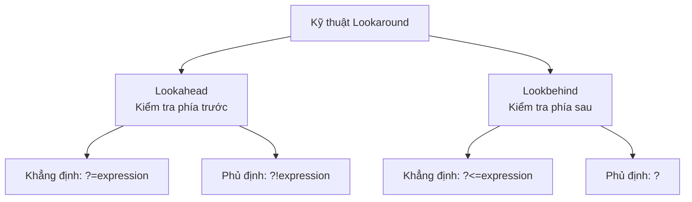

# Hướng dẫn về Biểu thức Chính quy (Regular Expression - Regex)

> *“Women and children can be careless, not men”*  
> — **Mario Puzo, The Godfather (Bố Già)**

<details open>
<summary><b>Mục lục (Table of Contents)</b></summary>

- [1. Ngôn ngữ Regex (Regex Language)](#1-ngôn-ngữ-regex-regex-language)
  - [1.1. Giới thiệu chung (Introduction)](#11-giới-thiệu-chung-introduction)
  - [1.2. Kết quả khớp (Matches)](#12-kết-quả-khớp-matches)
  - [1.3. Khái niệm Nhóm (Group)](#13-khái-niệm-nhóm-group)
  - [1.4. Lựa chọn thay thế (Alternation)](#14-lựa-chọn-thay-thế-alternation)
  - [1.5. Ký tự tùy chọn & Lớp ký tự (Character Classes)](#15-ký-tự-tùy-chọn--lớp-ký-tự-character-classes)
  - [1.6. Lớp ký tự phủ định (Negation)](#16-lớp-ký-tự-phủ-định-negation)
  - [1.7. Bộ định vị ranh giới (Anchors)](#17-bộ-định-vị-ranh-giới-anchors)
  - [1.8. Các lớp ký tự viết tắt (Shorthand Classes)](#18-các-lớp-ký-tự-viết-tắt-shorthand-classes)
  - [1.9. Bộ lượng hóa số lần xuất hiện (Quantifiers)](#19-bộ-lượng-hóa-số-lần-xuất-hiện-quantifiers)
  - [1.10. Các cờ thiết lập (Flags)](#110-các-cờ-thiết-lập-flags)
- [2. Thực hành & Các bài tập tình huống (Practices)](#2-thực-hành--các-bài-tập-tình-huống-practices)
  - [2.1. Bài tập 1: Tìm tên file ảnh (Image File Names)](#21-bài-tập-1-tìm-tên-file-ảnh-image-file-names)
  - [2.2. Bài tập 2: Xác định các định dạng Số (Numbers)](#22-bài-tập-2-xác-định-các-định-dạng-số-numbers)
  - [2.3. Bài tập 3: Xác thực định dạng Email (Emails)](#23-bài-tập-3-xác-thực-định-dạng-email-emails)
  - [2.4. Bài tập 4: Trích xuất cấu hình mạng (Network Configuration)](#24-bài-tập-4-trích-xuất-cấu-hình-mạng-network-configuration)
  - [2.5. Tình huống thực tế: Chuyển đổi định dạng Logs thành CSV](#25-tình-huống-thực-tế-chuyển-đổi-định-dạng-logs-thành-csv)
  - [2.6. Thử thách nâng cao & Kỹ thuật Lookaround](#26-thử-thách-nâng-cao--kỹ-thuật-lookaround)
- [3. Cơ chế hoạt động của Regex Engine (Regex Engine)](#3-cơ-chế-hoạt-động-của-regex-engine-regex-engine)
  - [3.1. Nguyên lý hoạt động cơ bản](#31-nguyên-lý-hoạt-động-cơ-bản)
  - [3.2. Cơ chế Duyệt từ trái qua phải (Left-to-Right) & Quay lui (Backtracking)](#32-cơ-chế-duyệt-từ-trái-qua-phải-left-to-right--quay-lui-backtracking)
  - [3.3. Các thực hành tốt nhất để tối ưu hiệu năng (Best Practices)](#33-các-thực-hành-tốt-nhất-để-tối-ưu-hiệu-năng-best-practices)
- [4. Tổng kết & Bài tập tự giải (Recap & Homework)](#4-tổng-kết--bài-tập-tự-giải-recap--homework)

</details>

---

# 1. Ngôn ngữ Regex (Regex Language)

## 1.1. Giới thiệu chung (Introduction)

*   **Biểu thức chính quy (Regular Expression - Regex)** là một công cụ cực kỳ mạnh mẽ dùng để so khớp, tìm kiếm và thao tác các mẫu ký tự bên trong chuỗi văn bản.
*   **Các trường hợp ứng dụng thực tế (Use cases):**
    *   **Xác thực dữ liệu (Data validation):** Kiểm tra định dạng đầu vào của email, số điện thoại, số định danh, mật khẩu...
    *   **Thao tác tìm kiếm (Search operations):** Tìm các từ hoặc cụm từ theo quy luật phức tạp trong file hoặc cơ sở dữ liệu.
    *   **Phân tích cú pháp (Parsing):** Trích xuất thông tin cụ thể từ các chuỗi logs, tệp cấu hình, cấu trúc dữ liệu thô.
    *   **Xử lý chuỗi (Text manipulation):** Tìm và thay thế hàng loạt nội dung trong các trình soạn thảo văn bản hoặc ứng dụng.
*   **Sự khác biệt giữa các ngôn ngữ:** Mỗi ngôn ngữ lập trình tích hợp một bộ xử lý regex riêng (**Regex Engine**) và hoạt động của chúng có nhiều điểm khác biệt:
    *   Cú pháp Regex giống như một **Giao diện (Interface)** tiêu chuẩn chung.
    *   Cụ thể hoạt động của từng Regex Engine của từng ngôn ngữ lại giống như một **Lớp hiện thực (Implementation)** riêng biệt.

---

## 1.2. Kết quả khớp (Matches)

*   **Đầu vào (Input):** Gồm một chuỗi văn bản nguồn (String) và một biểu thức chính quy (Regex).
*   **Đầu ra (Output):** Danh sách các chuỗi con tìm thấy thỏa mãn điều kiện biểu thức (Match/Matches).
*   *Công cụ kiểm thử trực quan trực tuyến:* [Regex101](https://regex101.com/)

---

## 1.3. Khái niệm Nhóm (Group)

*   Dùng để gom cụm một phần của biểu thức chính quy để áp dụng lượng hóa hoặc thực hiện trích xuất dữ liệu sau đó.
*   **Cú pháp gom nhóm:** Sử dụng cặp ngoặc đơn `(...)`.
*   **Nhóm có đặt tên (Named Group):** Để dễ dàng gọi tên và truy xuất giá trị của nhóm con thay vì gọi theo số thứ tự mặc định, ta sử dụng cú pháp: `(?<group_name>expression)`.
    *   *Ví dụ:* `(?<year>\d{4})-(?<month>\d{2})` giúp trích xuất trực tiếp giá trị năm và tháng bằng từ khóa `year` và `month`.

---

## 1.4. Lựa chọn thay thế (Alternation)

*   Sử dụng khi bạn muốn so khớp một trong nhiều biểu thức chính quy khác nhau.
*   **Cú pháp:** Sử dụng ký tự gạch đứng `|` để phân tách các lựa chọn (hoạt động tương tự như toán tử OR logic).
    *   *Ví dụ:* `mèo|chó|chuột` sẽ khớp với bất kỳ từ nào trong 3 từ này.

---

## 1.5. Ký tự tùy chọn & Lớp ký tự (Character Classes)

*   **Lớp ký tự `[...]`:** Khớp với một ký tự đơn nằm trong tập hợp được định nghĩa.
    *   *Ví dụ:* Biểu thức `a|b|c` hoàn toàn tương đương với lớp ký tự `[abc]`.
*   **Dải ký tự (Range):** Định nghĩa một khoảng ký tự liên tục bằng dấu gạch ngang `-`.
    *   `[a-z]`: Khớp với một chữ cái thường từ a đến z.
    *   `[0-9]`: Khớp với một chữ số từ 0 đến 9.
    *   `[a-zA-Z0-9]`: Khớp với một ký tự chữ hoặc số bất kỳ.

---

## 1.6. Lớp ký tự phủ định (Negation)

*   Sử dụng khi muốn khớp với một ký tự bất kỳ **KHÔNG nằm trong** dải hoặc tập hợp ký tự đã chỉ định.
*   **Cú pháp:** Đặt ký tự mũ `^` ở ngay sau dấu mở ngoặc vuông: `[^...]`.
    *   *Ví dụ:* `[^0-9]` khớp với bất kỳ ký tự nào ngoại trừ các chữ số.

---

## 1.7. Bộ định vị ranh giới (Anchors)

Các bộ định vị không khớp với ký tự cụ thể mà dùng để đánh dấu ranh giới vị trí trong chuỗi:
*   `^`: Đánh dấu vị trí **bắt đầu dòng** (Start of line).
*   `$`: Đánh dấu vị trí **kết thúc dòng** (End of line).
*   `\b`: Đánh dấu **ranh giới từ** (Word boundary) - tức vị trí ranh giới giữa một ký tự chữ (`\w`) và một ký tự không phải chữ (`\W` hoặc biên dòng).
    *   *Ví dụ:* `\bcat\b` sẽ khớp chính xác từ "cat" đơn lẻ, không khớp với từ "cat" nằm trong "category" hay "bobcat".

---

## 1.8. Các lớp ký tự viết tắt (Shorthand Classes)

Để viết regex ngắn gọn hơn, ta sử dụng các ký tự viết tắt đại diện cho một lớp ký tự phổ biến:
*   `\d`: Khớp bất kỳ chữ số nào, tương đương với `[0-9]`.
*   `\w`: Khớp bất kỳ ký tự chữ nào (gồm chữ cái viết hoa, viết thường, chữ số và dấu gạch dưới `_`), tương đương với `[A-Za-z0-9_]`.
*   `\s`: Khớp bất kỳ ký tự khoảng trắng nào (dấu cách, tab, xuống dòng), tương đương với `[ \t\r\n\f]`.
*   `.` (dấu chấm): Khớp với bất kỳ ký tự đơn nào (ngoại trừ ký tự xuống dòng ở chế độ mặc định).
*   `\`: Ký tự thoát (Escape character), dùng để chuyển các ký tự đặc biệt của regex trở lại thành ký tự văn bản thường.
    *   *Ví dụ:* Để tìm dấu chấm thực sự, ta phải dùng `\.`.

---

## 1.9. Bộ lượng hóa số lần xuất hiện (Quantifiers)

Sử dụng ngay sau một ký tự hoặc một nhóm ký tự để quy định số lần xuất hiện của chúng:
*   `*`: Xuất hiện **từ 0 lần trở lên** (tương đương `{0,}`).
*   `+`: Xuất hiện **từ 1 lần trở lên** (tương đương `{1,}`).
*   `?`: Xuất hiện **0 hoặc 1 lần** (tương đương `{0,1}`).
*   `{n}`: Xuất hiện **chính xác $n$ lần**.
*   `{n,}`: Xuất hiện **ít nhất $n$ lần**.
*   `{n,m}`: Xuất hiện **từ $n$ đến $m$ lần**.

---

## 1.10. Các cờ thiết lập (Flags)

Các cờ được áp dụng toàn cục để thay đổi hành vi tìm kiếm của Regex Engine:
*   `g` (Global): Tìm tất cả các kết quả khớp trên toàn chuỗi nguồn thay vì dừng lại ngay sau khi tìm thấy kết quả đầu tiên.
*   `i` (Insensitive): Thiết lập không phân biệt chữ hoa hay chữ thường trong quá trình so khớp.
*   `m` (Multi-line): Thiết lập chế độ nhiều dòng. Khi bật cờ này, bộ định vị `^` và `$` sẽ khớp với vị trí đầu và cuối của **từng dòng đơn** thay vì bắt đầu và kết thúc của toàn bộ chuỗi văn bản lớn.

---

# 2. Thực hành & Các bài tập tình huống (Practices)

> [!TIP]
> *   Khi thực hành trên trang Regex101, hãy luôn ưu tiên chọn cấu hình **Javascript engine** vì độ tương thích cao.
> *   Regex engine của Java có một số điểm hoạt động không thực sự tối ưu trong một số tình huống.
> *   Nếu biểu thức chạy đúng trên Regex101 nhưng lỗi khi đưa vào mã nguồn thật, hãy lưu ý kiểm tra cơ chế escape ký tự đặc biệt (ví dụ trong Java/C# cần viết hai dấu gạch chéo `\\` thay vì chỉ một `\`).

## 2.1. Bài tập 1: Tìm tên file ảnh (Image File Names)
*   **Yêu cầu:** Xác định các tên file có đuôi mở rộng định dạng ảnh phổ biến (như `.jpg`, `.jpeg`, `.png`, `.gif`).
*   **Mẫu regex gợi ý:** `\b[\w-]+\.(?:jpe?g|png|gif)\b`

## 2.2. Bài tập 2: Xác định các định dạng Số (Numbers)
*   **Yêu cầu:** Tìm và khớp tất cả các số nguyên, số thập phân, số âm và số dương.
*   **Mẫu regex gợi ý:** `^[+-]?\d+(?:\.\d+)?$`

## 2.3. Bài tập 3: Xác thực định dạng Email (Emails)
*   **Yêu cầu:** Kiểm tra tính hợp lệ của địa chỉ Email.
*   **Mẫu regex gợi ý:** `^[a-zA-Z0-9._%+-]+@[a-zA-Z0-9.-]+\.[a-zA-Z]{2,}$`

## 2.4. Bài tập 4: Trích xuất cấu hình mạng (Network Configuration)
*   **Yêu cầu:** Tìm kiếm và lọc ra thông tin địa chỉ IP (IPv4) từ chuỗi văn bản cấu hình hệ thống.
*   **Mẫu regex gợi ý:** `\b(?:(?:25[0-5]|2[0-4][0-9]|[01]?[0-9][0-9]?)\.){3}(?:25[0-5]|2[0-4][0-9]|[01]?[0-9][0-9]?)\b`

---

## 2.5. Tình huống thực tế: Chuyển đổi định dạng Logs thành CSV
*   **Yêu cầu:** Cho một file log chứa các thông tin giao dịch. Hãy lọc riêng thông tin mã khách hàng và mã giảm giá (voucher), sau đó định dạng lại thành file CSV.
*   **Ví dụ đầu ra mong muốn:** `2023-09-12T13:23:48.796+07:00, U56, V12`
*   **Cách làm trên VS Code:**
    *   Mở file log trên VS Code, nhấn `Ctrl + H` để mở tính năng Thay thế (Replace), bật biểu tượng Regex `.*`.
    *   *Mẫu tìm kiếm (Find):* `^(?<time>[\d-T:.+]+)\s+.*?\s+(?<user>U\d+)\s+.*?\s+(?<voucher>V\d+).*$`
    *   *Mẫu thay thế (Replace):* `$<time>, $<user>, $<voucher>`

---

## 2.6. Thử thách nâng cao & Kỹ thuật Lookaround

### 2.6.1. Bài toán Thử thách:
Tìm và khớp chính xác các số Hộ chiếu (Passport Number). Biết rằng số hộ chiếu và số Căn cước công dân (Citizen ID) có cùng chung quy luật định dạng độ dài số, nhưng số hộ chiếu luôn đi kèm một tiền tố đặc trưng đứng phía trước mà ta không muốn lấy tiền tố đó vào kết quả khớp.

### 2.6.2. Kỹ thuật Lookaround (Khớp ranh giới không tiêu tốn ký tự):
Lookaround là kỹ thuật nâng cao giúp kiểm tra điều kiện xung quanh vị trí hiện tại mà không làm dịch chuyển con trỏ duyệt ký tự của Regex Engine (không tiêu thụ ký tự).



*   **Lookahead (Kiểm tra phía trước):** Nhìn về phía trước (bên phải con trỏ) để đảm bảo có hoặc không có mẫu ký tự mong muốn.
    *   *Khẳng định (Positive):* `(?=expression)`
    *   *Phủ định (Negative):* `(?!expression)`
*   **Lookbehind (Kiểm tra phía sau):** Nhìn về phía sau (bên trái con trỏ) để đảm bảo điều kiện trước đó được thỏa mãn.
    *   *Khẳng định (Positive):* `(?<=expression)`
    *   *Phủ định (Negative):* `(?<!expression)`

> **Nguyên lý hoạt động:** Có thể coi Lookaround hoạt động giống như cấu trúc điều kiện lập trình: **NẾU** điều kiện trong ngoặc `Lookaround` trả về True, **THÌ** biểu thức chính ngoài ngoặc mới tiến hành so khớp dữ liệu.

---

# 3. Cơ chế hoạt động của Regex Engine (Regex Engine)

## 3.1. Nguyên lý hoạt động cơ bản

*   Regex engine hoạt động theo cơ chế **duyệt từng ký tự một (one character at a time)** từ **trái sang phải (left to right)**.
*   **Tính tham lam (Greedy):** Theo mặc định, các bộ lượng hóa như `*` hoặc `+` sẽ cố gắng khớp dữ liệu dài nhất có thể trong chuỗi văn bản đầu vào.
*   **Tính lười biếng (Lazy / Non-greedy):** Engine sẽ chỉ khớp lượng dữ liệu tối thiểu nhất có thể để biểu thức hoạt động đúng, rồi nhường quyền khớp tiếp tục cho các ký tự phía sau.
    *   *Cách chuyển đổi:* Thêm dấu chấm hỏi `?` ngay sau bộ lượng hóa (ví dụ: `*?`, `+?`).

### Bảng so sánh trực quan Greedy vs Lazy:
Giả sử ta có chuỗi văn bản nguồn: `<div>nội dung 1</div><div>nội dung 2</div>`

| Biểu thức Regex | Phân loại | Kết quả khớp (Match) | Giải thích |
| :--- | :--- | :--- | :--- |
| `<div>.*</div>` | **Tham lam (Greedy)** | `<div>nội dung 1</div><div>nội dung 2</div>` | Quét và khớp từ thẻ mở đầu tiên đến tận thẻ đóng **cuối cùng** của chuỗi. |
| `<div>.*?</div>` | **Lười biếng (Lazy)** | `<div>nội dung 1</div>` và `<div>nội dung 2</div>` | Chỉ khớp dữ liệu tối thiểu cần thiết để đóng thẻ `</div>` đầu tiên gặp phải. |

---

## 3.2. Cơ chế Duyệt từ trái qua phải (Left-to-Right) & Quay lui (Backtracking)

Khi một phần của regex không thể khớp với ký tự tiếp theo trong chuỗi, Regex Engine sẽ thực hiện **Quay lui (Backtracking)**:
1.  Quay ngược lại trạng thái đã khớp thành công trước đó.
2.  Lựa chọn một nhánh rẽ khác (ví dụ: nhánh tiếp theo của toán tử lựa chọn `|` hoặc giảm số lượng ký tự đã khớp của bộ lượng hóa tham lam `*`).
3.  Tiếp tục thử so khớp lại từ vị trí đó.

---

## 3.3. Các thực hành tốt nhất để tối ưu hiệu năng (Best Practices)

Trong các hệ thống Backend chịu tải cao, việc sử dụng Regex không tối ưu có thể làm treo toàn bộ máy chủ. Hãy tuân thủ các quy tắc sau:

1.  **Biên dịch Regex một lần duy nhất (Compile Once):**
    Không khởi tạo lại regex trong các vòng lặp lớn. Hãy biên dịch và lưu trữ đối tượng Regex ở dạng biến tĩnh/hằng số (`static final` trong Java hoặc `re.compile` trong Python) để tái sử dụng nhiều lần.
2.  **Hạn chế tối đa việc biến mọi thứ thành tùy chọn (Avoid Everything Optional):**
    Hãy tập trung định nghĩa rõ ràng **những gì không được phép khớp**, điều này quan trọng hơn việc cố gắng bao quát tất cả các trường hợp tùy chọn.
3.  **Sử dụng cẩn thận các bộ lượng hóa tham lam (`*`, `+`):**
    Tránh để các bộ lượng hóa này quét tự do không giới hạn vì rất dễ gây ra hiện tượng khớp nhầm dữ liệu sang các dòng khác hoặc làm chậm hệ thống.
4.  **Tận dụng chế độ lười biếng (`+?`, `*?`):**
    Giúp dừng tìm kiếm sớm ngay khi thỏa mãn điều kiện, tiết kiệm tài nguyên CPU.
5.  **Sử dụng lớp ký tự phủ định thay vì dấu chấm (`.`):**
    Thay vì viết `.*` để khớp mọi thứ, hãy viết cụ thể như `[^"\n]*` (khớp mọi ký tự ngoại trừ dấu nháy kép và ký tự xuống dòng) để giới hạn chặt chẽ phạm vi tìm kiếm.
6.  **Sử dụng nhóm không bắt giữ (Non-Capturing Group) để tiết kiệm bộ nhớ:**
    Nếu chỉ cần gom nhóm để lượng hóa hoặc lựa chọn thay thế mà không cần trích xuất giá trị ra ngoài, hãy sử dụng cấu trúc nhóm không bắt giữ `(?:...)` thay vì nhóm bắt giữ `(...)` thông thường.
7.  **Tránh lỗi treo hệ thống do quay lui lũy thừa (Catastrophic Backtracking):**
    Tuyệt đối tránh viết các biểu thức lồng nhau dạng bộ lượng hóa như `^(\w*)*$`. Khi gặp một chuỗi đầu vào dài không thỏa mãn điều kiện, engine sẽ phải thử hàng tỷ tỷ nhánh quay lui khác nhau để kiểm tra, dẫn đến sập CPU (lỗ hổng bảo mật **ReDoS - Regular Expression Denial of Service**).
8.  **Cài đặt thời gian chờ (Timeout) cho Regex:**
    Nếu ngôn ngữ lập trình hỗ trợ, hãy luôn khai báo tham số Timeout khi chạy Regex để tự động ngắt tiến trình so khớp nếu thời gian chạy vượt quá ngưỡng an toàn.

---

# 4. Tổng kết & Bài tập tự giải (Recap & Homework)

*   **Tóm tắt cốt lõi (Recap):**
    *   Hiểu rõ cú pháp Regex (Group, Anchor, Shorthand, Quantifiers, Flags).
    *   Nắm vững cơ chế hoạt động của Regex Engine (Left-to-Right, Backtracking, Greedy vs Lazy).
    *   *Kinh nghiệm phát triển:* Khi xây dựng biểu thức Regex phức tạp, hãy luôn bắt đầu từ một biểu thức cực kỳ đơn giản trước, sau đó mở rộng dần từng bước và kiểm thử liên tục.

*   **Bài tập tự giải (Homework):**
    1.  **Trò chơi Regex:** Thử thách bản thân giải các quiz nâng cao trên Regex101:
        *   [Quiz 1](https://regex101.com/quiz/1) | [Quiz 3](https://regex101.com/quiz/3) | [Quiz 6](https://regex101.com/quiz/6) | [Quiz 12](https://regex101.com/quiz/12)
    2.  **Xử lý trùng lặp văn bản bằng Regex:**
        Cho danh sách mã ID dưới đây:
        ```text
        U123
        U234
        U452
        U341
        U123
        U789
        U1092
        U109
        U2342
        U1092
        U603
        U745
        ```
        Hãy viết các biểu thức chính quy để thực hiện các yêu cầu sau:
        *   **Yêu cầu 1:** Phát hiện các dòng ID bị trùng lặp trong văn bản.
        *   **Yêu cầu 2:** Xóa bỏ toàn bộ các dòng bị trùng lặp (chỉ giữ lại dòng xuất hiện đầu tiên).
        *   **Yêu cầu 3:** Xóa bỏ hoàn toàn cả dòng trùng lặp và dòng gốc ban đầu của nó khỏi văn bản.

---

*   **Tài liệu tham khảo & Học tập thêm (References):**
    *   [Video hướng dẫn Regex cơ bản đến nâng cao](https://www.youtube.com/watch?v=sa-TUpSx1JA)
    *   [Tài liệu Learn Regex trên Github](https://github.com/ziishaned/learn-regex)
    *   [Công cụ kiểm thử Regex101](https://regex101.com/)
    *   [Regex Cheat Sheet nhanh](https://cheatography.com/davechild/cheat-sheets/regular-expressions/)
    *   [Bách khoa toàn thư về Regex](https://www.regular-expressions.info/)
    *   [Tối ưu hóa hiệu năng Regex trong Java (Baeldung)](https://www.baeldung.com/java-regex-performance)
