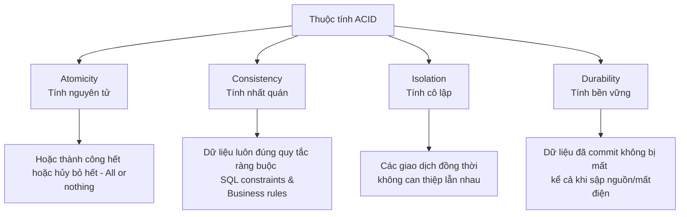
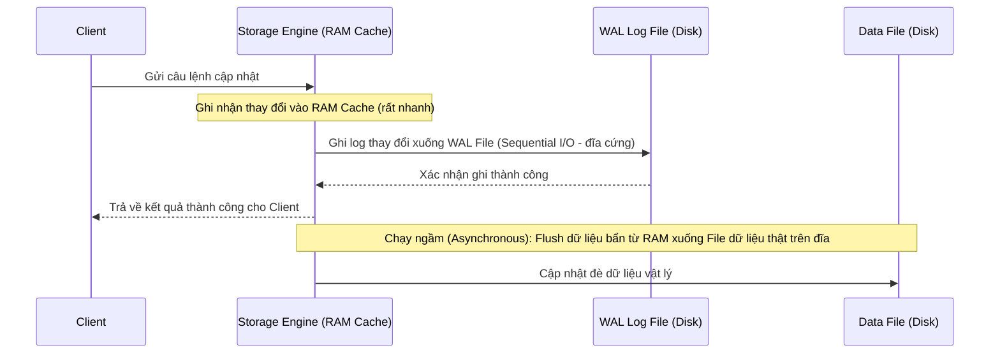

# Hướng dẫn về Giao dịch Cơ sở Dữ liệu (Database Transaction)

> *“Stop thinking, and end your problems.”*  
> — **Lao Tzu (Lão Tử)**

<details open>
<summary><b>Mục lục (Table of Contents)</b></summary>

- [1. Giới thiệu chung (Introduction)](#1-giới-thiệu-chung-introduction)
  - [1.1. Định nghĩa (Definition)](#11-định-nghĩa-definition)
  - [1.2. Thuộc tính ACID (ACID Properties)](#12-thuộc-tính-acid-acid-properties)
  - [1.3. Các cấp độ cô lập giao dịch (Isolation Levels)](#13-các-cấp-do-cô-lập-giao-dịch-isolation-levels)
    - [1.3.1. Read Uncommitted (Đọc dữ liệu chưa commit)](#131-read-uncommitted-đọc-dữ-liệu-chưa-commit)
    - [1.3.2. Read Committed (Đọc dữ liệu đã commit)](#132-read-committed-đọc-dữ-liệu-đã-commit)
    - [1.3.3. Repeatable Read (Đọc lặp lại)](#133-repeatable-read-đọc-lặp-lại)
    - [1.3.4. Serializable (Tuần tự hóa)](#134-serializable-tuần-tự-hóa)
- [2. Cơ chế hoạt động của Giao dịch (How Transactions Work?)](#2-cơ-chế-hoạt-động-của-giao-dịch-how-transactions-work)
  - [2.1. Nhật ký ghi trước (Write-Ahead Logging - WAL)](#21-nhật-ký-ghi-trước-write-ahead-logging---wal)
  - [2.2. Kiểm soát đồng thời đa phiên bản (Multiversion Concurrency Control - MVCC)](#22-kiểm-soát-đồng-thời-đa-phiên-bản-multiversion-concurrency-control---mvcc)
  - [2.3. Độ dài danh sách lịch sử phiên bản (History List Length - HLL)](#23-độ-dài-danh-sách-lịch-sử-phiên-bản-history-list-length---hll)
- [3. Các sự cố giao dịch thường gặp & Giải pháp (Common Problems)](#3-các-sự-cố-giao-dịch-thường-gặp--giải-pháp-common-problems)
  - [3.1. Giao dịch quá lớn (Large Transaction)](#31-giao-dịch-quá-lớn-large-transaction)
  - [3.2. Giao dịch chạy quá lâu (Long-Running Transactions)](#32-giao-dịch-chạy-quá-lâu-long-running-transactions)
  - [3.3. Giao dịch bị đình trệ (Stalled Transaction)](#33-giao-dịch-bị-đình-trệ-stalled-transaction)
  - [3.4. Giao dịch bị bỏ hoang (Abandoned Transaction)](#34-giao-dịch-bị-bỏ-hoang-abandoned-transaction)
  - [3.5. Một số lưu ý quan trọng khi cấu hình](#35-một-số-lưu-ý-quan-trọng-khi-cấu-hình)
- [4. Tổng kết & Bài tập về nhà (Recap & Homework)](#4-tổng-kết--bài-tập-về-nhà-recap--homework)

</details>

---

# 1. Giới thiệu chung (Introduction)

## 1.1. Định nghĩa (Definition)

*   **Giao dịch (Transaction)** là một tập hợp gồm một hoặc nhiều câu lệnh truy vấn SQL được đóng gói và xử lý như một đơn vị công việc nguyên tử (atomic) duy nhất.
*   **Nguyên tắc cốt lõi:** **Tất cả hoặc không có gì (All or Nothing)**. Toàn bộ các câu lệnh trong giao dịch phải cùng thực hiện thành công, hoặc nếu có một lệnh bị lỗi thì toàn bộ các lệnh trước đó phải bị hủy bỏ hoàn toàn để trả dữ liệu về trạng thái ban đầu.
*   **Cú pháp cơ bản:**
    *   `START TRANSACTION` hoặc `BEGIN`: Đánh dấu bắt đầu giao dịch.
    *   *Nhóm các câu lệnh SQL xử lý dữ liệu.*
    *   `COMMIT`: Xác nhận áp dụng vĩnh viễn tất cả các thay đổi dữ liệu vào đĩa cứng.
    *   `ROLLBACK`: Hủy bỏ toàn bộ các thay đổi tạm thời và đưa dữ liệu trở lại trạng thái trước khi giao dịch bắt đầu.

---

## 1.2. Thuộc tính ACID (ACID Properties)

ACID là bộ tiêu chuẩn bắt buộc phải tuân thủ để đảm bảo độ tin cậy của giao dịch trong cơ sở dữ liệu quan hệ:



*   **Atomicity (Tính nguyên tử):** Coi cả nhóm truy vấn SQL như một câu lệnh duy nhất. Không bao giờ tồn tại trạng thái giao dịch được thực thi một nửa.
*   **Consistency (Tính nhất quán):** Đảm bảo dữ liệu luôn hợp lệ theo tất cả các quy tắc đã định nghĩa trước. Cơ sở dữ liệu chỉ được phép chuyển dịch từ một trạng thái nhất quán này sang một trạng thái nhất quán khác, duy trì đầy đủ các ràng buộc (Constraints), quy tắc nghiệp vụ (Business rules) và kiểu dữ liệu.
*   **Isolation (Tính cô lập):** Các giao dịch thực thi đồng thời không được phép can thiệp hoặc ảnh hưởng đến nhau. Kết quả trung gian của một giao dịch đang chạy sẽ được ẩn đi đối với các giao dịch khác cho đến khi nó được commit.
*   **Durability (Tính bền vững):** Một khi giao dịch đã commit thành công, các thay đổi dữ liệu sẽ được lưu trữ vĩnh viễn xuống đĩa cứng và không bị mất đi ngay cả khi hệ thống gặp sự cố tắt nguồn đột ngột.

---

## 1.3. Các cấp độ cô lập giao dịch (Isolation Levels)

Tùy thuộc vào cấp độ cô lập được thiết lập, cơ sở dữ liệu sẽ cho phép hoặc ngăn chặn các dị thường (anomalies) dữ liệu khi chạy đồng thời:

| Cấp độ cô lập (Isolation Level) | Đọc bẩn (Dirty Read) | Đọc không lặp lại (Non-repeatable Read) | Đọc bóng ma (Phantom Read) |
| :--- | :---: | :---: | :---: |
| **Read Uncommitted** | Bị lỗi | Bị lỗi | Bị lỗi |
| **Read Committed** | Đã khắc phục | Bị lỗi | Bị lỗi |
| **Repeatable Read** | Đã khắc phục | Đã khắc phục | Bị lỗi (MySQL InnoDB khắc phục một phần) |
| **Serializable** | Đã khắc phục | Đã khắc phục | Đã khắc phục |

---

### 1.3.1. Read Uncommitted (Đọc dữ liệu chưa commit)
*   **Hành vi:** Giao dịch này có thể nhìn thấy dữ liệu đang thay đổi của một giao dịch khác ngay cả khi giao dịch đó chưa gọi lệnh `COMMIT`.
*   **Hiện tượng lỗi:** **Dirty Read (Đọc bẩn)** — Đọc phải dữ liệu tạm thời mà sau đó giao dịch kia thực hiện `ROLLBACK` khiến dữ liệu đó biến mất hoặc không hợp lệ.
*   **Đánh giá:** Rất hiếm khi được sử dụng trong thực tế.
*   **Trường hợp sử dụng:** Các hệ thống ghi nhận log tần suất cao (high-frequency logging), nơi hiệu năng đọc ghi được ưu tiên tuyệt đối hơn độ chính xác tuyệt đối của từng dòng dữ liệu log.

---

### 1.3.2. Read Committed (Đọc dữ liệu đã commit)
*   **Hành vi:** Giao dịch chỉ có thể đọc được dữ liệu của các giao dịch khác sau khi các giao dịch đó đã `COMMIT` thành công.
*   **Giải quyết:** Khắc phục hoàn toàn lỗi Đọc bẩn (Dirty Read).
*   **Cấu hình mặc định:** Đây là cấp độ cô lập **mặc định của PostgreSQL**.
*   **Hiện tượng lỗi tồn tại:** **Read Skew / Non-repeatable Read (Đọc không lặp lại)** — Trong cùng một giao dịch, nếu bạn đọc một hàng dữ liệu lần 1, sau đó có một giao dịch khác cập nhật hàng đó và commit thành công, khi bạn đọc lại lần 2 sẽ nhận được kết quả khác hoàn toàn với lần 1.
*   **Trường hợp sử dụng:** Hệ thống tài chính thông thường, yêu cầu mỗi giao dịch chỉ thao tác trên dữ liệu sạch, đã committed để tránh lỗi cơ bản nhưng có thể chấp nhận hiện tượng lệch đọc giữa các lần truy vấn.

---

### 1.3.3. Repeatable Read (Đọc lặp lại)
*   **Hành vi:** Đảm bảo dữ liệu của các dòng đã đọc sẽ luôn giữ nguyên trạng thái (look the same) trong suốt toàn bộ các lần đọc tiếp theo bên trong cùng giao dịch đó.
*   **Giải quyết:** Khắc phục lỗi Đọc không lặp lại (Non-repeatable Read).
*   **Cấu hình mặc định:** Đây là cấp độ cô lập **mặc định của MySQL**.
*   **Hiện tượng lỗi tồn tại:** **Phantom Read (Đọc bóng ma)** — Khi bạn thực hiện lại một câu truy vấn tìm kiếm theo khoảng (Range Query), số lượng dòng trả về có thể thay đổi (xuất hiện thêm dòng mới hoặc mất đi dòng cũ) do một giao dịch khác thực hiện chèn hoặc xóa dòng trong khoảng đó và commit thành công.
*   **Trường hợp sử dụng:** Hệ thống bán lẻ trực tuyến (Online Retail), yêu cầu bảo toàn dữ liệu về giá sản phẩm và số lượng tồn kho hiển thị đồng nhất cho khách hàng suốt phiên đặt hàng.

---

### 1.3.4. Serializable (Tuần tự hóa)
*   **Hành vi:** Khắc phục triệt để lỗi Đọc bóng ma (Phantom Read) bằng cách ép buộc các giao dịch có khả năng tranh chấp phải xếp hàng chạy tuần tự.
*   **Cơ chế:** Database sẽ tự động đặt khóa đọc (shared lock) trên mọi hàng dữ liệu mà giao dịch quét qua.
*   **Hạn chế:** **Làm giảm mạnh khả năng xử lý đồng thời (Concurrency)** của hệ thống, tăng nguy cơ Deadlock. Rất hiếm khi sử dụng trên Production.
*   **Trường hợp sử dụng:** Hệ thống giao dịch bất động sản, đấu giá hoặc chuyển khoản đặc biệt nghiêm ngặt, yêu cầu cô lập tuyệt đối.

---

# 2. Cơ chế hoạt động của Giao dịch (How Transactions Work?)

## 2.1. Nhật ký ghi trước (Write-Ahead Logging - WAL)

Khi có yêu cầu cập nhật dữ liệu (Write Operation), Storage Engine sẽ thực hiện quy trình sau để tối ưu hiệu năng IOPS:



1.  **Ghi nhật ký trước:** Storage Engine ghi nhận thông tin thay đổi vào file nhật ký giao dịch (Redo Log/WAL) trên đĩa cứng bằng hình thức **Ghi tuần tự (Sequential I/O)**. Việc ghi tuần tự diễn ra cực kỳ nhanh và đảm bảo dữ liệu bền vững.
2.  **Cập nhật trên RAM:** Cập nhật phiên bản dữ liệu mới lên bộ nhớ đệm (In-memory copy / Buffer pool) trên RAM $\rightarrow$ Trả kết quả thành công ngay lập tức cho client.
3.  **Flush dữ liệu ngầm:** Định kỳ hoặc khi rảnh, tiến trình chạy ngầm sẽ đồng bộ (flush) các trang dữ liệu đã thay đổi trên RAM xuống file dữ liệu vật lý thực tế trên đĩa cứng.

---

## 2.2. Kiểm soát đồng thời đa phiên bản (Multiversion Concurrency Control - MVCC)

Để cho phép các tác vụ Đọc không bị chặn bởi các tác vụ Ghi (và ngược lại), các Storage Engine hiện đại (như InnoDB của MySQL hay MVCC của Postgres) áp dụng cơ chế **MVCC**:

```mermaid
graph LR
    RowV1[Phiên bản hàng V1 <br/> Committed] <-- Trỏ đến bản cũ --- RowV2[Phiên bản hàng V2 <br/> Committed]
    RowV2 <-- Trỏ đến bản cũ --- RowV3[Phiên bản hàng V3 <br/> Active Txn]
    
    subgraph UndoLog [Chuỗi Undo Logs nằm trong Buffer Pool]
        RowV1
        RowV2
    end
```

*   **Nguyên lý:** Mỗi khi một hàng dữ liệu được cập nhật, hệ thống không ghi đè trực tiếp mà sẽ tạo ra một phiên bản mới của hàng đó.
*   **Undo Logs:** Phiên bản cũ của hàng dữ liệu được cất giữ trong **Undo Log**. Undo logs chứa thông tin hướng dẫn cách xây dựng lại dữ liệu của các phiên bản hàng cũ, phục vụ cho việc đọc nhất quán (`REPEATABLE READ`) và thao tác `ROLLBACK` khi cần.
*   **Tạo Bản chụp (Snapshot):** Khi lệnh `SELECT` được thực thi, database sẽ tạo ra một snapshot đại diện cho trạng thái dữ liệu tại thời điểm đó để truy vấn.
*   **Purge (Dọn dẹp):** Khi giao dịch gốc thực hiện commit và không còn bất kỳ giao dịch active nào khác cần sử dụng snapshot chứa phiên bản hàng cũ nữa, database sẽ tiến hành dọn dẹp các Undo Logs cũ này để giải phóng bộ nhớ.
*   **Lưu ý bộ nhớ:** Undo logs được lưu trữ tại **InnoDB Buffer Pool** (RAM) và được flush xuống đĩa. Việc một transaction giữ quá nhiều locks và sinh ra quá nhiều undo logs sẽ làm suy giảm nghiêm trọng hiệu năng của Buffer Pool.

---

## 2.3. Độ dài danh sách lịch sử phiên bản (History List Length - HLL)

*   **Định nghĩa:** **HLL** là chỉ số đo lường số lượng các phiên bản hàng dữ liệu cũ (Undo logs) chưa được tiến hành dọn dẹp (purged/flushed) khỏi hệ thống.
*   **Yêu cầu quản trị:** Cần thường xuyên giám sát và giữ chỉ số HLL ở mức ngắn. Chỉ số HLL tăng cao đột biến là dấu hiệu cảnh báo bộ nhớ RAM/đĩa bị phình to và các câu lệnh truy vấn đọc dữ liệu bị chậm đi rõ rệt do phải duyệt qua quá nhiều phiên bản cũ để tìm dữ liệu khớp.

---

# 3. Các sự cố giao dịch thường gặp & Giải pháp (Common Problems)

## 3.1. Giao dịch quá lớn (Large Transaction)
*   **Vấn đề:** Giao dịch thực hiện chỉnh sửa quá nhiều hàng dữ liệu cùng lúc.
*   **Hậu quả:** Gây khóa (lock) diện rộng trên bảng dữ liệu, phình to dung lượng Undo logs, làm cạn kiệt tài nguyên Buffer Pool.
*   **Giải pháp:** 
    *   Phân tích câu lệnh SQL xem tại sao lại cập nhật diện rộng như vậy.
    *   Thay đổi logic nghiệp vụ để chia tách tiến trình thành nhiều lô nhỏ (batching) xử lý tuần tự để giảm thiểu số lượng hàng bị khóa trong một giao dịch.

---

## 3.2. Giao dịch chạy quá lâu (Long-Running Transactions)
*   **Vấn đề:** Giao dịch được mở ra nhưng mất quá nhiều thời gian để gọi lệnh `COMMIT` hoặc `ROLLBACK`.
*   **Nguyên nhân:**
    *   Các câu lệnh truy vấn bên trong giao dịch quá chậm (không có index phù hợp).
    *   Ứng dụng thực hiện quá nhiều câu lệnh truy vấn hoặc lồng ghép các logic tính toán nặng, các cuộc gọi API bên ngoài (HTTP requests) bên trong khối giao dịch.
*   **Giải pháp:**
    *   Tìm nguyên nhân gốc rễ (có thể do bị chặn khóa - data locks).
    *   **Quy tắc tối kỵ:** Tuyệt đối không thực hiện các tác vụ không liên quan đến database (như gọi API bên ngoài, gửi email, xử lý ảnh...) bên trong một giao dịch DB.
    *   Tách biệt logic ứng dụng và tối giản hóa số lượng câu lệnh SQL trong block transaction.

---

## 3.3. Giao dịch bị đình trệ (Stalled Transaction)
*   **Vấn đề:** Khoảng thời gian chờ đợi giữa các câu lệnh SQL trong cùng một giao dịch từ phía ứng dụng là quá lâu.
*   **Ví dụ:**
    ```sql
    BEGIN;
    SELECT * FROM orders WHERE id = 5;
    -- Ứng dụng dừng lại để xử lý logic quá lâu ở đây (Stall)
    UPDATE orders SET status = 'processed' WHERE id = 5;
    COMMIT;
    ```
*   **Giải pháp:**
    *   Đánh giá xem các câu lệnh này có thực sự bắt buộc phải gom vào một giao dịch hay không.
    *   Cân nhắc sử dụng mức cô lập `READ COMMITTED` để tắt cơ chế khóa khoảng trống (Gap Locking) của MySQL, giúp các hàng dữ liệu xung quanh không bị khóa oan trong thời gian giao dịch bị stall.

---

## 3.4. Giao dịch bị bỏ hoang (Abandoned Transaction)
*   **Vấn đề:** Kết nối mạng từ Client/Application đến Database Server bị đứt đột ngột khi giao dịch đang hoạt động và chưa gọi lệnh đóng.
*   **Nguyên nhân:** Lập trình viên để rò rỉ kết nối (connection leaks) ở phía ứng dụng, hoặc do lỗi mạng đứt kết nối một nửa (half-closed connections).
*   **Giải pháp:**
    *   Sửa đổi và rà soát logic quản lý Connection Pool ở phía ứng dụng (đảm bảo giải phóng kết nối trong khối `try-finally`).
    *   Thiết lập giám sát trên Database Server để tự động phát hiện và ngắt (kill) các tiến trình giao dịch bị bỏ hoang chạy quá lâu mà không có hoạt động mới.

---

## 3.5. Một số lưu ý quan trọng khi cấu hình
*   **Phạm vi áp dụng Isolation Level:** Khi bạn thay đổi mức cô lập của giao dịch, thiết lập đó **chỉ áp dụng duy nhất cho giao dịch tiếp theo**. Sau khi giao dịch đó đóng lại, các giao dịch sau đó sẽ tự động quay về sử dụng mức cô lập mặc định của hệ thống.
*   **Autocommit mặc định:** Trong MySQL, thuộc tính `autocommit` được bật mặc định. Bạn cần sử dụng lệnh `START TRANSACTION` để báo hiệu bắt đầu giao dịch tường minh.
*   **Thiết lập cảnh báo:** Luôn thiết lập hệ thống cảnh báo (Alert) khi chỉ số History List Length (HLL) vượt ngưỡng an toàn quy định.
*   **Giao dịch vs Khóa:** Giao dịch (Transaction) và Cơ chế khóa (Locking) là hai khái niệm hoàn toàn khác biệt nhằm giải quyết hai vấn đề khác nhau (Transaction giải quyết tính toàn vẹn dữ liệu, Locking giải quyết tranh chấp truy cập tài nguyên đồng thời).

---

# 4. Tổng kết & Bài tập về nhà (Recap & Homework)

*   **Tóm tắt cốt lõi (Recap):**
    *   Mỗi cấp độ cô lập giao dịch được thiết kế để giải quyết dị thường dữ liệu của cấp độ trước đó. Trong thực tế, `Read Committed` và `Repeatable Read` là hai cấp độ được ứng dụng rộng rãi nhất.
    *   Giao dịch hoạt động dựa trên cơ chế ghi nhật ký trước (WAL), đa phiên bản (MVCC) và chuỗi Undo Logs. Hãy tối ưu hóa thời gian chạy và quy mô của giao dịch để bảo vệ tài nguyên RAM/đĩa.

*   **Bài tập về nhà (Homework):**
    *   **Thực hành chạy kịch bản Isolation Levels:** Sử dụng công cụ dòng lệnh (Terminal) mở song song 2 phiên kết nối tới cơ sở dữ liệu. Thực hiện lần lượt các kịch bản thiết lập Isolation Level từ `Read Uncommitted` đến `Serializable` để tự tái hiện và quan sát trực quan các hiện tượng: Đọc bẩn (Dirty Read), Đọc không lặp lại (Non-repeatable Read) và Đọc bóng ma (Phantom Read).

*   **Tài liệu tham khảo (References):**
    *   [Thiết kế máy trạng thái cho Transactions](https://blog.lawrencejones.dev/state-machines/index.html)
    *   [So sánh chi tiết Optimistic Locking vs Pessimistic Locking](https://vladmihalcea.com/optimistic-vs-pessimistic-locking/)
    *   [Tài liệu nghiên cứu sâu về Database Locking & Transactions](https://faculty.kutztown.edu/schwesin/spring2022/csc343/lectures/Locking.pdf)
