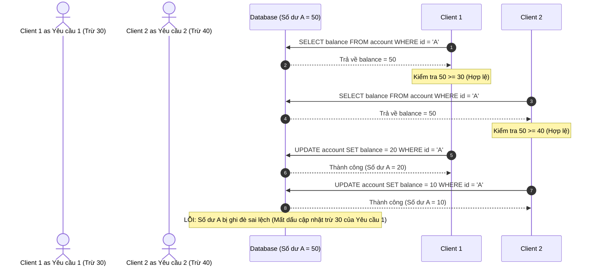
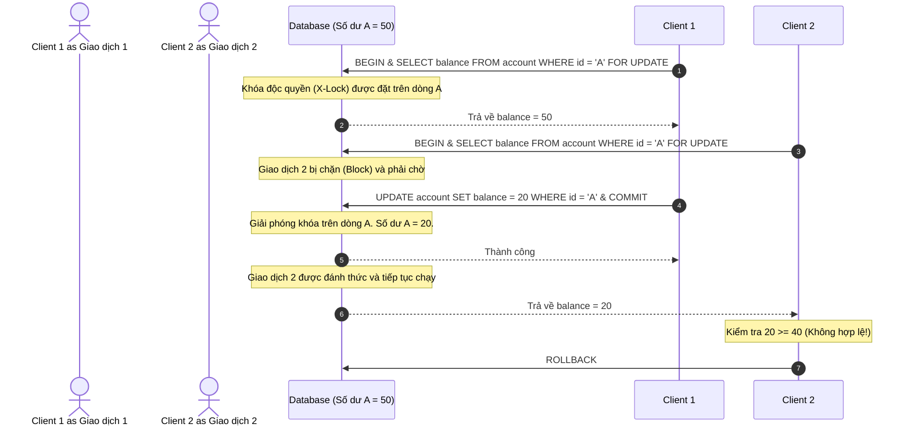
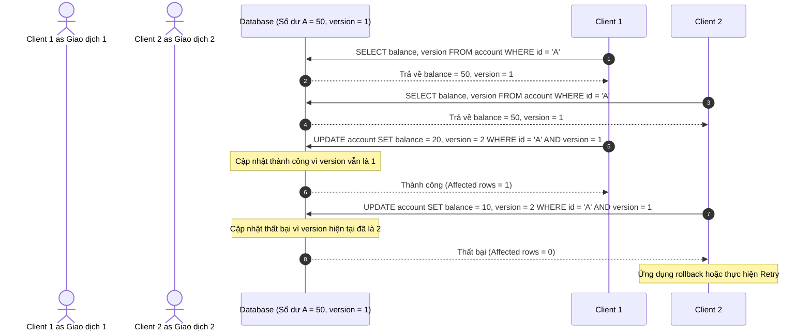

# Hướng dẫn về Cơ chế Khóa (Locking Guide)

> *“Nhiều vấn đề nó nằm ở tâm lý,*  
> *những cái định kiến sẽ là rào cản tâm lý.”*  

<details open>
<summary><b>Mục lục (Table of Contents)</b></summary>

- [1. Bối cảnh bài toán & Tranh chấp dữ liệu (Problem Context)](#1-bối-cảnh-bài-toán--tranh-chấp-dữ-liệu-problem-context)
- [2. Phân loại Khóa trong MySQL (Types of Locks)](#2-phân-loại-khóa-trong-mysql-types-of-locks)
  - [2.1. Phân loại theo cấp độ hoạt động (Operation-Level Locks)](#21-phân-loại-theo-cấp-độ-hoạt-động-operation-level-locks)
  - [2.2. Phân loại theo phạm vi khóa (Granularity-Level Locks)](#22-phân-loại-theo-phạm-vi-khóa-granularity-level-locks)
- [3. Khóa cấp dòng trong InnoDB (Row Locks)](#3-khóa-cấp-dòng-trong-innodb-row-locks)
  - [3.1. Các loại khóa dòng chi tiết](#31-các-loại-khóa-dòng-chi-tiết)
  - [3.2. Truy vấn giám sát thông tin Khóa (Query Lock Info)](#32-truy-vấn-giám-sát-thông-tin-khóa-query-lock-info)
  - [3.3. Cơ chế khóa thừa dòng (Redundant Locking)](#33-cơ-cế-khóa-thừa-dòng-redundant-locking)
- [4. Tranh chấp khóa & Giải pháp (Lock Contention)](#4-tranh-chấp-khóa--giải-pháp-lock-contention)
- [5. Khóa bi quan vs Khóa lạc quan (Pessimistic vs Optimistic Locking)](#5-khóa-bi-quan-vs-khóa-lạc-quan-pessimistic-vs-optimistic-locking)
  - [5.1. Khóa Bi quan (Pessimistic Locking)](#51-khóa-bi-quan-pessimistic-locking)
  - [5.2. Khóa Lạc quan (Optimistic Locking)](#52-khóa-lạc-quan-optimistic-locking)
- [6. Thực hành tốt & Triển khai (Practices)](#6-thực-hành-tốt-triển-khai-practices)
  - [6.1. Quy trình triển khai Khóa Lạc quan](#61-quy-trình-triển-khai-khóa-lạc-quan)
  - [6.2. Các lưu ý cốt lõi](#62-các-lưu-ý-cốt-lõi)
  - [6.3. Khuyến nghị thực hành tốt nhất (Best Practices)](#63-khuyến-nghị-thực-hành-tốt-nhất-best-practices)
- [Bài tập về nhà & Tài liệu tham khảo (Homework & References)](#bài-tập-về-nhà--tài-liệu-tham-khảo-homework-references)

</details>

---

# 1. Bối cảnh bài toán & Tranh chấp dữ liệu (Problem Context)

*   **Ngữ cảnh (Context):** Thực hiện giao dịch chuyển tiền (Fund Transfer - tác vụ ghi ghi đồng thời vào cơ sở dữ liệu).
*   **Vấn đề (Problem):** Tranh chấp dữ liệu (**Race Condition**) xảy ra khi nhiều tiến trình/luồng cùng thay đổi một tài nguyên tại một thời điểm mà không được đồng bộ hóa thứ tự thực thi.

### Ví dụ về sự bất tuần tự trong xử lý đồng thời (Ordering in Concurrency)
Giả sử tài khoản A có số dư hiện tại là **50** (triệu/USD). Có 2 yêu cầu rút tiền xảy ra hoàn toàn đồng thời:
1.  **Yêu cầu 1:** A chuyển cho B số tiền **30**.
2.  **Yêu cầu 2:** A chuyển cho C số tiền **40**.

Nếu hệ thống xử lý song song không có cơ chế khóa:
*   Tiến trình 1 đọc số dư A = 50, kiểm tra điều kiện $50 \ge 30$ (hợp lệ), và chuẩn bị trừ tiền.
*   Cùng lúc đó, tiến trình 2 cũng đọc số dư A = 50, kiểm tra điều kiện $50 \ge 40$ (hợp lệ), và chuẩn bị trừ tiền.
*   **Hậu quả:** Cả hai tiến trình đều thực hiện thành công và ghi đè số dư mới xuống DB. Số dư của A có thể bị âm tiền ($50 - 30 - 40 = -20$) hoặc dữ liệu bị ghi đè lẫn nhau khiến số dư cuối cùng bị sai lệch nghiêm trọng. Trong khi đó, quy tắc nghiệp vụ bắt buộc số dư của A phải luôn $\ge 0$.



$\rightarrow$ **Giải pháp:** Sử dụng cơ chế khóa (**Locking**) để kiểm soát thứ tự thực thi và đảm bảo tính tuần tự hóa tại các thời điểm nhạy cảm.

---

# 2. Phân loại Khóa trong MySQL (Types of Locks)

## 2.1. Phân loại theo cấp độ hoạt động (Operation-Level Locks)
Đứng dưới góc độ thao tác đọc/ghi, cơ sở dữ liệu cung cấp hai loại khóa cơ bản:

1.  **Shared Lock (Khóa chia sẻ - S Lock / Read Lock):**
    *   Cho phép nhiều giao dịch khác nhau cùng giữ khóa đọc trên một tài nguyên để truy vấn dữ liệu đồng thời.
    *   **Chặn** toàn bộ các thao tác ghi (Write/Update) từ các giao dịch khác cho đến khi khóa chia sẻ được giải phóng hoàn toàn.
2.  **Exclusive Lock (Khóa độc quyền - X Lock / Write Lock):**
    *   Chỉ cho phép duy nhất một giao dịch giữ khóa trên một tài nguyên tại một thời điểm.
    *   **Chặn hoàn toàn** cả thao tác đọc (yêu cầu khóa S) lẫn thao tác ghi (yêu cầu khóa X) từ các giao dịch khác.

### Ma trận tương thích giữa các loại khóa (Lock Compatibility Matrix)

| Loại Khóa Hiện Tại | Shared Lock (S) | Exclusive Lock (X) |
| :--- | :---: | :---: |
| **Shared Lock (S)** | **Tương thích (Cho phép)** | Không tương thích (Chặn) |
| **Exclusive Lock (X)**| Không tương thích (Chặn) | Không tương thích (Chặn) |

*   **Ví dụ 1 (S - S):**
    1. Giao dịch A đặt khóa **S** trên dòng dữ liệu X để đọc.
    2. Giao dịch B yêu cầu đặt khóa **S** trên dòng dữ liệu X $\rightarrow$ **Thành công** (cả hai cùng đọc đồng thời).
*   **Ví dụ 2 (S - X):**
    1. Giao dịch A đặt khóa **S** trên dòng dữ liệu X.
    2. Giao dịch B yêu cầu đặt khóa **X** để cập nhật dòng X $\rightarrow$ **Bị chặn/Chờ đợi** cho đến khi giao dịch A commit hoặc rollback.
*   **Ví dụ 3 (X - S):**
    1. Giao dịch A đặt khóa **X** trên dòng dữ liệu X để update.
    2. Giao dịch B yêu cầu đặt khóa **S** trên dòng X $\rightarrow$ **Bị chặn/Chờ đợi** cho đến khi giao dịch A hoàn tất.

> [!NOTE]
> **Câu hỏi:** Loại khóa hoạt động nào được sử dụng để giải quyết bài toán tranh chấp số dư tài khoản A ở phần 1?
> 
> **Trả lời:** Sử dụng **Exclusive Lock (Khóa độc quyền)** thông qua cú pháp SQL `SELECT ... FOR UPDATE` khi đọc số dư của A. Điều này giúp ngăn không cho bất kỳ giao dịch nào khác đọc hay cập nhật tài khoản A cho đến khi giao dịch hiện tại hoàn tất.

---

## 2.2. Phân loại theo phạm vi khóa (Granularity-Level Locks)
InnoDB hỗ trợ khóa ở nhiều phạm vi kích thước khác nhau để tối ưu hóa hiệu năng:

1.  **Global Lock (Khóa toàn cục):** Khóa toàn bộ các cơ sở dữ liệu trên instance. Thường dùng khi backup dữ liệu toàn hệ thống để giữ trạng thái nhất quán.
2.  **Table Lock (Khóa cấp bảng):** Khóa toàn bộ một bảng dữ liệu.
    *   *Ví dụ cú pháp:* `LOCK TABLES accounts WRITE;`
    *   **Intention Lock (Khóa định ý):** Là loại khóa cấp bảng được InnoDB tự động sử dụng nhằm báo hiệu rằng một giao dịch đang hoặc sắp đặt khóa (S hoặc X) trên các dòng dữ liệu cụ thể trong bảng đó. Gồm hai loại: *Intention Shared (IS)* và *Intention Exclusive (IX)*. Nhờ có khóa định ý, khi một tiến trình muốn khóa toàn bộ bảng, nó chỉ cần kiểm tra trạng thái khóa định ý ở cấp bảng mà không cần duyệt từng dòng trong bảng để tìm khóa, giúp nâng cao hiệu năng hệ thống rõ rệt.
    *   **AUTO-INC Lock:** Một cơ chế khóa bảng đặc biệt xảy ra khi chèn dữ liệu vào bảng có cột tự tăng (`AUTO_INCREMENT`). Trên các phiên bản MySQL mới, cơ chế này đã được tối ưu đáng kể bằng cách dùng các chốt định vị nhanh (mutex) để sinh số thay vì khóa toàn bảng trong suốt giao dịch.
3.  **Row Level Lock (Khóa cấp dòng):** Khóa chính xác trên từng dòng dữ liệu cụ thể. Đây là loại khóa quan trọng nhất giúp tăng tối đa khả năng xử lý đồng thời của hệ thống.

---

# 3. Khóa cấp dòng trong InnoDB (Row Locks)

## 3.1. Các loại khóa dòng chi tiết
InnoDB không chỉ khóa đơn giản trên một dòng, mà chia ra các loại khóa dòng tinh tế sau:

| Tên Khóa | Ký hiệu trong InnoDB | Khóa khoảng trống (Gap)? | Mô tả chi tiết |
| :--- | :--- | :---: | :--- |
| **Record Lock** | `REC_NOT_GAP` | Không | Khóa trực tiếp duy nhất trên một dòng dữ liệu (chỉ mục - index record) cụ thể. |
| **Gap Lock** | `GAP` | Có | Khóa khoảng trống nằm giữa các dòng dữ liệu (hoặc khoảng trước dòng đầu tiên/sau dòng cuối cùng), không khóa chính dòng dữ liệu đó. |
| **Next-Key Lock** | `NEXT_KEY` | Có | Là sự kết hợp giữa **Record Lock** trên dòng dữ liệu đó và **Gap Lock** trên khoảng trống nằm ngay trước dòng đó. |
| **Insert Intention Lock** | `INSERT_INTENTION` | Có | Một loại Gap Lock đặc biệt được tạo ra trước khi thực hiện câu lệnh `INSERT`, cho phép nhiều giao dịch cùng thực hiện chèn dữ liệu vào cùng một khoảng trống một cách đồng thời miễn là họ không chèn trùng vị trí khóa chính (ví dụ: một luồng chèn id=3, một luồng chèn id=4 vào khoảng trống giữa 2 và 5). |

### Phân tích ví dụ thực tế
```sql
UPDATE account_balance 
SET balance = balance + 10 
WHERE account_number BETWEEN 2 AND 5;
```
> [!NOTE]
> **Câu hỏi:** Loại khóa cấp dòng nào sẽ được sử dụng để giải quyết câu lệnh cập nhật theo khoảng trên?
> 
> **Trả lời:** InnoDB sẽ đặt **Next-Key Lock** (và **Gap Lock**) trên khoảng giá trị từ 2 đến 5 để khóa toàn bộ các dòng hiện có và chặn mọi hành vi chèn dòng mới vào khoảng này nhằm tránh lỗi Đọc bóng ma (Phantom Read). Ngược lại, nếu chúng ta chỉ cập nhật chính xác một dòng bằng khóa chính (`WHERE id = 3`), InnoDB sẽ tối ưu bằng cách chỉ sử dụng **Record Lock** (`REC_NOT_GAP`) trên duy nhất dòng đó.

---

## 3.2. Truy vấn giám sát thông tin Khóa (Query Lock Info)
Để debug các sự cố tranh chấp hoặc Deadlock, ta có thể truy vấn thông tin các khóa đang active thông qua Performance Schema:

```sql
SELECT 
    thread_id, 
    index_name, 
    lock_type, 
    lock_mode, 
    lock_status, 
    lock_data
FROM performance_schema.data_locks
WHERE object_name = '<tên_bảng>';
```
*Ý nghĩa các trường:*
*   `thread_id`: ID luồng của tiến trình giữ hoặc đang chờ khóa.
*   `lock_mode`: Chế độ khóa hiện tại (ví dụ: `X,REC_NOT_GAP`, `S,GAP`, `IX`).
*   `lock_status`: Trạng thái của khóa (`GRANTED` - đã được cấp, `WAITING` - đang xếp hàng chờ).
*   `lock_data`: Giá trị thực tế của index đang bị khóa (ví dụ: giá trị của khóa chính `3`).

---

## 3.3. Cơ chế khóa thừa dòng (Redundant Locking)
Theo cuốn sách *"Efficient MySQL Performance"* của tác giả Daniel Nichter:
> *“Các cơ chế khóa trong MySQL đôi khi giống như một chiếc hộp đen (blackbox) bí ẩn.”*

**Tại sao MySQL đôi khi lại khóa cả những dòng thừa thãi không trực tiếp thỏa mãn điều kiện cập nhật?**
*   **Nguyên nhân:** Để đảm bảo mức độ cô lập **Repeatable Read (Đọc lặp lại)** mặc định. Để ngăn chặn lỗi Đọc bóng ma (Phantom Read), MySQL buộc phải khóa cả các khoảng trống (Gap Lock/Next-Key Lock) bao quanh phạm vi quét dữ liệu của chỉ mục (Index) mà câu lệnh truy vấn đã sử dụng, dẫn tới việc các dòng lân cận cũng bị khóa "oan".

---

# 4. Tranh chấp khóa & Giải pháp (Lock Contention)

*   **Tranh chấp khóa (Lock Contention):** Xảy ra khi nhiều giao dịch đồng thời xếp hàng chờ đợi để có quyền truy cập vào cùng một tài nguyên bị khóa.
*   **Hậu quả:** Làm tăng thời gian phản hồi của hệ thống (latency), giảm hiệu năng thông qua (throughput) và tăng nguy cơ gây ra **Deadlock** (xung đột khóa vòng tròn giữa các giao dịch khiến hệ thống bị đình trệ).

---

# 5. Khóa bi quan vs Khóa lạc quan (Pessimistic vs Optimistic Locking)

Dựa trên phương thức triển khai thực tế, chúng ta phân loại cơ chế khóa thành hai trường phái đối lập:

| Tiêu chí | Khóa Bi quan (Pessimistic Locking) | Khóa Lạc quan (Optimistic Locking) |
| :--- | :--- | :--- |
| **Tư duy cốt lõi** | Chủ động khóa chặn tài nguyên ngay từ đầu vì giả định xung đột luôn xảy ra. | Không giữ khóa lúc đọc. Cho phép xung đột xảy ra và sẽ kiểm tra, giải quyết ở bước ghi dữ liệu. |
| **Cách triển khai** | Dùng cơ chế khóa của DB (`SELECT ... FOR UPDATE`, `SELECT ... FOR SHARE`) hoặc khóa ở mức ứng dụng (`synchronized`). | Dùng thuật toán so sánh phiên bản (Compare-And-Swap - CAS) thông qua trường `version`. |
| **Ưu điểm** | Đảm bảo an toàn dữ liệu tuyệt đối ở mức vật lý DB. Tránh việc ứng dụng ghi đè dữ liệu sai lệch. | Rất nhẹ (Lightweight), giảm thiểu chi phí khóa hệ thống, tối ưu hóa băng thông xử lý đồng thời, loại bỏ hoàn toàn Deadlock ở ứng dụng. |
| **Nhược điểm** | Nặng nề (Heavyweight). Dễ gây nghẽn cổ chai hiệu năng khi số lượng kết nối lớn. Tăng nguy cơ Deadlock ở DB. | Rủi ro xung đột cao. Khi có nhiều request ghi đồng thời, chỉ 1 request thành công, các request còn lại sẽ bị từ chối và phải thực hiện retry. |
| **Ngữ cảnh sử dụng**| Hệ thống có **tần suất tranh chấp lớn** (High Concurrency + High Contention). | Hệ thống có **tần suất tranh chấp thấp** (High Concurrency + Low Contention). |

---

## 5.1. Khóa Bi quan (Pessimistic Locking)
*   **Cú pháp trong SQL:**
    *   `SELECT ... FOR SHARE;` (Đặt khóa đọc S)
    *   `SELECT ... FOR UPDATE;` (Đặt khóa độc quyền X)



---

## 5.2. Khóa Lạc quan (Optimistic Locking)
*   **Cơ chế Compare-And-Swap (CAS):**
    *   **Sử dụng cột Version:** Thêm một cột `version` kiểu số vào bảng dữ liệu. Mỗi lần cập nhật sẽ tăng giá trị `version` lên 1 và so sánh giá trị này ở điều kiện `WHERE`.
    *   **Sử dụng Timestamp:** Sử dụng thời gian cập nhật cuối cùng (tuy nhiên cách này ít khuyến khích hơn vì độ phân giải của đồng hồ hệ thống có thể bị lệch trên môi trường phân tán).



---

# 6. Thực hành tốt & Triển khai (Practices)

## 6.1. Quy trình triển khai Khóa Lạc quan
1.  **Thiết lập bảng dữ liệu:** Thêm cột `version` (mặc định khởi tạo là `1`).
2.  **Đọc dữ liệu (Read):** Thực hiện câu lệnh `SELECT` thông thường để lấy thông tin dòng kèm theo version hiện tại (ví dụ: `old_version = 1`).
3.  **Xử lý logic ứng dụng:** Tính toán các giá trị mới cần cập nhật.
4.  **Cập nhật dữ liệu (Write):** Chạy câu lệnh `UPDATE` kèm điều kiện kiểm tra phiên bản cũ:
    ```sql
    UPDATE account_balance 
    SET balance = <giá_trị_mới>, version = <old_version + 1>
    WHERE id = <id> AND version = <old_version>;
    ```
5.  **Kiểm tra kết quả:** Xem số lượng dòng bị ảnh hưởng (affected rows). Nếu bằng `0`, nghĩa là đã có tiến trình khác thay đổi dữ liệu trước đó $\rightarrow$ Ứng dụng báo lỗi xung đột hoặc tự động thực hiện cơ chế thử lại (Retry).

---

## 6.2. Các lưu ý cốt lõi
*   **Giao dịch $\neq$ Khóa:** Giao dịch giải quyết tính toàn vẹn và cô lập dữ liệu (ACID), trong khi Khóa giải quyết tranh chấp tài nguyên đồng thời.
*   **Khóa Database $\neq$ Khóa ngôn ngữ lập trình:** Khóa của database (như InnoDB Row Lock) được quản lý dưới đĩa cứng/RAM của DB Server. Khóa của ngôn ngữ (như Java `synchronized` hoặc Go `sync.Mutex`) chỉ có tác dụng trong bộ nhớ của một tiến trình đơn lẻ, không thể kiểm soát tranh chấp trên môi trường nhiều cụm server (môi trường phân tán).

---

## 6.3. Khuyến nghị thực hành tốt nhất (Best Practices)
*   **Trừ tiền trước, cộng tiền sau (Subtract first, add later):** Khi làm hệ thống chuyển tiền, luôn thực hiện trừ tiền tài khoản nguồn trước. Nếu tài khoản nguồn không đủ tiền hoặc bị lỗi, giao dịch sẽ báo lỗi sớm và rollback ngay lập tức, tránh việc cộng tiền cho tài khoản đích trước rồi mới lỗi ở tài khoản nguồn.
*   **Sử dụng khóa chính (Primary Key):** Luôn sử dụng khóa chính trong điều kiện `WHERE` của câu lệnh `UPDATE` để database kích hoạt chính xác khóa dòng đơn lẻ (`REC_NOT_GAP`), giảm tối đa tranh chấp.
*   **Tránh dùng chỉ mục phụ (Secondary Index) để cập nhật:** Cập nhật dữ liệu dựa trên chỉ mục phụ có thể khiến database phải quét và khóa nhiều dòng thừa hoặc khóa toàn bảng.
*   **Kết hợp linh hoạt:** Phối hợp sử dụng **Khóa phân tán (Distributed Lock - như Redis Redlock)** ở tầng ứng dụng và **Khóa lạc quan (Optimistic Locking)** ở tầng database để đạt hiệu năng tối ưu nhất.

---

# Bài tập về nhà & Tài liệu tham khảo (Homework & References)

### Bài tập về nhà (Homework)
*   **Đề bài:** Thiết kế và triển khai hệ thống đặt vé máy bay (Flight Booking System).
*   **Nghiệp vụ yêu cầu:**
    1. Tạo đơn đặt vé mới (Create a booking).
    2. Giảm số lượng ghế trống khả dụng trên chuyến bay tương ứng (Decrease available seats).
*   **Các cơ chế khóa cần triển khai:**
    *   *Mức cơ bản:* Sử dụng duy nhất Khóa bi quan (Pessimistic Locking) trong Database (`SELECT ... FOR UPDATE`).
    *   *Mức nâng cao:* Kết hợp Khóa lạc quan (Optimistic Locking - sử dụng cột `version`) cùng với Khóa phân tán (Distributed Lock) ở tầng ứng dụng để tối ưu hiệu năng.
*   **Câu hỏi tư duy thêm:** Nêu rõ **4 điều kiện dẫn đến Deadlock** và đề xuất giải pháp đơn giản nhất để phòng tránh Deadlock khi triển khai hệ thống của bạn.

### Tài liệu tham khảo (References)
*   **State Machines & Transactions:** [Design State Machines for Transactions](https://blog.lawrencejones.dev/state-machines/index.html)
*   **Locking Comparison:** [Optimistic vs Pessimistic Locking - Vlad Mihalcea](https://vladmihalcea.com/optimistic-vs-pessimistic-locking/)
*   **Database Locking & Transactions Research:** [CSC343 Lectures - Database Locking](https://faculty.kutztown.edu/schwesin/spring2022/csc343/lectures/Locking.pdf)

**Cảm ơn bạn! (Thank you)**
