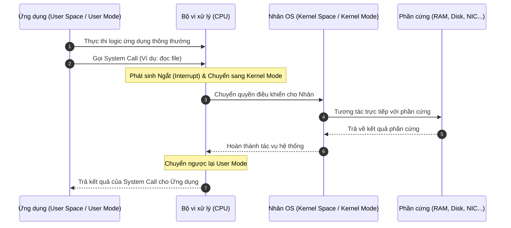
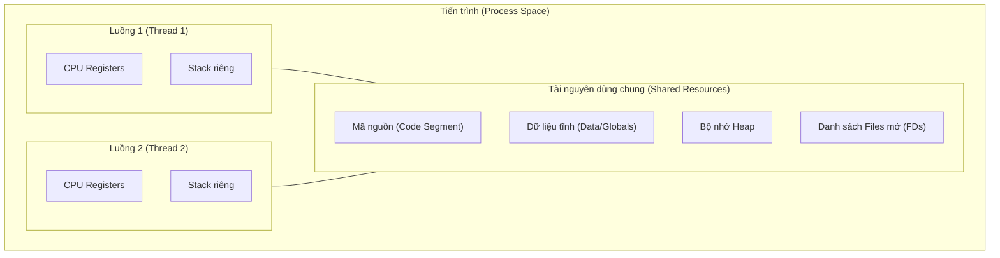
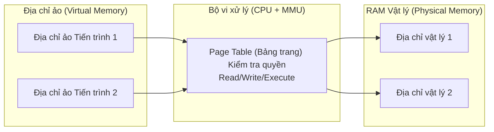

# Hướng dẫn về Hệ điều hành (Operating System Guide)

> *“Nên tránh những cuộc tranh luận*  
> *không có tính xây dựng, vô bổ.”*  

<details open>
<summary><b>Mục lục (Table of Contents)</b></summary>

- [1. Giới thiệu chung (Introduction)](#1-giới-thiệu-chung-introduction)
  - [1.1. Hệ điều hành (Operating System)](#11-hệ-điều-hành-operating-system)
  - [1.2. Nhân hệ điều hành (Kernel)](#12-nhân-hệ-điều-hành-kernel)
  - [1.3. Cơ chế hoạt động của Kernel (How the Kernel Works)](#13-cơ-chế-hoạt-động-của-kernel-how-the-kernel-works)
  - [1.4. Khả năng quản lý của Kernel](#14-khả-năng-quản-lý-của-kernel)
  - [1.5. Đặc trưng thiết kế của Linux](#15-đặc-trưng-thiết-kế-của-linux)
- [2. Quản lý Tiến trình & Luồng (Process & Thread Management)](#2-quản-lý-tiến-trình--luồng-process--thread-management)
  - [2.1. Các khái niệm cơ bản](#21-các-khái-niệm-cơ-bản)
  - [2.2. Tiến trình (Process) & Khối quản lý PCB](#22-tiến-trình-process--khối-quản-lý-pcb)
  - [2.3. Chuyển ngữ cảnh tiến trình (Process Context Switching)](#23-chuyển-ngữ-cảnh-tiến-trình-process-context-switching)
  - [2.4. Luồng (Thread) & Chia sẻ tài nguyên](#24-luồng-thread--chia-sẻ-tài-nguyên)
  - [2.5. Nguyên lý xử lý trên lõi đơn (Single-Core Principle)](#25-nguyên-lý-xử-lý-trên-lõi-đơn-single-core-principle)
- [3. Quản lý Bộ nhớ (Memory Management)](#3-quản-lý-bộ-nhớ-memory-management)
  - [3.1. Vấn đề tranh chấp bộ nhớ](#31-vấn-đề-tranh-chấp-bộ-nhớ)
  - [3.2. Bộ nhớ ảo (Virtual Memory)](#32-bộ-nhớ-ảo-virtual-memory)
  - [3.3. Phân vùng tráo đổi (Swap Partition)](#33-phân-vùng-tráo-đổi-swap-partition)
  - [3.4. Mô hình bộ nhớ đệm (Memory Cache Model)](#34-mô-hình-bộ-nhớ-đệm-memory-cache-model)
- [4. Cơ chế Vào/Ra (I/O) & Điểm nghẽn (Bottlenecks)](#4-cơ-chế-vàora-io--điểm-nghẽn-bottlenecks)
  - [4.1. Thao tác I/O là gì?](#41-thao-tác-io-là-gì)
  - [4.2. Các nhóm điểm nghẽn (Bottleneck Groups) trong ứng dụng Backend](#42-các-nhóm-điểm-nghẽn-bottleneck-groups-trong-ứng dụng-backend)
  - [4.3. Cơ chế hoạt động của I/O](#43-cơ-chế-hoạt-động-của-io)
  - [4.4. Tại sao I/O là điểm nghẽn hiệu năng?](#44-tại-sao-io-là-điểm-nghẽn-hiệu-năng)
  - [4.5. Phân loại mô hình I/O (Blocking vs Non-Blocking)](#45-phân-loại-mô-hình-io-blocking-vs-non-blocking)
  - [4.6. Cơ chế truy cập tập tin (File Access)](#46-cơ-chế-truy-cập-tập-tin-file-access)
- [5. Hệ thống tập tin (File System)](#5-hệ-thống-tập-tin-file-system)
  - [5.1. Định nghĩa & Triết lý Linux](#51-định-nghĩa--triết-lý-linux)
  - [5.2. Inode (Index Node)](#52-inode-index-node)
  - [5.3. Liên kết cứng (Hard Link)](#53-liên-kết-cứng-hard-link)
  - [5.4. Liên kết mềm (Soft Link / Symbolic Link)](#54-liên-kết-mềm-soft-link--symbolic-link)
  - [5.5. Quản lý quyền truy cập (Access Control)](#55-quản-lý-quyền-truy-cập-access-control)
- [6. Các lệnh Linux thông dụng & Shell (Linux Commands)](#6-các-lệnh-linux-thông-dụng--shell-linux-commands)
  - [6.1. Các lệnh dòng lệnh cơ bản](#61-các-lệnh-dòng-lệnh-cơ-bản)
  - [6.2. Shell trên Linux](#62-shell-trên-linux)
- [7. Kết nối Mạng & Đa hợp I/O (Networking & Multiplexing I/O)](#7-kết-nối-mạng--đa-hợp-io-networking--multiplexing-io)
  - [7.1. Server có thể phục vụ tối đa bao nhiêu kết nối đồng thời?](#71-server-có-thể-phục-vụ-tối-đa-bao-nhiêu-kết-nối-đồng-thời)
  - [7.2. Cơ chế Đa hợp I/O (Multiplexing I/O)](#72-cơ-chế-đa-hợp-io-multiplexing-io)
- [Tóm tắt & Bài tập về nhà (Recap & Homework)](#tóm-tắt--bài-tập-về-nhà-recap--homework)

</details>

---

# 1. Giới thiệu chung (Introduction)

## 1.1. Hệ điều hành (Operating System)
*   **Hệ điều hành (OS)** là phần mềm hệ thống quản lý tài nguyên phần cứng, tài nguyên phần mềm và cung cấp các dịch vụ chung cho các chương trình ứng dụng.
*   OS đóng vai trò là chiếc **cầu nối** trung gian giữa phần cứng máy tính và người dùng/ứng dụng. Nó cung cấp giao diện người dùng (User Interface) và kiểm soát phần cứng vật lý để phần mềm ứng dụng có thể hoạt động trơn tru.

---

## 1.2. Nhân hệ điều hành (Kernel)
*   **Nhân (Kernel)** là phần cốt lõi quan trọng nhất của hệ điều hành.
*   Kernel là chương trình máy tính chịu trách nhiệm kết nối và chuyển dịch yêu cầu giữa các ứng dụng phần mềm đến các thiết bị phần cứng thực tế (CPU, bộ nhớ RAM, ổ đĩa cứng, card mạng, v.v.).
*   **Tại sao lại cần Kernel?**
    *   Máy tính được cấu tạo bởi rất nhiều linh kiện phần cứng đa dạng và phức tạp của nhiều nhà sản xuất khác nhau.
    *   Nếu không có Kernel, mỗi nhà phát triển phần mềm sẽ phải tự viết các giao thức truyền thông phức tạp riêng để giao tiếp với từng linh kiện phần cứng vật lý đó $\rightarrow$ Điều này là bất khả thi và cực kỳ lãng phí nguồn lực.

---

## 1.3. Cơ chế hoạt động của Kernel (How the Kernel Works)
Để bảo vệ hệ thống khỏi các hành vi phá hoại hoặc lỗi phần mềm của ứng dụng, hầu hết các hệ điều hành hiện đại đều phân tách bộ nhớ thành hai không gian độc lập:
*   **Kernel Space (Không gian nhân):** Vùng nhớ đặc quyền chỉ dành riêng cho các chương trình cốt lõi của nhân OS hoạt động.
*   **User Space (Không gian người dùng):** Vùng nhớ an toàn dành riêng cho các ứng dụng của bên thứ ba hoặc của người dùng chạy. 

Khi chạy, CPU cũng phân chia làm 2 chế độ đặc quyền tương ứng:
*   **Kernel Mode:** CPU có toàn quyền truy cập phần cứng và mọi địa chỉ bộ nhớ vật lý.
*   **User Mode:** CPU bị giới hạn quyền truy cập bộ nhớ và không được phép giao tiếp trực tiếp với phần cứng.

Khi ứng dụng chạy trong User Space cần thao tác phần cứng (ví dụ: đọc file trên đĩa cứng), nó phải thực hiện một **System Call (Lời gọi hệ thống)**. Lời gọi này sẽ kích hoạt một cơ chế **Ngắt (Interrupt)** để báo cho CPU chuyển quyền điều khiển và chế độ hoạt động sang Kernel Mode để Nhân xử lý tác vụ đó, sau khi xong sẽ trả lại quyền điều khiển về cho ứng dụng ở User Mode.



---

## 1.4. Khả năng quản lý của Kernel
Nhân hệ điều hành sở hữu các năng lực đặc quyền cốt lõi sau:
*   Quản lý tiến trình (Process) và luồng (Thread).
*   Quản lý bộ nhớ vật lý và bộ nhớ ảo.
*   Quản lý và giao tiếp trực tiếp với các thiết bị phần cứng thông qua các trình điều khiển (Drivers).
*   Cung cấp các System Calls giao tiếp bảo mật với tầng ứng dụng.

---

## 1.5. Đặc trưng thiết kế của Linux
*   **MultiTask (Đa nhiệm):** Cho phép nhiều nhiệm vụ/tiến trình được thực thi song song đồng thời.
*   **SMP (Symmetric Multiprocessing):** Đa xử lý đối xứng. Mỗi nhân CPU trong kiến trúc đa nhân đều có vị thế ngang hàng và quyền hạn bình đẳng trong việc khai thác tài nguyên hệ thống.
*   **ELF (Executable File Link Format):** Định dạng file nhị phân tiêu chuẩn được Linux sử dụng để lưu trữ các tập tin thực thi và thư viện liên kết động.
*   **Monolithic Kernel (Nhân nguyên khối):** Tất cả các thành phần cốt lõi của nhân Linux (như file system, driver, network protocol) đều chạy chung một không gian địa chỉ bộ nhớ Kernel Space ở chế độ Kernel Mode. Trái ngược với Linux, hệ điều hành Windows sử dụng **Hybrid Kernel (Nhân lai)** - kết hợp giữa nhân nguyên khối và vi nhân (microkernel).

---

# 2. Quản lý Tiến trình & Luồng (Process & Thread Management)

## 2.1. Các khái niệm cơ bản
*   **Chương trình (Program):** Một tập tin thực thi tĩnh chứa mã nguồn đã biên dịch, được lưu trữ cố định trên đĩa cứng (ví dụ: file `.exe` trên Windows hoặc file nhị phân trên Linux).
*   **Tiến trình (Process):** Một chương trình đang được nạp vào bộ nhớ RAM và được CPU cấp phát tài nguyên để chạy các câu lệnh logic.
*   **Luồng (Thread):** Một luồng thực thi các câu lệnh bên trong một tiến trình. Luồng là đơn vị nhỏ nhất được CPU lên lịch phân chia thời gian xử lý.

---

## 2.2. Tiến trình (Process) & Khối quản lý PCB
Mặc dù tại một thời điểm vật lý cực kỳ nhỏ, một CPU đơn nhân chỉ có thể xử lý duy nhất một tiến trình, nhưng trong vòng 1 giây, CPU chuyển đổi qua lại giữa hàng trăm tiến trình khác nhau cực kỳ nhanh. Điều này tạo ra cảm giác đa nhiệm đồng thời (**Concurrency**).

Để quản lý và lưu trữ trạng thái của từng tiến trình, hệ điều hành sử dụng một cấu trúc dữ liệu gọi là **PCB (Process Control Block)** gồm:
*   Process ID (PID) và User ID (UID) của người sở hữu.
*   Trạng thái hiện tại (Running, Ready, Blocked/Waiting).
*   Mức độ ưu tiên của tiến trình (Priority).
*   Không gian địa chỉ bộ nhớ ảo, danh sách các file mô tả tập tin đang mở (FDs).
*   Giá trị hiện thời của các thanh ghi CPU (Registers) và con trỏ chương trình.

---

## 2.3. Chuyển ngữ cảnh tiến trình (Process Context Switching)
Trước khi một tác vụ mới được nạp vào CPU để xử lý, CPU cần biết tác vụ đó được nạp ở đâu trong RAM và bắt đầu từ lệnh nào:
*   Các thanh ghi CPU (Registers) lưu giá trị dữ liệu tức thời.
*   **Program Counter (PC):** Thanh ghi đặc biệt lưu trữ địa chỉ của lệnh tiếp theo sẽ được CPU thực hiện.

**Chuyển ngữ cảnh (Context Switching)** giữa các tiến trình là một tác vụ tiêu tốn rất nhiều tài nguyên hệ thống (high overhead). Nhân OS phải lưu lại toàn bộ trạng thái thanh ghi và PC của tiến trình cũ vào PCB của nó, đồng thời dọn sạch cache bộ nhớ ảo (TLB) và nạp dữ liệu PCB của tiến trình mới vào CPU để tiếp tục thực thi.

---

## 2.4. Luồng (Thread) & Chia sẻ tài nguyên
*   Một tiến trình có thể chứa nhiều luồng chạy đồng thời.
*   Các luồng trong cùng một tiến trình sẽ **chia sẻ chung** tài nguyên của tiến trình cha như: phân đoạn mã nguồn (code segment), phân đoạn dữ liệu toàn cục (data segment), bộ nhớ Heap, và danh sách các tập tin đang mở (Open Files).
*   Tuy nhiên, mỗi luồng sẽ tự sở hữu một bộ thanh ghi CPU và **vùng nhớ Stack** độc lập để lưu trữ biến cục bộ và lịch sử cuộc gọi hàm.
*   **Ưu thế:** Quá trình chuyển ngữ cảnh giữa các luồng (Thread Context Switching) diễn ra **nhanh và ít tốn tài nguyên hơn nhiều** so với tiến trình vì chúng không cần tải lại không gian địa chỉ bộ nhớ ảo mới.



---

## 2.5. Nguyên lý xử lý trên lõi đơn (Single-Core Principle)
> [!IMPORTANT]
> Đối với một nhân CPU duy nhất (1 core), việc thực thi tuần tự hai tác vụ A và B luôn luôn nhanh hơn việc thực thi đồng thời A và B thông qua cơ chế chia lát thời gian (Time-Slicing). Lý do là vì chạy tuần tự không phát sinh chi phí hao tổn từ việc chuyển đổi ngữ cảnh (Context Switching) liên tục giữa A và B.

---

# 3. Quản lý Bộ nhớ (Memory Management)

## 3.1. Vấn đề tranh chấp bộ nhớ
*   **Vấn đề:** Nếu hai chương trình chạy đồng thời cùng truy xuất và sửa đổi trực tiếp vào một địa chỉ RAM vật lý cố định (ví dụ: `0x00002000`), chúng sẽ ghi đè đè dữ liệu lên nhau $\rightarrow$ Gây xung đột và sập hệ thống.

---

## 3.2. Bộ nhớ ảo (Virtual Memory)
*   **Giải pháp:** Sử dụng hệ thống **Bộ nhớ ảo (Virtual Memory)**.
*   **Địa chỉ bộ nhớ ảo (Virtual Address):** Mỗi chương trình được cấp phát một không gian địa chỉ ảo độc lập chạy từ 0 đến giới hạn hệ thống. Chương trình chỉ tương tác với địa chỉ ảo này.
*   **Địa chỉ bộ nhớ vật lý (Physical Address):** Địa chỉ thực tế tồn tại trên thanh RAM vật lý của phần cứng.
*   **Ánh xạ bộ nhớ ảo sang vật lý:** Bộ vi xử lý sử dụng một chip phần cứng chuyên dụng có tên là **MMU (Memory Management Unit)** để chuyển dịch địa chỉ ảo sang địa chỉ vật lý thật thông qua **Bảng trang (Page Table)**.
*   **Bảo mật:** Bảng trang chứa các thuộc tính phân quyền (Read, Write, Execute). Nếu ứng dụng cố tình ghi vào trang bộ nhớ chỉ đọc (Read-only), MMU sẽ phát hiện và OS sẽ dừng tiến trình đó ngay lập tức (lỗi *Segmentation Fault*), giúp hệ thống an toàn hơn.



---

## 3.3. Phân vùng tráo đổi (Swap Partition)
*   **Vấn đề:** Khi tổng nhu cầu sử dụng bộ nhớ của các tiến trình vượt quá dung lượng thực tế của RAM vật lý.
*   **Giải pháp (Thu hồi bộ nhớ):** Sử dụng phân vùng **Swap** trên đĩa cứng.
    $$\text{Bộ nhớ ảo} = \text{RAM vật lý} + \text{Phân vùng Swap (đĩa cứng)}$$
*   Khi RAM vật lý bị đầy, hệ điều hành sẽ tìm các trang dữ liệu ít được sử dụng nhất và chuyển chúng xuống phân vùng Swap trên đĩa cứng (gọi là **Swap Out**), giải phóng RAM cho dữ liệu nóng. Khi tiến trình cần dùng lại dữ liệu đó, OS sẽ tải ngược từ đĩa lên RAM (gọi là **Swap In**).
*   **Nhược điểm:** Tốc độ đọc ghi của ổ đĩa cứng (HDD/SSD) chậm hơn RAM hàng trăm đến hàng nghìn lần, dẫn đến hiệu năng hệ thống bị suy giảm nghiêm trọng khi xảy ra hiện tượng tráo đổi liên tục (Thrashing).

---

## 3.4. Mô hình bộ nhớ đệm (Memory Cache Model)
*   Để tăng tốc độ tính toán, dữ liệu nóng thường xuyên truy cập sẽ có một bản sao được lưu tại các tầng Cache L1, L2, L3 tích hợp trực tiếp trong chip CPU.
*   Vì dữ liệu có thể tồn tại đồng thời ở cả RAM vật lý, Cache L1 của Core 1 và Cache L1 của Core 3, hệ thống bắt buộc phải sử dụng các cơ chế đồng bộ hóa bộ đệm (**Cache Coherence Protocols**) phức tạp để đảm bảo tính nhất quán dữ liệu giữa các nhân CPU.

---

# 4. Cơ chế Vào/Ra (I/O) & Điểm nghẽn (Bottlenecks)

## 4.1. Thao tác I/O là gì?
*   **Tác vụ I/O (Input/Output):** Là quá trình truyền dẫn dữ liệu giữa máy tính và môi trường bên ngoài.
*   **Phân loại:**
    *   **Disk I/O:** Đọc/ghi dữ liệu vào ổ cứng (SSD, HDD).
    *   **Network I/O:** Gửi/nhận dữ liệu qua card mạng (Socket, API, Database connection).
    *   **Peripheral I/O:** Giao tiếp với các thiết bị ngoại vi (bàn phím, chuột, máy in).
*   > [!WARNING]
> Việc truy xuất dữ liệu trên bộ nhớ RAM **không** được coi là một tác vụ I/O.

---

## 4.2. Các nhóm điểm nghẽn (Bottleneck Groups) trong ứng dụng Backend
Một ứng dụng Backend khi gặp vấn đề về hiệu năng thường rơi vào một trong các nhóm nghẽn tài nguyên sau:
1.  **CPU Bottleneck:**
    *   Tần suất chuyển ngữ cảnh (Context switches) quá lớn do có quá nhiều luồng chạy đồng thời.
    *   CPU phải xếp hàng chờ đợi tài nguyên I/O rảnh (IO waits).
2.  **Memory Bottleneck:** Thiếu hụt dung lượng RAM hoặc rò rỉ bộ nhớ (Memory Leak).
3.  **Disk Bottleneck:**
    *   Giới hạn tốc độ đọc ghi IOPS của phần cứng đĩa.
    *   Cách thức đọc ghi: Đọc ghi tuần tự (Sequential I/O) nhanh hơn vượt trội so với đọc ghi ngẫu nhiên (Random I/O).
    *   Hiện tượng phân mảnh dữ liệu trên đĩa cứng (Fragmentation).
4.  **Network Bottleneck:** Giới hạn về băng thông đường truyền (Bandwidth) hoặc sử dụng các mô hình mạng I/O kém tối ưu.

---

## 4.3. Cơ chế hoạt động của I/O
Quy trình thực thi một tác vụ I/O thông thường:
1. Ứng dụng đưa ra yêu cầu thực hiện tác vụ I/O.
2. Ứng dụng phát lệnh System Call yêu cầu hệ điều hành thực hiện.
3. OS giao tiếp với thiết bị phần cứng thông qua Driver phần cứng tương ứng.
4. Quá trình truyền dữ liệu vật lý diễn ra.
5. Sau khi hoàn thành truyền dữ liệu, thiết bị phần cứng gửi một tín hiệu **Ngắt (Interrupt)** báo cho CPU biết tác vụ đã kết thúc.
6. OS trả lại quyền kiểm soát và kết quả cho ứng dụng tiếp tục chạy.

> [!TIP]
> **Direct Memory Access (DMA):** Là một tính năng phần cứng đặc biệt cho phép các thiết bị ngoại vi truyền dữ liệu trực tiếp vào RAM mà không cần phải đi qua và làm phiền CPU xử lý, giúp tối ưu hóa hiệu năng CPU.

---

## 4.4. Tại sao I/O là điểm nghẽn hiệu năng?
Khi thực hiện tác vụ Vào/Ra truyền thống, luồng xử lý của ứng dụng sẽ bị **chặn lại (Blocking)** để chờ đợi phần cứng bên ngoài hoàn thành nhiệm vụ. Do thiết bị phần cứng luôn chậm hơn hàng nghìn lần so với tốc độ xử lý của CPU, luồng CPU sẽ phải rơi vào trạng thái ngủ đông vô ích, gây lãng phí lớn tài nguyên.

---

## 4.5. Phân loại mô hình I/O (Blocking vs Non-Blocking)
*   **Blocking I/O (Chặn):** Luồng gọi yêu cầu I/O sẽ bị treo hoàn toàn cho đến khi toàn bộ dữ liệu được tải xong và chuyển vào bộ đệm của ứng dụng.
*   **Non-Blocking I/O (Không chặn - Đồng bộ):** Khi luồng gọi yêu cầu I/O, OS trả về kết quả ngay lập tức. Nếu dữ liệu chưa sẵn sàng, nó trả về một mã lỗi tạm thời (như `EWOULDBLOCK`). Ứng dụng sẽ phải thực hiện cơ chế **thăm dò liên tục (Polling)** để kiểm tra bao giờ dữ liệu sẵn sàng để xử lý.

---

## 4.6. Cơ chế truy cập tập tin (File Access)
*   *Quan niệm sai lầm:* Nhiều người mặc định rằng ổ đĩa cứng luôn luôn chậm chạp.
*   Thực tế, ổ đĩa quay theo một chiều vật lý nhất định. Do đó, **Truy cập tuần tự (Sequential Access)** nhanh hơn gấp nhiều lần (thậm chí 3-4 lần) so với **Truy cập ngẫu nhiên (Random Access)** vì đầu đọc đĩa không phải di chuyển cơ học để tìm kiếm các vị trí dữ liệu nằm phân tán.

---

# 5. Hệ thống tập tin (File System)

## 5.1. Định nghĩa & Triết lý Linux
*   Hệ thống tập tin (File System) là một phân hệ của hệ điều hành chịu trách nhiệm lưu trữ và tổ chức dữ liệu bền vững trên đĩa cứng.
*   **Triết lý cốt lõi của Linux:** *“Tất cả mọi thứ đều là tập tin” (Everything is a file)*. Trên Linux, từ một tiến trình, thiết bị phần cứng, kết nối socket mạng cho đến các đường ống truyền thông IPC đều được quản lý dưới dạng tập tin.
*   **File Descriptor (FD - Bộ mô tả tập tin):** Là một số nguyên không âm đại diện cho một file hoặc tài nguyên I/O đang được mở bởi một tiến trình. Mặc định Linux giới hạn số lượng FD tối đa mỗi tiến trình được mở (thường là 1024), nhưng quản trị viên có thể cấu hình nâng cao giới hạn này.

---

## 5.2. Inode (Index Node)
*   **Inode (Nút chỉ mục):** Là cấu trúc dữ liệu lưu trữ toàn bộ thông tin mô tả (metadata) của tập tin (như kích thước file, quyền sở hữu, vị trí các block dữ liệu thực tế trên đĩa cứng,...), **ngoại trừ tên của tập tin**.
*   Mỗi tập tin trên ổ đĩa sẽ có một số hiệu Inode duy nhất.
*   **Directory Entry (Dentry):** Là cấu trúc lưu trữ ánh xạ giữa **Tên tập tin** và **Số hiệu Inode** tương ứng, cùng mối quan hệ phân cấp thư mục.

---

## 5.3. Liên kết cứng (Hard Link)
*   Là việc tạo ra nhiều tên file (nhiều directory entries) cùng trỏ đến **chung một số hiệu Inode** trên đĩa.
*   Vì dùng chung Inode nên chúng thực chất là một tập tin vật lý duy nhất. Việc sửa đổi nội dung của một Hard Link sẽ trực tiếp thay đổi nội dung của các file kia.
*   Khi bạn xóa một Hard Link, dữ liệu thực tế trên đĩa vẫn không bị mất đi chừng nào vẫn còn ít nhất một Hard Link khác trỏ tới số Inode đó.

---

## 5.4. Liên kết mềm (Soft Link / Symbolic Link)
*   Là một tập tin đặc biệt, hoạt động tương tự như Shortcut trên Windows.
*   Soft Link sở hữu **một số hiệu Inode độc lập** và nội dung bên trong nó chỉ chứa đường dẫn (path) trỏ tới tập tin gốc.
*   Nếu tập tin gốc bị xóa, di chuyển hoặc đổi tên, Soft Link sẽ bị hỏng (**Broken Link**) vì đường dẫn không còn tồn tại.

---

## 5.5. Quản lý quyền truy cập (Access Control)
Hệ thống phân quyền trên Linux được chia làm ba nhóm đối tượng:
1.  **User:** Người dùng sở hữu trực tiếp tập tin.
2.  **Group:** Nhóm người dùng được gán quyền chung.
3.  **Other:** Tất cả những người dùng khác trên hệ thống.

Quyền truy cập bao gồm ba loại thao tác cơ bản:

| Quyền | Ký hiệu | Giá trị nhị phân | Đại diện số thập phân |
| :--- | :---: | :---: | :---: |
| **None (Không quyền)** | `-` | `000` | **0** |
| **Execute (Thực thi)** | `x` | `001` | **1** |
| **Write (Ghi/Sửa)** | `w` | `010` | **2** |
| **Read (Đọc)** | `r` | `100` | **4** |

*Ví dụ:* Quyền `chmod 750 file_name` có ý nghĩa:
*   User: `7` ($4 + 2 + 1 \rightarrow$ có đầy đủ quyền Read, Write, Execute).
*   Group: `5` ($4 + 1 \rightarrow$ chỉ có quyền Read và Execute).
*   Other: `0` ($\rightarrow$ bị cấm hoàn toàn mọi quyền truy cập).

---

# 6. Các lệnh Linux thông dụng & Shell (Linux Commands)

## 6.1. Các lệnh dòng lệnh cơ bản
*   `head`: Đọc và hiển thị một số dòng đầu tiên của tập tin.
*   `tail`: Đọc và hiển thị một số dòng cuối cùng của tập tin (thường kết hợp tham số `-f` để theo dõi log realtime).
*   `sed`: Bộ biên tập luồng dữ liệu văn bản (Stream Editor) cực mạnh để thay thế, xóa, chèn chuỗi.
*   `awk`: Ngôn ngữ lập trình mini chuyên dụng cho tác vụ xử lý chuỗi và kết xuất báo cáo văn bản dạng cột.
*   `curl` / `wget`: Các công cụ đầu cuối giúp gửi request HTTP/FTP và tải file từ Internet.

---

## 6.2. Shell trên Linux
*   **Shell:** Là chương trình đóng vai trò là giao diện dòng lệnh giúp người dùng nhập lệnh để tương tác và ra lệnh cho nhân Kernel xử lý.
*   Các loại Shell phổ biến:
    *   `sh` (Bourne Shell - cổ điển).
    *   `bash` (Bourne Again Shell - mặc định trên hầu hết các bản phân phối Linux).
    *   `csh` (C Shell).
    *   `zsh` (Z Shell - giao diện hiện đại, khuyên dùng kèm Oh-My-Zsh vì có nhiều plugin hỗ trợ lập trình viên rất tốt).

---

# 7. Kết nối Mạng & Đa hợp I/O (Networking & Multiplexing I/O)

## 7.1. Server có thể phục vụ tối đa bao nhiêu kết nối đồng thời?
Khả năng phục vụ số lượng lớn kết nối mạng đồng thời (High Concurrency) của một máy chủ phụ thuộc vào các yếu tố giới hạn:
*   **Số lượng File Descriptors:** Mỗi socket kết nối mạng được hệ thống coi là một file, do đó số kết nối bị giới hạn trực tiếp bởi số lượng FD tối đa của tiến trình và hệ thống.
*   **Dung lượng bộ nhớ RAM:** Mỗi kết nối mạng (Socket) tiêu tốn một phần dung lượng bộ nhớ đệm nhất định cho việc gửi nhận dữ liệu.
*   **Mô hình thiết kế luồng (Threading Design Pattern):**
    *   *Mô hình truyền thống (Một kết nối - Một luồng):* Mỗi kết nối mạng được phục vụ bởi một luồng CPU riêng biệt. Khi lượng kết nối lên tới hàng chục nghìn, CPU sẽ bị quá tải hoàn toàn vì chi phí chuyển ngữ cảnh (Context Switching) giữa các luồng quá nặng và hệ thống cạn kiệt bộ nhớ Stack của luồng.

---

## 7.2. Cơ chế Đa hợp I/O (Multiplexing I/O)
*   **Đa hợp I/O (I/O Multiplexing):** Là giải pháp cho phép **duy nhất một tiến trình đơn lẻ** có thể giám sát đồng thời sự kiện của hàng nghìn Socket kết nối mạng cùng lúc.
*   **Mô hình select / poll:** Khi có sự kiện mạng xảy ra, Kernel bắt buộc phải duyệt tuần tự qua toàn bộ danh sách Socket để tìm ra Socket nào có dữ liệu $\rightarrow$ Độ phức tạp thuật toán là $O(N)$. Hiệu năng hệ thống sẽ bị kéo sụt nhanh chóng khi danh sách kết nối phình to.
*   **Mô hình epoll (độc quyền trên Linux):** Sử dụng cấu trúc dữ liệu **Cây đỏ đen (Red-Black Tree)** kết hợp cơ chế kích hoạt theo sự kiện (Event-driven callback). Khi socket có dữ liệu, nó sẽ tự động được đưa vào danh sách sẵn sàng (Ready List) $\rightarrow$ Độ phức tạp truy vấn sự kiện là $O(1)$. Đây chính là bí mật giúp các Web Server như Nginx hoặc Node.js xử lý hàng vạn kết nối đồng thời siêu nhanh.

```mermaid
graph TD
    subgraph SelectPoll ["Mô hình select/poll (Độ phức tạp O(N))"]
        App1["Ứng dụng"] -->|1. Gửi danh sách N Sockets| Kernel1["Kernel"]
        Kernel1 -->|2. Lặp tuyến tính qua N Sockets| Traverse["Kiểm tra từng Socket"]
        Traverse -->|3. Trả lại toàn bộ danh sách| App1
    end
    
    subgraph Epoll ["Mô hình epoll (Độ phức tạp O(1))"]
        App2["Ứng dụng"] -->|1. Thêm Socket vào Cây Đỏ-Đen| RBTree["Red-Black Tree trong Kernel"]
        NetworkEvent["Sự kiện Mạng xảy ra"] -->|2. Kích hoạt Callback| EventList["Ready List (Danh sách Socket sẵn sàng)"]
        App2 -->|3. Gọi epoll_wait()| EventList
        EventList -->|4. Chỉ trả về các Socket có dữ liệu| App2
    end
```

---

# Tóm tắt & Bài tập về nhà (Recap & Homework)

### Tóm tắt cốt lõi (Recap)
*   Chuyển đổi ngữ cảnh (Context Switch) giữa các tiến trình/luồng và các lệnh gọi System Call (chuyển sang Kernel Mode) tiêu tốn rất nhiều tài nguyên CPU.
*   Tối ưu hóa các tác vụ Vào/Ra (I/O):
    *   Sử dụng cơ chế không chặn (Non-blocking I/O) thay cho cơ chế chặn (Blocking I/O).
    *   Với đĩa cứng: Ưu tiên Đọc ghi tuần tự (Sequential I/O) thay vì Đọc ghi ngẫu nhiên (Random I/O).
    *   Với mạng: Sử dụng các mô hình Đa hợp I/O (Multiplexing I/O) như `epoll` thay vì các cơ chế quét tuần tự.
*   Trong Linux, mọi thứ đều được trừu tượng hóa dưới dạng tập tin (Everything is a file) và được đại diện bởi các mã định danh File Descriptor (FD).

### Bài tập về nhà (Homework)
*   **Bài tập 1: Thay thế biến môi trường trong file Manifest**
    *   Cho file cấu hình `deployment.yaml` có chứa dòng cấu hình: `image: $IMAGE_TAG`.
    *   Hãy viết câu lệnh sử dụng `sed` hoặc `awk` để tìm kiếm và thay thế biến môi trường `$IMAGE_TAG` thành giá trị cụ thể: `ronin:v0.0.1`.
*   **Bài tập 2: Viết Shell Script khởi động không gian làm việc**
    *   Hãy viết một kịch bản shell script (ví dụ: `workspace.sh`) giúp tự động mở IDE lập trình, trình duyệt web, Postman và khởi chạy các container Docker cần thiết (như MySQL, Redis).
    *   *Ví dụ cú pháp chạy:* `./workspace.sh mysql up` để khởi động cơ sở dữ liệu.

### Tài liệu tham khảo (References)
*   **Operating Systems I/O Systems:** [UIC OS Course Notes - I/O Systems](https://www.cs.uic.edu/~jbell/CourseNotes/OperatingSystems/13_IOSystems.html)
*   **Common Software Bottlenecks:** [High Scalability - 20 Common Bottlenecks](https://highscalability.com/big-list-of-20-common-bottlenecks/)

**Cảm ơn bạn! (Thank you)**
