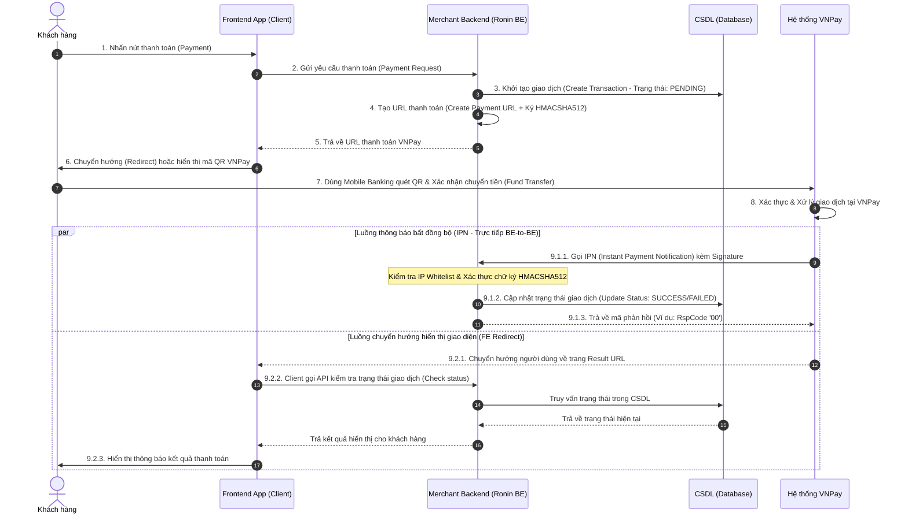
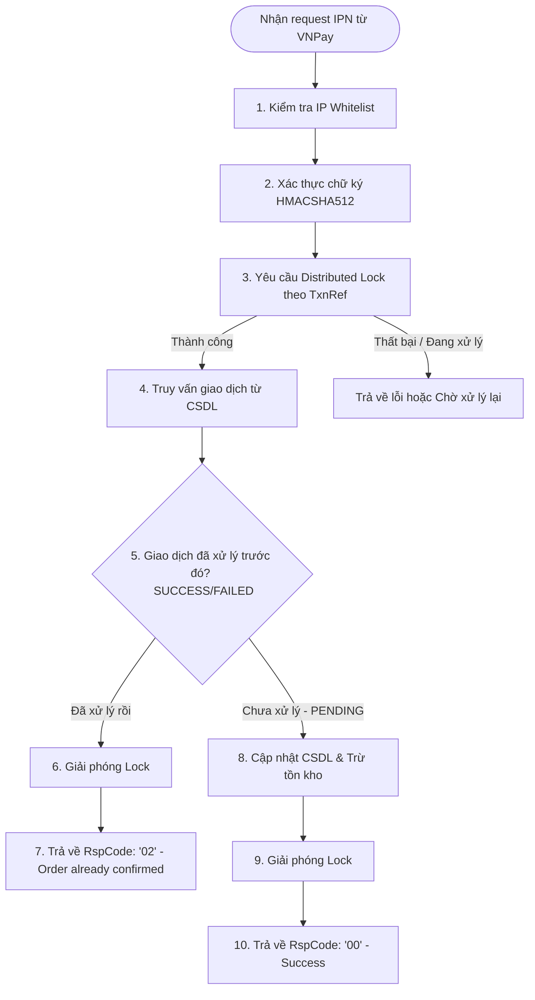

# Hướng dẫn Tích hợp Cổng Thanh toán (Payment Gateway Integration Guide)

> *“Nhiều khi tiền không giải quyết được vấn đề,*  
> *mà là quan hệ và chữ tín.”*  

<b>Mục lục (Table of Contents)</b>

- [1. Phân tích Yêu cầu (Requirements Analysis)](#1-phân-tích-yêu-cầu-requirements-analysis)
  - [1.1. Các yếu tố đánh giá khi tích hợp hệ thống](#11-các-yếu-tố-đánh-giá-khi-tích-hợp-hệ-thống)
  - [1.2. Giải pháp tích hợp](#12-giải-pháp-tích-hợp)
  - [1.3. Tại sao lựa chọn giải pháp VNPay QR?](#13-tại-sao-lựa-chọn-giải-pháp-vnpay-qr)
- [2. Thiết kế hệ thống (System Design)](#2-thiết-kế-hệ-thống-system-design)
  - [2.1. Luồng thanh toán QR (QR Payment Flow)](#21-luồng-thanh-toán-qr-qr-payment-flow)
  - [2.2. Luồng tiền (Fund Flow)](#22-luồng-tiền-fund-flow)
- [3. Triển khai & Bảo mật (Implementation & Security)](#3-triển-khai--bảo-mật-implementation--security)
  - [3.1. Bảo mật hệ thống (Security)](#31-bảo-mật-hệ thống-security)
  - [3.2. Xử lý lỗi & Thử lại (Error Handling & Retry)](#32-xử-lý-lỗi--thử-lại-error-handling--retry)
  - [3.3. Cơ chế Đảm bảo Tính nhất quán (Idempotent Handler)](#33-cơ-chế-đảm-bảo-tính-nhất-quán-idempotent-handler)
  - [3.4. Giám sát hệ thống (Tracing & Logging)](#34-giám-sát-hệ-thống-tracing--logging)
- [4. Cải tiến và Tối ưu hóa (Enhancements)](#4-cải-tiến-và-tối-ưu-hóa-enhancements)
- [Tổng kết & Bài tập (Recap & Homework)](#tổng-kết--bài-tập-recap--homework)

---

# 1. Phân tích Yêu cầu (Requirements Analysis)

## 1.1. Các yếu tố đánh giá khi tích hợp hệ thống
Khi quyết định tích hợp một cổng thanh toán hoặc hệ thống bên thứ ba, chúng ta cần đánh giá kỹ lưỡng các yếu tố kỹ thuật và phi kỹ thuật theo thứ tự ưu tiên sau:

1.  **Security (Bảo mật):** Đây là yếu tố sống còn đối với mọi giao dịch tài chính. Hệ thống phải đảm bảo an toàn thông tin thẻ, thông tin người dùng và ngăn ngừa các lỗ hổng gian lận giao dịch.
2.  **Reliability (Độ tin cậy/Ổn định):** Tỷ lệ uptime của hệ thống bên thứ ba phải cao để tránh gián đoạn dịch vụ của khách hàng.
3.  **Performance (Hiệu năng):**
    *   **Throughput (Băng thông):** Khả năng xử lý số lượng giao dịch đồng thời lớn.
    *   **Latency (Độ trễ):** Thời gian phản hồi tạo URL thanh toán và nhận kết quả giao dịch phải cực kỳ nhanh.
4.  **Complexity (Độ phức tạp):** Tài liệu tích hợp rõ ràng, thư viện hỗ trợ đầy đủ giúp giảm thiểu thời gian và công sức phát triển.

---

## 1.2. Giải pháp tích hợp
Để cung cấp giải pháp thanh toán tự động (Automation) giúp khách hàng mua sắm nhanh chóng, hệ thống Merchant (Ronin) cần lựa chọn tích hợp với một **Cổng thanh toán (Payment Gateway)** uy tín. 

---

## 1.3. Tại sao lựa chọn giải pháp VNPay QR?
*Lưu ý: Tài liệu này cung cấp đánh giá khách quan dựa trên số liệu kỹ thuật và chi phí thực tế, hoàn toàn không mang tính quảng cáo.*

### 1.3.1. Bảo mật vượt trội
*   VNPay là một trong những đơn vị trung gian thanh toán lớn nhất Việt Nam, sở hữu cơ sở hạ tầng công nghệ hiện đại.
*   Tuân thủ nghiêm ngặt tiêu chuẩn bảo mật quốc tế **PCI-DSS (Payment Card Industry Data Security Standard)** giúp bảo vệ dữ liệu thẻ và tài khoản khách hàng tối đa.

### 1.3.2. Phí giao dịch cạnh tranh
Dưới đây là bảng so sánh phí giao dịch đối với phương thức thanh toán **QR Mobile Banking (Nội địa)** của một số cổng thanh toán phổ biến để tham khảo:

| Cổng thanh toán | Phí cố định (Fixed Fee) | Phí phần trăm (Percentage Fee) | Đánh giá chung |
| :--- | :---: | :---: | :--- |
| **VNPay QR** | 0 VND | ~1.5% - 2.2% | Phí hợp lý, liên kết hầu hết ngân hàng lớn tại Việt Nam |
| **Momo QR** | 0 VND | ~2.0% - 2.5% | Tiếp cận tệp người dùng ví điện tử lớn |
| **PayOS** | 2,000 VND | 0% | Phí cố định thấp, thích hợp cho giao dịch giá trị cao |

### 1.3.3. Các yếu tố vận hành khác
*   **Hỗ trợ kỹ thuật:** Đội ngũ Sale và kỹ sư tích hợp hỗ trợ rất nhiệt tình.
*   **Giao diện thanh toán:** Thân thiện, dễ thao tác trên cả thiết bị di động và máy tính.
*   **Liên kết sâu rộng:** Hỗ trợ quét mã thanh toán của gần 40 ngân hàng nội địa và các ứng dụng ví điện tử lớn.
*   **Quản lý giao dịch:** Trang quản trị Merchant Portal cung cấp đầy đủ tính năng đối soát, thống kê giao dịch chi tiết.

---

# 2. Thiết kế hệ thống (System Design)

## 2.1. Luồng thanh toán QR (QR Payment Flow)
Luồng thanh toán bao gồm hai kênh giao tiếp đồng thời để đảm bảo tính thời gian thực (Real-time Redirect) và tính bền vững của giao dịch (Async IPN):

---

## 2.2. Luồng tiền (Fund Flow)
1.  Khách hàng chuyển tiền từ tài khoản Ngân hàng cá nhân $\rightarrow$ tài khoản thụ hưởng của Cổng thanh toán (VNPay).
2.  VNPay ghi nhận giao dịch thành công $\rightarrow$ tích lũy số dư tạm giữ của Merchant.
3.  Định kỳ (hàng ngày/hàng tuần) sau khi đối soát xong, VNPay thực hiện quyết toán chuyển tiền về tài khoản ngân hàng doanh nghiệp của Merchant (Ronin) sau khi đã trừ đi phí dịch vụ.

---

# 3. Triển khai & Bảo mật (Implementation & Security)

## 3.1. Bảo mật hệ thống (Security)

### 3.1.1. Tính toàn vẹn (Data Integrity) & Xác thực nguồn gốc (Authenticity)
*   **Vấn đề:** Tham số của Payment Request (như số tiền giao dịch `amount`) được tạo ra ở Backend Merchant, trả về cho Client. Phía Client (Frontend App/Browser) là nơi rất dễ bị tin tặc can thiệp và sửa đổi số tiền trước khi chuyển tiếp sang VNPay (ví dụ: đổi từ 10,000,000 VND thành 1,000 VND).
*   **HTTPS không an toàn 100%:** HTTPS chỉ mã hóa dữ liệu trên đường truyền, không thể ngăn chặn việc tin tặc sửa đổi dữ liệu trực tiếp trên thiết bị client trước khi gửi đi.
*   **Giải pháp:** Sử dụng cơ chế tạo chữ ký số đối xứng **HMAC-SHA512** (Message Authentication Code). 
    *   Backend Merchant sử dụng một mã bí mật chung (`HashSecret`) được cấp bởi VNPay để ký lên toàn bộ Payload dữ liệu giao dịch:
        $$\text{Payment Request} = \text{Payload} + \text{HMAC-SHA512}(\text{Payload}, \text{HashSecret})$$
    *   Khi VNPay nhận được request, họ sẽ dùng chung `HashSecret` đó để tính toán lại chữ ký và so sánh. Nếu tin tặc sửa đổi dù chỉ 1 ký tự trong Payload, chữ ký sẽ không khớp và giao dịch lập tức bị từ chối.

### 3.1.2. Danh sách trắng địa chỉ IP (IP Whitelist)
*   Để bảo vệ API nhận thông báo kết quả thanh toán (IPN API), Backend Merchant chỉ cho phép các IP thuộc dải IP chính thức của VNPay gọi vào API này, ngăn chặn tin tặc giả mạo request IPN để phê duyệt giao dịch ảo.

### 3.1.3. Quản lý phiên bản (API Versioning)
*   Luôn sử dụng phiên bản API mới nhất của nhà cung cấp (ví dụ: VNPay v2.1) để thừa hưởng các bản vá bảo mật và cải tiến hiệu năng. Thường xuyên kiểm tra và cập nhật các thư viện phụ thuộc để tránh lỗ hổng bảo mật.

---

## 3.2. Xử lý lỗi & Thử lại (Error Handling & Retry)

### 3.2.1. Thiết lập mã phản hồi (Response Code)
Hệ thống Merchant bắt buộc phải xử lý try-catch ngoại lệ toàn diện và phản hồi chính xác mã trạng thái theo quy định của tài liệu tích hợp VNPay:

| Mã phản hồi (RspCode) | Ý nghĩa trạng thái | Hành động của VNPay |
| :--- | :--- | :--- |
| **'00'** | Confirm thành công (Giao dịch xử lý hoàn tất) | Dừng gửi IPN |
| **'01'** | Order not found (Không tìm thấy đơn hàng trong hệ thống) | Dừng gửi hoặc thực hiện Retry |
| **'02'** | Order already confirmed (Đơn hàng này đã được xác nhận trước đó) | Dừng gửi IPN |
| **'04'** | Invalid amount (Số tiền thanh toán không khớp với hóa đơn gốc) | Ghi nhận lỗi và dừng gửi |
| **'97'** | Signature invalid (Chữ ký checksum không hợp lệ) | Cảnh báo bảo mật và dừng gửi |
| **'99'** | Unknown error (Lỗi hệ thống không xác định phía Merchant) | Thực hiện Retry |

---

### 3.2.2. Cơ chế thử lại (Retry) & Trùng lặp cuộc gọi (Duplicate IPN)
*   **Cơ chế Retry của VNPay:** Nếu Merchant phản hồi mã lỗi (`99`) hoặc kết nối bị timeout (IPN Timeout), VNPay sẽ tự động gọi lại API IPN tối đa **10 lần trong vòng 5 phút** để đảm bảo giao dịch không bị mất.
*   **Rủi ro phát sinh:** 
    *   *Trùng lặp tuần tự (Duplication):* Nhận 1 request IPN trước, xử lý chậm, rồi nhận tiếp 1 request IPN sau.
    *   *Tranh chấp đồng thời (Race Condition):* Do độ trễ mạng hoặc lỗi retry, 2 request IPN của cùng một giao dịch có thể ập vào hệ thống Merchant Backend hoàn toàn **đồng thời**.

---

## 3.3. Cơ chế Đảm bảo Tính nhất quán (Idempotent Handler)
*   **Vấn đề:** Nếu 2 IPN gọi đồng thời, cả 2 luồng xử lý đều thấy giao dịch ở trạng thái `PENDING` $\rightarrow$ cả hai cùng cập nhật trạng thái thành `SUCCESS` $\rightarrow$ thực hiện trừ kho 2 lần hoặc khuyến mãi gấp đôi cho khách hàng.
*   **Giải pháp:** Áp dụng cơ chế xử lý Idempotent bằng cách sử dụng **Distributed Lock (Khóa phân tán)** thông qua mã hóa đơn (`TxnRef`):

---

## 3.4. Giám sát hệ thống (Tracing & Logging)
*   Đặt log rõ ràng ở đầu vào và đầu ra của từng bước trong luồng thanh toán (kể cả case thành công, thất bại, và exception).
*   Ghi nhận đầy đủ lịch sử Request/Response trao đổi với VNPay để phục vụ đối soát tài chính và gỡ lỗi khi có khiếu nại từ khách hàng.

---

# 4. Cải tiến và Tối ưu hóa (Enhancements)

*   **Chủ động truy vấn trạng thái (Active Polling):** Trong luồng Redirect (bước 9.2.3), nếu FE chuyển hướng về trang kết quả nhưng hệ thống vẫn chưa nhận được IPN từ VNPay do nghẽn mạng, Backend Merchant có thể chủ động thực hiện một truy vấn (Query Transaction API) sang VNPay để lấy trạng thái mới nhất và cập nhật hóa đơn ngay lập tức.
*   **Quét giao dịch định kỳ (Reconciliation Cron Job):** Trong trường hợp cả luồng IPN và luồng Redirect đều bị mất (ví dụ do sập nguồn điện đột ngột), hệ thống cần cấu hình một tiến trình chạy ngầm định kỳ quét qua toàn bộ đơn hàng ở trạng thái `PENDING` quá 15 phút để truy vấn trạng thái đồng bộ với VNPay.
*   **Hỗ trợ hoàn tiền (Refund API):** Triển khai API hoàn tiền tự động khi khách hàng hủy đơn hàng hoặc thanh toán thừa số tiền.

---

# Tổng Kết & Bài Tập (Recap & Homework)

### Tóm tắt cốt lõi (Recap)
*   Khi tích hợp bên thứ ba, bảo mật và tính nhất quán dữ liệu luôn phải đặt lên hàng đầu.
*   Sử dụng chữ ký số đối xứng (HMAC-SHA512) để chống gian lận và sửa đổi dữ liệu từ phía Client.
*   Luôn thiết kế API IPN tuân thủ tính nhất quán (Idempotency) bằng cách sử dụng khóa phân tán để tránh race condition khi xử lý trùng lặp giao dịch.

### Bài tập về nhà (Homework)
*   **Đề bài:** Viết một đoạn mã mã hóa tạo chữ ký HMAC-SHA512 bằng ngôn ngữ lập trình tự chọn (Go, Java, Node.js,...).
*   **Yêu cầu:** 
    *   Tự tạo cấu trúc Payload chứa các thông tin: `vnp_Amount`, `vnp_TxnRef`, `vnp_OrderInfo`.
    *   Thực hiện ký Payload với `HashSecret` đã cho trước và in kết quả ra màn hình.
    *   Viết logic so khớp chữ ký để mô phỏng lại cách Backend Merchant xác thực request từ cổng thanh toán.

**Cảm ơn bạn! (Thank you)**
