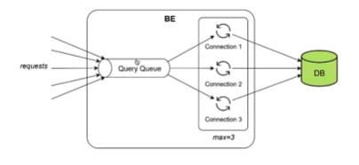
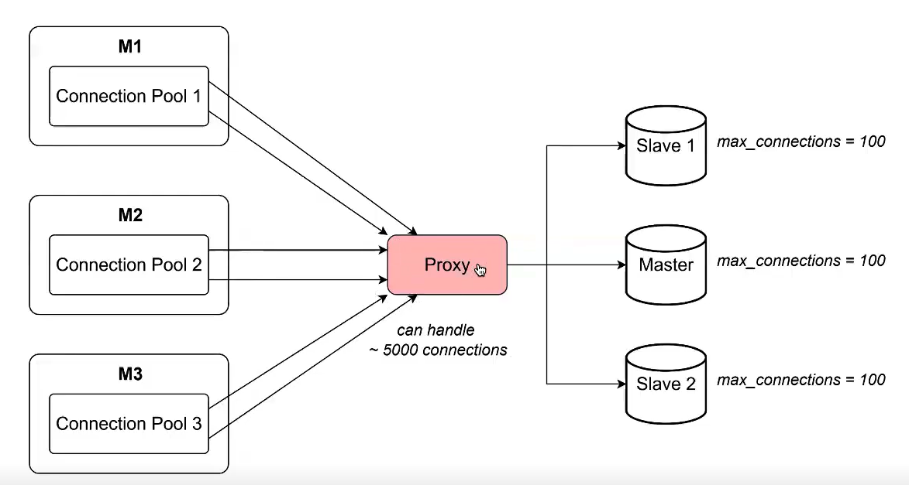
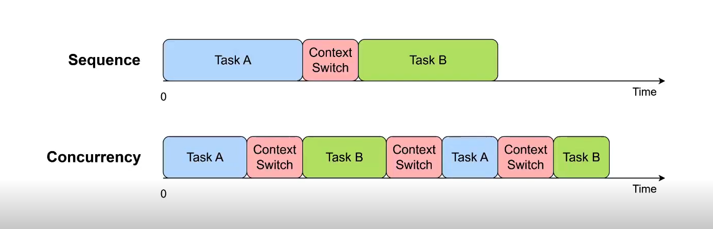

# Tài liệu Tối ưu hoá Backend (Datetime, Connection Pool & Thread Pool)

<b>Mục lục (Table of Contents)</b>

- [1. Datetime và Timezone](#1-datetime-và-timezone)
  - [1.1. Máy tính lưu trữ thời gian như thế nào?](#11-máy-tính-lưu-trữ-thời-gian-như-thế-nào)
  - [1.2. Múi giờ (Timezone)](#12-múi-giờ-timezone)
  - [1.3. Định dạng thời gian (Datetime Format)](#13-định-dạng-thời-gian-datetime-format)
  - [1.4. Bài tập (Exercise)](#14-bài-tập-exercise)
  - [1.5. Khi nào nên sử dụng DateTime, Timestamp?](#15-khi-nào-nên-sử-dụng-datetime-timestamp)
  - [1.6. Múi giờ trong hệ thống (Timezone in System)](#16-múi-giờ-trong-hệ-thống-timezone-in-system)
  - [1.7. Độ chính xác (Precision)](#17-độ-chính-xác-precision)
  - [1.8. Làm việc với kiểu dữ liệu Datetime như thế nào?](#18-làm-việc-với-kiểu-dữ-liệu-datetime-như-thế-nào-how-to-work-with-datetime-data-type)
  - [1.9. Các thực hành tốt nhất (Best Practices)](#19-các-thực-hành-tốt-nhất-best-practices)
- [2. Connection Pool](#2-connection-pool)
  - [2.1. Vấn đề (Problem)](#21-vấn-đề-problem)
  - [2.2. Giải pháp: Connection Pool](#22-giải-pháp-connection-pool-solution-connection-pool)
  - [2.3. Cấu hình Connection Pool](#23-cấu-hình-connection-pool-connection-pool-configuration)
  - [2.4. Điều chỉnh ở phía Client (Tuning on Client Side)](#24-điều-chỉnh-ở-phía-client-tuning-on-client-side)
  - [2.5. External Connection Pooler (Proxy)](#25-external-connection-pooler-proxy)
  - [2.6. Cấu hình được khuyến nghị (Recommended Configuration)](#26-cấu-hình-được-khuyến-nghị-recommended-configuration)
- [3. Thread Pool](#3-thread-pool)
  - [3.1. Nguyên lý (Principle)](#31-nguyên-lý-principle)
  - [3.2. Kích thước Thread Pool (Pool Size)](#32-kích-thước-thread-pool-pool-size)
- [4. Tổng kết (Recap)](#4-tổng-kết-recap)

---

# 1. Datetime và Timezone
## 1.1. Máy tính lưu trữ thời gian như thế nào?

*   **UNIX timestamp**: số giây đã trôi qua kể từ ngày 01-01-1970 lúc 00:00:00 UTC
*   Ví dụ:
    *   Timestamp tính bằng giây: 1695718262
    *   Timestamp tính bằng mili giây: 1695718262342
*   Sự thật (Facts):
    *   Ở các hệ thống 32bit cũ, số nguyên có dấu sẽ bị **tràn (overflow) vào năm 2038**
    *   Tại sao lại là năm 1970? Hệ điều hành Unix được tạo ra vào cuối những năm 1960 và đầu những năm 1970. Các kỹ sư Unix đã tùy ý chọn năm 1970.

## 1.2. Múi giờ (Timezone)

*   Tại sao chúng ta lại cần các múi giờ?
*   Các múi giờ duy trì trật tự logic và điều chỉnh ngày và đêm trên toàn cầu
*   UTC = GMT = Múi giờ có độ lệch (offset) bằng 0

## 1.3. Định dạng thời gian (Datetime Format)

*   **ISO 8601**: 2023-09-25T16:20:52+07:00, 2023-09-25T09:20:52Z
    *   Z = +00:00
*   Việt Nam: 26/09/2023
*   RFC 2822: Mon, 25 Sep 2023 09:16:58 +0000
*   Javascript: YYYY-MM-DDTHH:mm:ss.sssZ
*   Java: Tue Sep 26 16:05:37 ICT 2023 (+0700)
*   RFC 3339

## 1.4. Bài tập (Exercise)

*   **ISO 8601**
*   Thời gian ở Hà Nội: 2023-09-26T07:15:52+07:00 -> Thời gian ở Tokyo (+09), Paris (+01), California (...)

## 1.5. Khi nào nên sử dụng DateTime, Timestamp?

*   **Timestamp**: để ghi lại một thời điểm cố định (ít nhiều).
    *   Ví dụ: created_at
*   **Datetime**: thời gian có thể được thiết lập và thay đổi tùy ý.
    *   Ví dụ: thời gian lên lịch cho các cuộc hẹn (schedule time for appointments)

## 1.6. Múi giờ trong hệ thống (Timezone in System)

*(Sơ đồ luồng đi của thời gian)*
*   **FE** (tz = +07) gửi timestamp `1724753640234`
*   **BE** (OS: tz = +07) nhận và chuyển thành chuỗi `'2024-08-27T17:13:24+07:00'`
*   **DB** (tz = +00) lưu trữ dạng chuỗi `'2024-08-27T17:13:24'`

*   **Backend, DB sử dụng múi giờ UTC. Khuyến nghị lưu trữ cả Múi giờ (TZ).**
*   Frontend sử dụng datetime cục bộ (hiển thị múi giờ) và gửi kèm Múi giờ (TZ) nếu cần.
*   **Cẩn thận**: Múi giờ của JVM (JVM timezone) != Múi giờ của Hệ điều hành (OS timezone) -> thiết lập múi giờ JVM bằng cách sử dụng biến môi trường (env var).

## 1.7. Độ chính xác (Precision)

*   FE insert: `'2024-08-27T17:13:25.123+07:00'` vào CSDL MySQL
*   BE return: `'2024-08-27T17:13:25.000+07:00'`
*   Tại sao?
*   Bởi vì độ chính xác của kiểu dữ liệu thời gian trong MySQL mặc định là theo giây.
*   Nguyên nhân: Kiểu dữ liệu: Datetime
*   **Sử dụng các chữ số thập phân (fractional digits) -> độ chính xác (accuracy)**
    *   datetime(3)
    *   timestamp(3)
*   Timestamp trong Postgres sử dụng 6 chữ số thập phân theo mặc định.

## 1.8. Làm việc với kiểu dữ liệu Datetime như thế nào? (How to Work with Datetime Data Type?)

*   **Các kiểu dữ liệu datetime của MySQL không lưu trữ thông tin múi giờ -> Khuyến nghị nên lưu trữ thông tin múi giờ.**
*   Ví dụ trong Postgres:
    *   Cột `started_at`: timestamptz(3)
    *   Cột `tz`: smallint
    *   TZ: UTC (+00)

## 1.9. Các thực hành tốt nhất (Best Practices)

*   **ISO 8601**
*   **Backend, DB sử dụng múi giờ UTC**
*   Frontend sử dụng datetime cục bộ (hiển thị múi giờ)
*   DB lưu trữ dưới dạng timestamp nếu có thể
*   Lưu trữ múi giờ (Store time zone)
*   **MySQL: sử dụng các chữ số thập phân (fractional digitals) -> độ chính xác (accuracy)**
*   **Múi giờ của JVM (JVM timezone) != Múi giờ của Hệ điều hành (OS timezone)**

Cẩn thận với (Be careful with):
*   **Múi giờ (Time zone)**
*   **Định dạng thời gian (Datetime format)**
*   **Độ chính xác: Chữ số thập phân (Precision: Fractional digitals)**
*   Một số case ma giáo khác

# 2. Connection Pool

## 2.1. Vấn đề (Problem)

*   Cách thông thường (native way): với mỗi truy vấn, client sẽ tạo một kết nối mới tới DB.
*   Vấn đề (Problem):
    *   Tốn kém (Costly):
        *   **Tốn CPU để thiết lập các kết nối**
        *   **Tốn thời gian** (Time-consuming)
        *   Tốn bộ nhớ để duy trì các kết nối
        *   File Descriptor: ID của các kết nối 
        *   Thời gian để tạo và giải phóng các kết nối
    *   Nếu có lưu lượng truy cập cao (high traffic), số lượng kết nối đồng thời đến DB lớn
        -> chúng ta có thể làm sập (lose) cả DB và ứng dụng BE.

## 2.2. Giải pháp: Connection Pool (Solution: Connection Pool)

*(Sơ đồ: requests -> Query Queue -> Connections trong Pool -> DB)*

*   Khi truy vấn hoàn tất, **thay vì chấm dứt kết nối, pooler (bộ quản lý pool) sẽ đặt kết nối trở lại vào pool** để nó có khả năng được tái sử dụng bởi một truy vấn tiếp theo.
*   Nếu **không có kết nối nào rảnh rỗi (no idle connection), các yêu cầu sẽ được đưa vào hàng đợi (enqueue)**, chờ một kết nối có sẵn.
*   Không phải mọi cách triển khai connection pool đều giống nhau -> hãy chọn cái phù hợp.

## 2.3. Cấu hình Connection Pool (Connection Pool Configuration)

*   Câu hỏi: Có bao nhiêu kết nối trong một connection pool của client?
*   Trả lời:
    *   **Kích thước của Pool (Pool sizing) rốt cuộc lại rất đặc thù cho từng đợt triển khai (deployments).**
    *   Chúng ta **phải điều chỉnh (tune)**.
    *   Ví dụ, các hệ thống có sự kết hợp giữa các transaction chạy lâu (long running transactions) và các transaction rất ngắn là khó điều chỉnh nhất.

## 2.4. Điều chỉnh ở phía Client (Tuning on Client Side)

*   **Bắt đầu với (Start with):**
    `Pool Size = Number of Core * 2 + Effective Spindle Count`
    *   **Spindle Count (Số lượng trục chính ổ đĩa):**
        *   `0`: nếu active data (dữ liệu đang hoạt động) được cache hoàn toàn
        *   `1`: dành cho SSD nói chung
        *   `> 1`: dành cho HDD, là số lượng đĩa trục (spindle disks)
*   **Lần thử thứ hai (Second Try):**
    `Pool Size = T x (C - 1) + 1`
    *   `T`: số lượng luồng (number of threads)
    *   `C`: số lượng kết nối đồng thời tối đa được giữ bởi một luồng đơn (max number of concurrent connections held by a single thread)
*   **Lần thử thứ ba (Third Try):** giá trị nằm giữa lần thử thứ nhất và lần thử thứ hai.
*   **Lần thử thứ tư (Fourth Try):** Tăng dần lên từ lần thử thứ hai.

## 2.5. External Connection Pooler (Proxy)

*(Sơ đồ: Các client M1, M2, M3 với Connection Pool -> Proxy (chịu tải ~5000 kết nối) -> DB Master/Slaves (max_connections = 100))*

*   Proxy có nhiệm vụ định tuyến (routes) và cân bằng tải (load balance) các yêu cầu (requests) đến master và các slaves.
*   Proxy đóng vai trò như một bộ quản lý kết nối (connection pooler) có khả năng xử lý số lượng lớn các kết nối đồng thời.
    *   -> làm cho việc điều chỉnh kích thước client pool (client pool size) trở nên khó khăn hơn.
*   **Lưu ý (Note):** Hãy chọn đúng chế độ pooling (Pick a right pooling mode).

## 2.6. Cấu hình được khuyến nghị (Recommended Configuration)

*   **Số lượng kết nối tối thiểu (Min of connections):** khoảng 10
*   **Số lượng kết nối tối đa (Max of connections):** khoảng 20 - 30

# 3. Thread Pool

## 3.1. Nguyên lý (Principle)

*   Đối với một nhân (core), việc thực thi A và B một cách **tuần tự (sequentially)** sẽ luôn nhanh hơn so với việc thực thi A và B **đồng thời (concurrently)** thông qua việc cắt lát thời gian (time-slicing).

*(Sơ đồ: Việc thực thi đồng thời phải tốn thêm nhiều thời gian cho việc Chuyển đổi ngữ cảnh - Context Switch so với thực thi tuần tự)*

## 3.2. Kích thước Thread Pool (Pool Size)

*   **Trường hợp 1: Các tác vụ nặng về CPU (CPU-Bound Tasks)**
    *   Khuyến nghị (Recommend): `n + 1`
*   **Trường hợp 2: Các tác vụ nặng về I/O (IO-Bound Tasks)**
    *   Khuyến nghị (Recommend): `n * 2`
*   **Trường hợp 3: Công thức chung (Generic)**
    *   `n * (1 + thời gian chờ trung bình / thời gian làm việc trung bình)` (average waiting time / average working time)
*   **Trong đó:** `n` là số lượng nhân CPU (number of cores).

# 4. Tổng kết (Recap)

*   **Datetime:**
    *   Nên lưu trữ thông tin múi giờ (Time zone should be stored)
    *   Chú ý đến độ chính xác (Precision)
*   **Connection Pool:**
    *   Kích thước của pool rốt cuộc lại rất đặc thù cho từng đợt triển khai (Pool sizing is ultimately very specific to deployments)
*   **Thread Pool:**
    *   Phân biệt tác vụ nặng về CPU (CPU-Bound Task) và tác vụ nặng về I/O (IO-Bound Task)