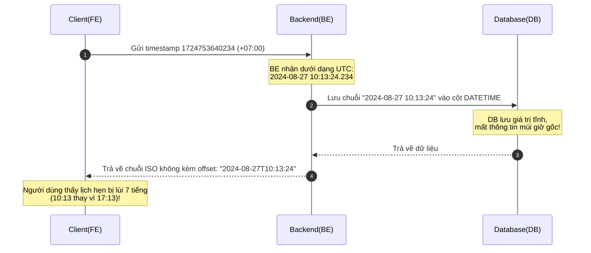
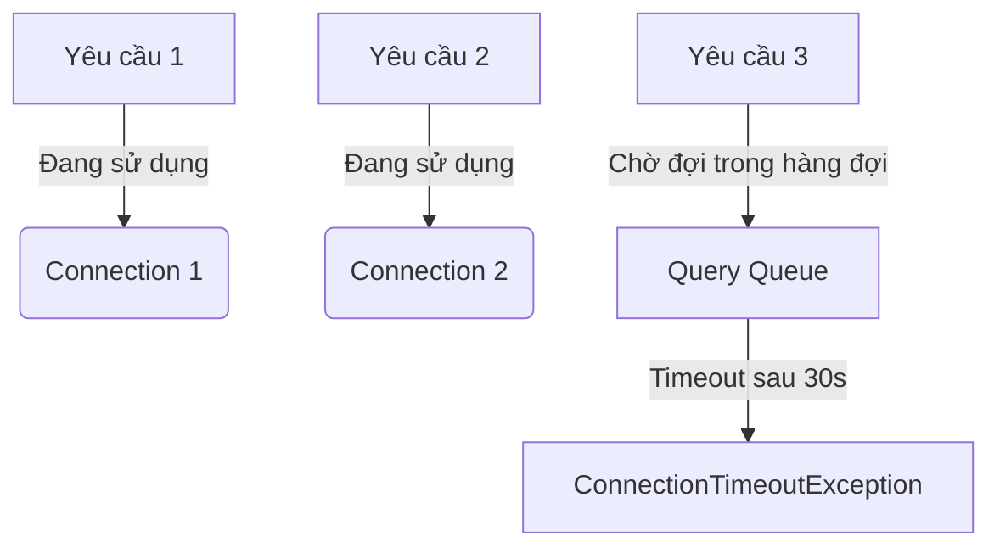

# 🧪 HƯỚNG DẪN THỰC HÀNH & BÀI TẬP VỀ DATETIME, CONNECTION POOL & THREAD POOL

Tài liệu này cung cấp các bài tập thực tế và hướng dẫn chi tiết nhằm giúp bạn làm chủ cách xử lý múi giờ (Timezone), tối ưu hóa cấu hình Connection Pool (DB) và Thread Pool (Application) trong các hệ thống Backend hiệu năng cao.

---

## 📅 BÀI THỰC HÀNH 1: Làm Chủ Datetime & Timezone

### 🧪 Bài Tập 1.1: Tính Toán Chuyển Đổi Múi Giờ (Timezone Conversion)
**Đề bài:** Một sự kiện diễn ra vào thời điểm cố định ở Hà Nội: `2026-05-30T15:30:00+07:00` (ISO 8601). Hãy chuyển đổi thời điểm này sang các múi giờ sau:
1. Múi giờ UTC (`Z` hoặc `+00:00`)
2. Tokyo, Nhật Bản (`+09:00`)
3. Paris, Pháp (Mùa hè - DST: `+02:00`)
4. California, Mỹ (Mùa hè - DST: `-07:00`)

#### 📝 Kết quả tính toán & Giải thích:
*   **UTC (+00:00):** `2026-05-30T08:30:00Z` (Lấy giờ Hà Nội trừ đi 7 tiếng: $15:30 - 7 = 08:30$).
*   **Tokyo (+09:00):** `2026-05-30T17:30:00+09:00` (Lấy giờ UTC cộng thêm 9 tiếng: $08:30 + 9 = 17:30$).
*   **Paris (+02:00 - DST):** `2026-05-30T10:30:00+02:00` (Lấy giờ UTC cộng thêm 2 tiếng: $08:30 + 2 = 10:30$).
*   **California (-07:00 - DST):** `2026-05-30T01:30:00-07:00` (Lấy giờ UTC trừ đi 7 tiếng: $08:30 - 7 = 01:30$).

---

### 🧪 Bài Tập 1.2: Mô Phỏng Lỗi Lệch Múi Giờ Hệ Thống (Timezone Mismatch)
**Tình huống:** Người dùng ở Hà Nội gửi yêu cầu đặt lịch hẹn thông qua ứng dụng Frontend:
*   **FE (Client local):** gửi timestamp `1724753640234` (tương đương `2024-08-27T17:13:24.234+07:00`).
*   **BE (Spring Boot/Java):** chạy trên máy chủ có OS Timezone là UTC. JVM không được cấu hình Timezone cụ thể nên mặc định nhận UTC.
*   **DB (MySQL):** cấu hình `time_zone = '+00:00'` (UTC) và sử dụng kiểu dữ liệu `DATETIME` (không lưu múi giờ).



#### 🛠️ Giải pháp khắc phục:
1.  **Đồng nhất múi giờ phía BE:** Thiết lập múi giờ JVM về UTC bằng cách chạy Java với tham số `-Duser.timezone=UTC` hoặc thiết lập trong Spring Boot Startup:
    ```java
    @PostConstruct
    void started() {
        TimeZone.setDefault(TimeZone.getTimeZone("UTC"));
    }
    ```
2.  **Sử dụng kiểu dữ liệu phù hợp trong DB:** Thay vì `DATETIME` thuần túy, hãy sử dụng `TIMESTAMP` (MySQL tự động chuyển đổi sang UTC khi lưu và chuyển về múi giờ kết nối khi đọc) hoặc lưu trữ kèm cột múi giờ offset độc lập.
3.  **Chuẩn hóa dữ liệu truyền nhận:** Sử dụng định dạng chuẩn ISO 8601 kèm thông tin Offset hoặc luôn truyền nhận bằng UNIX Timestamp (miliseconds).

---

### 🧪 Bài Tập 1.3: Độ Chính Xác Thời Gian (Datetime Fractional Seconds Precision)
**Vấn đề:** Khi lưu `2024-08-27T17:13:25.123+07:00` vào cột `DATETIME` trong MySQL, giá trị hiển thị khi select ra lại là `2024-08-27 17:13:25.000` (mất đi phần mili giây `.123`).

*   **Nguyên nhân:** Mặc định kiểu dữ liệu `DATETIME` và `TIMESTAMP` trong MySQL chỉ có độ chính xác đến hàng giây (tương đương `DATETIME(0)`). Phần thập phân phía sau sẽ bị làm tròn (round) hoặc cắt bỏ (truncate).
*   **Giải pháp:** Định nghĩa kiểu cột có độ chính xác thập phân mong muốn, ví dụ:
    *   `DATETIME(3)` để lưu trữ chính xác đến **mili giây** (3 chữ số).
    *   `DATETIME(6)` để lưu trữ chính xác đến **micro giây** (6 chữ số).

---

## 🛢️ BÀI THỰC HÀNH 2: Tối Ưu Hóa Cấu Hình Connection Pool

### 🧪 Bài Tập 2.1: Áp Dụng Công Thức Tính Sizing Connection Pool
**Đề bài:** Hãy tính toán kích thước Connection Pool khởi tạo cho một ứng dụng có các thông số sau:
*   Số lượng CPU Cores của DB server: $N = 4$ cores.
*   Ổ cứng sử dụng: SSD (Spindle Count = 1).
*   Ứng dụng xử lý đa luồng (multi-threaded application) với số lượng luồng thực thi đồng thời tối đa là $T = 30$, mỗi luồng chỉ giữ tối đa $C = 1$ kết nối tại một thời điểm.

#### 🧮 Áp dụng công thức 1 (HikariCP / Postgres recommended formula):
$$\text{Pool Size} = N \times 2 + \text{Effective Spindle Count}$$
*   $$\text{Pool Size} = 4 \times 2 + 1 = 9$$ kết nối.

#### 🧮 Áp dụng công thức 2 (Hạn chế tối đa Deadlock giữa các luồng):
$$\text{Pool Size} = T \times (C - 1) + 1$$
*   $$\text{Pool Size} = 30 \times (1 - 1) + 1 = 1$$ kết nối.

> [!NOTE]
> *   Theo công thức 1, cấu hình tối ưu hiệu năng đĩa và CPU cho DB là **9 kết nối**.
> *   Theo công thức 2, vì mỗi luồng chỉ cần tối đa 1 kết nối cùng lúc ($C=1$), xác suất xảy ra deadlock tài nguyên là 0. Do đó kích thước pool có thể đặt linh hoạt từ **9 đến 15** để tối ưu hiệu năng tổng thể mà không sợ nghẽn cổ chai đĩa cứng.

---

### 🧪 Bài Tập 2.2: Phân Tích Hiện Tượng Nghẽn Connection Pool
**Tình huống:** Hệ thống có Traffic cao đột biến. Log hệ thống xuất hiện lỗi:
`Connection is not available, request timed out after 30000ms.`



#### 🔍 Nguyên nhân và các bước tối ưu:
1.  **Lỗi rò rỉ kết nối (Connection Leak):** Do Code không giải phóng kết nối sau khi sử dụng (thiếu `try-with-resources` hoặc đóng connection trong khối `finally`).
2.  **Long-running Transactions:** Các truy vấn SQL quá phức tạp, thiếu Index hoặc xử lý logic nghiệp vụ nặng (gọi API bên thứ ba) nằm ngay bên trong Transaction làm chiếm giữ kết nối quá lâu.
3.  **Thiếu kích thước Pool:** Số lượng kết nối tối đa quá nhỏ so với nhu cầu thực tế.
4.  **Cách xử lý:** 
    *   Sử dụng tính năng phát hiện rò rỉ của HikariCP (`leakDetectionThreshold = 2000`).
    *   Tách biệt logic gọi API ngoài ra khỏi Transaction cơ sở dữ liệu.
    *   Tối ưu hóa các câu truy vấn chậm (Slow Queries).

---

## 🧵 BÀI THỰC HÀNH 3: Cấu Hình Thread Pool

### 🧪 Bài Tập 3.1: Phân Loại Tác Vụ & Cấu Hình Thread Pool
**Đề bài:** Hãy thiết lập số lượng luồng tối ưu (Pool Size) cho hai loại Thread Pool xử lý các tác vụ sau trên máy chủ có $n = 8$ nhân CPU:

#### 1. Tác vụ nặng về CPU (CPU-Bound Tasks)
*   *Mô tả:* Các tác vụ mã hóa dữ liệu, giải nén tệp tin zip lớn, render hình ảnh hoặc tính toán thuật toán AI.
*   *Công thức:* $$\text{Pool Size} = n + 1$$
*   *Kích thước tối ưu:* $8 + 1 = 9$ threads.
*   *Giải thích:* Hạn chế tối đa việc chuyển đổi ngữ cảnh (Context Switch) giữa các luồng vì CPU luôn hoạt động hết công suất.

#### 2. Tác vụ nặng về I/O (IO-Bound Tasks)
*   *Mô tả:* Đọc ghi dữ liệu từ đĩa cứng, truy vấn Database, gửi HTTP request tới các API dịch vụ bên thứ ba.
*   *Công thức:* $$\text{Pool Size} = n \times 2$$ (hoặc áp dụng công thức chi tiết dưới đây)
*   *Công thức chi tiết:*
    $$\text{Pool Size} = n \times \left(1 + \frac{\text{Average Waiting Time}}{\text{Average Working Time}}\right)$$
*   Giả sử thời gian luồng phải đợi I/O (Waiting Time) trung bình là 100ms, thời gian thực sự xử lý tính toán của CPU (Working Time) là 10ms:
    $$\text{Pool Size} = 8 \times \left(1 + \frac{100}{10}\right) = 8 \times 11 = 88$$ threads.
*   *Giải thích:* Khi một luồng đang chờ dữ liệu trả về từ I/O (Network/Disk), CPU rảnh rỗi có thể chuyển sang xử lý luồng khác mà không tốn công suất xử lý.

---

### 🧪 Bài Tập 3.2: Tác Hại Của Context Switching (Cắt lát thời gian)
**Tình huống:** Một máy chủ 2 nhân CPU chạy 100 threads đồng thời để xử lý các thuật toán CPU-Bound. Hệ thống bị chậm đi rõ rệt so với khi chỉ chạy 3 threads.

*   **Tại sao chạy nhiều threads hơn lại chậm hơn?** 
    *   Khi số lượng thread vượt quá số nhân vật lý của CPU, hệ điều hành buộc phải thực hiện kỹ thuật **Cắt lát thời gian (Time-slicing)** và liên tục hoán đổi trạng thái của các luồng (Context Switch).
    *   Mỗi lần hoán đổi, CPU phải lưu lại trạng thái các thanh ghi (registers), con trỏ lệnh (program counter), tải trạng thái của luồng mới, làm sạch bộ đệm Cache L1/L2 $\rightarrow$ Hao phí lượng lớn chu kỳ CPU cho việc quản trị thay vì thực thi công việc thực tế.
