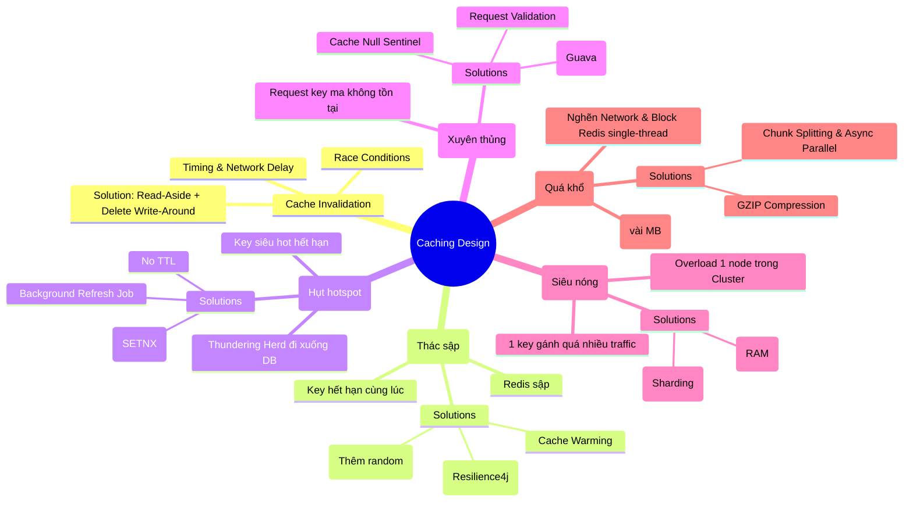

# 🧠 TỔNG HỢP KIẾN THỨC NÂNG CAO: CACHE DESIGN PATTERNS & MITIGATION STRATEGIES

Tài liệu này tổng hợp toàn bộ các vấn đề kinh điển khi thiết kế hệ thống Caching trong phát triển Backend hiệu năng cao kèm theo hướng dẫn kiểm thử các giải pháp đã được implement trong mã nguồn của bạn.

---

## 🗺️ Bản Đồ Tổng Quan Các Vấn Đề Về Cache



---

## 🛡️ 6 Vấn Đề Kinh Điển & Chiến Lược Giải Quyết Chi Tiết

### 1. Cache Invalidation & Race Condition (Vô hiệu hóa Cache)
*   **Vấn đề:** Khi cập nhật dữ liệu, nếu update DB trước rồi update Cache, hoặc update Cache trước rồi update DB, dưới tác động của mạng bất đồng bộ, các thread chạy xen kẽ sẽ dẫn đến bất đồng bộ dữ liệu vĩnh viễn giữa DB và Cache.
*   **Giải pháp tối ưu:** **Read-Aside + Delete Write-Around** (Xóa Cache khi Update DB). Chúng ta áp dụng cơ chế Retry (sử dụng `@Retryable` của Spring Retry) khi thao tác xóa Cache gặp lỗi để đảm bảo tính nhất quán (Eventual Consistency).

### 2. Cache Avalanche (Tuyết lở Cache)
*   **Vấn đề:** Một lượng lớn key hết hạn cùng một thời điểm, hoặc server Redis bị sập đột ngột, kéo theo toàn bộ request đè nặng lên DB làm sập hệ thống.
*   **Giải pháp:**
    *   **TTL Jitter:** Thêm một khoảng thời gian ngẫu nhiên (ví dụ 10% - 20% TTL) để thời gian hết hạn của các key tản ra.
    *   **Circuit Breaker (Cầu chì):** Wrap lệnh truy vấn DB bằng Resilience4j. Khi DB quá tải và bắt đầu chậm/lỗi, cầu chì sẽ tự ngắt (`OPEN`) để chặn request từ sớm, trả về dữ liệu fallback hoặc lỗi tạm thời nhằm cứu DB.
    *   **Cache Warming:** Tải trước dữ liệu hot lên cache khi khởi động ứng dụng để tránh sập ngay khi vừa deploy.

### 3. Cache Breakdown (Hụt Cache Hotspot)
*   **Vấn đề:** Một key cực kỳ "hot" (ví dụ: thông tin khuyến mãi đang diễn ra) hết hạn đột ngột. Hàng vạn request đồng thời truy vấn key này đều bị Cache Miss và cùng chui xuống DB lấy dữ liệu để nạp lại Cache (Thundering Herd / Cache Stampede).
*   **Giải pháp:**
    *   **No TTL:** Đối với dữ liệu cực kỳ hot, không bao giờ đặt thời gian hết hạn trên Redis mà chỉ cập nhật bằng cơ chế chủ động (Event-driven).
    *   **Background Job:** Chạy một thread ngầm định kỳ quét và nạp lại Cache trước khi nó hết hạn.
    *   **Mutex/Locking:** Sử dụng Distributed Lock (lệnh `SETNX` trên Redis) để chỉ cho phép **duy nhất 1 request** đi xuống DB nạp lại cache, các request khác sẽ đợi và lấy từ Cache sau khi mở khóa.

### 4. Cache Penetration (Xuyên thủng Cache)
*   **Vấn đề:** Attacker liên tục request các key "ma" không hề tồn tại trong DB. Vì dữ liệu không tồn tại, Cache luôn bị Miss và DB luôn bị truy vấn.
*   **Giải pháp:**
    *   **Validate Request:** Chặn các định dạng tham số sai định nghĩa (`id <= 0`, SQL Injection...) ngay từ Gateway/Controller.
    *   **Cache Null Value:** Lưu một giá trị Sentinel (Ví dụ: `"NULL_VALUE"`) vào Redis với TTL ngắn (2-3 phút) để chặn đứng các request sau truy cập vào key ma đó.
    *   **Bloom Filter:** Cấu trúc dữ liệu dạng mảng bit siêu nhẹ, không lưu trữ giá trị cụ thể mà kiểm tra nhanh xem phần tử có nằm trong tập hợp không với độ chính xác cao. Nếu Bloom Filter báo "Không tồn tại", chặn ngay lập tức mà không cần truy vấn DB hay Redis.

### 5. Hot Key (Key siêu nóng)
*   **Vấn đề:** Chỉ một số ít key gánh toàn bộ tải của hệ thống. Dù Redis có Cluster nhiều máy chủ, các request vào cùng 1 key luôn đổ vào đúng 1 node chứa key đó, gây nghẽn băng thông vật lý của node đó.
*   **Giải pháp:**
    *   **Local Cache:** Lưu trữ dữ liệu siêu hot đó trực tiếp trong RAM của Application (JVM Memory) thông qua các thư viện như Caffeine Cache. Chỉ gọi Redis 1 lần mỗi vài giây.
    *   **Key Replication (Sharding Key):** Nhân bản key hot thành nhiều bản (Ví dụ: `hotkey_1`, `hotkey_2`, `hotkey_3`). Application khi đọc sẽ ngẫu nhiên chọn một bản để dàn đều tải cho các node Redis Cluster khác nhau.

### 6. Large Key (Key quá khổ)
*   **Vấn đề:** Object lưu trữ quá lớn (vài MB) làm nghẽn băng thông mạng và block luồng xử lý đơn nhân (Single-thread) của Redis.
*   **Giải pháp:**
    *   **Compression:** Sử dụng thuật toán nén tốc độ cao (như GZIP/ZSTD) để nén String JSON thành mảng byte trước khi đẩy lên Redis.
    *   **Splitting:** Chia nhỏ danh sách lớn thành nhiều chunk nhỏ (Ví dụ: 5 chunk 10,000 item), lưu dưới các key khác nhau và dùng cơ chế bất đồng bộ (`CompletableFuture`) để lấy song song và gộp lại ở RAM Application.

---

## 🧪 Hướng Dẫn Kiểm Thử (Cheat Sheet API)

Để phục vụ cho quá trình tự học và kiểm nghiệm thực tế, bạn có thể khởi động project và sử dụng các công cụ API client (như Postman hoặc `curl` trên Terminal) để test các endpoint sau:

### 📍 Cache Avalanche & Warming
*   **Xem trạng thái Circuit Breaker:**
    ```bash
    curl http://localhost:8080/api/cache/circuit-breaker
    ```
*   **Gọi endpoint an toàn (đã bọc Circuit Breaker & TTL Jitter):**
    ```bash
    curl http://localhost:8080/api/users/1/safe
    ```
*   **Thủ công kích hoạt Cache Warming:**
    ```bash
    curl -X POST http://localhost:8080/api/cache/warm-up
    ```

### 📍 Cache Breakdown
*   **Đọc hotspot không bao giờ hết hạn (No TTL):**
    ```bash
    curl http://localhost:8080/api/users/1/hotspot-no-ttl
    ```
*   **Đọc hotspot bảo vệ bằng Mutex Lock (SETNX):**
    ```bash
    curl http://localhost:8080/api/users/1/hotspot-mutex
    ```
*   **Kiểm tra TTL còn lại của key trên Redis:**
    ```bash
    curl http://localhost:8080/api/cache/ttl/1
    ```

### 📍 Cache Penetration (Key Ma)
*   **Gọi kiểu cũ (bị xuyên thủng DB - kiểm tra log console):**
    ```bash
    curl http://localhost:8080/api/users/9999/penetration-legacy
    ```
*   **Gọi với Cache Null (Lưu Sentinel):**
    ```bash
    curl http://localhost:8080/api/users/9999/penetration-cache-null
    ```
*   **Gọi với Bloom Filter bảo vệ (Log "Chặn ngay lập tức" mà ko đụng DB/Redis):**
    ```bash
    curl http://localhost:8080/api/users/9999/penetration-bloom
    ```

### 📍 Hot Key & Large Key
*   **Đọc qua Local Cache JVM:**
    ```bash
    curl http://localhost:8080/api/users/1/hotkey-local
    ```
*   **Đọc qua Key Replication:**
    ```bash
    curl http://localhost:8080/api/users/1/hotkey-replicated
    ```
*   **Test nén dữ liệu lớn GZIP:**
    ```bash
    # Ghi dữ liệu nén
    curl -X POST http://localhost:8080/api/cache/large-key/compress/mydata
    # Đọc dữ liệu nén
    curl http://localhost:8080/api/cache/large-key/compress/mydata
    ```
*   **Test chia nhỏ song song (Splitting):**
    ```bash
    # Ghi dữ liệu chia nhỏ
    curl -X POST http://localhost:8080/api/cache/large-key/split/mydata
    # Đọc dữ liệu chia nhỏ
    curl http://localhost:8080/api/cache/large-key/split/mydata
    ```
