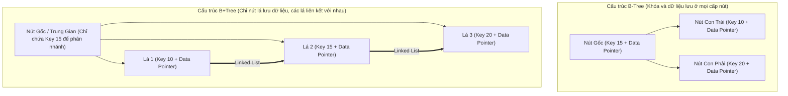
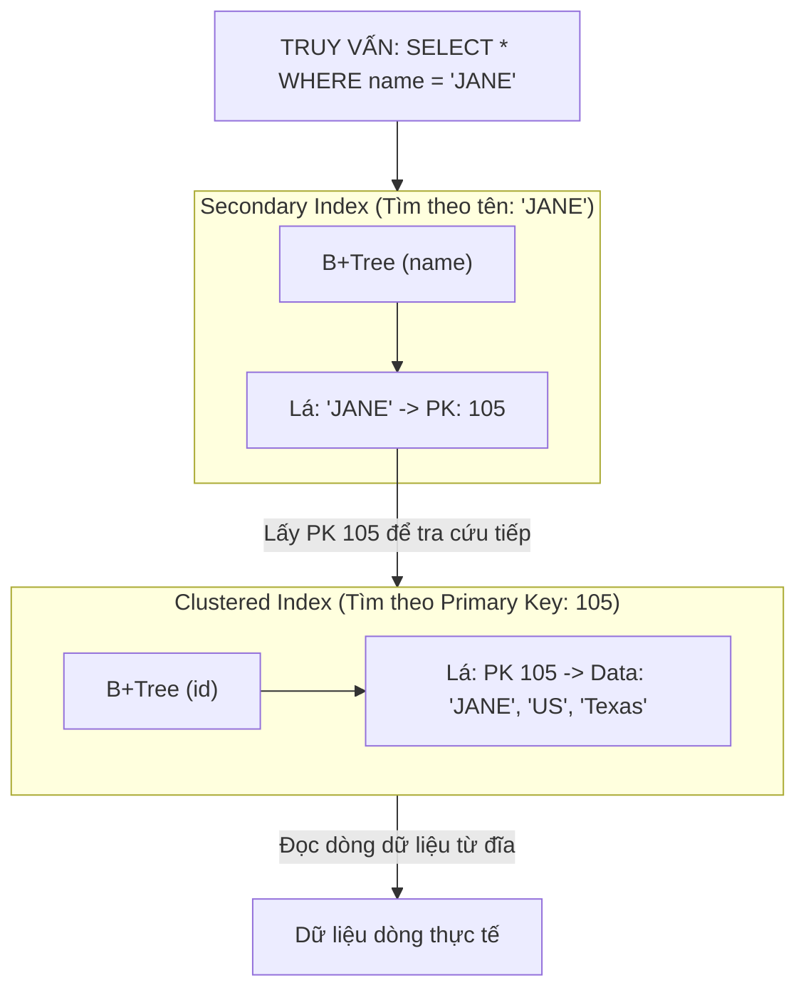

# Hướng dẫn về Chỉ mục Database (Database Indexing Guide)

> *“Binh pháp có câu: Binh vô thường thế, thủy vô thường hình.*  
> *Hãy tỏ ra yếu thế khi bạn mạnh, và tỏ ra mạnh mẽ khi bạn yếu thế.”*  
> — *Tôn Tử (Binh Pháp Tôn Tử)*

<details open>
<summary><b>Mục lục (Table of Contents)</b></summary>

- [1. Giới thiệu về Chỉ mục (Index Introduction)](#1-giới-thiệu-về-chỉ-mục-index-introduction)
  - [1.1. Khái niệm Index là gì?](#11-khái-niệm-index-là-gì)
  - [1.2. Nơi lưu trữ Index](#12-nơi-lưu-trữ-index)
- [2. Phân loại Chỉ mục (Classification)](#2-phân-loại-chỉ-mục-classification)
  - [2.1. Phân loại theo Cấu trúc dữ liệu (Data Structure)](#21-phân-loại-theo-cấu-trúc-dữ-liệu-data-structure)
  - [2.2. Phân loại theo Cơ chế lưu trữ vật lý (Physical Storage)](#22-phân-loại-theo-cơ-chế-lưu-trữ-vật-lý-physical-storage)
  - [2.3. Phân loại theo Đặc tính ràng buộc (Characteristics)](#23-phân-loại-theo-đặc-tính-ràng-buộc-characteristics)
  - [2.4. Phân loại theo Số lượng cột (Composite & Covering Index)](#24-phân-loại-theo-số-lượng-cột-composite--covering-index)
  - [2.5. Các loại Index đặc thù khác](#25-các-loại-index-đặc-thù-khác)
- [3. Thực hành & Tránh lỗi (Practices & Pitfalls)](#3-thực-hành--tránh-lỗi-practices--pitfalls)
  - [3.1. Khi nào nên và không nên sử dụng Index?](#31-khi-nào-nên-và-không-nên-sử-dụng-index)
  - [3.2. Các trường hợp lỗi khiến Index bị vô hiệu hóa (Index Failures)](#32-các-trường- hợp-lỗi-khiến-index-bị-vô-hiệu-hóa-index-failures)
  - [3.3. Các khuyến nghị thực hành tốt nhất (Best Practices)](#33-các-khuyến-nghị-thực-hành-tốt-nhất-best-practices)
  - [3.4. Điểm khác biệt kiến trúc giữa MySQL và PostgreSQL](#34-điểm-khác-biệt-kiến-trúc-giữa-mysql-và-postgresql)
- [Tóm tắt & Bài tập về nhà (Recap & Homework)](#tóm-tắt--bài-tập-về-nhà-recap--homework)

</details>

---

# 1. Giới thiệu về Chỉ mục (Index Introduction)

## 1.1. Khái niệm Index là gì?
*   **Chỉ mục (Index)** là một cấu trúc dữ liệu đặc biệt được xây dựng để tăng tốc độ tìm kiếm và truy xuất dữ liệu từ các bảng trong cơ sở dữ liệu.
*   Hãy tưởng tượng Index giống như **Mục lục** ở cuối một cuốn sách dày. Thay vì phải lật đọc từng trang từ đầu đến cuối cuốn sách (gọi là *Full Table Scan*), bạn chỉ cần tra cứu từ khóa trong mục lục để tìm ngay số trang chứa thông tin cần tìm.

---

## 1.2. Nơi lưu trữ Index
*   Mặc dù dữ liệu Index được nạp lên bộ nhớ RAM để xử lý nhanh, nhưng các tập tin cấu trúc Index thực tế vẫn được **lưu trữ bền vững trên đĩa cứng** (Disk) đi kèm với dữ liệu của bảng. Vì vậy, việc tạo quá nhiều Index sẽ làm tăng đáng kể dung lượng lưu trữ vật lý của cơ sở dữ liệu.

---

# 2. Phân loại Chỉ mục (Classification)

## 2.0. Tổng quan các cách phân loại
Chúng ta có thể phân loại Index dựa trên nhiều góc độ khác nhau:
*   **Theo Cấu trúc dữ liệu:** B+ Tree index, Hash index, Fulltext (Inverted) index, LSM Tree, R-Tree,...
*   **Theo Cách lưu trữ vật lý:** Clustered Index (Chỉ mục cụm), Non-clustered Index / Secondary Index (Chỉ mục thứ cấp).
*   **Theo Số lượng cột cấu thành:** Single-column Index (Đơn cột), Composite Index (Đa cột/Tổ hợp).
*   **Theo Đặc tính nghiệp vụ:** Primary Key Index, Unique Index (Chỉ mục duy nhất), Prefix Index (Chỉ mục tiền tố).

---

## 2.1. Phân loại theo Cấu trúc dữ liệu (Data Structure)
Khi lựa chọn hoặc đánh giá một cấu trúc dữ liệu làm Index, chúng ta cần cân nhắc kỹ các yếu tố:
1.  **Mục đích sử dụng (Use Case):** Truy vấn so sánh bằng, truy vấn khoảng (range), hay tìm kiếm văn bản đầy đủ.
2.  **Độ phức tạp thời gian (Time Complexity):** Cho các tác vụ Tìm kiếm, Chèn, Xóa, Cập nhật.
3.  **Độ phức tạp không gian (Space Complexity):** Dung lượng bộ nhớ cần dùng.
4.  **Độ phức tạp triển khai (Implementation Complexity):** Khả năng lập trình và duy trì cấu trúc.

### 2.1.1. Cấu trúc B-Tree (Balanced Tree)
*   Là cây tự cân bằng, đảm bảo tất cả các nút lá (leaf nodes) luôn nằm trên cùng một mức (level).
*   Mỗi nút chứa một danh sách các khóa đã được sắp xếp tăng dần.
*   Một nút không phải lá có $k$ nút con sẽ chứa đúng $k-1$ khóa. (Ví dụ: Nút có 3 con sẽ chứa đúng 2 khóa).
*   Độ phức tạp thời gian cho các thao tác Tìm kiếm, Chèn, Xóa đều là **$O(\log N)$**.

### 2.1.2. Cấu trúc B+Tree (Cải tiến của B-Tree)
B+Tree là một biến thể tối ưu hơn của B-Tree và là cấu trúc mặc định của hầu hết các RDBMS hiện đại (như InnoDB của MySQL):
*   **Chỉ lưu trữ con trỏ dữ liệu tại Nút Lá:** Các nút trung gian (internal nodes) chỉ lưu trữ khóa (keys) và con trỏ điều hướng để phân nhánh, không chứa dữ liệu thực tế. Nhờ vậy, kích thước một nút trung gian rất nhỏ, giúp một nút chứa được nhiều khóa hơn $\rightarrow$ Giảm chiều cao của cây $\rightarrow$ Giảm số lần đọc đĩa (Disk I/O).
*   **Liên kết giữa các Nút Lá:** Tất cả các nút lá được nối với nhau thông qua một danh sách liên kết vòng kép (Doubly Linked List). Điều này giúp các truy vấn khoảng (Range Queries) và sắp xếp dữ liệu cực kỳ hiệu quả vì chỉ cần tìm đến phần tử đầu tiên rồi duyệt tuyến tính sang các nút lá lân cận.



### 2.1.3. Cấu trúc Hash Index
*   Sử dụng một hàm băm (Hash Function) để ánh xạ trực tiếp giá trị của cột sang một địa chỉ lưu trữ vật lý cụ thể.
*   **Ưu điểm:** Tốc độ tìm kiếm tuyệt đối đạt **$O(1)$** đối với các phép toán so sánh bằng (`=`, `IN`).
*   **Hạn chế:**
    *   Không hỗ trợ truy vấn khoảng (Range queries như `>`, `<`, `BETWEEN`) hay sắp xếp (`ORDER BY`) vì dữ liệu băm không được lưu trữ theo thứ tự tuần tự.
    *   Xảy ra hiện tượng trùng mã băm (Collision) làm suy giảm hiệu năng khi trùng lặp quá nhiều.

---

## 2.2. Phân loại theo Cơ chế lưu trữ vật lý (Physical Storage)

### 2.2.1. Clustered Index (Chỉ mục cụm)
*   Quyết định thứ tự sắp xếp vật lý của toàn bộ dữ liệu dòng trên đĩa cứng.
*   Một bảng dữ liệu **chỉ có duy nhất một Clustered Index**.
*   **Đặc điểm:** Các nút lá của cây B+Tree chứa toàn bộ nội dung dữ liệu của dòng (Row Data).
*   Theo mặc định, MySQL InnoDB tự động chọn cột **Khóa chính (Primary Key)** làm Clustered Index. Nếu bảng không khai báo khóa chính, InnoDB sẽ chọn cột `UNIQUE NOT NULL` đầu tiên, hoặc tự động sinh ra một cột ẩn `ROWID` tăng dần làm Clustered Index.

### 2.2.2. Non-clustered Index / Secondary Index (Chỉ mục thứ cấp)
*   Là tất cả các chỉ mục được tạo thêm ngoài Clustered Index. Một bảng có thể có **nhiều Secondary Indexes**.
*   **Đặc điểm:** Nút lá của Secondary Index **chỉ lưu giá trị của cột làm Index và giá trị của Khóa chính (Primary Key)** tương ứng của dòng đó, chứ không lưu địa chỉ đĩa vật lý trực tiếp của dòng.
*   **Cơ chế tra cứu hai lần (Bookmark Lookup):** Khi truy vấn bằng Secondary Index, hệ thống sẽ duyệt cây Secondary Index để lấy ra khóa chính của dòng. Sau đó, nó dùng khóa chính này để duyệt cây Clustered Index một lần nữa mới lấy được toàn bộ dữ liệu dòng thực tế từ đĩa cứng.



> **Tại sao nút lá của Secondary Index lại trỏ về giá trị Khóa chính thay vì địa chỉ đĩa vật lý của bản ghi?**
> *Trả lời:* Vì trong quá trình vận hành bảng (như cập nhật dữ liệu, chèn dòng mới, hoặc chạy chống phân mảnh đĩa), địa chỉ vật lý của các dòng dữ liệu trên đĩa cứng có thể bị dịch chuyển liên tục. Nếu trỏ trực tiếp vào địa chỉ đĩa, hệ thống sẽ phải cập nhật lại địa chỉ vật lý này trên toàn bộ các Secondary Index hiện có $\rightarrow$ Gây tốn chi phí ghi cực lớn. Trỏ về Khóa chính giúp cô lập và tránh được vấn đề này.

---

### Nhược điểm của việc sử dụng Index
Mặc dù giúp tăng tốc độ đọc dữ liệu, Index cũng đi kèm các mặt hạn chế sau:
*   **Làm chậm tác vụ Ghi (Write Operations):** Các câu lệnh `INSERT`, `UPDATE`, `DELETE` sẽ chạy chậm hơn vì ngoài việc cập nhật dữ liệu bảng, DB còn phải cập nhật, sắp xếp lại và cân bằng lại toàn bộ cây chỉ mục liên quan.
*   **Tốn không gian lưu trữ vật lý:** Các tập tin chỉ mục chiếm dụng dung lượng đĩa cứng đáng kể.
*   **Chi phí duy trì:** Đòi hỏi thời gian và tài nguyên máy chủ để bảo trì và tối ưu hóa định kỳ.

---

## 2.3. Phân loại theo Đặc tính ràng buộc (Characteristics)

### 2.3.1. Phân biệt giữa Key (Khóa) và Index (Chỉ mục)
*   **Key (Khóa):** Là một khái niệm logic đại diện cho một **ràng buộc dữ liệu (Constraint)** để đảm bảo tính toàn vẹn thông tin (ví dụ: `PRIMARY KEY` bắt buộc duy nhất và không được NULL, `FOREIGN KEY` ràng buộc tham chiếu).
*   **Index (Chỉ mục):** Là cấu trúc dữ liệu vật lý được xây dựng để tối ưu hóa hiệu năng tìm kiếm. Khai báo Key thường tự động tạo ra một Index đi kèm để hỗ trợ kiểm tra tính duy nhất.

### 2.3.2. Primary Index (Chỉ mục khóa chính)
*   Được tự động tạo ra khi định nghĩa khóa chính. Nó đóng vai trò là mã định danh duy nhất cho mỗi dòng trong bảng. Việc sử dụng khóa chính dạng số tự tăng (auto-increment) sẽ giúp việc ghi dữ liệu mới diễn ra tuần tự ở cuối cây B+Tree, hạn chế tối đa việc phân tách trang (Page Split) dữ liệu.

### 2.3.3. Unique Index (Chỉ mục duy nhất)
*   Đảm bảo giá trị của các cột trong chỉ mục không được trùng lặp nhau. Tuy nhiên, khác với Khóa chính, cột định nghĩa Unique Index **được phép chứa nhiều giá trị NULL**.
*   **Cú pháp tạo:**
    ```sql
    CREATE UNIQUE INDEX index_name ON table_name(column_1, column_2, ...);
    ```

---

## 2.4. Phân loại theo Số lượng cột (Composite & Covering Index)

### 2.4.1. Composite Index (Chỉ mục tổ hợp)
*   Là chỉ mục được xây dựng từ **nhiều cột** dữ liệu cùng lúc.
*   Càng chứa nhiều cột, chỉ mục càng chiếm nhiều không gian đĩa cứng.

> [!IMPORTANT]
> **Quy tắc Tiền tố Bên trái nhất (Most Left-Prefix Rule):**
> Giả sử ta có một Composite Index trên ba cột: `(country, province, name)`.
>
> Hãy xem xét các câu lệnh truy vấn sau:
> 1.  `SELECT * WHERE province = 'Texas' AND country = 'US';` $\rightarrow$ **CÓ** sử dụng Index (Thứ tự điều kiện trong `WHERE` không quan trọng vì bộ tối ưu của DB tự sắp xếp lại, miễn là có cột đầu tiên `country`).
> 2.  `SELECT * WHERE province = 'Texas';` $\rightarrow$ **KHÔNG** sử dụng Index (Thiếu cột đầu tiên `country`).
> 3.  `SELECT * WHERE name = 'JANE' AND province = 'Texas';` $\rightarrow$ **KHÔNG** sử dụng Index (Thiếu cột đầu tiên `country`).
> 4.  `SELECT * WHERE country = 'US';` $\rightarrow$ **CÓ** sử dụng Index (Chỉ dùng cột `country`).
>
> *Quy tắc:* Điều kiện tìm kiếm bắt buộc phải chứa cột đầu tiên nằm bên trái nhất trong khai báo của Composite Index thì Index mới được kích hoạt.

#### Xác định thứ tự cột trong Composite Index:
*   **Quy tắc chung:** Hãy đặt các cột có **độ chọn lọc cao (High Cardinality)** lên đầu tiên trong khai báo Composite Index.
*   **Độ chọn lọc cao (High Cardinality):** Là những cột có lượng giá trị phân biệt lớn (ví dụ: `name` hay `email` có độ chọn lọc cao hơn nhiều so với `gender` hay `country`). Đặt cột chọn lọc cao lên trước giúp cây B+Tree phân nhánh nhanh hơn, loại bỏ lượng lớn dòng dữ liệu dư thừa ngay từ các nhánh đầu tiên, làm giảm độ phức tạp thời gian truy vết.

#### Phân tích hiệu lực Composite Index `(a, b)` qua các ví dụ:
*   **Q1:** `SELECT * WHERE a > 1 AND b = 2` $\rightarrow$ **Chỉ sử dụng cột (a)** của Index. Phép toán so sánh lớn hơn (`>`) làm đứt gãy tính tuần tự sắp xếp của cột tiếp theo (`b`), do đó cột `b` không dùng được Index để lọc.
*   **Q2:** `SELECT * WHERE a >= 1 AND b = 2` $\rightarrow$ **Sử dụng cả hai cột (a, b)**. Phần bằng (`=`) trong phép toán `>=` cho phép tiếp tục dùng cột `b` cho các dòng thỏa mãn `a = 1`.
*   **Q3:** `SELECT * WHERE a BETWEEN 2 AND 8 AND b = 2` $\rightarrow$ **Sử dụng cả hai cột (a, b)** nhờ tính chất phạm vi được xác định rõ biên của toán tử `BETWEEN`.

---

### 2.4.2. Covering Index (Chỉ mục bao phủ)
*   **Định nghĩa:** Là chỉ mục chứa **toàn bộ tất cả các cột** được yêu cầu trong câu lệnh `SELECT` (bao gồm cả cột ở `WHERE`, `SELECT`, `JOIN`, `GROUP BY`).
*   **Ưu điểm vượt trội:** Bộ tối ưu hóa cơ sở dữ liệu sẽ trả về kết quả ngay lập tức bằng cách đọc dữ liệu từ cây Secondary Index mà **không cần thực hiện bước tra cứu lần hai (Bookmark Lookup)** để quét Clustered Index trên đĩa cứng $\rightarrow$ Tiết kiệm phần lớn tài nguyên I/O đĩa.
*   **Khuyến nghị:** Chỉ nên áp dụng Covering Index cho các truy vấn lấy ít thông tin (tối đa $\le 5$ cột) để tránh phình to kích thước file index.

---

## 2.5. Các loại Index đặc thù khác
*   **Fulltext Index (Chỉ mục văn bản đầy đủ):** Sử dụng cấu trúc Chỉ mục đảo ngược (Inverted Index) chuyên dùng cho các tìm kiếm từ khóa phức tạp trong các đoạn văn bản dài (thay thế cho toán tử `LIKE '%keyword%'` kém hiệu năng).
*   **Spatial Index (Chỉ mục không gian):** Sử dụng cấu trúc R-Tree để tăng tốc truy vấn dữ liệu hình học, tọa độ GPS (ví dụ: GIST trong Postgres).
*   **Bitmap Index (Chỉ mục Bitmap):** Sử dụng các chuỗi bit (0 và 1) để biểu diễn sự tồn tại của dữ liệu.
    *   *Sử dụng khi:* Bảng có lượng đọc cực kỳ lớn trên các cột có độ chọn lọc cực kỳ thấp (Low Cardinality) như cột trạng thái đơn hàng `status` (`PROCESSING`, `DELIVERED`,...).

---

# 3. Thực hành & Tránh lỗi (Practices & Pitfalls)

## 3.1. Khi nào nên và không nên sử dụng Index?

### Nên sử dụng khi:
*   Bảng có lượng đọc lớn (Read-heavy) và thường xuyên truy vấn lọc dữ liệu bằng các mệnh đề `WHERE`, `JOIN`, `GROUP BY`, `ORDER BY`.
*   Truy vấn lọc ra một tập dữ liệu con có kích thước nhỏ từ một bảng lớn.
*   Cột có ràng buộc duy nhất (Unique restrictions).

### Không nên sử dụng khi:
*   Bảng có kích thước quá nhỏ (dưới vài trăm dòng, quét toàn bộ bảng sẽ nhanh hơn duyệt cây Index).
*   Cột có độ chọn lọc dữ liệu quá thấp (Low cardinality, ví dụ: cột giới tính `gender`).
*   Bảng chỉ có các tác vụ ghi (Write-heavy) và hầu như không có nhu cầu đọc dữ liệu.

---

## 3.2. Các trường hợp lỗi khiến Index bị vô hiệu hóa (Index Failures)
*Một số câu lệnh truy vấn viết sai cách sẽ khiến công cụ tối ưu bỏ qua Index và chuyển sang quét toàn bộ bảng (Full Table Scan).*

### 3.2.1. Lỗi 1: Sử dụng ký tự đại diện `%` ở đầu chuỗi tìm kiếm
Giả sử có index trên cột `name`:
1.  `SELECT * WHERE name LIKE '%ronin';` $\rightarrow$ **Không** dùng được Index.
2.  `SELECT * WHERE name LIKE '%ronin%';` $\rightarrow$ **Không** dùng được Index.
3.  `SELECT * WHERE name LIKE 'ronin%';` $\rightarrow$ **CÓ** sử dụng Index (Tìm kiếm chuỗi khớp tiền tố).

### 3.2.2. Lỗi 2: Sử dụng toán tử `OR` thiếu đồng bộ
```sql
SELECT * FROM users WHERE id = 1 OR age = 18;
```
Nếu cột `id` có index nhưng cột `age` không có index, DB buộc phải quét toàn bộ bảng vì điều kiện `OR` bắt buộc phải kiểm tra tất cả các dòng để tìm những người có `age = 18`.

### 3.2.3. Lỗi 3: Ép kiểu dữ liệu ngầm định (Implicit Type Conversion)
*   **Trường hợp 1:** Cột `id` có kiểu dữ liệu là số nguyên (`INT`).
    *   `SELECT * FROM users WHERE id = '10';` $\rightarrow$ **Vẫn sử dụng được Index** vì MySQL tự động chuyển chuỗi `'10'` thành số `10` mà không làm thay đổi giá trị cột gốc.
*   **Trường hợp 2:** Cột `id` có kiểu dữ liệu là chuỗi (`VARCHAR`).
    *   `SELECT * FROM users WHERE id = 10;` $\rightarrow$ **KHÔNG sử dụng được Index**. Vì để so sánh chuỗi với số, MySQL bắt buộc phải chuyển đổi tất cả các giá trị chuỗi của cột `id` sang số (tương đương lệnh gọi hàm ngầm định `CAST(id AS UNSIGNED) = 10`), dẫn đến việc vô hiệu hóa Index trên toàn bộ cột.

### 3.2.4. Lỗi 4: Sử dụng hàm số bao quanh cột chỉ mục
```sql
SELECT * FROM users WHERE length(name) = 6;
```
*   **Kết quả:** **KHÔNG sử dụng được Index** vì cây B+Tree lưu trữ giá trị gốc của trường dữ liệu chứ không lưu trữ kết quả tính toán của hàm số. (Ngoại trừ trường hợp sử dụng Function-based Index được hỗ trợ từ MySQL 8.0+, Oracle, Postgres nhưng cần cấu hình và sử dụng cẩn thận).

### 3.2.5. Lỗi 5: Thực hiện phép toán trên cột chỉ mục
```sql
SELECT * FROM users WHERE id + 1 = 10;  -- Sai, không dùng được Index
SELECT * FROM users WHERE id = 10 - 1;  -- Đúng, sử dụng được Index
```
*   Tương tự như sử dụng hàm số, việc đặt các biểu thức toán học lên cột chỉ mục sẽ vô hiệu hóa Index. Hãy chuyển các biểu thức tính toán sang vế phải của toán tử so sánh để cột chỉ mục luôn ở dạng nguyên bản.

---

## 3.3. Các khuyến nghị thực hành tốt nhất (Best Practices)
1.  **Hạn chế số lượng Index:** Chỉ tạo những Index thực sự cần thiết.
2.  **Khóa chính nên chọn kiểu số tự tăng (Auto-increment):** Giúp chèn dữ liệu tuần tự vào cuối trang đĩa, giảm thiểu phân mảnh đĩa (Fragmentation) và phân tách trang (Page Splits).
3.  **Thiết lập các cột Index là `NOT NULL`:** Giá trị `NULL` làm phép so sánh trở nên phức tạp hơn trong cơ chế hoạt động của cơ sở dữ liệu và vẫn chiếm không gian bộ nhớ vật lý một cách vô nghĩa.
4.  **Tận dụng Covering Index:** Thiết kế chỉ mục thông minh chứa đủ các trường `SELECT` để loại bỏ hoàn toàn Disk I/O từ Bookmark Lookup.
5.  **Sử dụng Prefix Index (Chỉ mục tiền tố):** Với các cột chuỗi dài, thay vì index toàn bộ chuỗi, hãy chỉ index một số ký tự đầu tiên (ví dụ: `INDEX(name(10))`) để giảm dung lượng file index.
6.  **Giám sát và Tối ưu định kỳ:** Cây B+Tree có thể bị mất cân bằng và phân mảnh sau thời gian dài ghi đè dữ liệu. Cần chạy lệnh rebuild/analyze index để tối ưu lại cấu trúc.

---

## 3.4. Điểm khác biệt kiến trúc giữa MySQL và PostgreSQL
*   **Về mặt kiến trúc lưu trữ:**
    *   **MySQL (InnoDB):** Sử dụng kiến trúc Clustered Index (Index dẫn hướng). Bản ghi dữ liệu thực tế được lưu trực tiếp tại nút lá của Khóa chính. Secondary Index sẽ trỏ về giá trị Khóa chính này.
    *   **PostgreSQL:** Sử dụng kiến trúc Heap-organized Table (Bảng Heap). Bản ghi dữ liệu thực tế được lưu trữ ngẫu nhiên trong các trang dữ liệu Heap độc lập. Tất cả các Index (bao gồm cả Primary Key Index) trong Postgres đều đóng vai trò là Secondary Index và trỏ trực tiếp đến địa chỉ vật lý của bản ghi trong Heap thông qua mã định danh **TID (Tuple ID)**. Khi dữ liệu được cập nhật, Postgres sử dụng cơ chế MVCC ghi bản mới và có thể dẫn đến việc cập nhật hàng loạt con trỏ chỉ mục (ngoại trừ khi tối ưu hóa được bằng cơ chế HOT - Heap-Only Tuple).

---

# Tóm tắt & Bài tập về nhà (Recap & Homework)

### Tóm tắt cốt lõi (Recap)
*   Nút lá của cây B+Tree trong Secondary Index trỏ về giá trị Khóa chính (Primary Key) chứ không trỏ về địa chỉ đĩa vật lý của bản ghi.
*   Việc truy vấn dữ liệu bằng Secondary Index bắt buộc phải trải qua hai lần đọc đĩa (Bookmark Lookup) trừ khi truy vấn đó sử dụng **Covering Index**.
*   Sắp xếp thứ tự cột trong Composite Index theo quy tắc: Cột có độ chọn lọc cao (**High Cardinality**) đặt lên hàng đầu và luôn tuân thủ quy tắc **Left-Prefix**.

### Bài tập về nhà (Homework)
*   **Yêu cầu thực hành:**
    1.  Cài đặt một bộ dữ liệu mẫu (ví dụ: bảng `customers` có khoảng 10,000 dòng).
    2.  Thực hiện chạy lệnh giải trình `EXPLAIN` trên cơ sở dữ liệu của bạn để xác thực 3 lý thuyết sau:
        *   **Thuyết 1:** Sự khác biệt về hiệu năng và cách sử dụng Index giữa `LIKE '%name'` và `LIKE 'name%'`.
        *   **Thuyết 2:** Truy vấn sử dụng Covering Index (kiểm tra cột `Extra` có ghi `Using index` hay không).
        *   **Thuyết 3:** Index bị vô hiệu hóa khi thực hiện hàm số hoặc phép tính trên cột chỉ mục (ví dụ: `WHERE id + 1 = 10` hoặc `WHERE length(name) = 6`).
    3.  Chụp ảnh kết quả giải trình hoặc copy kết quả phân tích của lệnh `EXPLAIN` và ghi chú giải thích chi tiết vào báo cáo thực hành của bạn.

### Tài liệu tham khảo (References)
*   **Database Indexing at a Glance:** [freeCodeCamp Guide](https://www.freecodecamp.org/news/database-indexing-at-a-glance-bb50809d48bd/)
*   **MySQL Indexing Guide:** [Building the best INDEX for a given SELECT](https://use-the-index-luke.com/)

**Cảm ơn bạn! (Thank you)**
