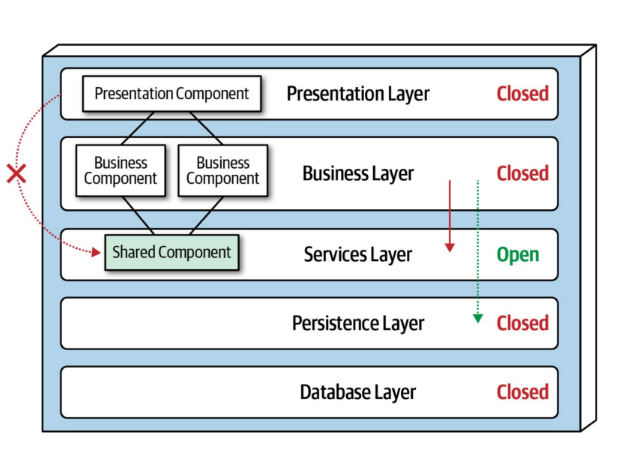
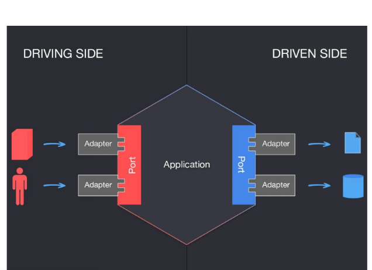
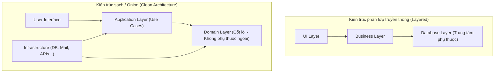
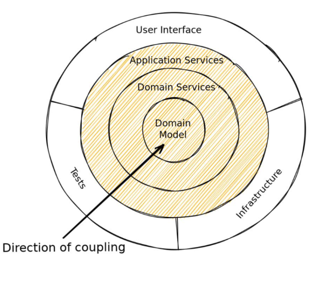
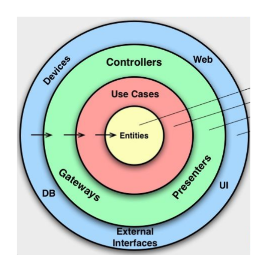
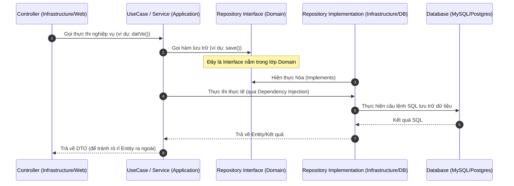
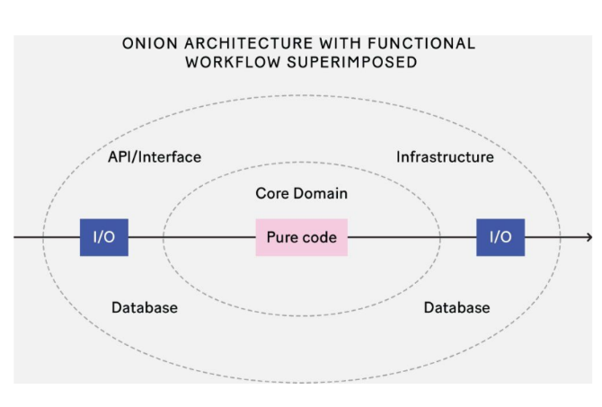
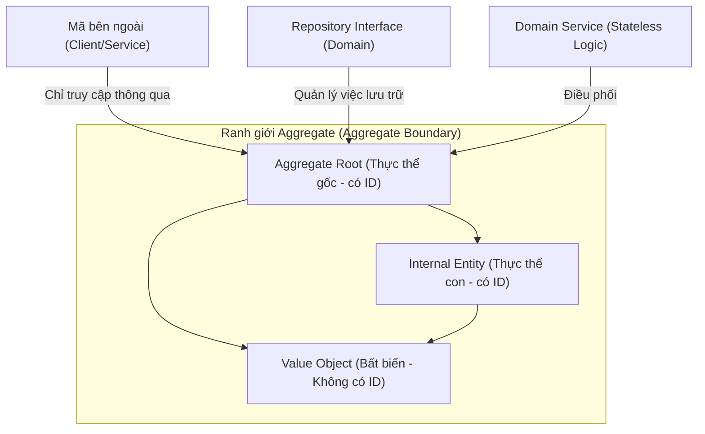

# Hướng dẫn về Kiến trúc Hệ thống & Cấu trúc Dự án (Architectural Patterns & Codebase Structure)

> *“Được ai đó yêu sâu sắc sẽ mang lại cho bạn sức mạnh,*  
> *trong khi yêu ai đó sâu sắc sẽ mang lại cho bạn sự dũng cảm.”*  
> — *Lão Tử*

<details open>
<summary><b>Mục lục (Table of Contents)</b></summary>

- [1. Các mô hình kiến trúc phần mềm (Architectural Patterns)](#1-các-mô-hình-kiến-trúc-phần-mềm-architectural-patterns)
  - [1.1. Kiến trúc phân lớp (Layered Architecture)](#11-kiến-trúc-phân-lớp-layered-architecture)
  - [1.2. Kiến trúc lục giác (Hexagonal Architecture / Ports & Adapters)](#12-kiến-trúc-lục-giác-hexagonal-architecture--ports--adapters)
  - [1.3. Kiến trúc hành tây (Onion Architecture)](#13-kiến-trúc-hành-tây-onion-architecture)
  - [1.4. Kiến trúc sạch (Clean Architecture)](#14-kiến-trúc-sạch-clean-architecture)
  - [1.5. Kiến trúc hàm (Functional Architecture)](#15-kiến-trúc-hàm-functional-architecture)
- [2. Cấu trúc thư mục dự án thực tế (Project Structure)](#2-cấu-trúc-thư-mục-dự-án-thực-tế-project-structure)
- [3. Thiết kế hướng miền (Domain-Driven Design - DDD)](#3-thiết-kế-hướng-miền-domain-driven-design---ddd)
  - [3.1. Giới thiệu chung](#31-giới-thiệu-chung)
  - [3.2. Ngữ cảnh ràng buộc (Bounded Context)](#32-ngữ-cảnh-ràng-buộc-bounded-context)
  - [3.3. Thiết kế chiến thuật (Tactical Design)](#33-thiết-kế-chiến-thuật-tactical-design)
  - [3.4. Các phân lớp trong cấu trúc DDD (DDD Layers)](#34-các-phân-lớp-trong-cấu-trúc-ddd-ddd-layers)
- [Tóm tắt & Bài tập về nhà (Recap & Homework)](#tóm-tắt--bài-tập-về-nhà-recap--homework)

</details>

---

# 1. Các mô hình kiến trúc phần mềm (Architectural Patterns)

### Vấn đề thực tế trong phát triển phần mềm:
*   Đã bao giờ bạn tự hỏi tại sao cấu trúc dự án này lại được chia theo cách này mà không phải cách khác?
*   Khi codebase ngày một phình to, tại sao việc quản lý mã nguồn, tìm kiếm và đặt vị trí logic nghiệp vụ lại trở nên cực kỳ khó khăn?
*   Làm thế nào để đưa các lý thuyết kiến trúc trừu tượng vào thực tế dự án một cách hiệu quả?

---

## 1.1. Kiến trúc phân lớp (Layered Architecture)
*   **Khái niệm:** Hệ thống phần mềm được chia thành các lớp ngang (horizontal layers) riêng biệt, hoạt động cùng nhau để tạo nên một đơn vị phần mềm thống nhất. Số lượng lớp không bị giới hạn cứng nhắc mà tùy thuộc vào thiết kế hệ thống.
*   **Nguyên tắc đóng (Closed Layers):** Một yêu cầu từ lớp trên cùng khi đi xuống bắt buộc phải đi qua tuần tự từng lớp tiếp theo, không được phép "nhảy cóc" qua bất kỳ lớp nào để tránh phá vỡ tính cô lập.
*   **Tính cô lập của các lớp (Layers of Isolation):** Thay đổi ở một lớp sẽ được cô lập trong nội bộ lớp đó và không làm ảnh hưởng dây chuyền đến các lớp khác.

```
+-----------------------------------+
|      User Interface (UI Layer)    |
+-----------------------------------+
                 |
                 v
+-----------------------------------+
|   Business Logic (Domain Layer)   |
+-----------------------------------+
                 |
                 v
+-----------------------------------+
|     Data Access (Database Layer)  |
+-----------------------------------+
```

> **Vấn đề phát sinh:** Nếu trong Business Layer xuất hiện quá nhiều đối tượng/thành phần dùng chung (shared components) dẫn đến chồng chéo logic?
> **Giải pháp:** Bổ sung thêm một lớp dịch vụ trung gian gọi là **Service Layer (Open Layer)** để điều phối công việc mà không vi phạm nguyên tắc cấu trúc.

### Đánh giá:
*   **Ưu điểm:** Đơn giản, dễ tiếp cận, dễ triển khai nhanh cho các dự án nhỏ, dễ viết unit test độc lập cho từng lớp.
*   **Nhược điểm:** Khó mở rộng khi hệ thống lớn; các lớp phụ thuộc chặt chẽ vào nhau (Business Layer phụ thuộc trực tiếp vào Database Layer), dẫn đến việc thay đổi công nghệ Database sẽ kéo theo sự thay đổi toàn bộ mã nguồn nghiệp vụ.

---

## 1.2. Kiến trúc lục giác (Hexagonal Architecture / Ports & Adapters)
*   **Ý tưởng cốt lõi:** Đặt logic nghiệp vụ ở trung tâm (Core Domain) và đẩy toàn bộ các cổng vào/ra (I/O, Database, UI, Web API, Mail Service) ra vùng biên (edges) để tạo nên các thành phần liên kết lỏng (loosely coupled).
*   **Cơ chế hoạt động:** Các tác nhân bên ngoài tương tác với Core Domain thông qua hai khái niệm:
    *   **Port (Cổng kết nối):** Là các giao diện **Interface** được định nghĩa bên trong Core Domain thể hiện nghiệp vụ cần trao đổi.
    *   **Adapter (Bộ chuyển đổi):** Là lớp **Implementation** thực tế nằm bên ngoài Core Domain hiện thực hóa các Interface đó (ví dụ: SQLAdapter, RedisAdapter, RESTController).
*   **Cơ chế Factory:** Sử dụng Factory Pattern để khởi tạo các Adapter phù hợp với cấu hình môi trường chạy.


### Đánh giá:
*   **Ưu điểm:** Liên kết cực kỳ lỏng (Loose Coupling); Core Domain hoàn toàn độc lập với công nghệ phần cứng nên có thể viết unit test mà không cần khởi chạy Database hay Web Server; dễ dàng hoán đổi công nghệ bên ngoài (ví dụ: chuyển từ MySQL sang PostgreSQL chỉ bằng cách đổi Adapter).
*   **Nhược điểm:** Đường cong học tập dốc (Learning Curve), đòi hỏi lập trình viên phải hiểu sâu về Interface và DI.

---

## 1.3. Kiến trúc hành tây (Onion Architecture)
*   Là bước tiến hóa từ kiến trúc phân lớp nhằm giải quyết triệt để hai vấn đề: Sự phụ thuộc chéo giữa các tầng và sự liên kết chặt chẽ với cơ sở hạ tầng (Infrastructure).
*   **Đặc điểm:** Cơ sở dữ liệu (Database/Infrastructure) không còn nằm ở vị trí trung tâm hay lớp đáy nữa. Thay vào đó, **Business Domain (Nghiệp vụ) là trung tâm cốt lõi**.
*   **Áp dụng Nguyên lý Đảo ngược Phụ thuộc (Dependency Inversion):**
    *   Mọi sự phụ thuộc đều hướng vào trong (Inward).
    *   Các tầng bên trong (Domain) hoàn toàn không biết và không có bất kỳ phụ thuộc nào vào mã nguồn của các tầng bên ngoài (Infrastructure/UI).



### Đánh giá:
*   **Ưu điểm:** Tập trung tuyệt đối vào thiết kế Domain; giảm thiểu tối đa liên kết cứng; kiểm thử dễ dàng bằng cách giả lập (mock) các cổng kết nối ngoại vi.
*   **Nhược điểm:** Cấu trúc nhiều lớp dẫn đến độ phức tạp cao, tốn thời gian thiết lập ban đầu.

---

## 1.4. Kiến trúc sạch (Clean Architecture)

*   Được đề xướng bởi Robert C. Martin (Uncle Bob), thực chất là sự kế thừa và đóng gói lại các tư tưởng cốt lõi của Kiến trúc lục giác và Kiến trúc hành tây.
*   **Quy tắc bất biến:** Không bao giờ vi phạm nguyên lý đảo ngược phụ thuộc (mã nguồn bên trong không được phép import hay gọi trực tiếp thư viện lớp bên ngoài). Số lượng lớp phân tách không giới hạn cứng nhắc.

### Cơ chế Vượt ranh giới (Crossing Boundaries):
Trong thực tế phát triển, có 2 vấn đề lớn thường vi phạm kiến trúc nếu không xử lý đúng cách:

#### Vấn đề 1: Trả trực tiếp Entity của Domain ra ngoài API
*   *Hậu quả:* Sự thay đổi cấu trúc bảng dữ liệu sẽ trực tiếp làm thay đổi JSON trả về cho Client, gây vỡ giao diện Frontend.
*   *Giải pháp:* Sử dụng **DTO (Data Transfer Object)** tại ranh giới lớp Application để đóng gói dữ liệu đầu ra riêng biệt, không rò rỉ Entity ra ngoài.

#### Vấn đề 2: Lớp Domain cần gọi Database để lưu trữ dữ liệu
*   *Hậu quả:* Nếu Domain gọi trực tiếp Database Layer sẽ vi phạm nguyên lý Dependency Inversion.
*   *Giải pháp:* Sử dụng mẫu thiết kế **Repository Pattern**:
    1.  Khai báo một **Repository Interface** ngay trong lớp Domain.
    2.  Lớp **Repository Implementation** (nằm ở lớp ngoài Infrastructure) sẽ hiện thực hóa Interface đó.
    3.  Lớp Application/Domain gọi lưu trữ thông qua Interface (Dependency Injection sẽ nạp implementation thực tế lúc runtime).



### Đánh giá ứng dụng thực tế:
*   **Ưu điểm:** Độc lập hoàn toàn với Framework, Database và các tác nhân UI; dễ bảo trì; tăng khả năng làm việc cộng tác trong team lớn; dễ viết bài test.
*   **Nhược điểm:** Tốn nhiều thời gian thiết lập ban đầu (boilerplate code). Rất dễ vô tình vi phạm kiến trúc khi sử dụng các annotation/framework tiện ích.
*   **Khi nào nên dùng:** Dự án lớn, vòng đời phát triển dài hạn, có nghiệp vụ kinh doanh (Business Logic) phức tạp và số lượng thành viên dự án lớn.
*   **Khi nào không nên dùng:** Dự án nhỏ (1-3 người), các dự án dạng POC/CRUD đơn giản, các công cụ, thư viện thuần kỹ thuật (không chứa logic nghiệp vụ).

---

## 1.5. Kiến trúc hàm (Functional Architecture)

*   Kế thừa tư tưởng của Lập trình hàm (Functional Programming).
*   **Nguyên tắc cốt lõi:**
    *   **Core Domain** chỉ chứa các **Hàm thuần túy (Pure Functions)**.
    *   Hàm thuần túy: $f(x) \rightarrow y$. Với cùng một đầu vào $x$, hàm luôn trả ra duy nhất một đầu ra $y$ (tính đơn định - Deterministic), tuyệt đối không gây ra các tác dụng phụ (**Side Effects**) như thay đổi biến toàn cục hay thực hiện I/O.
    *   Tác vụ I/O và ghi dữ liệu được đẩy ra ngoài rìa hệ thống (edges).

### Đánh giá:
*   **Ưu điểm:** Phân tách hoàn hảo giữa Unit Testing (kiểm thử logic nghiệp vụ thuần túy không có I/O) và Integration Testing (kiểm thử tích hợp I/O ở lớp ngoài).
*   **Nhược điểm:** Chuyển đổi tư duy lập trình từ hướng đối tượng (OOP) sang hướng hàm (FP) mất rất nhiều thời gian, cộng đồng phát triển và áp dụng trong doanh nghiệp còn hạn chế.

---

# 2. Cấu trúc thư mục dự án thực tế (Project Structure)

Có hai trường phái chính để tổ chức mã nguồn:
1.  **Package by Layer (Chia theo tầng kỹ thuật):** Gom tất cả Controller vào thư mục `controllers`, Model vào `models`, Repository vào `repositories`. Cấu trúc này dễ tiếp cận ban đầu nhưng khi dự án lớn, việc tìm kiếm file liên quan đến một tính năng sẽ bắt buộc lập trình viên phải nhảy qua lại giữa nhiều thư mục ở xa nhau.
2.  **Package by Feature/Domain (Chia theo miền nghiệp vụ):** Gom tất cả những gì thuộc về tính năng Đặt vé (Booking) vào một thư mục `booking`, tính năng Chuyến bay vào `flight`. Giúp tăng tính cô lập và dễ bảo trì tính năng độc lập.

---

# 3. Thiết kế hướng miền (Domain-Driven Design - DDD)

## 3.1. Giới thiệu chung
*   **Domain-Driven Design (DDD)** là phương pháp thiết kế phần mềm tập trung vào việc mô hình hóa phần mềm sao cho khớp nhất với thế giới thực của miền nghiệp vụ kinh doanh, bỏ qua các chi tiết kỹ thuật không liên quan như ngôn ngữ lập trình hay công nghệ database.
*   Kiến trúc mã nguồn (tên Class, Method, Variable) phải ánh xạ 1-1 với ngôn ngữ nghiệp vụ thực tế.
*   **Ubiquitous Language (Ngôn ngữ phổ quát):** Là bộ từ vựng nghiệp vụ thống nhất chung giữa nhà phát triển phần mềm (Developer) và chuyên gia nghiệp vụ (Domain Expert) để giao tiếp hiệu quả, tránh hiểu nhầm yêu cầu. Ngôn ngữ này phải được thể hiện trực tiếp trong mã nguồn của chương trình.

---

## 3.2. Ngữ cảnh ràng buộc (Bounded Context)
*   **Bounded Context** xác định ranh giới logic của một mô hình nghiệp vụ mà trong đó các từ ngữ, khái niệm đều có một ý nghĩa thống nhất và duy nhất.
*   *Ví dụ 1:* Từ `"letter"` mang hai nghĩa hoàn toàn khác nhau ở các ngữ cảnh khác nhau:
    *   Trong ngữ cảnh Bưu điện: Nghĩa là "Lá thư gửi đi".
    *   Trong ngữ cảnh Giáo dục: Nghĩa là "Chữ cái".
*   *Ví dụ 2:* Từ `"credit"`:
    *   Trong ngữ cảnh Cho vay (Lending): Khả năng mua trước trả sau dựa trên uy tín.
    *   Trong ngữ cảnh Thanh toán (Payment): Tài khoản nhận tiền.
*   Nhờ phân chia Bounded Context, các đội phát triển có thể vận hành và phát triển các dịch vụ một cách độc lập mà không lo sợ xung đột thuật ngữ.

---

## 3.3. Thiết kế chiến thuật (Tactical Design)
Các thành phần xây dựng mã nguồn tiêu chuẩn trong DDD:



### 3.3.1. Entity (Thực thể)
*   Là đối tượng được định danh bằng một **ID duy nhất** đi kèm suốt vòng đời của nó.
*   Hai Entity được coi là giống nhau khi và chỉ khi chúng có chung ID, dù các thuộc tính khác có thể thay đổi.
*   *Ví dụ:* `User` (định danh bằng UserId), `Flight` (định danh bằng FlightNumber).

### 3.3.2. Value Object (Đối tượng giá trị)
*   Là đối tượng dùng để mô tả đặc tính của Entity, **không sở hữu ID định danh** và có tính chất **bất biến (Immutable)**.
*   Hai Value Object được coi là giống nhau khi toàn bộ giá trị các thuộc tính của chúng trùng khớp nhau.
*   *Ví dụ:* `Address` (đường, mã bưu điện), `Money` (số tiền, loại tiền tệ). Khi muốn thay đổi địa chỉ của một User, ta không cập nhật thuộc tính mà tiến hành thay thế bằng một đối tượng `Address` mới hoàn toàn.

### 3.3.3. Aggregate & Aggregate Root (Tập hợp dữ liệu)
*   **Aggregate** là một cụm liên kết gồm các Entity và Value Object có liên quan chặt chẽ với nhau nhằm bảo toàn các ràng buộc nghiệp vụ (Business Invariants).
*   Đòi hỏi tính nhất quán của giao dịch (Transactional Consistency).
*   **Aggregate Root (Gốc tập hợp):** Là Entity chính diện đại diện cho cả nhóm Aggregate để giao tiếp với bên ngoài. Mọi truy xuất từ bên ngoài vào các thành phần con bên trong Aggregate bắt buộc phải đi qua Aggregate Root.
*   *Ví dụ:* Một `Booking` (Aggregate Root) chứa danh sách các `Ticket` (Internal Entity). Hệ thống bên ngoài không được phép truy vấn hay sửa đổi trực tiếp `Ticket` mà phải gọi qua `Booking`.

### 3.3.4. Domain Service (Dịch vụ miền)
*   Là nơi chứa các logic nghiệp vụ không thuộc về trách nhiệm của riêng một Entity hay Value Object nào. Domain Service nên là **không lưu trạng thái (Stateless)**.
*   *Ví dụ:* `BookingService` điều phối logic tính giá vé và kiểm tra chỗ trống.

### 3.3.5. Repository (Kho dữ liệu)
*   Định nghĩa Interface trong lớp Domain và thực thi lưu trữ thực tế ở lớp Infrastructure.

---

## 3.4. Các phân lớp trong cấu trúc DDD (DDD Layers)
DDD đề xuất chia hệ thống làm 4 phân lớp chính:
1.  **User Interface Layer (Giao diện):** Hiển thị thông tin và nhận lệnh từ người dùng (Controllers, CLI, Web views).
2.  **Application Layer (Ứng dụng):** Điều phối các công việc của Domain để hoàn thành Use Case. Lớp này không nắm giữ quy tắc nghiệp vụ (Business Rules).
3.  **Domain Layer (Tên miền):** Trái tim của hệ thống, chứa mô hình nghiệp vụ, thực thể, giá trị, dịch vụ miền và các quy tắc nghiệp vụ cốt lõi.
4.  **Infrastructure Layer (Hạ tầng):** Triển khai các tác vụ kỹ thuật như kết nối Database, gửi Mail, Message Queue, cấu hình bảo mật.

---

# Tóm tắt & Bài tập về nhà (Recap & Homework)

### Tóm tắt cốt lõi (Recap)
*   Cần đảm bảo tính cô lập giữa các phân lớp và luôn tuân thủ nguyên lý đảo ngược phụ thuộc (Dependency Inversion).
*   Nhà phát triển phần mềm cần hiểu sâu sắc yêu cầu kinh doanh để xây dựng mã nguồn phản ánh chính xác nghiệp vụ (Ubiquitous Language).
*   Sử dụng Entity cho các đối tượng có ID định danh và Value Object cho các đối tượng bất biến mô tả thuộc tính.

### Bài tập về nhà (Homework)
*   **Yêu cầu:** Khởi tạo cấu trúc gói (package) và lớp dữ liệu (classes) cho ứng dụng đặt vé máy bay (**Flight Booking System**) áp dụng mô hình **Clean Architecture** kết hợp **Domain-Driven Design (DDD)**.
*   **Quy định:**
    1.  Chỉ tạo cấu trúc thư mục (packages), các file class/interface/struct trống.
    2.  Không viết mã logic bên trong các hàm.
    3.  Tổ chức phân cấp rõ ràng thành các tầng: `domain`, `application`, `infrastructure`, `presentation` để chứng minh sự hiểu biết về ranh giới phụ thuộc và cơ chế đảo ngược phụ thuộc.

### Tài liệu tham khảo (References)
*   **The Clean Architecture:** [Uncle Bob's Blog](https://blog.cleancoder.com/uncle-bob/2012/08/13/the-clean-architecture.html)
*   **Primer on Functional Architecture:** [Increment Article](https://increment.com/software-architecture/primer-on-functional-architecture/)
*   **Domain-Driven Design at a Glance:** [Tacta Blog on DDD](https://medium.com/ssense-tech/domain-driven-design-everything-you-always-wanted-to-know-about-it-but-were-afraid-to-ask-a85e7b74497a)

**Cảm ơn bạn! (Thank you)**
