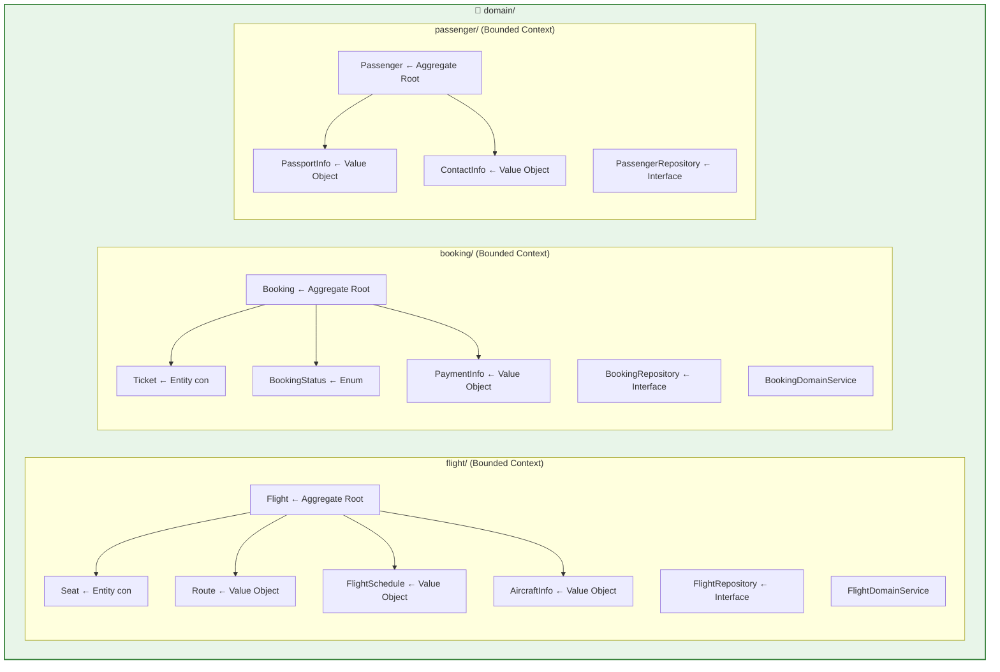
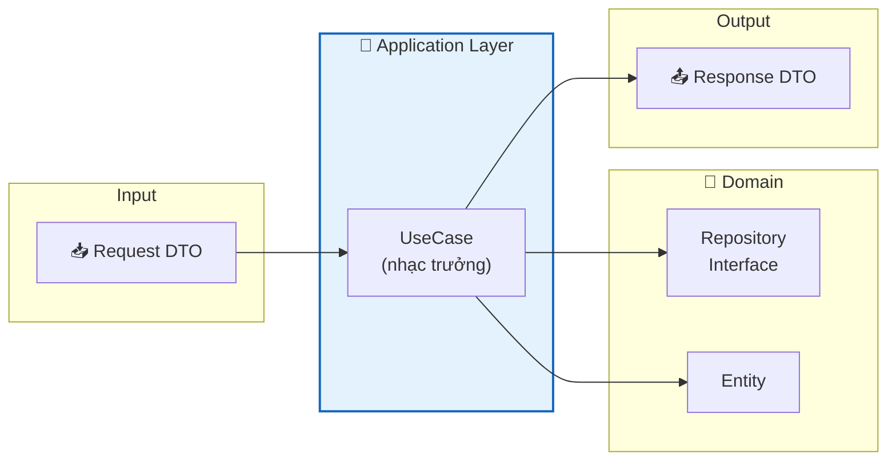
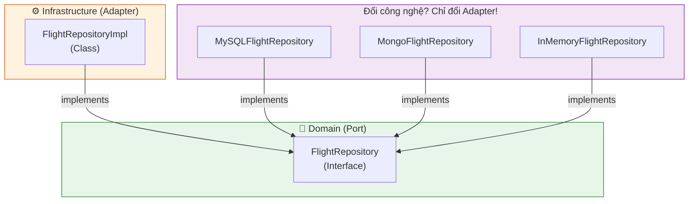
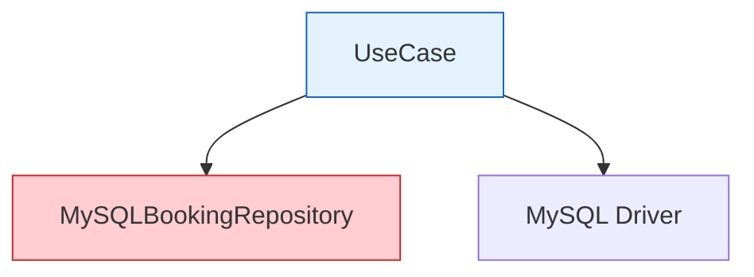
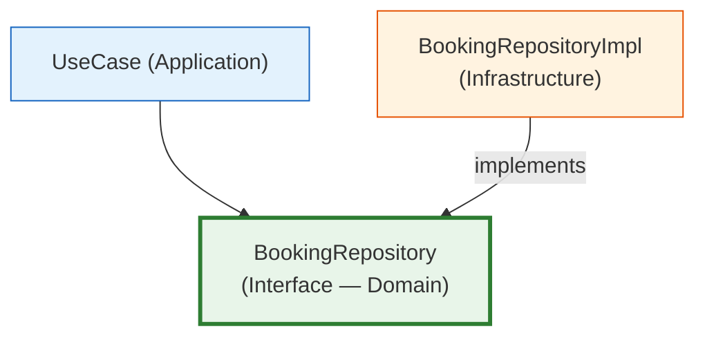
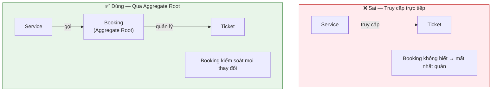
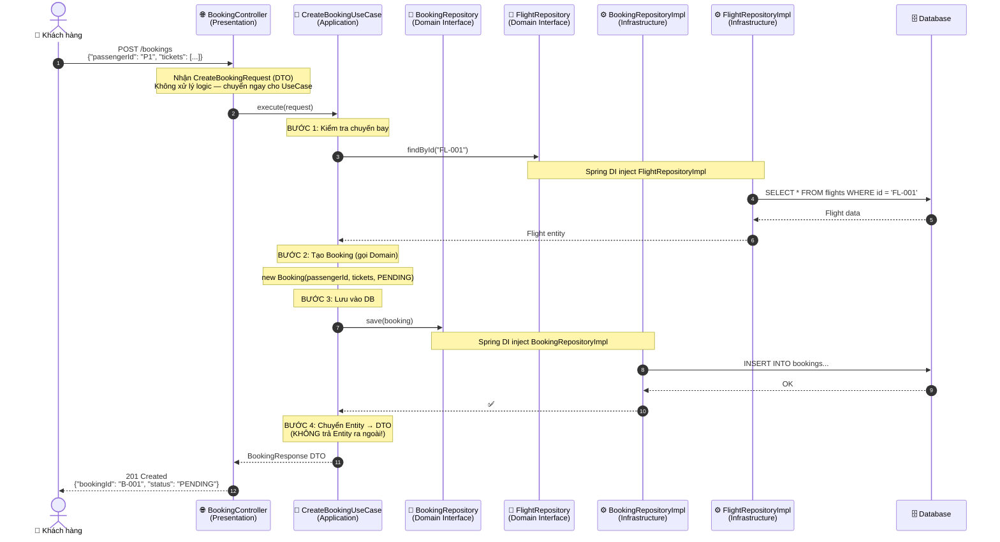

# ✈️ Flight Booking System — Hướng dẫn học hiểu kiến trúc

> *"Nói cho tôi nghe, tôi sẽ quên. Cho tôi xem, tôi sẽ nhớ. Để tôi làm, tôi sẽ hiểu."*
> — *Khổng Tử*

Tài liệu này giải thích **tại sao** mỗi file tồn tại, **tại sao** nó nằm ở vị trí đó, và **chuyện gì xảy ra nếu làm sai**.

---

<details open>
<summary><b>📋 Mục lục</b></summary>

- [1. Ẩn dụ trực quan — Hiểu kiến trúc qua đời thực](#1-ẩn-dụ-trực-quan--hiểu-kiến-trúc-qua-đời-thực)
- [2. Bốn tầng kiến trúc — Chi tiết từng file](#2-bốn-tầng-kiến-trúc--chi-tiết-từng-file)
  - [2.1. Domain Layer — Trái tim](#21--domain-layer--trái-tim)
  - [2.2. Application Layer — Nhạc trưởng](#22--application-layer--nhạc-trưởng)
  - [2.3. Infrastructure Layer — Thợ xây](#23-️-infrastructure-layer--thợ-xây)
  - [2.4. Presentation Layer — Lễ tân](#24--presentation-layer--lễ-tân)
- [3. Dependency Inversion — Giải thích bằng ví dụ](#3-dependency-inversion--giải-thích-bằng-ví-dụ)
- [4. Entity vs Value Object — Bài test nhanh](#4-entity-vs-value-object--bài-test-nhanh)
- [5. Aggregate — Tại sao không truy cập Ticket trực tiếp?](#5-aggregate--tại-sao-không-truy-cập-ticket-trực-tiếp)
- [6. Luồng xử lý đầy đủ — Đặt vé máy bay](#6-luồng-xử-lý-đầy-đủ--đặt-vé-máy-bay)
- [7. Anti-Pattern — Những lỗi sai phổ biến](#7-anti-pattern--những-lỗi-sai-phổ-biến)
- [8. Câu hỏi tự kiểm tra](#8-câu-hỏi-tự-kiểm-tra)

</details>

---

## 1. Ẩn dụ trực quan — Hiểu kiến trúc qua đời thực

Hãy tưởng tượng hệ thống đặt vé máy bay như một **sân bay thực tế**:

```
🏢 SÂN BAY (Flight Booking System)
├── 🌐 Quầy lễ tân (Presentation Layer)
│   └── Tiếp nhận yêu cầu của khách hàng, không xử lý gì cả
│
├── 🔧 Phòng điều hành (Application Layer)
│   └── Nhạc trưởng — điều phối ai làm gì, thứ tự nào
│   └── KHÔNG tự quyết định quy tắc nghiệp vụ
│
├── 💎 Bộ quy tắc hàng không (Domain Layer)
│   └── "Mỗi ghế chỉ bán cho 1 người"
│   └── "Vé hạng Business giá gấp 3 Economy"
│   └── "Hộ chiếu hết hạn → không đặt được vé"
│   └── Đây là LUẬT — không phụ thuộc vào công nghệ nào
│
└── ⚙️ Phòng kỹ thuật (Infrastructure Layer)
    └── Kết nối hệ thống máy tính, database, email
    └── Thay máy tính mới? Không ảnh hưởng quy tắc hàng không!
```

> **Điểm mấu chốt:** Quy tắc hàng không (Domain) **tồn tại trước khi có máy tính**. Dù bạn ghi chép bằng sổ giấy hay MySQL, quy tắc "mỗi ghế chỉ bán cho 1 người" **không thay đổi**. Đó là lý do Domain không phụ thuộc vào Infrastructure.

---

## 2. Bốn tầng kiến trúc — Chi tiết từng file

### 2.1. 💎 Domain Layer — Trái tim

> **Một câu:** Domain chứa **quy tắc nghiệp vụ** — những thứ đúng bất kể bạn dùng công nghệ gì.



#### Giải thích từng file:

| File | Loại | Tại sao tồn tại? |
|---|---|---|
| `Flight.java` | **Aggregate Root** | Đại diện cho 1 chuyến bay. Mọi thao tác với ghế ngồi **phải đi qua Flight** — không ai được tự ý sửa ghế mà không hỏi chuyến bay |
| `Seat.java` | **Entity** | Ghế có ID riêng (`A1`, `B3`), trạng thái thay đổi (trống ↔ đã đặt). Nhưng ghế **thuộc về** chuyến bay → là Entity con |
| `Route.java` | **Value Object** | Tuyến bay `HAN → SGN`. Không có ID, bất biến. Hai tuyến `HAN → SGN` luôn giống nhau → so sánh bằng giá trị |
| `FlightSchedule.java` | **Value Object** | Giờ bay. Bất biến — khi đổi giờ bay, tạo object mới thay vì sửa object cũ |
| `AircraftInfo.java` | **Value Object** | Thông tin máy bay (Boeing 787, Vietnam Airlines). Bất biến |
| `FlightRepository.java` | **Interface (Port)** | Khai báo "tôi cần khả năng `save()`, `findById()`" — nhưng **không quan tâm** lưu ở đâu (MySQL? MongoDB? File?) |
| `FlightDomainService.java` | **Domain Service** | Logic nghiệp vụ không thuộc riêng Entity nào. VD: "Kiểm tra chuyến bay còn ghế trống" cần biết cả Flight lẫn Seat |
| `Booking.java` | **Aggregate Root** | Đơn đặt vé — quản lý danh sách Ticket bên trong. Huỷ Booking → tất cả Ticket phải huỷ theo (Transactional Consistency) |
| `Ticket.java` | **Entity** | Vé cụ thể — có ID riêng, gắn với 1 chuyến bay + 1 ghế. Thuộc Aggregate Booking |
| `BookingStatus.java` | **Enum** | Trạng thái đặt vé. Dùng Enum thay vì String `"CONFIRMED"` → tránh gõ nhầm `"COMFIRMED"` |
| `PaymentInfo.java` | **Value Object** | Thông tin thanh toán. Dùng `BigDecimal` cho tiền (không dùng `double` vì lỗi làm tròn!) |
| `BookingRepository.java` | **Interface (Port)** | Tương tự FlightRepository — cổng kết nối lưu trữ |
| `BookingDomainService.java` | **Domain Service** | Logic tính giá vé, kiểm tra tính hợp lệ đặt vé |
| `Passenger.java` | **Aggregate Root** | Hành khách — sở hữu PassportInfo và ContactInfo |
| `PassportInfo.java` | **Value Object** | Hộ chiếu — đổi hộ chiếu = tạo object mới, không sửa object cũ |
| `ContactInfo.java` | **Value Object** | Email + SĐT. Bất biến |
| `PassengerRepository.java` | **Interface (Port)** | Cổng lưu trữ hành khách |

---

### 2.2. 🔧 Application Layer — Nhạc trưởng

> **Một câu:** Application **điều phối** Use Case — nhận DTO vào, gọi Domain, trả DTO ra. **Không chứa business rules.**



#### Tại sao cần DTO?

```java
// ❌ SAI — Trả Entity trực tiếp ra API
@GetMapping("/bookings/{id}")
public Booking getBooking(@PathVariable String id) {
    return bookingRepository.findById(id);  // RÒ RỈ Entity!
}
// Hậu quả: Thêm cột "internalNote" trong DB → Client nhìn thấy ghi chú nội bộ
// Hậu quả: Đổi tên trường "status" → Frontend vỡ vì JSON thay đổi

// ✅ ĐÚNG — Trả DTO
@GetMapping("/bookings/{id}")
public BookingResponse getBooking(@PathVariable String id) {
    Booking booking = bookingRepository.findById(id);
    return new BookingResponse(booking.getId(), booking.getStatus().name(), ...);
    // Client chỉ thấy những gì ta CHỌN trả về
}
```

| File | Tại sao tồn tại? |
|---|---|
| `SearchFlightRequest.java` | Gom tham số tìm kiếm vào 1 object (tránh method có 5 tham số) |
| `FlightResponse.java` | Kiểm soát JSON trả về — chỉ trả `availableSeats`, giấu chi tiết nội bộ |
| `SearchFlightUseCase.java` | Điều phối: nhận request → gọi `FlightRepository.findAll()` → lọc → trả response |
| `CreateBookingRequest.java` | Dữ liệu tạo đặt vé từ Client (chứa nested `TicketRequest`) |
| `BookingResponse.java` | Chỉ trả `bookingId`, `status`, `totalAmount` — không rò rỉ `Ticket` entity |
| `CancelBookingRequest.java` | Dữ liệu huỷ vé (bookingId + lý do) |
| `CreateBookingUseCase.java` | Điều phối tạo vé — inject **2** repository interface (Booking + Flight) |
| `CancelBookingUseCase.java` | Điều phối huỷ vé |
| `RegisterPassengerRequest.java` | Dữ liệu đăng ký hành khách |
| `PassengerResponse.java` | Trả `fullName` + `nationality` — giấu `passportNumber` (bảo mật!) |
| `RegisterPassengerUseCase.java` | Điều phối đăng ký hành khách |

---

### 2.3. ⚙️ Infrastructure Layer — Thợ xây

> **Một câu:** Infrastructure **hiện thực hóa** những gì Domain **khai báo** — là Adapter cho Port.



| File | Tại sao tồn tại? |
|---|---|
| `FlightRepositoryImpl.java` | Implement `FlightRepository` Interface — kết nối DB thực tế |
| `BookingRepositoryImpl.java` | Implement `BookingRepository` Interface |
| `PassengerRepositoryImpl.java` | Implement `PassengerRepository` Interface |
| `BeanConfig.java` | Nói cho Spring biết: "Khi ai đó cần `FlightRepository`, hãy inject `FlightRepositoryImpl`" |

---

### 2.4. 🌐 Presentation Layer — Lễ tân

> **Một câu:** Presentation nhận HTTP request, chuyển cho UseCase, trả JSON response. **Không biết Domain tồn tại.**

| File | Tại sao tồn tại? |
|---|---|
| `FlightController.java` | API endpoint `/flights/search` — inject `SearchFlightUseCase` |
| `BookingController.java` | API endpoint `/bookings` — inject 2 UseCase (tạo + huỷ) |
| `PassengerController.java` | API endpoint `/passengers` — inject `RegisterPassengerUseCase` |

---

## 3. Dependency Inversion — Giải thích bằng ví dụ

Đây là nguyên lý **quan trọng nhất** của Clean Architecture.

### Không có Dependency Inversion (❌ Sai):



```java
// ❌ UseCase phụ thuộc trực tiếp vào MySQL
public class CreateBookingUseCase {
    private final MySQLBookingRepository repo; // CỨNG! Đổi sang MongoDB = sửa UseCase
}
```

**Hậu quả:** Đổi MySQL → PostgreSQL = phải sửa **TẤT CẢ** UseCase.

### Có Dependency Inversion (✅ Đúng):



```java
// ✅ UseCase phụ thuộc vào Interface (trừu tượng)
public class CreateBookingUseCase {
    private final BookingRepository repo; // Interface! Đổi DB = chỉ đổi Impl
    
    // Spring DI tự inject BookingRepositoryImpl lúc runtime
}
```

**Kết quả:** Đổi MySQL → PostgreSQL = chỉ tạo `PostgresBookingRepositoryImpl` mới. UseCase **không cần sửa 1 dòng nào**.

---

## 4. Entity vs Value Object — Bài test nhanh

Khi thiết kế, hãy tự hỏi 3 câu:

```
┌─────────────────────────────────────────────────────────┐
│  1. Nó có cần ID riêng để phân biệt không?              │
│     CÓ → Entity    |    KHÔNG → Value Object            │
│                                                          │
│  2. Nó có thể thay đổi trạng thái theo thời gian?       │
│     CÓ → Entity    |    KHÔNG (bất biến) → Value Object │
│                                                          │
│  3. Hai đối tượng cùng giá trị có phải là "cùng 1" không?│
│     KHÔNG (VD: 2 User cùng tên ≠ nhau) → Entity         │
│     CÓ (VD: 2 Route HAN→SGN = nhau) → Value Object      │
└─────────────────────────────────────────────────────────┘
```

### Bài test — Hãy phân loại:

| Đối tượng | Entity hay VO? | Giải thích |
|---|---|---|
| `Flight` | **Entity** ✈️ | Có FlightId. Chuyến bay VN-123 ngày 1/1 ≠ VN-123 ngày 2/1 |
| `Seat` | **Entity** 💺 | Có SeatId. Ghế A1 thay đổi trạng thái (trống → đã đặt) |
| `Route` | **Value Object** 🗺️ | `HAN → SGN` luôn = `HAN → SGN`. Không cần ID |
| `PaymentInfo` | **Value Object** 💰 | 500.000 VND bằng VISA = 500.000 VND bằng VISA. Bất biến |
| `Booking` | **Entity** 📋 | Có BookingId. Trạng thái thay đổi: PENDING → CONFIRMED |
| `PassportInfo` | **Value Object** 🛂 | So sánh bằng giá trị. Đổi hộ chiếu = tạo object mới |

### Value Object phải bất biến — Tại sao?

```java
// ❌ Nếu Value Object MUTABLE (thay đổi được):
Route route = new Route("HAN", "SGN");
flight1.setRoute(route);
flight2.setRoute(route);   // Cùng chia sẻ 1 object!

route.setArrival("DAD");   // NGUY HIỂM: Cả flight1 và flight2 đều bị đổi!

// ✅ Value Object IMMUTABLE (bất biến):
Route route1 = new Route("HAN", "SGN");
Route route2 = new Route("HAN", "DAD");  // Tạo object MỚI
flight1.setRoute(route1);
flight2.setRoute(route2);  // An toàn — mỗi flight có object riêng
```

---

## 5. Aggregate — Tại sao không truy cập Ticket trực tiếp?

### Vấn đề nếu truy cập trực tiếp:

```java
// ❌ SAI — Truy cập Ticket trực tiếp, bỏ qua Booking
Ticket ticket = ticketRepository.findById("T-001");
ticket.cancel();  // Huỷ vé mà Booking không biết!
// Booking vẫn status = CONFIRMED nhưng 1 vé đã bị huỷ → DỮ LIỆU KHÔNG NHẤT QUÁN
```

### Giải pháp — Luôn đi qua Aggregate Root:

```java
// ✅ ĐÚNG — Mọi thao tác đi qua Booking (Aggregate Root)
Booking booking = bookingRepository.findById("B-001");
booking.cancelTicket("T-001");  // Booking kiểm soát toàn bộ!
// Booking tự cập nhật: nếu tất cả Ticket đều huỷ → status = CANCELLED
```



> **Quy tắc Aggregate:**
> - Bên ngoài chỉ giữ **reference ID** đến Aggregate Root khác (VD: `Booking` giữ `passengerId`, không giữ object `Passenger`)
> - Repository chỉ tạo cho **Aggregate Root** — không có `TicketRepository`!

---

## 6. Luồng xử lý đầy đủ — Đặt vé máy bay



### Quy tắc Import — Ai biết ai?

```
BookingController      → biết: CreateBookingUseCase, CreateBookingRequest, BookingResponse
                       → KHÔNG biết: Booking (Entity), BookingRepositoryImpl

CreateBookingUseCase   → biết: BookingRepository (Interface), FlightRepository (Interface)
                       → KHÔNG biết: BookingRepositoryImpl, Database

BookingRepositoryImpl  → biết: BookingRepository (Interface), Booking (Entity)
                       → KHÔNG biết: CreateBookingUseCase, BookingController
```

> **Kết quả:** 3 class này **không biết nhau** nhưng vẫn hoạt động nhờ Spring DI nối dây lúc runtime.

---

## 7. Anti-Pattern — Những lỗi sai phổ biến

### ❌ Lỗi 1: Domain import Infrastructure

```java
// Trong domain/booking/entity/Booking.java
import com.tamdao.codebase.infrastructure.persistence.booking.BookingRepositoryImpl; // ❌ CHẾT!

// Domain bây giờ PHỤ THUỘC vào Infrastructure
// → Đổi DB = phải sửa Domain = phá vỡ toàn bộ kiến trúc
```

### ❌ Lỗi 2: Controller gọi Repository trực tiếp

```java
// Trong presentation/BookingController.java
public class BookingController {
    private final BookingRepository repo; // ❌ Nhảy cóc qua Application!
    
    // Controller giờ chứa logic nghiệp vụ — vi phạm Single Responsibility
    // Không thể tái sử dụng logic này ở CLI hay message queue
}
```

### ❌ Lỗi 3: Trả Entity ra API

```java
// ❌ Rò rỉ Entity
@GetMapping("/passengers/{id}")
public Passenger getPassenger(...) {
    return passengerRepo.findById(id);
    // Client nhìn thấy: passportNumber, mọi internal field
    // → Vi phạm bảo mật + phá vỡ khi đổi schema
}
```

### ❌ Lỗi 4: Đặt business rules ở Application

```java
// Trong application/booking/usecase/CreateBookingUseCase.java
public BookingResponse execute(CreateBookingRequest req) {
    if (flight.getSeats().stream().filter(s -> !s.isBooked()).count() == 0) {
        throw new RuntimeException("Hết ghế"); // ❌ Business rule ở Application!
    }
    // Logic này phải nằm ở Domain (FlightDomainService hoặc Flight entity)
}
```

**Đúng:**
```java
// Trong domain/flight/service/FlightDomainService.java
public boolean hasAvailableSeat(Flight flight, String seatClass) {
    // ✅ Business rule nằm đúng chỗ — Domain Layer
}
```

---

## 8. Câu hỏi tự kiểm tra

Hãy trả lời **trước khi xem đáp án** (click mở):

---

**Câu 1:** `FlightRepository` (Interface) nằm ở tầng Domain. Nhưng `FlightRepositoryImpl` nằm ở Infrastructure. Tại sao Interface không nằm cùng chỗ với Implementation?

<details>
<summary>🔍 Xem đáp án</summary>

Vì **Dependency Inversion**: UseCase (Application) cần gọi `save()`, `findById()`. Nếu Interface nằm ở Infrastructure → Application phải import Infrastructure → vi phạm quy tắc "phụ thuộc hướng vào trong".

Đặt Interface ở Domain → Application chỉ import Domain (hợp lệ). Infrastructure implement Interface đó → Infrastructure phụ thuộc vào Domain (hợp lệ — hướng vào trong).

</details>

---

**Câu 2:** Tại sao có `BookingDomainService` khi đã có `CreateBookingUseCase`? Chúng khác gì nhau?

<details>
<summary>🔍 Xem đáp án</summary>

| | `BookingDomainService` | `CreateBookingUseCase` |
|---|---|---|
| **Tầng** | Domain | Application |
| **Chứa gì** | Business Rules (tính giá vé, validate) | Điều phối (gọi Domain, gọi Repository) |
| **Ví dụ** | "Vé Business giá gấp 3 Economy" | "Nhận request → gọi service tính giá → lưu DB → trả DTO" |
| **Biết DB không?** | ❌ Không biết DB tồn tại | ✅ Gọi Repository Interface |

</details>

---

**Câu 3:** Tại sao `PaymentInfo` dùng `BigDecimal` thay vì `double` cho tiền?

<details>
<summary>🔍 Xem đáp án</summary>

```java
// double có lỗi làm tròn:
System.out.println(0.1 + 0.2); // → 0.30000000000000004 ❌

// BigDecimal chính xác tuyệt đối:
new BigDecimal("0.1").add(new BigDecimal("0.2")); // → 0.3 ✅
```

Trong tài chính, sai lệch `0.00000000000000004` tích luỹ qua hàng triệu giao dịch = mất hàng tỷ đồng!

</details>

---

**Câu 4:** Nếu muốn thêm tính năng **"Gửi email xác nhận đặt vé"**, file mới nên nằm ở tầng nào?

<details>
<summary>🔍 Xem đáp án</summary>

- **Domain:** Khai báo `NotificationService` Interface (Port) — "tôi cần khả năng gửi thông báo"
- **Infrastructure:** Tạo `EmailNotificationServiceImpl` — "tôi gửi qua SMTP" (Adapter)
- **Application:** `CreateBookingUseCase` inject `NotificationService` Interface và gọi sau khi tạo booking thành công

→ Sau này đổi từ Email sang SMS? Chỉ tạo `SmsNotificationServiceImpl` mới. Domain + Application không cần sửa!

</details>

---

**Câu 5:** Tại sao KHÔNG có `TicketRepository`?

<details>
<summary>🔍 Xem đáp án</summary>

Vì `Ticket` là **Entity con** nằm trong Aggregate `Booking`. Quy tắc Aggregate:
- Repository chỉ tạo cho **Aggregate Root**
- Mọi thao tác với Ticket phải đi qua `Booking`
- Lưu/xoá Ticket = lưu/xoá cả Booking (Transactional Consistency)

Nếu tạo `TicketRepository` → cho phép truy cập Ticket trực tiếp → mất nhất quán dữ liệu!

</details>

---

## Tài liệu tham khảo

- [The Clean Architecture — Uncle Bob](https://blog.cleancoder.com/uncle-bob/2012/08/13/the-clean-architecture.html)
- [Domain-Driven Design — Martin Fowler](https://martinfowler.com/bliki/DomainDrivenDesign.html)
- [Aggregate Pattern — Vaughn Vernon](https://www.dddcommunity.org/library/vernon_2011/)
