# Hướng dẫn về Mạng Máy tính (Computer Networking Guide)

> *“Tất cả chúng ta đều được kết nối với nhau bởi Internet,*  
> *giống như các neuron thần kinh trong một bộ não khổng lồ.”*  
> — *Stephen Hawking*

<details open>
<summary><b>Mục lục (Table of Contents)</b></summary>

- [1. Cơ bản về Mạng máy tính (Fundamentals)](#1-cơ-bản-về-mạng-máy-tính-fundamentals)
  - [1.1. Lịch sử phát triển (History)](#11-lịch-sử-phát-triển-history)
  - [1.2. Phân loại phạm vi mạng (Network Types)](#12-phân-loại-phạm-vi-mạng-network-types)
  - [1.3. Mô hình tham chiếu OSI và TCP/IP (OSI vs TCP/IP Model)](#13-mô-hình-tham-chiếu-osi-và-tcpip-osi-vs-tcpip-model)
  - [1.4. Đóng gói dữ liệu (Encapsulation)](#14-đóng-gói-dữ-liệu-encapsulation)
- [2. Các giao thức cốt lõi cho Backend Developer (Core Protocols)](#2-các-giao-thức-cốt-lõi-cho-backend-developer-core-protocols)
  - [2.1. Giao thức Transport Layer: TCP vs UDP](#21-giao-thức-transport-layer-tcp-vs-udp)
  - [2.2. Giao thức Network Layer: IP (IPv4 vs IPv6)](#22-giao-thức-network-layer-ip-ipv4-vs-ipv6)
    - [2.2.5. Phân lớp địa chỉ IP truyền thống (Classful IP Addressing)](#225-phân-lớp-địa-chỉ-ip-truyền-thống-classful-ip-addressing)
    - [2.2.6. Định tuyến không phân lớp (CIDR)](#226-định-tuyến-không-phân-lớp-cidr)
  - [2.3. Hệ thống phân giải tên miền (DNS - Domain Name System)](#23-hệ-thống-phân-giải-tên-miền-dns---domain-name-system)
  - [2.4. Giao thức HTTP/HTTPS và Cơ chế bắt tay bảo mật TLS](#24-giao-thức-httphttps-và-cơ-chế-bắt-tay-bảo-mật-tls)
- [3. Dịch vụ mạng & Sơ đồ hạ tầng (Network Services & Topology)](#3-dịch-vụ-mạng--sơ-đồ-hạ-tầng-network-services--topology)
  - [3.1. Các dịch vụ mạng cốt lõi (Core Network Services)](#31-các-dịch-vụ-mạng-cốt-lõi-core-network-services)
  - [3.2. Sơ đồ hạ tầng mạng doanh nghiệp (Enterprise Network Topology)](#32-sơ-đồ-hạ-tầng-mạng-doanh-nghiệp-enterprise-network-topology)
  - [3.3. Sơ đồ hạ tầng mạng gia đình (Home Network Topology)](#33-sơ-đồ-hạ-tầng-mạng-gia-đình-home-network-topology)
- [4. Thành phần hạ tầng mạng nâng cao (Advanced Network Infrastructure)](#4-thành-phần-hạ-tầng-mạng-nâng-cao-advanced-network-infrastructure)
  - [4.1. Proxy vs Reverse Proxy](#41-proxy-vs-reverse-proxy)
  - [4.2. Mạng phân phối nội dung (CDN - Content Delivery Network)](#42-mạng-phân-phối-nội-dung-cdn---content-delivery-network)
- [5. Quy trình truy cập một URL từ Trình duyệt (What happens when you type in a URL?)](#5-quy-trình-truy-cập-một-url-từ-trình-duyệt-what-happens-when-you-type-in-a-url)
  - [5.1. Phân tích cấu trúc URL (URL Parsing)](#51-phân-tích-cấu-trúc-url-url-parsing)
  - [5.2. Cơ chế tìm kiếm DNS (DNS Lookup)](#52-cơ-chế-tìm-kiếm-dns-dns-lookup)
  - [5.3. Chọn địa chỉ IP nguồn và Tuyến đường (Source IP & Route Selection)](#53-chọn-địa-chỉ-ip-nguồn-và-tuyến-đường-source-ip--route-selection)
  - [5.4. Đóng gói dữ liệu qua Chồng Giao thức (Protocol Stack & Encapsulation)](#54-đóng-gói-dữ-liệu-qua-chồng-giao-thức-protocol-stack--encapsulation)
  - [5.5. Định tuyến qua các Routers (Routing)](#55-định-tuyến-qua-các-routers-routing)
  - [5.6. Bắt tay TCP 3 bước (TCP 3-Way Handshake)](#56-bắt-tay-tcp-3-bước-tcp-3-way-handshake)
- [Tóm tắt & Bài tập về nhà (Recap & Homework)](#tóm-tắt--bài-tập-về-nhà-recap--homework)

</details>

---

# 1. Cơ bản về Mạng máy tính (Fundamentals)

## 1.1. Lịch sử phát triển (History)
Dưới đây là các mốc lịch sử quan trọng định hình nên mạng Internet toàn cầu ngày nay:

| Năm | Sự kiện lịch sử |
| :--- | :--- |
| **1961** | Leonard Kleinrock đề xuất ý tưởng sơ khai về mạng máy tính, là tiền đề cho mạng ARPANET. |
| **1969** | Lần đầu truyền dữ liệu thành công sử dụng mạng ARPANET. |
| **1973** | Robert Metcalfe phát minh và phát triển mạng **Ethernet** (Mạng cục bộ có dây). |
| **1978** | Bộ giao thức **TCP/IP** được Bob Kahn phát minh và phát triển để kết nối các mạng nhỏ lại với nhau. |
| **1981** | Giao thức **IPv4** chính thức được định nghĩa tiêu chuẩn trong RFC 791. |
| **1991** | Tim Berners-Lee phát minh ra mạng lưới thông tin toàn cầu **World Wide Web (WWW)**. |
| **1996** | Tiêu chuẩn giao thức thế hệ mới **IPv6** được giới thiệu để giải quyết nguy cơ cạn kiệt IP. |
| **1997** | Giao thức kết nối không dây **Wi-Fi** chính thức được giới thiệu. |
| **2004** | Tim O'Reilly và Dale Dougherty phổ biến thuật ngữ **Web 2.0**, kỷ nguyên web tương tác động. |

---

## 1.2. Phân loại phạm vi mạng (Network Types)
Dựa trên mức độ bảo mật và ranh giới quyền truy cập của tổ chức, mạng máy tính được chia làm 3 loại:

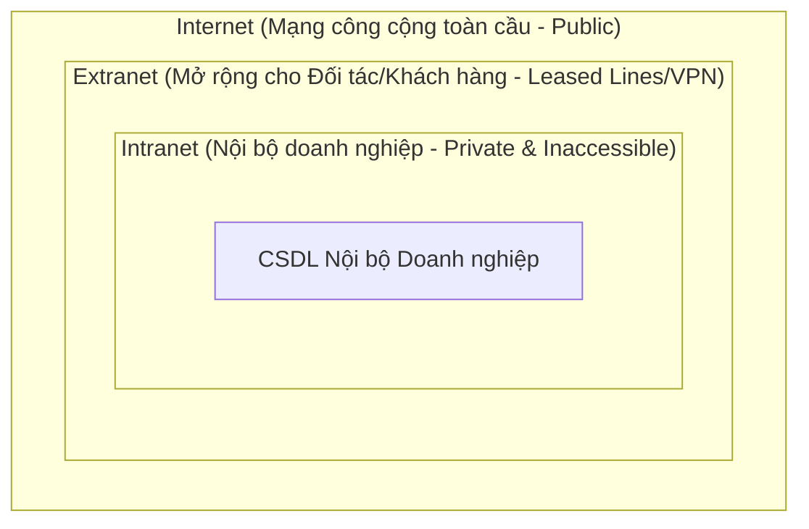

### 1.2.1. Mạng nội bộ (Intranet)
*   **Đặc điểm:** Là mạng lưới kết nối máy tính hoàn toàn khép kín **nội bộ bên trong một tổ chức**.
*   Các tài nguyên và dịch vụ trên mạng Intranet bị hạn chế nghiêm ngặt, hoàn toàn riêng tư và không thể truy cập từ môi trường Internet công cộng bên ngoài.
*   *Ví dụ:* Mạng lưới máy tính nội bộ của một Ngân hàng dùng để kết nối các máy chủ lưu dữ liệu tài khoản giao dịch.

### 1.2.2. Mạng mở rộng đối tác (Extranet)
*   **Đặc điểm:** Là phần mở rộng có kiểm soát của Intranet, cho phép những **đối tác liên kết, khách hàng hoặc nhà cung cấp bên ngoài** có thẩm quyền được kết nối vào hệ thống.
*   Đường kết nối thường sử dụng các đường truyền chuyên dụng (Leased Lines) hoặc thiết lập mạng ảo bảo mật VPN.
*   *Ví dụ:* Một ngân hàng thiết lập đường kết nối an toàn cho các cổng thanh toán/đối tác merchant kết nối trực tiếp để kiểm tra số dư và thực hiện giao dịch.

### 1.2.3. Mạng công cộng toàn cầu (Internet)
*   **Đặc điểm:** Là mạng lưới máy tính công cộng khổng lồ kết nối hàng tỷ thiết bị trên toàn thế giới. Bất kỳ ai cũng có thể truy cập các dịch vụ công khai trên Internet.
*   *Ví dụ:* Các ứng dụng công cộng phổ biến như Gmail, Youtube, Facebook,...

---

## 1.3. Mô hình tham chiếu OSI và TCP/IP (OSI vs TCP/IP Model)
Để các thiết bị phần cứng và phần mềm của các hãng sản xuất khác nhau có thể truyền dữ liệu tương thích, thế giới sử dụng các mô hình phân lớp tiêu chuẩn:

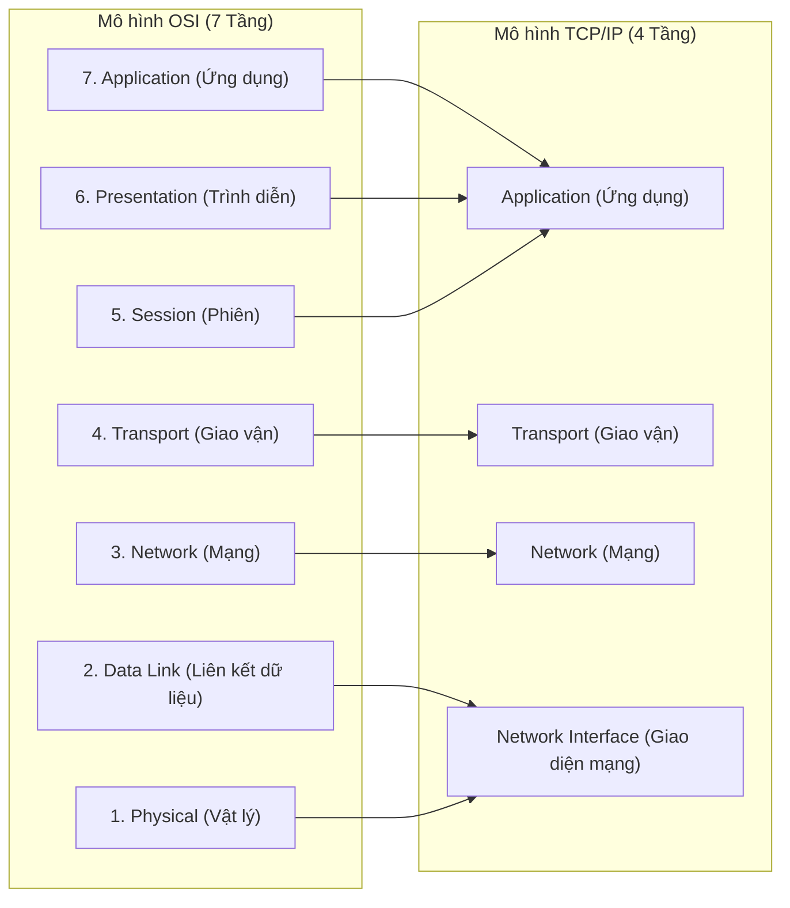

### Chi tiết 7 tầng của mô hình OSI (Open Systems Interconnection)

| STT | Tầng (Layer) | Chức năng cốt lõi | Đơn vị dữ liệu (PDU) | Giao thức phổ biến |
| :---: | :--- | :--- | :---: | :--- |
| **7** | **Application** (Ứng dụng) | Giao tiếp trực tiếp với người dùng và ứng dụng phần mềm. | **Data** | HTTP, HTTPS, DNS, FTP, SMTP |
| **6** | **Presentation** (Trình diễn) | Định dạng, mã hóa thiết lập dạng dữ liệu, nén và mã hóa bảo mật dữ liệu. | **Data** | SSL, TLS, ASCII, JPEG |
| **5** | **Session** (Phiên) | Thiết lập, quản lý và kết thúc các phiên hội thoại giữa các ứng dụng. | **Data** | NetBIOS, RPC, SOCKS |
| **4** | **Transport** (Giao vận) | Truyền tải dữ liệu tin cậy giữa các tiến trình (End-to-End). Kiểm soát luồng. | **Segment** (TCP) / **Datagram** (UDP) | TCP, UDP |
| **3** | **Network** (Mạng) | Định tuyến đường đi của gói tin giữa các mạng khác nhau bằng địa chỉ logic. | **Packet** | IP (IPv4, IPv6), ICMP, OSPF |
| **2** | **Data Link** (Liên kết) | Truyền tải dữ liệu vật lý giữa các nút lân cận trên cùng mạng. Phát hiện lỗi. | **Frame** | Ethernet, Wi-Fi, ARP, PPP |
| **1** | **Physical** (Vật lý) | Chuyển đổi dữ liệu thành các tín hiệu vật lý để truyền qua dây cáp, sóng vô tuyến. | **Bit** | Cáp mạng, Hub, tín hiệu điện |

### 1.3.1. Phân tích chi tiết các tầng trong mô hình OSI

#### 1. Tầng Vật lý (Physical Layer)
*   **Chức năng:** Chuyển đổi dữ liệu từ dạng các **bit kỹ thuật số (digital bits) thành các tín hiệu vật lý** (tín hiệu điện, sóng vô tuyến, hoặc tín hiệu quang học) để thiết lập và duy trì kết nối vật lý thực tế giữa các thiết bị phần cứng.
*   **Đơn vị dữ liệu:** Bit.

#### 2. Tầng Liên kết dữ liệu (Data Link Layer)
*   **Chức năng:** Chịu trách nhiệm truyền dữ liệu trực tiếp giữa các thiết bị **(host-to-host) nằm trong cùng một mạng nội bộ (LAN)**.
*   Thực hiện cơ chế phát hiện lỗi và sửa lỗi truyền dẫn ở mức vật lý.
*   **Định danh định vị:** Địa chỉ **MAC (Media Access Control)**.
*   **Giao thức tiêu biểu:** Ethernet, Wi-Fi, PPP.

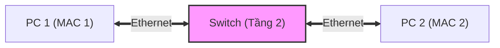

#### 3. Tầng Mạng (Network Layer)
*   **Chức năng:** Định tuyến đường đi và truyền các dòng dữ liệu từ **một host thuộc mạng này sang một host thuộc mạng hoàn toàn khác** (Liên mạng).
*   **Đặc tính không tin cậy (Unreliable):** Tầng Mạng không tự đảm bảo tính tin cậy của đường truyền, bao gồm:
    *   Việc phân phát thành công gói tin (Delivery of packets).
    *   Thứ tự tuần tự trước sau của gói tin (In-order packets).
    *   Tính toàn vẹn không lỗi của dữ liệu (Integrity of data).
    *   *Lưu ý:* Việc đảm bảo tính tin cậy này sẽ được ủy quyền cho tầng phía trên (Transport Layer - TCP) xử lý.
*   **Định danh định vị:** Địa chỉ **IP Address**.
*   **Giao thức tiêu biểu:** IP.

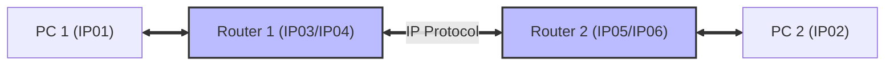

#### 4. Tầng Giao vận (Transport Layer)
*   **Chức năng:** Truyền tải dữ liệu giữa **các tiến trình/ứng dụng (applications/processes)** đang chạy trên các host khác nhau.
*   Cung cấp dịch vụ truyền dữ liệu **tin cậy (reliable data transfer)** lên các tầng phía trên thông qua các cơ chế:
    *   **Kiểm soát luồng (Flow Control):** Điều phối tốc độ truyền tránh gây tràn bộ đệm bên nhận.
    *   **Phân đoạn (Segmentation):** Chia nhỏ dữ liệu lớn thành các Segment/Datagram nhỏ và lắp ráp lại ở bên nhận.
    *   **Kiểm soát lỗi (Error Control):** Kiểm tra checksum và yêu cầu gửi lại các gói bị mất.
*   **Định danh định vị:** Số hiệu cổng **Port**. Do trên một Hệ điều hành (OS) có thể có nhiều tiến trình chạy song song cùng trao đổi dữ liệu, số hiệu Port được dùng để phân biệt chính xác tiến trình đích.
*   **Giao thức tiêu biểu:** TCP, UDP.

#### 5. Tầng Phiên (Session Layer)
*   **Chức năng:** Quản lý và duy trì việc gửi và nhận dữ liệu đồng thời (Sending and receiving data at the same time - Duplex) giữa hai thiết bị.
*   Thiết lập các quy trình để thực hiện **kiểm tra (checksum), tạm dừng (suspending), khởi động lại (restarting), và chấm dứt phiên làm việc (terminating a session)**.
*   **Định danh định vị:** Địa chỉ kết nối mạng **Socket**.

#### 6. Tầng Trình diễn (Presentation Layer)
*   **Chức năng:** Chuyển đổi dữ liệu sang định dạng mà ứng dụng ở hai đầu có thể hiểu được (Converting data into a format that applications can understand).
*   Thực hiện các nhiệm vụ nén dữ liệu, định dạng hiển thị và mã hóa/giải mã bảo mật (Encryption/Decryption): **TLS/SSL**.

#### 7. Tầng Ứng dụng (Application Layer)
*   **Chức năng:** Cung cấp các chức năng dịch vụ ứng dụng trực tiếp cho người dùng (Providing application functions for users).
*   **Giao thức tiêu biểu:** **HTTP, FTP, DNS, SMTP, Telnet, ...**

#### 💡 Cơ chế phân đoạn dữ liệu (Data Segmentation)
*   **Vấn đề:** Dữ liệu mà các ứng dụng cần truyền tải thường rất lớn, cực kỳ khó và không tối ưu nếu gửi trực tiếp cả một khối nguyên vẹn.
*   **Giải pháp:** **Gói dữ liệu bắt buộc phải được chia thành các khối nhỏ (divided into blocks)**. Bằng cách này, nếu có một khối bị mất hoặc bị hỏng trên đường truyền, hệ thống chỉ cần gửi lại duy nhất khối bị lỗi đó thay vì phải truyền tải lại toàn bộ gói tin khổng lồ từ đầu.
*   **Định danh để thiết lập một Socket:** Để thiết lập một phiên truyền nhận dữ liệu độc nhất giữa hai tiến trình, hệ thống cần 5 thông tin nhận diện (5-tuple):
    1.  **Source IP** (Địa chỉ IP nguồn)
    2.  **Source Port** (Cổng nguồn)
    3.  **Destination IP** (Địa chỉ IP đích)
    4.  **Destination Port** (Cổng đích)
    5.  **Transport Protocol** (Giao thức truyền vận: TCP hoặc UDP)

---

## 1.4. Đóng gói dữ liệu (Encapsulation)

Quá trình dữ liệu đi từ tầng trên cùng xuống tầng vật lý gọi là **Đóng gói dữ liệu (Encapsulation)**. Ngược lại, khi thiết bị nhận nhận được luồng bit vật lý và xử lý ngược lên các tầng ứng dụng gọi là **Giải đóng gói (De-encapsulation)**.

```
[Tầng 7, 6] Ứng dụng / Trình diễn           |              Dữ liệu (Data)              |
                                            v
[Tầng 5] Phiên (Session)           | HTTP Hdr |              Dữ liệu (Data)              |
                                            v
[Tầng 4] Giao vận (Transport)      | TCP/UDP Hdr | HTTP Hdr |         Dữ liệu (Data)         | -> Segment / Datagram
                                            v
[Tầng 3] Mạng (Network)            |  IP Hdr  | TCP Hdr | HTTP Hdr |       Dữ liệu       | -> Packet / Datagram
                                            v
[Tầng 2] Liên kết (Data Link)      | MAC Hdr  |  IP Hdr  | TCP Hdr | HTTP Hdr | Dữ liệu | -> Frame
                                            v
[Tầng 1] Vật lý (Physical)         | 1001011101010101... Tín hiệu vật lý (Cáp/Sóng)       | -> Bit Stream
```

### 1.4.1. Nguyên tắc đóng gói
*   **Thêm Header giao thức:** Mỗi tầng khi nhận dữ liệu từ tầng trên sẽ bổ sung thêm phần thông tin tiêu đề (Protocol Header) chứa các thông số định tuyến và kiểm soát lỗi của riêng tầng đó.
*   **Đơn vị dữ liệu (PDU):** Mỗi tầng sở hữu một đơn vị dữ liệu đặc trưng riêng biệt (Data, Segment, Packet, Frame, Bit).

### 1.4.2. Khái niệm đơn vị truyền tải tối đa MTU (Maximum Transmission Unit)
*   **MTU** là kích thước tối đa của một đơn vị dữ liệu (thường là Frame ở tầng Data Link) có thể truyền trên đường truyền vật lý mà không bị phân mảnh. Theo tiêu chuẩn Ethernet, giá trị MTU mặc định là **1500 Bytes**.
*   **Sự đánh đổi: MTU vs Throughput (Băng thông thực tế)**
    *   *MTU Lớn:* Tối ưu hóa băng thông thực tế (High Throughput) do tỷ lệ dữ liệu hữu ích cao hơn so với tổng dung lượng gói tin (giảm thiểu chi phí overhead của Header). Tuy nhiên, nếu xảy ra lỗi/mất gói tin trên đường truyền, chi phí và thời gian để gửi lại một Frame lớn sẽ rất cao, gây trễ đường truyền.
    *   *MTU Nhỏ:* Giảm trễ và phục hồi nhanh sau lỗi, nhưng làm phình to overhead và giảm Throughput do phải đính kèm quá nhiều Header trên lượng dữ liệu nhỏ.

---

# 2. Các giao thức cốt lõi cho Backend Developer (Core Protocols)

## 2.1. Giao thức Transport Layer: TCP vs UDP

### 2.1.1. So sánh tổng quan

| Đặc tính | TCP (Transmission Control Protocol) | UDP (User Datagram Protocol) |
| :--- | :--- | :--- |
| **Cơ chế kết nối** | Có hướng kết nối (Connection-Oriented). Bắt buộc thiết lập kết nối trước khi truyền. | Không hướng kết nối (Connectionless). Gửi dữ liệu trực tiếp không cần chuẩn bị. |
| **Kiểm tra & Kiểm soát lỗi**| Rất mạnh mẽ: Có kiểm soát luồng (Flow Control), phản hồi xác nhận (ACK). | Cơ bản: Chỉ sử dụng checksum để kiểm tra lỗi bit. |
| **Cơ chế truyền lại** | Có (Retransmission). Tự động truyền lại gói bị mất. | Không. Gói tin mất sẽ bị bỏ qua. |
| **Đánh thứ tự (Sequence)** | Có (Sequence Number). Sắp xếp đúng thứ tự dữ liệu bên nhận. | Không. Các gói tin có thể đến lộn xộn. |
| **Kích thước Header** | Lớn (20 - 60 Bytes). | Rất nhỏ (Cố định 8 Bytes). |
| **Tính năng Quảng bá (Broadcasting)** | Không hỗ trợ. | Có hỗ trợ (Truyền gói tin đến toàn bộ thiết bị trong mạng). |
| **Tốc độ truyền** | Chậm hơn (Slower). Do tốn hao phí thiết lập, truyền lại và ACK. | Rất nhanh (Faster). Không tốn hao phí kiểm soát. |
| **Độ tin cậy** | Có (Reliable). | Không (Unreliable). |
| **Ứng dụng tiêu biểu** | Web (HTTP/HTTPS), Email (SMTP), File transfer (FTP), kết nối Database. | VoIP, truyền phát video (Streaming), DNS, Game thời gian thực. |

---

### 2.1.2. Luồng thiết lập kết nối TCP: Bắt tay 3 bước (TCP 3-way Handshake)
Trước khi truyền tải bất kỳ dữ liệu HTTP nào, Client và Server phải thực hiện quy trình bắt tay 3 bước sau:

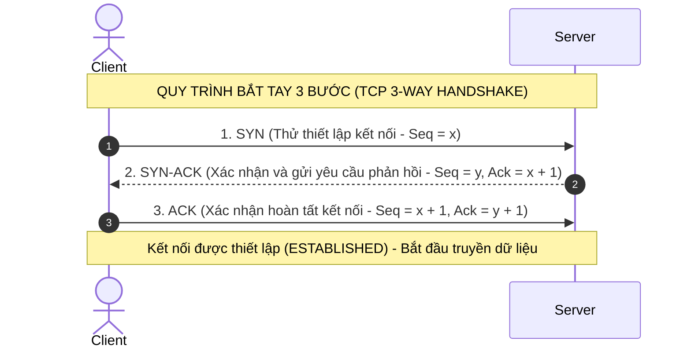

---

## 2.2. Giao thức Network Layer: IP (IPv4 vs IPv6)

### 2.2.1. Bản chất của giao thức IP
*   **Vai trò:** Giao thức IP chịu trách nhiệm truyền thông tin (packets) giữa hai thiết bị **không kết nối trực tiếp vật lý** với nhau.
*   *Ví dụ trực quan:* Hành trình vận chuyển một người từ Lạng Sơn đến TP. Hồ Chí Minh:
    $$\text{Lạng Sơn} \xrightarrow{\text{Tàu hỏa (Data Link Layer)}} \text{Sân bay Nội Bài} \xrightarrow{\text{Máy bay (Data Link Layer)}} \text{TP. Hồ Chí Minh}$$
    *   Các chặng giao thông cụ thể (Tàu hỏa, máy bay) giống như **Data Link Layer** (truyền nút kề nút trong cùng một mạng LAN).
    *   Việc điều phối, lên lịch trình toàn bộ hành trình đi qua các chặng trung gian từ điểm bắt đầu (Lạng Sơn) đến điểm kết thúc (TP. HCM) chính là vai trò định tuyến của **Network Layer (IP)**.
*   **Gán IP:** Địa chỉ IP được gán cho card mạng (NIC) của thiết bị. Một thiết bị/máy chủ có thể sở hữu nhiều địa chỉ IP khác nhau cùng lúc.

---

### 2.2.2. Phân biệt IPv4 và IPv6

*   **IPv4 (Internet Protocol version 4):**
    *   Sử dụng **32-bit** chia làm 4 nhóm, ngăn cách bởi dấu chấm `.` (ví dụ: `192.168.0.1`).
    *   Giới hạn tổng cộng khoảng **4.3 tỷ** địa chỉ IP trên toàn cầu.
    *   *Vấn đề:* Hiện nay số lượng thiết bị kết nối tăng chóng mặt dẫn đến cạn kiệt địa chỉ IPv4.
*   **IPv6 (Internet Protocol version 6):**
    *   Sử dụng **128-bit** viết dưới dạng hệ cơ số 16 Hexadecimal, ngăn cách bởi dấu hai chấm `:` (ví dụ: `2001:db8::ff00:42:8329`).
    *   Cung cấp số lượng địa chỉ khổng lồ ($3.4 \times 10^{38}$), giải quyết triệt để vấn đề cạn kiệt.

---

### 2.2.3. Phân biệt IP Công cộng (Public IP) và IP Nội bộ (Private IP)

| Đặc tính | IP Công cộng (Public IP) | IP Nội bộ (Private IP) |
| :--- | :--- | :--- |
| **Tính độc nhất** | **Độc nhất toàn cầu**. Không bao giờ trùng lặp trên mạng Internet. | Chỉ độc nhất trong **phạm vi một mạng LAN**. Có thể trùng lặp ở các mạng LAN khác nhau. |
| **Quyền quản lý** | Được cấp phát và quản lý bởi nhà cung cấp dịch vụ mạng (ISP). | Do quản trị viên mạng nội bộ tự cấu hình cấp phát. |
| **Khả năng định tuyến**| Được phép định tuyến trực tiếp trên mạng Internet toàn cầu. | Không thể định tuyến trên Internet. Bị các Router công cộng chặn lại. |
| **Dải IP tiêu chuẩn (RFC 1918)** | Tất cả các dải IP nằm ngoài dải Private IP. | • `192.168.x.x` (ví dụ: `192.168.0.0/16`) <br> • `172.16.x.x` $\rightarrow$ `172.31.x.x` <br> • `10.x.x.x` |

---

### 2.2.4. Công nghệ cứu rỗi IPv4: NAT Overload (PAT)
*   **NAT Overload (Port Address Translation - PAT):** Là giải pháp cấu hình trên Router để cho phép nhiều thiết bị nội bộ (sở hữu các Private IP khác nhau) có thể cùng truy cập mạng Internet thông qua **một địa chỉ Public IP duy nhất**.
*   **Cơ chế hoạt động:** Router Gateway sẽ gán nhãn các yêu cầu đi ra ngoài bằng cách thay đổi số hiệu cổng (Port Number) động. Khi dữ liệu phản hồi quay lại, Router sẽ dựa vào bảng ánh xạ Port này để chuyển tiếp chính xác về máy khách Private IP trong mạng LAN.

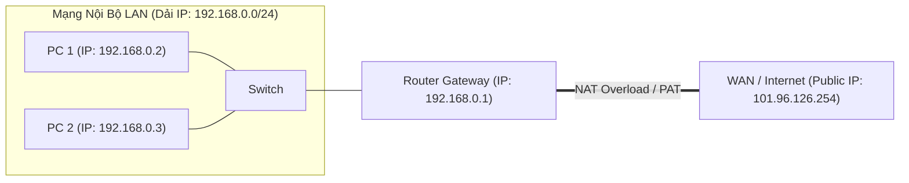

---

### 2.2.5. Phân lớp địa chỉ IP truyền thống (Classful IP Addressing)

Trong thời kỳ đầu của Internet, địa chỉ IPv4 được phân chia thành các lớp cố định (Class A, B, C, D, E). Mỗi địa chỉ IP 32-bit được chia làm 2 phần: **Network ID** và **Host ID**.
*   *Ví dụ ví von:* **Network ID** giống như một **Phòng ban (Department)** trong công ty, còn **Host ID** giống như các **Nhân viên (Employee)** làm việc trong phòng ban đó.

| Lớp IP | Bit bắt đầu | Độ dài Network ID | Độ dài Host ID | Mục đích / Quy mô sử dụng |
| :--- | :--- | :--- | :--- | :--- |
| **Class A** | `0` | 8 bits | 24 bits | Dành cho mạng quy mô cực lớn (tối đa ~16.7 triệu hosts). |
| **Class B** | `10` | 16 bits | 16 bits | Dành cho mạng quy mô trung bình-lớn (tối đa 65,534 hosts). |
| **Class C** | `110` | 24 bits | 8 bits | Dành cho mạng quy mô nhỏ (tối đa 254 hosts). |
| **Class D** | `1110` | - | - | Sử dụng cho truyền phát đa hướng (**Multicast**). |
| **Class E** | `1111` | - | - | Dành riêng cho nghiên cứu, phát triển (**Experimental**). |

#### Hạn chế của phân lớp Classful:
*   **Thiếu linh hoạt & Phân bổ không đều (Not flexible, not even distribution):** 
    *   Ví dụ: Một mạng lớp B cung cấp tới ~65k địa chỉ IP. Nếu một tổ chức chỉ cần 1000 IP, họ vẫn phải dùng một khối lớp B $\rightarrow$ Lãng phí hơn 64k địa chỉ IP còn lại.
    *   Ngược lại, mạng lớp C chỉ cho tối đa 254 IP. Nếu một tổ chức cần 300 IP, họ buộc phải xin 2 khối lớp C, gây khó khăn cho việc quản lý bảng định tuyến.
*   **Khó quản lý và định tuyến (Difficult to manage):** Bảng định tuyến trên các Router toàn cầu phình to nhanh chóng do không thể gộp các dải mạng một cách linh hoạt.
*   $$\rightarrow$$ Giải pháp khắc phục triệt để: **Định tuyến không phân lớp (CIDR - Classless Inter-Domain Routing)**.

---

### 2.2.6. Định tuyến không phân lớp (CIDR)

Để giải quyết sự lãng phí địa chỉ IP của phân lớp Classful, CIDR được giới thiệu vào năm 1993, cho phép phân bổ địa chỉ IP với độ dài Network ID linh hoạt thay vì bị giới hạn cứng nhắc ở 8, 16 hay 24 bits.

#### Khái niệm Prefix Length (/x)
*   Trong CIDR, địa chỉ IP đi kèm một ký hiệu `/x` (ví dụ: `/24`), trong đó $x$ là số bit đầu tiên được dùng làm **Network ID**. Các bit còn lại ($32 - x$) sẽ dành cho **Host ID**.
*   **Công thức tính số lượng địa chỉ IP khả dụng cho host:**
    $$\text{Số lượng IP khả dụng} = 2^{(32 - x)} - 2$$
    *   *Ví dụ với dải mạng `192.168.1.0/24`:*
        *   Số lượng IP khả dụng: $2^{(32 - 24)} - 2 = 2^8 - 2 = 254$ hosts.

#### Tại sao phải trừ đi 2?
1.  **Địa chỉ đầu tiên (Network ID):** Dùng để định danh chính dải mạng đó (địa chỉ đại diện mạng). Không thể gán cho bất kỳ thiết bị nào. Trong ví dụ trên là địa chỉ `192.168.1.0`.
2.  **Địa chỉ cuối cùng (Broadcast Address):** Dùng làm địa chỉ quảng bá. Khi gửi một gói tin đến địa chỉ này, mọi thiết bị trong mạng LAN đó đều sẽ nhận được thông tin. Trong ví dụ trên là địa chỉ `192.168.1.255`. Gói tin gửi đến địa chỉ Broadcast sẽ bị Router chặn lại, không cho phép đi sang mạng khác nhằm ngăn ngừa nghẽn mạng diện rộng.

#### Bảng thông tin chi tiết của dải `192.168.1.0/24`:

| Thành phần | Giá trị | Giải thích |
| :--- | :--- | :--- |
| **Network ID** | `192.168.1.0` | Địa chỉ định danh dải mạng. |
| **Prefix Length** | `24` | 24 bit đầu làm Network ID. |
| **Subnet Mask** | `255.255.255.0` | Mặt nạ mạng (tương đương với 24 bit 1 nhị phân). |
| **Địa chỉ IP khả dụng đầu tiên** | `192.168.1.1` | Thường được gán làm cổng kết nối mặc định (Default Gateway). |
| **Địa chỉ IP khả dụng cuối cùng** | `192.168.1.254` | Địa chỉ IP khả dụng cuối cùng cấp cho máy trạm (Host). |
| **Broadcast Address** | `192.168.1.255` | Địa chỉ dùng để gửi gói tin quảng bá trong mạng. |

---

## 2.3. Hệ thống phân giải tên miền (DNS - Domain Name System)
DNS đóng vai trò là "Danh bạ điện thoại" của Internet, chuyển đổi tên miền dễ đọc (như `google.com`) thành địa chỉ IP vật lý của máy chủ.

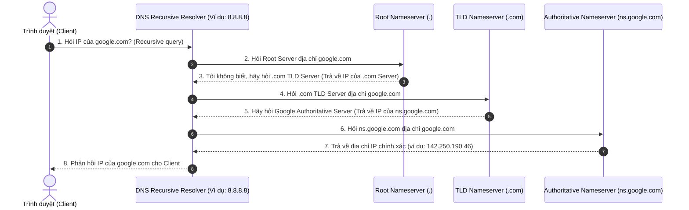

---

## 2.4. Giao thức HTTP/HTTPS và Cơ chế bắt tay bảo mật TLS/SSL

### 2.4.1. Khái niệm HTTP và HTTPS
*   **HTTP (Hypertext Transfer Protocol):** Giao thức phi trạng thái (Stateless) hoạt động ở tầng Application để truyền tải dữ liệu. Dữ liệu truyền đi dưới dạng văn bản thuần túy (Plaintext), dễ bị tấn công nghe lén (Man-in-the-Middle - MITM).
*   **HTTPS (HTTP Secure):** Là HTTP nhưng chạy trên một đường truyền được mã hóa bảo mật thông qua giao thức **TLS/SSL (Transport Layer Security / Secure Sockets Layer)**.

---

### 2.4.2. Chi tiết Quy trình bắt tay TLS/SSL (TLS/SSL Handshake)

Quy trình bắt tay TLS/SSL diễn ra ngay sau khi kết nối TCP Handshake được thiết lập. Mục tiêu là để hai bên xác thực danh tính của Server và thỏa thuận ra một **Session Key (Khóa phiên đối xứng)** dùng chung để mã hóa dữ liệu.

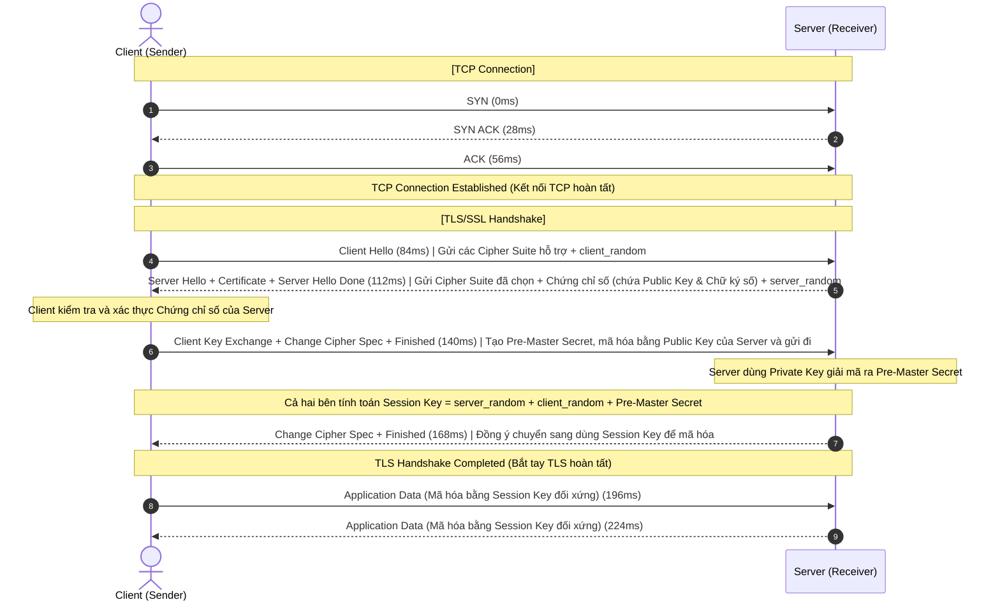

#### Chi tiết các bước thực hiện:
*   **Bước 0: Thiết lập kết nối TCP:** Đi qua quy trình bắt tay 3 bước thông thường (SYN -> SYN-ACK -> ACK) để tạo kết nối tin cậy trước khi bắt đầu TLS Handshake.
*   **Bước 1: Client Hello:** Client gửi thông điệp chào mừng kèm danh sách các thuật toán mã hóa được hỗ trợ (Cipher Suites) và một chuỗi ngẫu nhiên gọi là `client_random`.
*   **Bước 2: Server phản hồi (Server Hello, Certificate, Server Hello Done):**
    *   Server gửi lại thông điệp `Server Hello` chọn thuật toán mã hóa tối ưu nhất mà hai bên cùng hỗ trợ.
    *   Gửi kèm **Chứng chỉ số SSL (SSL Certificate)** chứa khóa công khai (**Public Key**) và chữ ký số xác thực của nhà phát hành chứng chỉ (CA).
    *   Gửi một chuỗi ngẫu nhiên của Server là `server_random`.
*   **Bước 3: Client xác thực chứng chỉ (Verify Certificate):** Client kiểm tra chữ ký số trên chứng chỉ của Server dựa trên danh sách các CA tin cậy được tích hợp sẵn trong hệ điều hành/trình duyệt. Nếu chứng chỉ hợp lệ, Client sẽ tin tưởng Server.
*   **Bước 4: Trao đổi khóa khách (Client Key Exchange):** Client tạo ra một giá trị bí mật ngẫu nhiên thứ ba gọi là **Pre-Master Secret**. Client mã hóa giá trị này bằng **Public Key** của Server (lấy từ chứng chỉ ở Bước 2) và gửi lại cho Server.
*   **Bước 5: Server giải mã (Server Decryption):** Server sử dụng **Private Key** (khóa riêng tư tuyệt mật chỉ Server giữ) để giải mã thông điệp, lấy ra giá trị **Pre-Master Secret**.
*   **Bước 6: Tạo khóa phiên dùng chung (Session Key Generation):** Đến thời điểm này, cả Client và Server đều sở hữu độc quyền 3 giá trị: `client_random`, `server_random`, và `Pre-Master Secret`. Cả hai bên sẽ tự tính toán độc lập để tạo ra cùng một **Khóa phiên (Session Key)** duy nhất.
*   **Bước 7: Change Cipher Spec & Finished:** Hai bên thông báo kết thúc quá trình bắt tay và chuyển hướng sang mã hóa dữ liệu.
*   **Bước 8: Truyền tải dữ liệu:** Mọi dữ liệu ứng dụng truyền đi sau đó sẽ được mã hóa bằng **Session Key** này dưới dạng **mã hóa đối xứng (Symmetric Encryption)** để đảm bảo tốc độ xử lý nhanh nhất.

---

# 3. Dịch vụ mạng & Sơ đồ hạ tầng (Network Services & Topology)

## 3.1. Các dịch vụ mạng cốt lõi (Core Network Services)

Để một hệ thống mạng hoạt động ổn định và an toàn, các thành phần dịch vụ mạng sau đóng vai trò vô cùng quan trọng:

*   **DHCP Server (Dynamic Host Configuration Protocol):** Máy chủ tự động cấp phát và quản lý địa chỉ IP cùng các thiết lập cấu hình mạng khác (như Subnet Mask, Default Gateway, DNS) cho các thiết bị khi chúng kết nối vào mạng nội bộ (LAN). Giúp tránh xung đột IP và tiết kiệm công sức cấu hình thủ công.
*   **DNS Server (Domain Name System):** Hệ thống phân giải tên miền đóng vai trò dịch các địa chỉ tên miền thân thiện, dễ đọc (như `google.com`) thành địa chỉ IP vật lý của máy chủ để các thiết bị định tuyến dữ liệu.
*   **Firewall (Tường lửa):** Thiết bị hoặc phần mềm bảo mật giám sát và lọc lưu lượng mạng đi vào/đi ra (Incoming & Outgoing traffic) dựa trên tập hợp quy tắc bảo mật thiết lập trước (Security Policies) của tổ chức, ngăn chặn truy cập trái phép.
*   **Proxy Server (Máy chủ ủy nhiệm):** Máy chủ trung gian đóng vai trò làm cổng kết nối (Gateway) giữa người dùng (Client) và máy chủ đích. Nó chuyển tiếp các yêu cầu (Requests) và phản hồi (Responses) giữa hai bên, có thể giúp ẩn danh hoặc lưu cache để tăng tốc.
*   **FTP Server (File Transfer Protocol Server):** Máy chủ chuyên dụng hỗ trợ việc tải lên (Upload) và tải xuống (Download) các tệp tin qua mạng sử dụng giao thức truyền file FTP.

---

## 3.2. Sơ đồ hạ tầng mạng doanh nghiệp (Enterprise Network Topology)

Dưới đây là mô hình sơ đồ hạ tầng mạng thực tế của một doanh nghiệp kết nối với đối tác và Internet công cộng:

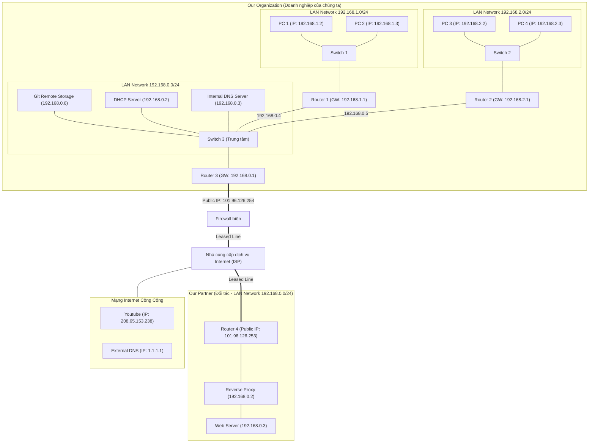

### Phân tích sơ đồ:
1.  **Doanh nghiệp của chúng ta (Our Organization):**
    *   Chia làm các phân vùng mạng (Subnet) khác nhau để tăng tính bảo mật và giảm miền quảng bá (Broadcast Domain):
        *   **LAN 1 (`192.168.1.0/24`)**: Dành cho các máy trạm PC 1 và PC 2, đi qua Gateway Router 1 (`192.168.1.1`).
        *   **LAN 2 (`192.168.2.0/24`)**: Dành cho PC 3 và PC 4, đi qua Gateway Router 2 (`192.168.2.1`).
        *   **Mạng lõi LAN trung tâm (`192.168.0.0/24`)**: Chứa các máy chủ dịch vụ dùng chung như **Git Remote Storage**, **DHCP Server**, và **Internal DNS Server** (để phân giải tên miền nội bộ).
    *   Router biên (Router 3) kết nối mạng nội bộ ra ngoài thông qua địa chỉ Public IP `101.96.126.254`.
    *   Lưu lượng đi qua thiết bị **Firewall** biên để sàng lọc bảo mật trước khi đi qua kênh truyền dẫn riêng biệt tốc độ cao (**Leased Line**) đến nhà mạng ISP.
2.  **Đối tác (Our Partner):**
    *   Kết nối với ISP qua Leased Line. Mạng LAN đối tác (`192.168.0.0/24`) sử dụng **Reverse Proxy** đứng trước để bảo vệ, tiếp nhận các yêu cầu từ ngoài vào rồi mới chuyển tiếp đến **Web Server** thực tế phía sau.
3.  **Internet công cộng:**
    *   Cho phép người dùng và doanh nghiệp truy cập đến các dịch vụ bên ngoài như Youtube (`208.65.153.238`) hay DNS công cộng (`1.1.1.1`).

---

## 3.3. Sơ đồ hạ tầng mạng gia đình (Home Network Topology)

Khác với mô hình doanh nghiệp phức tạp chia tách nhiều thiết bị chuyên dụng, mạng gia đình thường sử dụng một thiết bị "Tất cả trong một" gọi là **Modem/Router gia đình (Home Gateway)**.

### Các chức năng tích hợp của Modem/Router gia đình:
*   **Switch (Bộ chuyển mạch):** Cung cấp các cổng cắm mạng LAN (thường là 4 cổng RJ45) để kết nối trực tiếp các thiết bị trong nhà (PC, Smart TV) bằng dây cáp.
*   **Wireless Access Point (Bộ thu phát Wi-Fi):** Phát sóng vô tuyến không dây để điện thoại, laptop, thiết bị thông minh kết nối vào mạng.
*   **Router (Bộ định tuyến):** Thực hiện định tuyến gói tin giữa mạng LAN gia đình và mạng WAN (Internet của nhà mạng cung cấp).
*   **DHCP Server:** Tự động cấp địa chỉ IP động trong dải nội bộ (ví dụ: `192.168.1.100` đến `192.168.1.200`) cho điện thoại/laptop khi chúng kết nối vào Wi-Fi.
*   **Firewall:** Tích hợp tường lửa cơ bản để chặn các cổng (Ports) không sử dụng, ngăn chặn các cuộc quét IP trái phép từ ngoài Internet vào thiết bị gia đình.
*   **Web Server:** Chạy một máy chủ web siêu nhẹ để cung cấp giao diện quản trị cấu hình (thường truy cập qua IP `192.168.1.1` hoặc `192.168.0.1` bằng trình duyệt) giúp người dùng đổi mật khẩu Wi-Fi, cài đặt mạng.

---

# 4. Thành phần hạ tầng mạng nâng cao (Advanced Network Infrastructure)

## 4.1. Proxy vs Reverse Proxy
*   **Forward Proxy (Proxy xuôi):** Đứng làm trung gian đại diện cho **phía Client**. Giúp che giấu danh tính Client, vượt tường lửa để truy cập Internet.
*   **Reverse Proxy (Proxy ngược):** Đứng làm trung gian bảo vệ và đại diện cho **phía Server**.
    *   *Ứng dụng thực tế:* Định tuyến request (Routing), phân tải luồng (**Load Balancing**), lưu bộ đệm (**Caching** dữ liệu tĩnh), và thực hiện giải mã hóa bảo mật SSL/TLS ngay ở vùng biên nhằm giảm tải trực tiếp cho các máy chủ ứng dụng Backend.
    *   *Ví dụ công nghệ:* Nginx, HAProxy, Traefik.

---

## 4.2. Mạng phân phối nội dung (CDN - Content Delivery Network)
*   **Khái niệm:** Là hệ thống gồm nhiều máy chủ lưu trữ (Edge Servers) được phân bổ tại nhiều vị trí địa lý khác nhau trên thế giới.
*   **Cơ chế hoạt động:** CDN lưu bản sao bộ đệm (Cache) của các tài nguyên tĩnh như hình ảnh, video, tệp CSS/JS. Khi người dùng truy cập, yêu cầu sẽ được định tuyến đến máy chủ CDN gần nhất về mặt địa lý $\rightarrow$ Giảm thiểu tối đa độ trễ (Latency) đường truyền và tiết kiệm băng thông cho máy chủ gốc.

---

# 5. Quy trình truy cập một URL từ Trình duyệt (What happens when you type in a URL?)

Khi bạn nhập một địa chỉ URL vào thanh địa chỉ của trình duyệt (ví dụ: `https://www.example.com/shoes/running-shoes-for-men?color=black&sort=newest`), hệ thống sẽ thực hiện các bước tuần tự sau:

## 5.1. Phân tích cấu trúc URL (URL Parsing)

Trình duyệt sẽ phân tích cú pháp của URL để tách thành các thành phần cụ thể:

```
https://www.domain.com/shoes/running-shoes-for-men?color=black&sort=newest
  |       |       |      |             |                     |
Protocol  |     Domain  TLD        Slug / Path           Parameters
       Subdomain
```

*   **Protocol (Giao thức):** `https://` (xác định sẽ dùng HTTP Secure, giao vận qua cổng 443).
*   **Subdomain (Tên miền phụ):** `www.`
*   **Domain (Tên miền chính):** `domain`
*   **TLD (Top-Level Domain):** `.com` (Tên miền cấp cao nhất).
*   **Subfolder / Path (Thư mục con):** `/shoes`
*   **Slug (Đường dẫn thân thiện):** `/running-shoes-for-men`
*   **Parameters (Tham số truy vấn):** `?color=black&sort=newest`

> [!NOTE]
> Nếu phần đường dẫn dẫn tới tài nguyên bị thiếu (ví dụ bạn chỉ gõ `https://domain.com`), trình duyệt sẽ tự động ngầm định yêu cầu file tài nguyên mặc định của máy chủ là **`index.html`**.

---

## 5.2. Cơ chế tìm kiếm DNS (DNS Lookup)

Để gửi một HTTP Request đến máy chủ, trình duyệt cần biết địa chỉ IP của tên miền. Quá trình tìm kiếm IP (DNS Lookup) được thực hiện theo thứ tự ưu tiên từ gần đến xa như sau:

```
[Browser DNS Cache] -> [OS Hosts File] -> [DNS Resolver (ISP/Public)] -> [DNS Root/TLD/Authoritative Servers]
```

1.  **DNS Cache trong Trình duyệt:** Trình duyệt kiểm tra bộ nhớ đệm của chính nó xem tên miền đã được phân giải sang IP gần đây chưa.
2.  **Tệp Hosts của Hệ điều hành (OS Hosts file):** Nếu trình duyệt không có cache, nó yêu cầu hệ điều hành kiểm tra file cấu hình tĩnh cục bộ (ví dụ: `C:\Windows\System32\drivers\etc\hosts` trên Windows hoặc `/etc/hosts` trên Linux/macOS). Nếu tên miền được cấu hình tĩnh tại đây, hệ điều hành trả về IP ngay lập tức mà không cần truy vấn ra ngoài Internet.
3.  **DNS Server / Resolver:** Nếu cả hai bước trên đều không tìm thấy, hệ thống sẽ gửi truy vấn đệ quy (**Recursive Query**) ra ngoài mạng tới máy chủ DNS Resolver (thường do ISP cung cấp hoặc các DNS công cộng như `8.8.8.8`, `1.1.1.1`).

### Sơ đồ Quy trình Phân giải DNS đầy đủ và Truy vấn trang Web (10 bước):

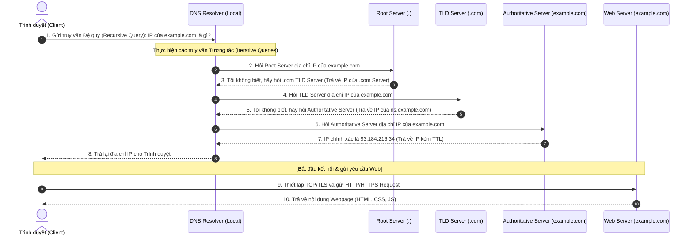

#### Mô tả chi tiết tiến trình phân giải DNS:
*   **Truy vấn Đệ quy (Recursive Query) (Bước 1 & 8):** Trình duyệt yêu cầu DNS Resolver trả về kết quả cuối cùng (hoặc IP chính xác, hoặc báo lỗi không tìm thấy). Browser không cần tham gia vào quá trình đi hỏi từng Server khác.
*   **Truy vấn Tương tác (Iterative Query) (Bước 2 đến 7):** DNS Resolver tự mình đóng vai trò thám tử đi hỏi lần lượt từng cấp máy chủ:
    *   **Root Server (`.`):** Định hướng dải tên miền cấp cao nhất (TLD).
    *   **TLD Server (`.com`, `.net`, `.vn`):** Định hướng máy chủ quản lý trực tiếp tên miền đó (Authoritative Server).
    *   **Authoritative Nameserver:** Máy chủ DNS cuối cùng giữ hồ sơ cấu hình DNS gốc của tên miền (ví dụ bản ghi A Record). Trả về địa chỉ IP chính xác cho Resolver kèm chỉ số **TTL (Time to Live)** xác định thời gian lưu trữ cache hợp lệ.

---

## 5.3. Chọn địa chỉ IP nguồn và Tuyến đường (Source IP & Route Selection)

Sau khi có được địa chỉ IP đích của máy chủ từ DNS, thiết bị Client phải xác định xem gói tin sẽ được gửi đi qua ngõ nào và dùng IP nguồn nào nếu thiết bị sở hữu nhiều card mạng/cổng kết nối (ví dụ: cắm cả mạng dây Ethernet lẫn bật Wi-Fi).

*   **Bảng định tuyến của Kernel (Kernel Routing Table):** Hệ điều hành duy trì một bảng định tuyến động (tra cứu qua lệnh `route -Cn` hoặc `ip route show` trên Linux/macOS, hoặc `route print` trên Windows).
*   **Cơ chế lựa chọn:**
    1.  Hệ điều hành so sánh địa chỉ IP đích với các quy tắc trong bảng định tuyến mạng để tìm kiếm card mạng vật lý thích hợp nhất (ví dụ: interface Wi-Fi `wlan0` hoặc interface Ethernet `eth0`).
    2.  Khi đã chọn được interface mạng vật lý gửi đi, hệ điều hành sẽ **chọn địa chỉ IP được gán cho interface đó làm địa chỉ IP nguồn (Source IP)** của gói tin.
    3.  Đồng thời, xác định địa chỉ IP của Router Gateway trung gian đầu tiên cần chuyển tiếp gói tin tới.

---

## 5.4. Đóng gói dữ liệu qua Chồng Giao thức (Protocol Stack & Encapsulation)

Để chuẩn bị truyền tải gói tin đi trên đường truyền vật lý, dữ liệu đi từ tầng ứng dụng xuống dưới sẽ trải qua quá trình **Đóng gói (Encapsulation)**, tại mỗi tầng dữ liệu sẽ được phân cắt nhỏ hơn (split into blocks/unit length) và gắn thêm các Header kiểm soát:

```
[Tầng 7, 6, 5: App/Presentation/Session]           |              Data              |
                                                          v
[Tầng 4: Transport Layer]                 | Source Port | Dest Port | Seq Num | Data | -> TCP Segment
                                                          v
[Tầng 3: Network Layer]                   | Source IP | Dest IP | TCP Header | Data | -> IP Datagram / Packet
                                                          v
[Tầng 2: Data Link Layer]    | Source MAC | Dest MAC | Frame Ctrl | IP Hdr | TCP Hdr | Data | -> Frame
                                                          v
[Tầng 1: Physical Layer]      | 1010010111... Tín hiệu điện/quang/sóng vô tuyến | -> Bit Stream
```

*   **Tại Tầng 4 (Transport Layer):** Dữ liệu được chia nhỏ thành các Block. Gắn thêm **Source Port**, **Destination Port**, và số thứ tự **Sequence Number** để đầu nhận lắp ghép đúng thứ tự. Tạo thành một **Segment**.
*   **Tại Tầng 3 (Network Layer):** Gắn thêm **Source IP**, **Destination IP** để định vị nguồn/đích toàn trình trên Internet. Tạo thành một **Datagram / Packet**.
*   **Tại Tầng 2 (Data Link Layer):** Gắn thêm địa chỉ vật lý nguồn **Source MAC** (của máy Client) và **Destination MAC** (của Router Gateway kế cận). Tạo thành một **Frame**.
*   **Tại Tầng 1 (Physical Layer):** Chuyển đổi toàn bộ Frame thành luồng tín hiệu nhị phân (Bit Stream `101010...`) để phát đi qua cáp quang, cáp đồng hoặc sóng vô tuyến.

---

## 5.5. Định tuyến qua các Routers (Routing)

Internet bản chất không phải là một đường kết nối trực tiếp đơn lẻ, mà là một mạng lưới khổng lồ gồm vô vàn các **Router** liên kết với nhau trên nhiều vùng địa lý (Regions).

*   **Chuyển tiếp chặng kế tiếp (Hop-by-hop forwarding):** Khi một Router nhận được gói tin, nó sẽ bóc tách phần Header tầng 2 để đọc địa chỉ IP đích ở tầng 3.
*   **Quyết định định tuyến (Routing Decisions):**
    *   Mỗi Router đều sở hữu một **Bảng định tuyến (Routing Table)** được xây dựng và cập nhật liên tục thông qua các giao thức định tuyến (Routing Protocols như OSPF, BGP, RIP).
    *   Router tra cứu bảng định tuyến để tìm ra tuyến đường ngắn nhất/tối ưu nhất để chuyển tiếp gói tin đến Router tiếp theo trong khu vực.
    *   Quá trình này lặp lại qua nhiều Router trung gian cho tới khi gói tin cập bến máy chủ đích.

---

## 5.6. Bắt tay TCP 3 bước (TCP 3-Way Handshake)

Khi gói tin đầu tiên tìm được đường đến Server, trước khi truyền nhận dữ liệu HTTP/HTTPS thực tế, Client và Server sẽ tiến hành quy trình bắt tay 3 bước để thiết lập một phiên truyền vận tin cậy.

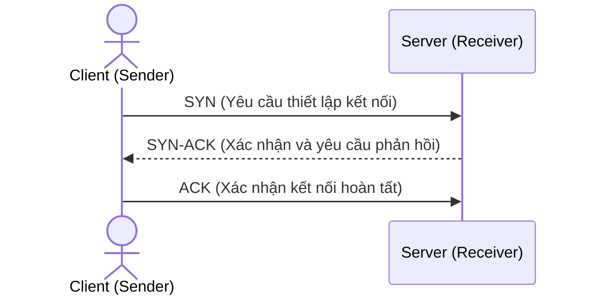

Quy trình bắt tay này đảm bảo cả hai thiết bị đều sẵn sàng gửi/nhận dữ liệu và thống nhất được các tham số truyền tải.

---

# Tóm tắt & Bài tập về nhà (Recap & Homework)

### Tóm tắt cốt lõi (Recap)
*   **Mô hình OSI & TCP/IP:** Phân biệt rõ chức năng của các tầng, đặc biệt là tầng mạng (Network - giao thức IP định tuyến gói tin) và tầng giao vận (Transport - giao thức TCP/UDP truyền dữ liệu giữa các tiến trình ứng dụng).
*   **Phân chia IP (Classful vs CIDR):** CIDR khắc phục nhược điểm lãng phí IP của phân lớp Classful nhờ Prefix Length `/x`. Một dải mạng luôn trừ đi 2 địa chỉ: địa chỉ mạng (Network ID) và địa chỉ quảng bá (Broadcast Address).
*   **Bắt tay TCP & TLS:** Trước khi truyền HTTPS, Client và Server phải thực hiện bắt tay 3 bước TCP để tạo kết nối tin cậy, sau đó thực hiện TLS/SSL Handshake để xác thực chứng chỉ số (Certificate) và thỏa thuận khóa phiên chung (**Session Key** đối xứng).
*   **Dịch vụ & Sơ đồ hạ tầng:** DHCP tự động cấp IP; DNS phân giải tên miền; Firewall bảo mật; Proxy chuyển tiếp. Mạng gia đình tích hợp tất cả chức năng này vào một Modem duy nhất, trong khi mạng doanh nghiệp chia tách thành các phân vùng LAN/Subnet chuyên dụng.
*   **Quy trình truy cập URL:** Trình duyệt phân tách URL (Protocol, Domain, Path, Query), tìm kiếm IP qua DNS Cache hoặc file **Hosts** cục bộ trước khi thực hiện quy trình phân giải DNS 10 bước qua các tầng máy chủ Root, TLD, và Authoritative.

### Bài tập về nhà (Homework)
*   **Yêu cầu:** Viết một đoạn mã script nhỏ bằng ngôn ngữ lập trình tự chọn thực hiện một HTTP Request lên một trang web bất kỳ.
*   **Yêu cầu phân tích:**
    1.  Hãy chạy công cụ phân tích gói tin **Wireshark** trên máy tính của bạn trước khi chạy script.
    2.  Bắt các gói tin liên quan đến địa chỉ IP của trang web bạn gọi.
    3.  Chụp ảnh hoặc trích xuất log chứng minh sự tồn tại của 3 tiến trình mạng đã học:
        *   Tìm gói tin truy vấn phân giải tên miền **DNS** của domain đó.
        *   Tìm 3 gói tin tương ứng với quy trình bắt tay **TCP 3-way Handshake (SYN -> SYN-ACK -> ACK)**.
        *   Tìm các gói tin bắt tay bảo mật **TLS Client Hello / Server Hello** chứng minh đường truyền HTTPS đã thiết lập thành công.

**Cảm ơn bạn! (Thank you)**
