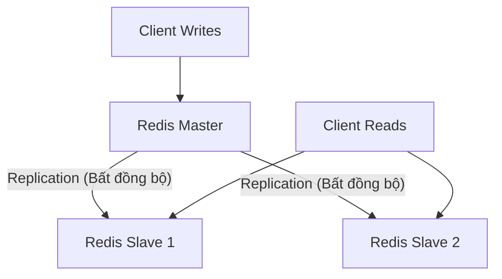
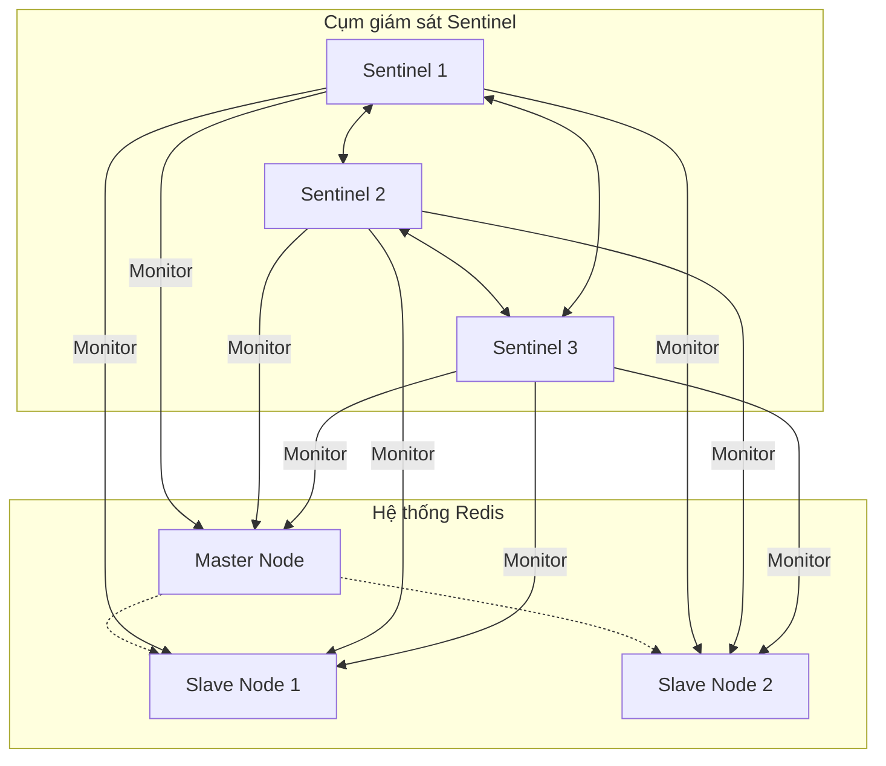
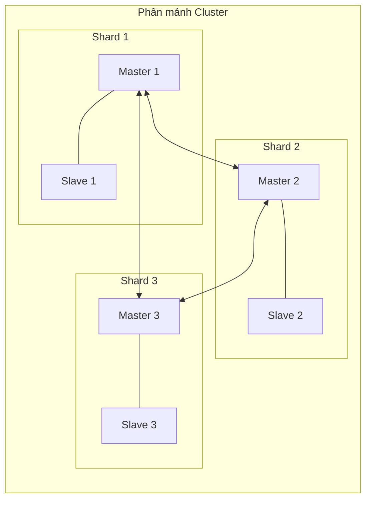

# Tài liệu Redis: Khái niệm cơ bản, Kiến trúc & Thực hành thiết kế hệ thống

> *“It does not matter how slowly you go as long as you do not stop.”*  
> — **Confucius (Khổng Tử)**

<details open>
<summary><b>Mục lục (Table of Contents)</b></summary>

- [1. Giới thiệu về Redis (Introduction)](#1-giới-thiệu-về-redis-introduction)
  - [1.1. Định nghĩa (Definition)](#11-định-nghĩa-definition)
  - [1.2. So sánh chi tiết Redis vs Memcached (Redis vs Memcached)](#12-so-sánh-chi-tiết-redis-vs-memcached-redis-vs-memcached)
  - [1.3. Các mô hình kiến trúc Redis (Architecture Modes)](#13-các-mô-hình-kiến-trúc-redis-architecture-modes)
    - [1.3.1. Mô hình Chủ - Tớ (Master-Slave Architecture)](#131-mô-hình-chủ---tớ-master-slave-architecture)
    - [1.3.2. Mô hình giám sát: Redis Sentinel](#132-mô-hình-giám-sát-redis-sentinel)
    - [1.3.3. Mô hình phân tán: Redis Cluster (Khuyến nghị)](#133-mô-hình-phân-tán-redis-cluster-khuyến-nghị)
- [2. Cơ chế hoạt động của Redis (How Redis Works?)](#2-cơ-chế-hoạt-động-của-redis-how-redis-works)
  - [2.1. Tại sao Redis lại nhanh? (Why is Redis So Fast?)](#21-tại-sao-redis-lại-nhanh-why-is-redis-so-fast)
    - [2.1.1. Điểm nghẽn hiệu năng của Redis (Redis Bottleneck)](#211-điểm-nghẽn-hiệu-năng-của-redis-redis-bottleneck)
    - [2.1.2. Yếu tố cốt lõi giúp Redis đạt tốc độ cao](#212-yếu-tố-cốt-lõi-giúp-redis-đạt-tốc-độ-cao)
    - [2.1.3. Lưu ý quan trọng về Thread Model của Redis](#213-lưu-ý-quan-trọng-về-thread-model-của-redis)
  - [2.2. Cách thức Redis lưu trữ dữ liệu (How Redis Stores Data?)](#22-cách-thức-redis-lưu-trữ-dữ-liệu-how-redis-stores-data)
  - [2.3. Cơ chế xử lý khóa hết hạn (Expired Deletion)](#23-cơ-chế-xử-lý-khóa-hết-hạn-expired-deletion)
    - [2.3.1. Cách xác định khóa hết hạn](#231-cách-xác-định-khóa-hết-hạn)
    - [2.3.2. Các chiến lược dọn dẹp khóa hết hạn](#232-các-chiến-lược-dọn-dẹp-khóa-hết-hạn)
  - [2.4. Chính sách giải phóng bộ nhớ khi đầy RAM (Memory Eviction)](#24-chính-sách-giải-phóng-bộ-nhớ-khi-đầy-ram-memory-eviction)
  - [2.5. Cơ chế bền vững hóa dữ liệu (Data Persistence)](#25-cơ-chế-bền-vững-hóa-dữ-liệu-data-persistence)
    - [2.5.1. Append Only File (AOF)](#251-append-only-file-aof)
    - [2.5.2. Redis Database Backup (RDB)](#252-redis-database-backup-rdb)
    - [2.5.3. Cơ chế kết hợp (Hybrid Persistence)](#253-cơ-chế-kết-hợp-hybrid-persistence)
- [3. Thực tế triển khai và các mẫu thiết kế (In Practices)](#3-thực-tế-triển-khai-và-các-mẫu-thiết-kế-in-practices)
  - [3.0. Bài toán thực tế: Lựa chọn cấu trúc dữ liệu tối ưu](#30-bài-toán-thực tế-lựa-chọn-cấu-trúc-dữ-liệu-tối-ưu)
  - [3.1. Các cấu trúc dữ liệu trong Redis (Data Structures)](#31-các-cấu-trúc-dữ-liệu-trong-redis-data-structures)
    - [3.1.1. String](#311-string)
    - [3.1.2. List](#312-list)
    - [3.1.3. Hash](#313-hash)
    - [3.1.4. Set](#314-set)
    - [3.1.5. Sorted Set (ZSET)](#315-sorted-set-zset)
  - [3.2. Các bài tập tình huống trong thực tế (Practices)](#32-các-bài-tập-tình-huống-trong-thực-tế-practices)
    - [3.2.1. Xây dựng tác vụ trì hoãn (Delay Task)](#321-xây-dựng-tác-vụ-trì-hoãn-delay-task)
    - [3.2.2. Xử lý khóa quá khổ (Big Keys)](#322-xử-lý-khóa-quá-khổ-big-keys)
    - [3.2.3. Định vị các khóa trên cùng một node trong cụm (Hash Tag)](#323-định-vị-các-khóa-trên-cùng-một-node-trong-cụm-hash-tag)
    - [3.2.4. Triển khai Khóa phân tán (Distributed Locks)](#324-triển-khai-khóa-phân-tán-distributed-locks)
    - [3.2.5. Các thực hành tốt nhất tổng quan (Best Practices)](#325-các-thực-hành-tốt-nhất-tổng-quan-best-practices)
- [4. Tổng kết & Bài tập về nhà (Recap & Homework)](#4-tổng-kết--bài-tập-về-nhà-recap--homework)

</details>

---

# 1. Giới thiệu về Redis (Introduction)

## 1.1. Định nghĩa (Definition)

*   **Redis** là một hệ quản trị cơ sở dữ liệu lưu trữ hoàn toàn trong bộ nhớ RAM (**in-memory database**), mã nguồn mở, hỗ trợ cấu trúc dữ liệu khóa-giá trị (Key-Value) với hiệu năng cực kỳ cao.
*   **Đa dạng cấu trúc dữ liệu:** Hỗ trợ đa dạng kiểu dữ liệu giúp tối ưu cho các kịch bản nghiệp vụ khác nhau (Strings, Hashes, Lists, Sets, Sorted Sets, Bitmaps, HyperLogLogs, Geospatial, Streams).
*   **Các tính năng nâng cao:**
    *   **Giao dịch (Transactions):** Đảm bảo các nhóm lệnh được thực thi an toàn.
    *   **Bền vững hóa dữ liệu (Persistence):** Ghi dữ liệu xuống đĩa cứng để tránh mất dữ liệu khi restart.
    *   **Lua scripts:** Thực thi logic lập trình nguyên tử ngay tại máy chủ Redis.
    *   **Giải pháp cụm đa dạng:** Replication (Master-Slave), Sentinel (Tự động failover), và Cluster (Phân tán ngang).
    *   **Mô hình Publish/Subscribe (Pub/Sub):** Hỗ trợ truyền nhận tin nhắn thời gian thực.
    *   **Cơ chế giải phóng bộ nhớ (Eviction policies):** Tự động dọn dẹp RAM khi đầy.
*   **Trường hợp sử dụng phổ biến (Use cases):** Làm bộ nhớ đệm (caching), cơ sở dữ liệu khóa-giá trị, hàng đợi tin nhắn (message queue), lưu session, lưu bảng xếp hạng (leaderboards), v.v.

---

## 1.2. So sánh chi tiết Redis vs Memcached (Redis vs Memcached)

### Điểm tương đồng (Similarities):
*   Đều lưu trữ dữ liệu trên bộ nhớ RAM (In-memory) và thường dùng làm cache.
*   Có chính sách tự động hết hạn khóa (Expiration policies).
*   Độ trễ xử lý cực thấp, hiệu năng cực cao (High performance).

### Điểm khác biệt (Differences):

| Tiêu chí | Redis | Memcached |
| :--- | :--- | :--- |
| **Mô hình luồng (Thread Model)** | **Đơn luồng (Single-thread)** trên một nhân CPU. Tránh chi phí khóa tranh chấp. | **Đa luồng (Multi-threaded)** trên nhiều nhân CPU. Xử lý tải đồng thời cao tốt hơn. |
| **Độ tối ưu** | Tốt hơn ở **thao tác đọc (read)** và cực kỳ tiết kiệm bộ nhớ. | Tốt hơn ở **thao tác ghi (write)**. |
| **Giới hạn hiệu năng** | Một instance đơn lẻ vượt quá **16 GB** RAM sẽ bị ảnh hưởng hiệu năng (do dọn dẹp và snapshot). | Xử lý mượt mà dung lượng lớn trên một node nhờ thiết kế đa luồng. |
| **Kiểu dữ liệu** | Hỗ trợ nhiều cấu trúc dữ liệu phức tạp (String, List, Hash, Set, ZSet...). | Chỉ hỗ trợ kiểu dữ liệu chuỗi đơn giản (String/Value). |
| **Lưu trữ đĩa (Persistence)** | **Có hỗ trợ** (RDB & AOF). | **Không hỗ trợ** (mất hết khi restart). |
| **Cụm phân tán (Cluster)** | **Hỗ trợ mặc định** (Sentinel, Cluster sharding tự động). | **Không hỗ trợ mặc định** (phải tự sharding ở phía client). |
| **Tính năng mở rộng** | Pub/Sub, Lua Script, Giao dịch (Transaction)... | Không hỗ trợ, chỉ tập trung vào chức năng Caching cơ bản. |

---

## 1.3. Các mô hình kiến trúc Redis (Architecture Modes)

### 1.3.1. Mô hình Chủ - Tớ (Master-Slave Architecture)

*   **Cơ chế hoạt động:** Dữ liệu mới được ghi trực tiếp vào một node Master (Chủ). Node Master này sẽ gửi bản sao của các câu lệnh ghi đó tới các node Replica (Slave / Tớ) một cách **bất đồng bộ (asynchronously)**.



*   **Ưu điểm (Pros):**
    *   Giúp mở rộng khả năng đọc dữ liệu của hệ thống (Scalable for reads) bằng cách hướng các request đọc sang các node Slave.
*   **Nhược điểm (Cons):**
    *   **Bất nhất dữ liệu (Data inconsistency):** Do quá trình nhân bản diễn ra bất đồng bộ, dữ liệu ở các Slave có thể bị lệch pha (trễ) so với Master.
    *   **Lỗi chuyển đổi dự phòng (Failover):** Nếu node Master bị sập, hệ thống không thể tự động thăng cấp Slave lên làm Master mới.

---

### 1.3.2. Mô hình giám sát: Redis Sentinel



*   **Nguyên lý hoạt động:**
    *   Sentinel liên tục giám sát trạng thái của node Master và các node Slave.
    *   Đóng vai trò là **Bộ khám phá dịch vụ (Service Discovery)**: Client sẽ hỏi Sentinel để biết địa chỉ node Master hiện tại.
    *   Khi node Master bị sập, các Sentinel sẽ cùng bầu cử ra 1 node Leader để ra quyết định chọn node Slave nào lên làm Master mới, đồng thời cấu hình lại các node Slave khác theo Master mới.
*   **Ưu điểm (Pros):**
    *   Giải quyết triệt để bài toán **tự động chuyển đổi dự phòng (Failover)**.
*   **Nhược điểm (Cons):**
    *   Vẫn gặp rủi ro bất nhất dữ liệu (Data inconsistency) trong quá trình failover.
    *   Tăng chi phí vận hành (Operational Overhead) vì cần triển khai thêm tối thiểu 3 node Sentinel độc lập để bỏ phiếu.
    *   **Không thể mở rộng khả năng ghi (Not scale for writes):** Mọi thao tác ghi vẫn bắt buộc phải đi qua node Master duy nhất.

---

### 1.3.3. Mô hình phân tán: Redis Cluster (Khuyến nghị)



*   **Phân mảnh dữ liệu tự động (Sharding):**
    *   Redis Cluster sử dụng khái niệm **Hash Slots** để ánh xạ dữ liệu và các node.
    *   Toàn bộ hệ thống Cluster có cố định **16,384 hash slots**.
    *   Các slots này được chia đều cho các node Master trong cụm. Khi ghi dữ liệu, Redis tính toán slot bằng cách: `CRC16(key) mod 16384`. Một slot có thể chứa nhiều key khác nhau.
*   **Ưu điểm (Pros):**
    *   Tự động xử lý sự cố lỗi (Failover).
    *   Giảm thiểu sự phụ thuộc của hệ thống vào một node Master đơn lẻ.
    *   **Có thể mở rộng ngang cho cả thao tác Đọc và Ghi (Scalable for read and write)** bằng cách thêm node Master mới vào cụm.
*   **Nhược điểm (Cons):**
    *   Vẫn có khả năng bất nhất dữ liệu (Data inconsistency).
    *   Cấu hình vận hành phức tạp hơn (Operational Overhead).

> **Lời khuyên lựa chọn mô hình:**
> Trong 3 mô hình (Master-Slave, Sentinel, Cluster), **Cluster** là mô hình được khuyến nghị mạnh mẽ nhất cho các hệ thống Production lớn để đạt hiệu quả tối đa về khả năng mở rộng và độ tin cậy.

---

# 2. Cơ chế hoạt động của Redis (How Redis Works?)

## 2.1. Tại sao Redis lại nhanh? (Why is Redis So Fast?)

### 2.1.1. Điểm nghẽn hiệu năng của Redis (Redis Bottleneck)
*   Đối với Redis, điểm nghẽn hiệu năng lớn nhất **KHÔNG phải là CPU** của máy chủ.
*   Hệ thống thường bị nghẽn ở hai yếu tố:
    1.  **Dung lượng bộ nhớ RAM (Memory):** Vì toàn bộ dữ liệu nằm trên bộ nhớ trong.
    2.  **Băng thông mạng (Network bandwidth):** Chi phí truyền tải dữ liệu qua socket mạng giữa client và server.

### 2.1.2. Yếu tố cốt lõi giúp Redis đạt tốc độ cao
1.  **Lưu trữ hoàn toàn trong bộ nhớ (In-Memory):** Loại bỏ hoàn toàn độ trễ I/O đọc ghi ổ đĩa cứng.
2.  **Mô hình đơn luồng (Single Thread Model):**
    *   Vì CPU không phải là điểm nghẽn, việc sử dụng đơn luồng giúp Redis tận dụng tối đa tài nguyên mà không lo ngại về chi phí chuyển đổi ngữ cảnh (context switching) giữa các thread.
    *   Tránh được việc sử dụng các cơ chế khóa (Locks) hay cơ chế đồng bộ phức tạp để xử lý tranh chấp dữ liệu (Race condition), giúp code chạy mượt mà, ít lỗi và đạt hiệu suất xử lý tuần tự tối đa.
3.  **Cơ chế Multiplexing I/O:**
    *   Sử dụng một luồng duy nhất để quản lý và lắng nghe đồng thời nhiều luồng dữ liệu (I/O streams) gửi đến từ mạng mà không bị rơi vào trạng thái chờ (non-blocking).
4.  **Cấu trúc dữ liệu hiệu quả cao:**
    *   Được thiết kế tinh gọn và tối ưu hóa sâu ở mức mã nguồn C để xử lý tức thì trên RAM.

### 2.1.3. Lưu ý quan trọng về Thread Model của Redis
*   **Làm cách nào để tối đa hóa hiệu năng CPU trên máy chủ đa nhân?**
    *   Hãy chạy **nhiều instance Redis độc lập** trên cùng một máy chủ vật lý và thiết lập chúng ở các cổng (port) khác nhau.
*   **Redis thực tế không hoàn toàn đơn luồng kể từ phiên bản 6.0:**
    *   **Luồng chính (Main thread):** Vẫn đảm nhiệm vai trò thực thi các câu lệnh nghiệp vụ để đảm bảo tính tuần tự và an toàn dữ liệu.
    *   **Các luồng phụ (Other threads):** Được bổ sung để đảm nhận các tác vụ nền tảng nặng nề khác như bền vững hóa dữ liệu (data persistence), giải phóng RAM ngầm và xử lý network I/O.

---

## 2.2. Cách thức Redis lưu trữ dữ liệu (How Redis Stores Data?)

*   Redis quản lý dữ liệu bằng cấu trúc **Dictionary (Bản đồ từ điển)**.
*   Bản chất của Dictionary này là một **Bảng băm (Hash Table)** giúp việc tìm kiếm dữ liệu theo khóa (Key Lookup) đạt độ phức tạp tức thì $O(1)$.

---

## 2.3. Cơ chế dọn dẹp khóa hết hạn (Expired Deletion)

### 2.3.1. Cách xác định khóa hết hạn
*   Redis duy trì song song **2 bảng băm**:
    1.  **Key dictionary (Bảng băm dữ liệu):** Chứa tất cả các cặp Key-Value hiện có.
    2.  **Expire dictionary (Bảng băm hết hạn):** Chứa các Key có cài đặt thời gian sống (TTL) kèm theo mốc thời gian hết hạn cụ thể của chúng.
*   **Luồng kiểm tra:** Khi client truy cập vào một khóa, Redis sẽ kiểm tra xem khóa đó có nằm trong bảng băm hết hạn hay không:
    *   *Nếu không:* Tiếp tục truy cập và trả về dữ liệu bình thường.
    *   *Nếu có:* So sánh mốc hết hạn của khóa với thời gian hiện tại của hệ thống.
        *   Nếu **mốc hết hạn < thời gian hiện tại** $\rightarrow$ Khóa đã hết hạn $\rightarrow$ Thực hiện xóa khóa và trả về `null`.

---

### 2.3.2. Các chiến lược dọn dẹp khóa hết hạn

#### Chiến lược 1: Xóa bị động (Passive Eviction)
*   Khóa đã hết hạn sẽ **không bị xóa ngay lập tức** khi vừa đến hạn.
*   Khi có client truy cập đến khóa này, Redis mới phát hiện hết hạn và thực hiện xóa bất đồng bộ.
*   **Vấn đề:** Có nhiều khóa được tạo ra nhưng không bao giờ được truy cập lại $\rightarrow$ RAM bị lãng phí do chứa dữ liệu rác đã hết hạn.

#### Chiến lược 2: Xóa chủ động định kỳ (Active Eviction)
*   Một tác vụ chạy ngầm tuần tra (`activeExpireCycle`) được kích hoạt **10 lần mỗi giây**:
    1.  Chọn ngẫu nhiên 20 khóa từ bảng băm hết hạn (Expire dictionary).
    2.  Kiểm tra và xóa tất cả các khóa đã hết hạn trong số 20 khóa này.
    3.  Nếu tỷ lệ khóa hết hạn **vượt quá 25%** số khóa được chọn (tức > 5 khóa), tiến trình tiếp tục lặp lại bước 1 ngay lập tức. Nếu tỷ lệ thấp hơn, tiến trình dừng lại để đợi chu kỳ tiếp theo.
*   **Vấn đề:** Nếu số lượng khóa hết hạn quá nhiều, tác vụ tuần tra chạy liên tục có thể gây nghẽn luồng chính. Do đó, Redis thiết lập **cơ chế giới hạn thời gian (Timeout)** cho tác vụ này.

#### Chiến lược kết hợp:
*   Redis kết hợp cả hai chiến lược **Xóa bị động + Xóa chủ động định kỳ** để dọn dẹp bộ nhớ tối ưu nhất.
*   **Cải tiến mới:** Mốc hết hạn của các khóa được lưu trong một cấu trúc **Sorted Set (ZSET)** giúp việc truy tìm các khóa đã hết hạn diễn ra hiệu quả và nhanh chóng hơn nhiều so với việc chỉ duyệt bảng băm ngẫu nhiên.

---

## 2.4. Chính sách giải phóng bộ nhớ khi đầy RAM (Memory Eviction)

Khi bộ nhớ RAM của Redis đạt tới giới hạn tối đa thiết lập (`maxmemory`), Redis sẽ thực hiện giải phóng dữ liệu theo các thuật toán cấu hình sau:

1.  **noeviction (Mặc định):** Không giải phóng dữ liệu. Khi đầy RAM, Redis sẽ trả về lỗi đối với các câu lệnh ghi mới (nhưng vẫn cho phép đọc).
2.  **random (Ngẫu nhiên):** Xóa ngẫu nhiên các khóa để lấy chỗ trống.
3.  **ttl:** Ưu tiên xóa trước các khóa có thời gian sống (TTL) ngắn nhất (sắp hết hạn nhất).
4.  **LRU (Least Recently Used):** Xóa các khóa **đã lâu nhất không được truy cập**.
5.  **LFU (Least Frequently Used):** Xóa các khóa **có tần suất truy cập thấp nhất**.

---

## 2.5. Cơ chế bền vững hóa dữ liệu (Data Persistence)

### 2.5.1. Append Only File (AOF)
*   **Cơ chế hoạt động:** Ghi lại mọi câu lệnh ghi dữ liệu vào một file nhật ký đuôi `.aof`.
*   **Ưu điểm (Pros):**
    *   Tránh chi phí kiểm tra định kỳ tốn tài nguyên.
    *   Không gây nghẽn trực tiếp lệnh ghi hiện tại.
    *   **Hạn chế tối đa việc mất mát dữ liệu** (có thể cấu hình ghi đĩa mỗi giây).
*   **Nhược điểm (Cons):**
    *   Vẫn có khả năng mất dữ liệu trong giây cuối cùng nếu hệ thống sập nguồn.
    *   Cơ chế ghi đĩa (`fsync`) đôi khi có thể gây block nhẹ các thao tác khác nếu đĩa cứng bị quá tải.
    *   Khi file nhật ký quá lớn, quá trình khởi động lại và khôi phục dữ liệu (data recovery) sẽ diễn ra **rất chậm**.

---

### 2.5.2. Redis Database Backup (RDB)
*   **Cơ chế hoạt động:** Tạo bản sao lưu trạng thái cơ sở dữ liệu (Snapshot) tại một thời điểm nhất định vào file nhị phân.
*   **Hai cách khởi tạo file RDB:**
    *   Lệnh `SAVE`: Ghi file trực tiếp trên **luồng chính (main thread)** $\rightarrow$ **Gây treo (block)** toàn bộ hệ thống.
    *   Lệnh `BGSAVE`: Tạo ra một **tiến trình con (child process)** để ghi file RDB ngầm $\rightarrow$ **Tránh treo** luồng chính của ứng dụng.
*   **Ưu điểm (Pros):**
    *   Khôi phục dữ liệu rất nhanh khi khởi động lại server.
*   **Nhược điểm (Cons):**
    *   Dễ mất mát lượng lớn dữ liệu phát sinh giữa hai chu kỳ snapshot.
    *   Việc khởi chạy tiến trình con (`fork()`) để snapshot là một tác vụ nặng nề đối với RAM và CPU khi database lớn.

---

### 2.5.3. Cơ chế kết hợp (Hybrid Persistence)
*   **Cơ chế hoạt động:** Kết hợp RDB và AOF (từ Redis 4.0). Phần đầu file là định dạng RDB để nạp nhanh, phần sau ghi các thay đổi mới dưới dạng AOF để đảm bảo dữ liệu mới nhất.
*   **Ưu điểm (Pros):**
    *   Khôi phục dữ liệu nhanh chóng và giảm thiểu tối đa khả năng mất dữ liệu.
*   **Nhược điểm (Cons):**
    *   File nén khó đọc hiểu trực tiếp bằng mắt thường (Poor readability).
    *   Tính tương thích kém, không thể sử dụng file này ở các phiên bản Redis cũ trước 4.0.

---

# 3. Thực tế triển khai và các mẫu thiết kế (In Practices)

## 3.0. Bài toán thực tế: Lựa chọn cấu trúc dữ liệu tối ưu

**Bài toán:** Ta có một đối tượng người dùng: `User object: {uid, username, email, age}`.  
**Yêu cầu truy vấn:**
*   **C1:** Chỉ truy cập trường `username`.
*   **C2:** Chỉ cập nhật trường `age`.
*   **C3:** Lấy toàn bộ các trường của đối tượng.

**Lựa chọn cấu trúc dữ liệu nào?**
1.  **Giải pháp dùng String JSON (`SET user:1000 '{"uid": 1000, "username": "tam", ...}'`):**
    *   *Với C1 & C2:* Cực kỳ kém hiệu quả. Ứng dụng phải tải toàn bộ chuỗi JSON về, giải mã (deserialize), đọc/sửa giá trị, sau đó mã hóa (serialize) lại rồi mới lưu đè lên Redis. Điều này gây lãng phí băng thông mạng và CPU, dễ xảy ra lỗi ghi đè dữ liệu nếu có 2 luồng cùng cập nhật đồng thời.
    *   *Với C3:* Tốt và nhanh gọn vì chỉ cần dùng 1 lệnh `GET`.
2.  **Giải pháp dùng Hash (`HSET user:1000 username "tam" age 26 email "..."`):**
    *   *Với C1:* Cực tốt, chỉ cần gọi `HGET user:1000 username`.
    *   *Với C2:* Cực tốt, chỉ cần gọi `HSET user:1000 age 27` (hoặc `HINCRBY`).
    *   *Với C3:* Tốt, dùng `HGETALL user:1000`.
*   **Kết luận:** Đối với các đối tượng có thuộc tính thường xuyên được truy cập hoặc cập nhật riêng lẻ (**C1** và **C2**), cấu trúc dữ liệu **Hash** là sự lựa chọn tối ưu và hoàn hảo nhất.

---

## 3.1. Các cấu trúc dữ liệu trong Redis (Data Structures)

### 3.1.1. String
*   **Bản chất triển khai:** **SDS (Simple Dynamic String - Chuỗi động đơn giản)**.
    *   SDS có thể lưu trữ cả dữ liệu văn bản thông thường lẫn dữ liệu nhị phân (ảnh, file, object serialized).
    *   SDS an toàn, cơ chế ghép chuỗi tự động mở rộng giúp phòng tránh lỗi tràn bộ đệm (Buffer Overflow).
*   **Ứng dụng:** Cache đối tượng (dạng chuỗi JSON), làm bộ đếm (Counters), chia sẻ thông tin phiên làm việc (Session share), triển khai Khóa phân tán (Distributed Lock).

### 3.1.2. List
*   **Bản chất:** Danh sách liên kết kép chứa các phần tử chuỗi, sắp xếp theo thứ tự chèn.
*   **Ứng dụng:** Lưu danh sách sự kiện, làm Hàng đợi tin nhắn (Message Queue).
*   **Hạn chế:**
    *   Số lượng phần tử tối đa là $2^{32} - 1$.
    *   Không hỗ trợ cơ chế nhiều consumer cùng đọc một message (như mô hình pub/sub phức tạp).
    *   Khả năng đảm bảo thứ tự dữ liệu bị giảm sút trong các trường hợp phân tán phức tạp.

### 3.1.3. Hash
*   **Bản chất:** Sử dụng bảng băm (hash table).
*   **Ứng dụng:** Lưu trữ thông tin đối tượng có các trường dữ liệu cần đọc ghi riêng lẻ, quản lý giỏ hàng (Shopping Cart):
    *   *Thêm sản phẩm:* `HSET cart:{user_id} {product_id} 1`
    *   *Tăng số lượng:* `HINCRBY cart:{user_id} {product_id} 1`
    *   *Tổng số loại hàng:* `HLEN cart:{user_id}`
    *   *Xóa một mặt hàng:* `HDEL cart:{user_id} {product_id}`
    *   *Lấy thông tin sản phẩm:* `HGET cart:{user_id} {product_id}`
    *   *Lấy toàn bộ giỏ hàng:* `HGETALL cart:{user_id}`

### 3.1.4. Set
*   **Bản chất:** Tập hợp không trùng lặp và không có thứ tự các phần tử.
*   **Ứng dụng:**
    *   Loại bỏ dữ liệu trùng lặp (Deduplication) để đảm bảo tính duy nhất.
    *   Thực hiện phép toán tập hợp (giao - intersection, hợp - union, hiệu - difference).
    *   Lưu thông tin lượt thích (Likes), danh sách người theo dõi chung (Common followers).
*   **Hạn chế:**
    *   Giới hạn tối đa $2^{32} - 1$ phần tử.
    *   Độ phức tạp tính toán của các phép toán tập hợp lớn ($O(N)$) có thể gây block luồng chính của Redis khi tập dữ liệu quá lớn.

### 3.1.5. Sorted Set (ZSET)
*   **Bản chất:** Tập hợp các phần tử không trùng lặp, mỗi phần tử đi kèm một điểm số (score). Triển khai bên dưới bằng cấu trúc dữ liệu **Skip List (Danh sách liên kết nhảy)**.
*   **Ứng dụng:** Lưu trữ danh sách cần sắp xếp, bảng xếp hạng điểm số (Leaderboard).

---

## 3.2. Các bài tập tình huống trong thực tế (Practices)

### 3.2.1. Xây dựng tác vụ trì hoãn (Delay Task)
*   **Ngữ cảnh bài toán:** Khi khách hàng đặt xe công nghệ (taxi), nếu không có tài xế nào nhận chuyến trong vòng 10 phút, hệ thống sẽ tự động hủy đơn hàng và gửi thông báo cho khách.
*   **Giải pháp:** Sử dụng cấu trúc dữ liệu **ZSet** làm hàng đợi trì hoãn (Delay Queue):
    *   *Thêm đơn hàng mới:* Key là `delay_queue`, `value` là `order_id`, `score` là mốc thời gian hết hạn (`current_timestamp + 600` giây).
    *   *Quét kiểm tra định kỳ (Polling):* Chạy background job gọi lệnh lấy các đơn hàng đã đến hạn:
        `ZRANGEBYSCORE delay_queue 0 {current_timestamp}`
    *   Các đơn hàng lấy ra sẽ được xử lý hủy tự động và xóa khỏi ZSet bằng lệnh `ZREM`.

| Key | Value (order_id) | Score (Mốc hết hạn timestamp) |
| :--- | :--- | :--- |
| delay_queue | o1 | 1704790435 |
| delay_queue | o2 | 1704793232 |
| delay_queue | o3 | 1704797344 |

---

### 3.2.2. Xử lý khóa quá khổ (Big Keys)

*   **Khái niệm khóa quá khổ (Big Key):**
    *   Khóa kiểu **String** có kích thước giá trị vượt quá **10 KB**.
    *   Khóa dạng tập hợp (**Hash, List, Set, ZSet**) chứa số lượng phần tử vượt quá **5000**.
*   **Hậu quả:**
    *   Tốn thời gian truy xuất qua mạng $\rightarrow$ gây timeout hệ thống.
    *   Gây nghẽn băng thông mạng cục bộ.
    *   Khi thực hiện xóa khóa quá khổ bằng lệnh `DEL`, luồng xử lý chính của Redis sẽ bị block lâu để giải phóng RAM.
    *   Gây mất cân bằng dung lượng lưu trữ giữa các node trong cụm.
*   **Giải pháp:**
    *   *Cách phát hiện:* Sử dụng các lệnh kiểm tra an toàn như `SCAN` kết hợp `HLEN`, `SCARD`, hoặc `MEMORY USAGE {key}`.
    *   *Quy tắc xóa:* **Không sử dụng lệnh `DEL`**.
    *   *Khuyến nghị:* Sử dụng lệnh **`UNLINK`**. Lệnh này sẽ ngay lập tức tách khóa khỏi global keyspace và thực hiện giải phóng vùng nhớ RAM một cách bất đồng bộ ở luồng phụ (Asynchronous deletion), tránh gây treo luồng chính.

---

### 3.2.3. Định vị các khóa trên cùng một node trong cụm (Hash Tag)
*   **Vấn đề:** Trong mô hình Redis Cluster, các câu lệnh thực hiện trên nhiều khóa đồng thời (như so sánh giao của 2 Set) sẽ bị **lỗi** nếu hai khóa đó nằm ở hai node khác nhau trong cụm.
*   **Giải pháp (Hash Tag):**
    *   Sử dụng dấu ngoặc nhọn `{}` trong tên khóa để ép buộc Redis chỉ băm phần ký tự nằm trong dấu ngoặc đó.
    *   *Ví dụ:* Khóa `user_profile:{34}` và khóa `user_session:{34}` đều có chung phần hash tag là `34` $\rightarrow$ Chúng sẽ được băm ra cùng một mã Hash Slot $\rightarrow$ Được lưu trữ trên **cùng một node Master** trong cụm.

---

### 3.2.4. Triển khai Khóa phân tán (Distributed Locks)

*   **Vấn đề:** Khi có nhiều request đồng thời (Race condition) muốn sửa đổi cùng một tài nguyên, ta cần đảm bảo tại một thời điểm chỉ có 1 request được xử lý thành công.
*   **Giải pháp:** Sử dụng lệnh **`SETNX`** (Set if Not Exists) với cơ chế sau:

```bash
# Thiết lập khóa với giá trị duy nhất (unique_value) kèm thời gian tự động giải phóng (TTL)
SET lock_key unique_value NX PX 10000
```

*   `NX`: Chỉ ghi khóa nếu khóa đó chưa tồn tại trên Redis (tránh ghi đè).
*   `PX 10000`: Khóa tự động hết hạn và xóa sau 10,000 mili-giây (phòng tránh deadlock nếu ứng dụng bị crash trước khi mở khóa).
*   *Mở khóa (Release lock):* Kiểm tra xem giá trị hiện tại có đúng bằng `unique_value` đã lưu ban đầu hay không (để tránh xóa nhầm khóa của luồng khác khi hết hạn), sau đó mới gọi lệnh `UNLINK lock_key` để giải phóng.

---

### 3.2.5. Các thực hành tốt nhất tổng quan (Best Practices)
*   Luôn chạy Redis ở chế độ **Cluster** trên môi trường Production.
*   Tận dụng các lệnh lấy nhiều dữ liệu một lúc (`MGET`, `MSET`) và cơ chế **Pipeline** để giảm số lần giao tiếp qua mạng (RTT).
*   Tránh chạy các tác vụ nặng, tốn thời gian dài trên luồng chính của Redis.
*   Thiết lập thời gian sống (TTL) ngắn cho các khóa cache thông thường.
*   Thiết lập phân tán thời gian hết hạn (Random Jitter) của các khóa để tránh hiện tượng dồn cục hết hạn gây quá tải DB (Thundering Herd).
*   Lựa chọn cấu trúc dữ liệu phù hợp nhất cho từng nghiệp vụ cụ thể.
*   Tận dụng **Hash Tag** khi cần thực hiện các phép toán đa khóa trên Cluster.
*   Hiểu rõ độ phức tạp thuật toán (Time Complexity: $O(1), O(N), O(\log N)$...) của từng lệnh Redis trước khi đưa vào code.

---

# 4. Tổng kết & Bài tập về nhà (Recap & Homework)

*   **Tóm tắt cốt lõi (Recap):**
    *   Hệ thống Redis Cluster có tổng cộng **16,384 hash slots** để phân phối và định tuyến dữ liệu.
    *   CPU không phải là điểm nghẽn của Redis. Thiết kế đơn luồng (Single Thread) kết hợp Multiplexing I/O mang lại hiệu năng tối đa mà không gây phức tạp trong lập trình đồng thời.
    *   Hãy hiểu và tận dụng tối đa sức mạnh của các cấu trúc dữ liệu và tính năng phân tán (đặc biệt là Distributed Lock).

*   **Bài tập về nhà (Homework):**
    *   **Đề bài:** Hãy thiết kế cơ chế Khóa phân tán (Distributed Lock) giải quyết bài toán đặt vé máy bay: 2 khách hàng đồng thời gửi yêu cầu đặt cùng một chỗ ngồi (`A34_S012C`) trên chuyến bay (`FA634`).
    *   *(Không cần viết code kết nối DB thực tế hay xây dựng logic đặt vé hoàn chỉnh, chỉ tập trung mô tả/viết mã giả luồng xử lý khóa bằng Redis).*

*   **Tài liệu tham khảo (References):**
    *   [Redis Antipatterns & Bad Practices](https://developer.redis.com/howtos/antipatterns/)
    *   [7 Redis Worst Practices to Avoid](https://redis.com/blog/7-redis-worst-practices/)
    *   [Deep dive into Redis Architecture](https://architecturenotes.co/redis/)
    *   [CPU Caches and Performance Implications](https://medium.com/software-design/why-software-developers-should-care-about-cpu-caches-8da04355bb8a)
