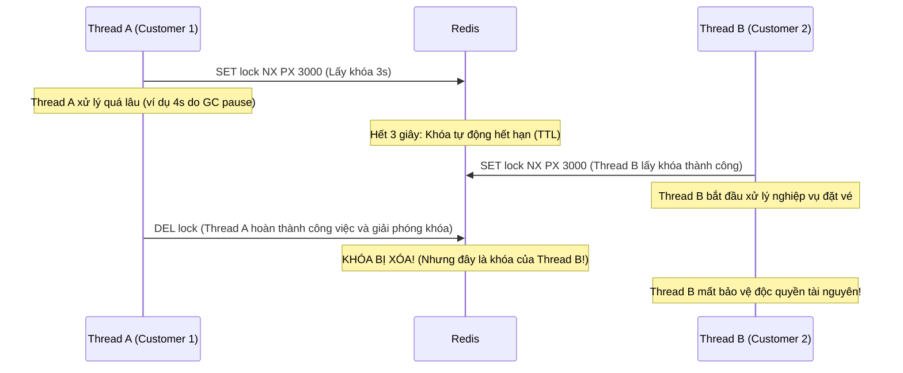

# 📚 Cẩm nang học tập: Khóa phân tán (Distributed Lock) với Redis

Tài liệu này phân tích chi tiết thiết kế cơ chế khóa phân tán bằng Redis để giải quyết bài toán tranh chấp tài nguyên (Concurrency Race Condition) – cụ thể là bài toán **hai khách hàng đồng thời đặt cùng một ghế ngồi** trên chuyến bay.

---

## 1. Bài toán đặt ghế song song (Concurrency Race Condition)

Khi Khách hàng A và Khách hàng B cùng nhấn nút đặt ghế `A34_S012C` trên chuyến bay `FA634` tại cùng một thời điểm:
- Nếu hệ thống không có cơ chế kiểm soát đồng thời (Concurrency Control), cả hai giao dịch có thể đọc trạng thái ghế là "trống", sau đó cả hai đều lưu trạng thái "đã đặt" vào Cơ sở dữ liệu.
- Kết quả: **Double Booking** (trùng lặp đặt chỗ) – một lỗi nghiêm trọng trong hệ thống đặt vé.

Để giải quyết ở quy mô phân tán (nhiều instance chạy song song), ta sử dụng **Redis Distributed Lock**.

---

## 2. Giải pháp 1: Custom Redis Lock (RedisTemplate)

Giải pháp thủ công trực quan nhất là sử dụng lệnh `SETNX` (Set if Not Exists) kèm theo thời gian hết hạn (TTL).

### 2.1. Lấy khóa (Acquire Lock)
```
SET lock:flight:FA634:seat:A34_S012C <unique_value> NX PX 5000
```
- **NX**: Chỉ ghi đè nếu Key chưa tồn tại.
- **PX 5000**: Tự động giải phóng khóa (TTL) sau 5000ms (5 giây) nếu luồng giữ khóa gặp sự cố đột ngột (crash, mất mạng, đứt nguồn) để tránh **Deadlock**.
- **<unique_value>**: Một giá trị định danh ngẫu nhiên duy nhất cho mỗi yêu cầu (ví dụ: UUID). **Đây là yếu tố tối quan trọng để giải phóng khóa an toàn.**

### 2.2. Giải phóng khóa (Release Lock) – Tại sao cần Lua Script?

#### ❌ Kịch bản lỗi khi xóa khóa trực tiếp bằng lệnh `DEL`:


#### ✅ Giải pháp: Sử dụng Lua Script để đảm bảo tính nguyên tử (Atomicity)
Để tránh việc xóa nhầm khóa của luồng khác, ta phải kiểm tra xem giá trị hiện tại trong Redis có trùng khớp với giá trị định danh (`unique_value`) ta tự sinh ra lúc lấy khóa hay không. 

Tuy nhiên, bước **Kiểm tra (Get)** và **Xóa (Del)** phải diễn ra cùng lúc (atomic). Nếu dùng lệnh Java thông thường, tiến trình khác vẫn có thể chen vào giữa 2 lệnh này. Lua Script được gửi lên và thực thi trực tiếp trên Single-thread Engine của Redis để đảm bảo tính nguyên tử tuyệt đối:

```lua
if redis.call('get', KEYS[1]) == ARGV[1] then
    return redis.call('del', KEYS[1])
else
    return 0
end
```

---

## 3. Giải pháp 2: Redisson Lock (Chuẩn Công nghiệp)

Dù Custom Lock giải quyết được vấn đề cơ bản, nó vẫn gặp phải một số hạn chế lớn mà **Redisson** đã tối ưu hóa cực kỳ tốt:

### 3.1. Cơ chế Watchdog (Tự động gia hạn khóa)
- **Vấn đề của Custom Lock**: Nếu ta xét TTL quá ngắn, khóa sẽ bị giải phóng khi luồng chưa xử lý xong. Nếu xét TTL quá dài, khi luồng bị crash hệ thống sẽ bị deadlock trong khoảng thời gian dài đó.
- **Giải pháp của Redisson**: Redisson sử dụng cơ chế **Watchdog** (một luồng chạy ngầm). Khi luồng lấy khóa thành công mà không truyền leaseTime cụ thể, Watchdog sẽ định kỳ (mặc định mỗi 10 giây) gửi lệnh gia hạn khóa thêm 30 giây nữa. Khi luồng hoàn thành công việc và gọi `unlock()`, Watchdog sẽ dừng lại. Nếu tiến trình bị crash, Watchdog chết theo và khóa sẽ tự giải phóng sau tối đa 30 giây.

### 3.2. Chống Spin Lock lãng phí CPU (Pub/Sub)
- **Vấn đề của Custom Lock**: Để chờ lấy khóa, ta thường phải viết vòng lặp `while(true)` kèm `Thread.sleep()`. Điều này gây lãng phí năng lượng tính toán (CPU) và tạo ra độ trễ lớn.
- **Giải pháp của Redisson**: Sử dụng cơ chế **Redis Pub/Sub**. Khi luồng B cố lấy khóa thất bại, nó sẽ đăng ký lắng nghe (subscribe) trên một kênh sự kiện giải phóng khóa. Khi luồng A giải phóng khóa, Redis sẽ phát đi thông báo và luồng B sẽ lập tức tỉnh dậy để lấy khóa.

### 3.3. Reentrant Lock (Khóa tái vào)
- Cho phép cùng một luồng lấy lại một khóa nhiều lần mà không bị tự chặn chính mình (Self-deadlock), cơ chế tương tự `ReentrantLock` trong Java.

---

## 4. Các lỗi thường gặp (Anti-patterns & Bad Practices)

1. **Khóa không có TTL (Time-To-Live)**: Không bao giờ được quên đặt thời gian hết hạn cho khóa. Nếu ứng dụng crash trước khi kịp giải phóng khóa, tài nguyên sẽ bị khóa vĩnh viễn (Deadlock).
2. **Hardcode TTL ngắn hơn thời gian xử lý thực tế**: Dẫn đến việc khóa tự động hết hạn khi tiến trình vẫn đang chạy, làm mất đi tính độc quyền (Mutual Exclusion). Hãy sử dụng Watchdog nếu thời gian xử lý không cố định.
3. **Giải phóng khóa không an toàn (Không dùng Lua Script / Token kiểm tra)**: Xóa nhầm khóa của luồng khác dẫn đến lỗi bảo vệ dữ liệu đồng thời.
4. **Sử dụng Distributed Lock cho các tác vụ không cần thiết**: Khóa phân tán có chi phí mạng (network overhead) khá lớn. Chỉ dùng cho các tài nguyên mang tính chất "độc quyền" cao (ví dụ: thanh toán, đặt chỗ duy nhất).

---

## 5. Thuật toán Redlock (Multi-node Redis)

Khi hệ thống sử dụng cụm Redis Cluster (nhiều master node):
- Lấy khóa trên một Node duy nhất không đảm bảo an toàn nếu Node đó bị sập trước khi đồng bộ dữ liệu sang Slave.
- **Redlock** giải quyết bằng cách: Luồng phải cố gắng lấy khóa đồng thời trên **tất cả** (hoặc đa số) các Redis Master Node với cùng một key và value. Khóa chỉ được coi là lấy thành công nếu luồng lấy được khóa từ **đa số tuyệt đối** các Node (ví dụ: ít nhất 3 trên 5 node) trong khoảng thời gian ngắn hơn TTL của khóa.
