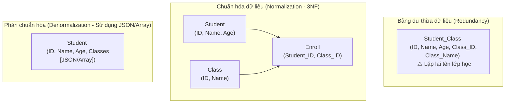
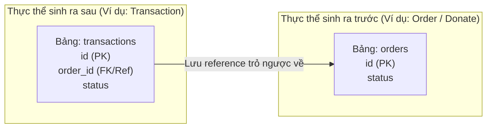
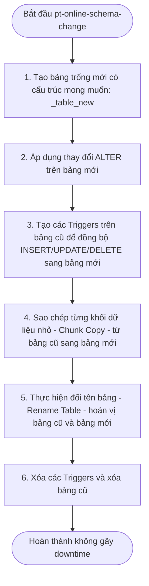

# Hướng dẫn về Thiết kế & Mô hình hóa Dữ liệu (Database Design & Data Modeling Guide)

> *“Kỹ thuật là làm mọi thứ đúng cách.*  
> *Lãnh đạo là làm đúng những thứ cần làm.”*  

<details open>
<summary><b>Mục lục (Table of Contents)</b></summary>

- [1. Thiết kế Cơ sở dữ liệu (Database Design)](#1-thiết-kế-cơ-sở-dữ-liệu-database-design)
  - [1.1. Quy trình thiết kế (Design Process)](#11-quy-trình-thiết-kế-design-process)
  - [1.2. Thiết kế Lược đồ (Schema Design)](#12-thiết-kế-lược-đồ-schema-design)
  - [1.3. Cơ chế thay đổi cấu trúc bảng (Table Format & Online DDL)](#13-cơ-chế-thay-đổi-cấu-trúc-bảng-table-format--online-ddl)
  - [1.4. Lựa chọn Kiểu dữ liệu vật lý (Data Types)](#14-lựa-chọn-kiểu-dữ-liệu-vật-lý-data-types)
- [2. Các Case Studies thực tế](#2-các-case-studies-thực-tế)
  - [2.1. Thiết kế Đa ngôn ngữ (Multiple Languages)](#21-thiết-kế-đa-ngôn-ngữ-multiple-languages)
  - [2.2. Sắp xếp thứ tự danh sách (Ordering)](#22-sắp-xếp-thứ-tự-danh-sách-ordering)
  - [2.3. Đặt phòng Homestay (Homestay Availability Booking)](#23-đặt-phòng-homestay-homestay-availability-booking)
  - [2.4. Lịch biểu sự kiện lặp lại (Calendar Events)](#24-lịch-biểu-sự-kiện-lặp-lại-calendar-events)
  - [2.5. Quản lý nhãn dán (Tagging / Labeling)](#25-quản-lý-nhãn-dán-tagging--labeling)
  - [2.6. Thống kê & Báo cáo (Report Queries)](#26-thống-kê--báo-cáo-report-queries)
- [3. Database View (Bảng ảo)](#3-database-view-bảng-ảo)
  - [3.1. Giới thiệu chung](#31-giới-thiệu-chung)
  - [3.2. Cơ chế hoạt động của View](#32-cơ-chế-hoạt-động-của-view)
  - [3.3. Hạn chế của View](#33-hạn-chế-của-view)
  - [3.4. Thực hành tốt nhất với View](#34-thực-hành-tốt-nhất-với-view)
- [Tóm tắt & Bài tập về nhà (Recap & Homework)](#tóm-tắt--bài-tập-về-nhà-recap--homework)

</details>

---

# 1. Thiết kế Cơ sở dữ liệu (Database Design)

## 1.1. Quy trình thiết kế (Design Process)
Quá trình xây dựng cấu trúc dữ liệu cho một hệ thống backend chuẩn mực trải qua ba giai đoạn chính:

1.  **Phân tích (Analysis):**
    *   Làm rõ yêu cầu nghiệp vụ và xác định rõ **mô hình truy cập dữ liệu (data access patterns)** (hệ thống sẽ đọc dữ liệu như thế nào, ghi dữ liệu ra sao).
    *   Khảo sát cơ sở dữ liệu hiện có (nếu có).
    *   Lập danh sách các trường thông tin sơ khởi cần quản lý.
2.  **Mô hình hóa dữ liệu (Data Modeling):**
    *   Xác định rõ ràng các bảng cần thiết.
    *   Phân chia các trường thông tin vào từng bảng tương ứng.
    *   Tinh chỉnh cấu trúc bảng tối ưu.
    *   Định nghĩa Khóa chính (Primary Key), Khóa ngoại (Foreign Key) và các Mối quan hệ giữa các bảng.
3.  **Toàn vẹn dữ liệu (Data Integrity):**
    *   Xem xét toàn diện và áp dụng linh hoạt giữa **Chuẩn hóa (Normalization)** và **Phản chuẩn hóa (Denormalization)** dựa trên nhu cầu tối ưu hóa hiệu năng.

---

## 1.2. Thiết kế Lược đồ (Schema Design)

### 1.2.1. Sơ đồ thực thể quan hệ (Entity-Relationship Diagram - ERD)
*   **Thực thể (Entity):** Là một đối tượng có định danh duy nhất và có vòng đời chuyển dịch trạng thái (status).
*   **Sơ đồ ERD:** Là sơ đồ trực quan dùng để biểu diễn các thực thể và các mối quan hệ (1-1, 1-N, N-N) giữa các thực thể trong cơ sở dữ liệu.

### 1.2.2. Phân loại các bảng trong hệ thống (Types of Tables)
Trong thiết kế cơ sở dữ liệu quan hệ, các bảng thường được chia thành 4 nhóm vai trò chính:
*   **Entity Table (Bảng thực thể):** Lưu thông tin cốt lõi của một đối tượng nghiệp vụ (ví dụ: `users`, `products`, `orders`).
*   **Relation Table (Bảng quan hệ):** Dùng để phân rã mối quan hệ nhiều-nhiều (N-M) giữa hai thực thể (ví dụ: `order_items` kết nối `orders` và `products`).
*   **Support Table (Bảng hỗ trợ):** Lưu thông tin bổ trợ cấu hình mở rộng cho một thực thể chính.
*   **Config Table (Bảng cấu hình):** Lưu danh mục dữ liệu ít thay đổi phục vụ việc chuẩn hóa thông tin (ví dụ: `countries`, `provinces`, `system_settings`).

---

### 1.2.3. Chuẩn hóa dữ liệu (Normalization)
*   **Khái niệm:** Là quá trình tổ chức cấu trúc dữ liệu nhằm giảm thiểu tối đa việc lặp lại dữ liệu dư thừa (data redundancy) và đảm bảo tính toàn vẹn dữ liệu (data integrity).
*   **Cơ chế:** Chia nhỏ các bảng lớn có nhiều thông tin dư thừa thành các bảng nhỏ hơn và liên kết chúng thông qua các quan hệ khóa.

#### Ví dụ về Chuẩn hóa bảng Sinh viên và Lớp học:
*Chưa chuẩn hóa (Bảng Student trùng lặp tên lớp học):*

| Student ID | Name | Age | Class ID | Class Name |
| :--- | :--- | :---: | :---: | :--- |
| 1 | Ly | 24 | 2 | Math |
| 2 | Trang | 25 | 3 | Physic |
| 3 | Linh | 18 | 1 | English |
| 4 | Hoa | 20 | 1 | English |

*Sau khi chuẩn hóa (Tách làm 3 bảng):*
*   **Student Table:** `ID`, `Name`, `Age`
*   **Class Table:** `ID`, `Name`
*   **Enroll Table (Bảng quan hệ):** `Student_ID`, `Class_ID`



*   **Ưu điểm:** Loại bỏ dư thừa dữ liệu tiết kiệm dung lượng đĩa, tránh xung đột dữ liệu khi cập nhật thông tin.
*   **Nhược điểm:** Tăng độ phức tạp của lược đồ cơ sở dữ liệu, bắt buộc phải viết nhiều lệnh `JOIN` phức tạp khi cần lấy dữ liệu, làm giảm hiệu năng đọc và đôi khi vô hiệu hóa khả năng sử dụng index của một số truy vấn.

---

### 1.2.4. Phản chuẩn hóa dữ liệu (Denormalization)
*   **Khái niệm:** Là quá trình ngược lại với chuẩn hóa. Chúng ta chủ động gộp các bảng hoặc lưu trữ thêm dữ liệu dư thừa vào một bảng để tối ưu hiệu năng.
*   *Ví dụ:* Thay vì JOIN bảng `Student` và `Enroll` để lấy danh sách mã lớp học, ta lưu trực tiếp mảng JSON `classes = [1, 2]` vào ngay một cột của bảng `Student`.
*   **Ưu điểm:** Tăng tốc độ truy vấn đọc dữ liệu, tận dụng tối đa chỉ mục (Index) trên một bảng duy nhất mà không cần JOIN.
*   **Nhược điểm:** Tốn thêm không gian lưu trữ đĩa cứng; phát sinh rủi ro bất nhất dữ liệu (Data Inconsistency) khi cập nhật dữ liệu ở một nơi mà quên đồng bộ ở các nơi còn lại.

---

### 1.2.5. Vấn đề về Ràng buộc Khóa ngoại (Foreign Key Constraint)
> [!WARNING]
> Việc lạm dụng ràng buộc Khóa ngoại vật lý (`FOREIGN KEY` Constraint) ở mức Database mang lại nhiều hệ lụy lớn cho hệ thống phân tán hiệu năng cao:
> 1.  **Suy giảm hiệu năng:** Khi thực hiện `INSERT` hoặc `UPDATE` dữ liệu, Database Engine bắt buộc phải thực hiện truy vấn ngầm để kiểm tra sự tồn tại của khóa ngoại ở bảng tham chiếu $\rightarrow$ Gây chậm tiến trình ghi.
> 2.  **Khóa bảng & Deadlock:** Quá trình kiểm tra khóa ngoại có thể tạo ra các shared-lock ngầm trên bảng tham chiếu, dễ gây ra nghẽn cổ chai và Deadlock khi có lượng lớn request đồng thời.
> 3.  **Tăng độ phức tạp:** Mã nguồn ứng dụng phải bắt và bóc tách các Exception từ Database để hiển thị lỗi thân thiện cho khách hàng. Quy trình sao lưu (Backup) và phục hồi (Restore) dữ liệu trở nên cực kỳ phức tạp vì sự ràng buộc chéo.
>
> **Giải pháp tối ưu:** Loại bỏ ràng buộc khóa ngoại vật lý trong Database. Hãy chỉ khai báo cột tham chiếu thông thường và **thực hiện kiểm tra tính toàn vẹn dữ liệu ở tầng Ứng dụng (Application Layer)**.
> *Lưu ý:* Ràng buộc khóa ngoại (Foreign Key Constraint) khác hoàn toàn với Cột tham chiếu logic (Reference Column).

---

### 1.2.6. Vị trí đặt Cột tham chiếu (Reference Column Placement)
*   **Ngữ cảnh:** Hệ thống có quan hệ 1-1 giữa hai thực thể:
    *   Tạo đơn hàng (`Order`) $\rightarrow$ sau đó tạo giao dịch thanh toán (`Payment Transaction`).
    *   Tạo lượt ủng hộ (`Donate`) $\rightarrow$ sau đó tạo giao dịch chuyển tiền (`Donate Transaction`).
*   **Câu hỏi:** Đặt cột tham chiếu ở bảng nào để tối ưu?
*   **Quy tắc thiết kế:** 
    > [!TIP]
    > **Thực thể sinh ra sau sẽ chứa cột tham chiếu trỏ về thực thể gốc sinh ra trước.**  
    > Cụ thể ở đây: Đặt cột `order_id` nằm trong bảng `transactions`. Thiết kế này giúp hệ thống dễ dàng mở rộng (Scalability) khi một Order sau này có thể phát sinh nhiều lượt thanh toán lại (1-N) mà không phải thay đổi cấu trúc bảng cũ.



---

## 1.3. Cơ chế thay đổi cấu trúc bảng (Table Format & Online DDL)

### 1.3.1. Thay đổi cấu trúc bảng lớn gây Lock & Downtime
*   Trong các phiên bản MySQL cũ, việc chạy câu lệnh thêm cột mới (`ALTER TABLE ADD COLUMN`) sẽ khóa toàn bộ bảng (Table Lock), ngăn chặn mọi tác vụ ghi dữ liệu của người dùng $\rightarrow$ Gây downtime nghiêm trọng trên các hệ thống lớn.
*   **Giải pháp thiết kế dự phòng:** Sử dụng một cột kiểu dữ liệu **JSON** (ví dụ đặt tên là `data`) để lưu trữ các trường dữ liệu động phát sinh trong tương lai mà không cần phải chạy ALTER TABLE thay đổi schema.

### 1.3.2. Đánh chỉ mục trên trường dữ liệu JSON
*   **Vấn đề:** Các phiên bản MySQL cũ không hỗ trợ đánh chỉ mục (Index) trực tiếp trên các trường nằm trong chuỗi JSON.
*   **Giải pháp thiết kế dự phòng (Redundant Columns):** Khi thiết kế bảng ban đầu, hãy chủ động tạo sẵn một vài cột rỗng dự phòng (ví dụ: `ext_col_1`, `ext_col_2` kiểu VARCHAR). Khi phát sinh nhu cầu cần đánh index cho một trường động mới, ta chỉ cần lưu dữ liệu đó vào cột dự phòng này và tiến hành đánh index bình thường. *Yêu cầu:* Phải viết tài liệu mô tả rõ ràng ý nghĩa của các cột dự phòng này.

### 1.3.3. Kỹ thuật thêm Index an toàn trên bảng sản xuất lớn (Online DDL)
*   **Trước MySQL 5.6:** Sử dụng công cụ **`pt-online-schema-change`** từ bộ công cụ Percona Toolkit.
    *   *Cơ chế:* Tạo một bảng trống mới có cấu trúc mong muốn $\rightarrow$ Tạo trigger đồng bộ dữ liệu tự động từ bảng cũ sang bảng mới $\rightarrow$ Sao chép dữ liệu cũ sang theo từng khối nhỏ (chunk) $\rightarrow$ Đổi tên bảng mới thay thế bảng cũ $\rightarrow$ Xóa trigger.



*   **Từ MySQL 5.6 trở đi (Online DDL):** MySQL hỗ trợ thực hiện trực tiếp thông qua thuật toán INPLACE không gây khóa ghi:
    ```sql
    ALTER TABLE my_table ADD INDEX my_index (my_column), 
    ALGORITHM=INPLACE, LOCK=NONE;
    ```
    *Lưu ý:* Mặc dù là Online DDL, hệ thống vẫn có thể bị khóa nhẹ (micro-lock) trong tích tắc ở giai đoạn cuối cùng khi cập nhật siêu dữ liệu (metadata swap).

### 1.3.4. Cấu trúc Bảng mẫu chuẩn (Table Template)
Mỗi bảng dữ liệu nghiệp vụ nên được thiết kế đồng bộ theo template phân chia rõ ràng hai nhóm dữ liệu:

*   **Business Data (Dữ liệu nghiệp vụ):**
    *   `id`: Khóa chính (khuyên dùng kiểu số tự tăng `BIGINT` hoặc `UUID/ULID`).
    *   `status`: Trạng thái nghiệp vụ của thực thể.
    *   `data`: Cột kiểu dữ liệu `JSON` để lưu các thuộc tính động.
*   **Technical Data (Dữ liệu kỹ thuật phục vụ vận hành):**
    *   `version`: Phiên bản bản ghi (phục vụ Khóa lạc quan - Optimistic Locking).
    *   `created_at`, `updated_at`: Thời gian khởi tạo và cập nhật cuối cùng.
    *   `created_by`, `updated_by`: ID người thực hiện hành vi.

---

## 1.4. Lựa chọn Kiểu dữ liệu vật lý (Data Types)

### 1.4.1. Kiểu dữ liệu Chuỗi (String)
*   **`VARCHAR`:** Chỉ sử dụng vừa đủ lượng không gian cần thiết để lưu trữ chuỗi thực tế, cộng thêm 1 hoặc 2 bytes phụ trợ để ghi nhận độ dài chuỗi. Thích hợp cho chuỗi ngắn ($< 255$ ký tự), truy xuất thường xuyên và ít khi cập nhật độ dài thay đổi lớn (ví dụ: tên đăng nhập, email).
*   **`TEXT` / `BLOB`:** Dùng để lưu trữ dữ liệu văn bản lớn. InnoDB sẽ lưu trữ các trường này ở một vùng nhớ ngoài đĩa cứng độc lập (external storage pages) thay vì lưu chung block với dòng dữ liệu chính. MySQL không thể đánh chỉ mục toàn bộ độ dài của kiểu TEXT/BLOB và không thể dùng chỉ mục này để sắp xếp (`ORDER BY`). Thích hợp lưu trữ: logs, bình luận, nội dung bài viết.

### 1.4.2. Kiểu dữ liệu Số (Number)
*   **Số nguyên (Integer):** `SMALLINT`, `INT`, `BIGINT`. Hãy chọn kiểu nhỏ nhất đáp ứng đủ nhu cầu nghiệp vụ để tiết kiệm RAM/Disk.
    *   > [!IMPORTANT]
    > **Sửa đổi hiểu lầm phổ biến:** Việc định nghĩa `INT(1)` hay `INT(9)` hoàn toàn không làm thay đổi dung lượng lưu trữ (luôn là 4 bytes) hay tốc độ tính toán của CPU. Ký số nằm trong dấu ngoặc chỉ là độ rộng hiển thị (Display Width) được sử dụng bởi một số client giao diện cũ.
*   **Số thực (Real Number):**
    *   `FLOAT` và `DOUBLE` tiêu tốn ít dung lượng hơn `DECIMAL` nhưng **tuyệt đối không được dùng để lưu trữ tiền tệ**. Do thiết kế theo chuẩn nhị phân IEEE 754, các phép toán số thực dấu phẩy động sẽ phát sinh sai số làm tròn số thập phân.
    *   **Lưu trữ tiền tệ:** Bắt buộc sử dụng kiểu dữ liệu **`DECIMAL(precision, scale)`** để đảm bảo độ chính xác tuyệt đối, hoặc lưu trữ dưới dạng số nguyên bằng cách nhân phần thập phân lên (ví dụ: lưu cents thay vì USD).

### 1.4.3. Kiểu dữ liệu Ngày tháng (Date & Time)
*   **`TIMESTAMP`:** Chiếm ít dung lượng (4 bytes), tự động chuyển đổi theo múi giờ của kết nối. Nhược điểm: Giới hạn khoảng thời gian (chỉ lưu được đến ngày 19/01/2038). Thích hợp cho các mốc thời gian hệ thống cố định như `created_at`, `updated_at`.
*   **`DATETIME`:** Chiếm nhiều dung lượng hơn (8 bytes), dễ đọc, không bị giới hạn năm 2038, lưu trữ chính xác giá trị được nhập mà không phụ thuộc múi giờ. Thích hợp lưu trữ thời gian do người dùng thiết lập tùy ý (ví dụ: giờ hẹn khám bệnh, giờ bay).
*   **Thực hành tốt nhất:** 
    *   Sử dụng phần lẻ giây (fractional seconds) để có độ chính xác cao.
    *   Lưu thêm múi giờ ở một cột riêng biệt nếu ứng dụng phục vụ đa quốc gia.
    *   Đồng bộ hóa múi giờ: Thiết lập múi giờ JVM = Múi giờ Hệ điều hành (OS) = Múi giờ Database = **UTC (Timezone 0)**.

---

# 2. Các Case Studies thực tế

## 2.1. Thiết kế Đa ngôn ngữ (Multiple Languages)
*   **Yêu cầu:** Hiển thị thông tin tiêu đề bài viết bằng nhiều ngôn ngữ khác nhau mà không làm thay đổi schema khi thêm ngôn ngữ mới, dễ truy vấn.
*   **Giải pháp:** Lưu trữ bản dịch trực tiếp trong một cột JSON duy nhất trong bảng bài viết:
    ```sql
    -- Cấu trúc cột title_translation:
    {
      "vi": "Kỹ Sư",
      "en": "Engineer",
      "cn": "工程师"
    }
    ```

---

## 2.2. Sắp xếp thứ tự danh sách (Ordering)
*   **Yêu cầu:** Cho phép người dùng thay đổi thứ tự công việc trong danh sách To-Do list mà không cần chạy lệnh cập nhật hàng loạt giá trị thứ tự của các dòng lân cận.
*   **Giải pháp:** 
    *   Thiết lập cột `order_index` kiểu số thực **`FLOAT`** hoặc **`DOUBLE`** với khoảng cách lớn giữa các phần tử ban đầu (ví dụ: phần tử 1 là `1000`, phần tử 2 là `2000`).
    *   Khi chèn một phần tử vào giữa hai phần tử có thứ tự $A$ và $B$, giá trị mới sẽ bằng:
        $$\text{order\_index} = \frac{A + B}{2}$$
    *   Kiểu số thực đảm bảo hệ thống có thể chia nhỏ giá trị vô số lần mà không sợ cạn kiệt khoảng trống số nguyên ở giữa.

---

## 2.3. Đặt phòng Homestay (Homestay Availability Booking)
*   **Yêu cầu:** Kiểm tra nhanh phòng trống của một ngày cụ thể và cho phép thay đổi giá phòng linh hoạt theo từng ngày khác nhau trong năm.
*   **Giải pháp:** 
    *   Tạo bảng phụ `homestay_availability` (`homestay_id`, `date`, `price`, `status`).
    *   Ngay khi chủ nhà tạo mới một Homestay, hệ thống tự động chạy tác vụ ngầm tạo trước **365 dòng** tương ứng với 365 ngày trong năm cho homestay đó. Nhờ đó, việc kiểm tra trạng thái phòng trống hay cập nhật giá của một ngày bất kỳ chỉ là một câu lệnh UPDATE/SELECT đơn giản trên một dòng dữ liệu thay vì phải tính toán khoảng thời gian chồng lấn phức tạp.

---

## 2.4. Lịch biểu sự kiện lặp lại (Calendar Events)
*   **Yêu cầu:** Lưu trữ các sự kiện lịch biểu có tính chất lặp lại (ví dụ: họp hàng tuần vào thứ 2) và cho phép truy vấn nhanh các sự kiện diễn ra trong một tuần cụ thể.
*   **Giải pháp:** Tạo sẵn trước các khoảng thời gian cụ thể (time slots) trong bảng `time_slots` để ứng dụng chỉ việc SELECT theo khoảng thời gian thực tế:
    ```sql
    CREATE TABLE time_slots (
      id INT NOT NULL PRIMARY KEY AUTO_INCREMENT,
      event_id INT NOT NULL,
      begin_local_time DATETIME NOT NULL,
      end_local_time DATETIME NOT NULL,
      timezone_id INT NOT NULL
    );
    ```

---

## 2.5. Quản lý nhãn dán (Tagging / Labeling)
*   **Yêu cầu:** Một bài viết (Post) có thể gắn nhiều thẻ (Tags). Cần tối ưu hóa cho tác vụ: Lấy ra toàn bộ thẻ của bài viết (truy vấn 1) nhanh hơn việc lấy toàn bộ bài viết theo một thẻ (truy vấn 2).
*   **Giải pháp:**
    *   *Cách truyền thống:* Tạo bảng trung gian quan hệ nhiều-nhiều (N-M).
    *   *Cách tối ưu hơn trên PostgreSQL:* Lưu các thẻ trực tiếp vào cột `tags` kiểu dữ liệu **`ARRAY`** (hoặc JSON) nằm ngay trong bảng bài viết, kết hợp đánh chỉ mục đảo ngược **GIN Index** để tối ưu hiệu năng đọc mà không cần JOIN bảng.

---

## 2.6. Thống kê & Báo cáo (Report Queries)
*   **Yêu cầu:** Đếm tổng số lượt click quảng cáo của ngày hôm trước với thời gian phản hồi siêu tốc.
*   **Giải pháp:**
    *   *Nếu chấp nhận sai số nhỏ:* Sử dụng thuật toán ước lượng số lượng phần tử duy nhất như **HyperLogLog**.
    *   *Nếu cần chính xác tuyệt đối:* Sử dụng tiến trình chạy ngầm (Cron Job) để cộng dồn dữ liệu cuối ngày, sử dụng Materialized View để đồng bộ bất đồng bộ, hoặc áp dụng xử lý dòng (Stream Processing).

---

# 3. Database View (Bảng ảo)

## 3.1. Giới thiệu chung
*   **View** là một bảng ảo (virtual table) không tự lưu trữ bất kỳ dữ liệu vật lý nào trên đĩa cứng. Dữ liệu thực sự của View luôn nằm ở các bảng gốc (base tables) bên dưới.
*   *Lưu ý:* Thông thường các View chỉ dùng để đọc dữ liệu. RDBMS có hỗ trợ Updatable View (View có thể cập nhật ngược lại bảng gốc) nhưng cơ chế này cực kỳ phức tạp và không được khuyến khích sử dụng trong thiết kế thực tế.

---

## 3.2. Cơ chế hoạt động của View
Khi người dùng chạy một truy vấn lên View, Database Engine sẽ sử dụng một trong hai thuật toán xử lý chính:

1.  **MERGE (Mặc định):**
    *   Hệ thống gộp câu lệnh SQL của người dùng với câu lệnh định nghĩa View để tạo thành một câu lệnh SQL cuối cùng.
    *   Sau đó, hệ thống thực thi câu lệnh gộp này trực tiếp trên bảng gốc $\rightarrow$ Cách này tận dụng được toàn bộ các chỉ mục (Indexes) đang có trên bảng gốc nên hiệu năng rất cao.
2.  **TEMPTABLE (Bảng tạm):**
    *   Hệ thống thực thi câu lệnh SQL định nghĩa View trước để tạo ra một bảng tạm thời (Temporary Table) chứa kết quả.
    *   Sau đó, hệ thống chạy SQL của người dùng trên bảng tạm này. Vì bảng tạm không có chỉ mục, hiệu năng của phép toán sẽ bị giảm sút nghiêm trọng.

---

## 3.3. Hạn chế của View
*   **Độ phức tạp che giấu:** View tạo ra cảm giác đơn giản cho lập trình viên ở tầng ứng dụng, nhưng thực tế có thể đang chạy những phép JOIN cực kỳ nặng nề dưới nền DB.
*   **Không hỗ trợ Materialized View gốc trong MySQL:** MySQL không hỗ trợ Materialized View (loại view lưu trữ kết quả vật lý ra một bảng ẩn và cập nhật định kỳ) mà chỉ hỗ trợ View ảo thông thường.

---

## 3.4. Thực hành tốt nhất với View
*   Chỉ nên sử dụng View để đơn giản hóa các câu lệnh truy vấn phức tạp (như gộp nhiều bảng cấu hình, các phép toán định dạng chuỗi).
*   Sử dụng View làm lớp bảo mật dữ liệu bổ sung (ví dụ: cấp quyền cho kế toán chỉ được view cột số dư, nhân sự chỉ được view cột thông tin cá nhân trên cùng một bảng gốc).
*   **Bắt buộc** chạy lệnh giải trình `EXPLAIN` kiểm tra execution plan của các câu lệnh truy vấn chạy trên View để đảm bảo DB đang sử dụng thuật toán `MERGE` và có tận dụng được Index của bảng gốc.

---

# Tóm tắt & Bài tập về nhà (Recap & Homework)

### Tóm tắt cốt lõi (Recap)
*   Tận dụng kiểu dữ liệu JSON để lưu trữ thông tin động nhằm tăng tính linh hoạt cho cấu trúc bảng mà không cần chạy ALTER TABLE gây khóa bảng.
*   Loại bỏ ràng buộc Khóa ngoại vật lý ở Database để tránh Deadlock và nghẽn ghi; hãy tự kiểm tra ràng buộc ở lớp ứng dụng.
*   Không có khái niệm tuyệt đối tốt giữa Chuẩn hóa hay Phản chuẩn hóa; hãy phối hợp hài hòa dựa trên mô hình đọc/ghi dữ liệu của hệ thống.

### Bài tập về nhà (Homework)
*   **Đề bài:** Thiết kế lược đồ cơ sở dữ liệu (Database Schema) cho hệ thống đặt vé máy bay (**Flight Booking System**).
*   **Yêu cầu thực hiện:**
    1.  Ứng dụng mẫu cấu trúc bảng chuẩn (Table Template) đã học (phân tách Business Data và Technical Data).
    2.  Thiết kế các bảng cho các thực thể: Khách hàng (Customer), Chuyến bay (Flight), Đơn đặt vé (Booking), và Chi tiết vé (Ticket).
    3.  Lựa chọn kiểu dữ liệu tối ưu nhất cho từng cột (lưu ý tiền tệ, ngày tháng múi giờ, trạng thái và các dữ liệu mở rộng).
    4.  Viết file SQL tạo bảng (`CREATE TABLE`) hoàn chỉnh, ghi rõ giải thích lý do lựa chọn kiểu dữ liệu cho từng cột nhạy cảm.

### Tài liệu tham khảo (References)
*   **MySQL Large Varchar vs Text:** [Stack Overflow discussion](https://stackoverflow.com/questions/2023481/mysql-large-varchar-vs-text)
*   **Create index without table locking:** [Stack Overflow guide on Online DDL](https://stackoverflow.com/questions/4244685/create-an-index-on-a-huge-mysql-production-table-without-table-locking)

**Cảm ơn bạn! (Thank you)**
