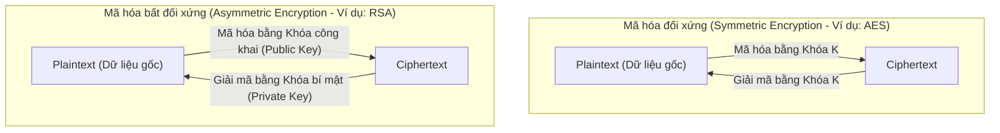
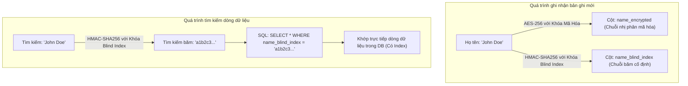
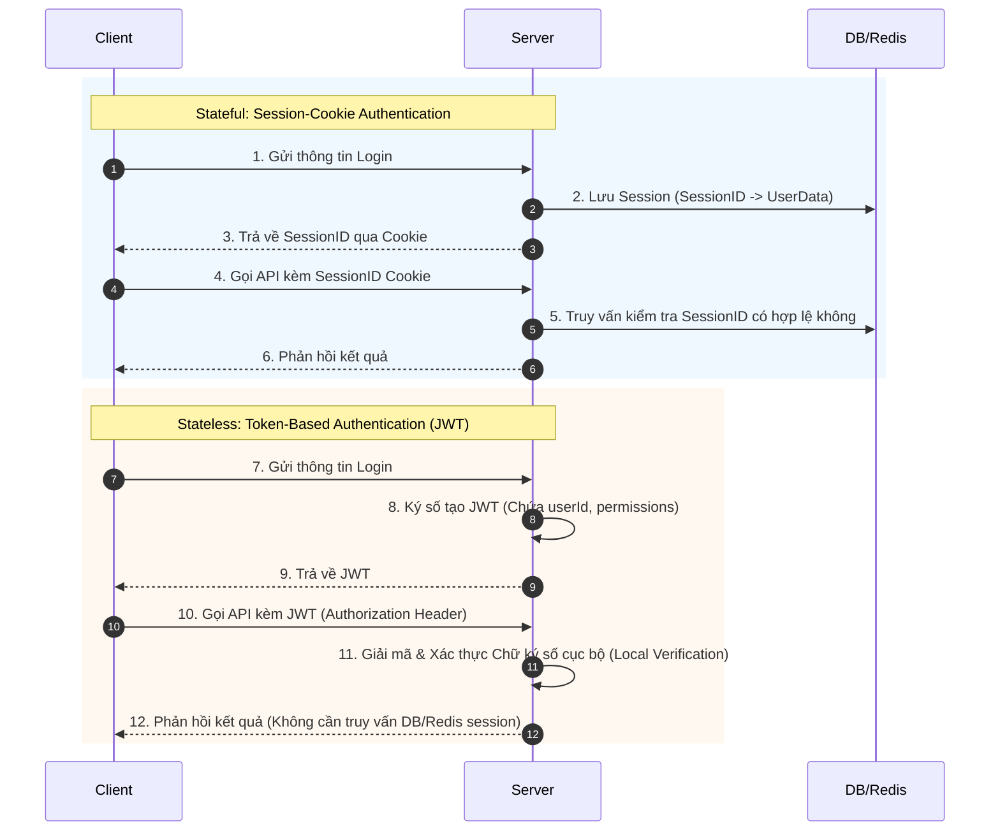
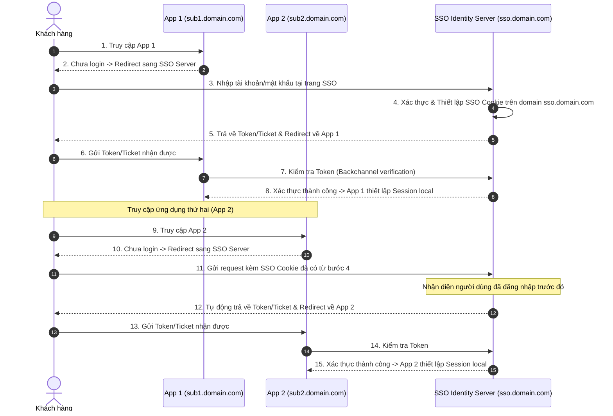

# Hướng dẫn về An ninh Bảo mật Backend (Backend Security Guide)

> *“Một ngày nào đó, bạn sẽ phải rời bỏ thế giới này,*  
> *vì vậy hãy sống một cuộc đời đáng nhớ.”*  
> — *The Nights (Avicii ft. Nicholas Furlong)*

<details open>
<summary><b>Mục lục (Table of Contents)</b></summary>

- [1. Các khái niệm nền tảng (Core Concepts)](#1-các-khái-niệm-nền-tảng-core-concepts)
  - [1.1. Mã hóa định dạng (Encoding)](#11-mã-hóa-định-dạng-encoding)
  - [1.2. Băm dữ liệu (Hashing)](#12-băm-dữ-liệu-hashing)
  - [1.3. Mã hóa bảo mật (Encryption)](#13-mã-hóa-bảo-mật-encryption)
  - [1.4. So sánh Encoding vs Hashing vs Encryption](#14-so-sánh-encoding-vs-hashing-vs-encryption)
  - [1.5. Chữ ký số (Digital Signature)](#15-chữ-ký-số-digital-signature)
  - [1.6. Case Study 1: Lưu trữ Mật khẩu an toàn (Password Storage)](#16-case-study-1-lưu-trữ-mật-khẩu-an-toàn-password-storage)
  - [1.7. Case Study 2: Mã hóa dữ liệu cá nhân (Personal Data Encryption)](#17-case-study-2-mã-hóa-dữ-liệu-cá-nhân-personal-data-encryption)
- [2. Các phương thức tấn công phổ biến (Common Attacks & Defenses)](#2-các-phương-thức-tấn-công-phổ-biến-common-attacks--defenses)
  - [2.1. Tấn công xen giữa (Man-in-the-Middle - MITM)](#21-tấn-công-xen-giữa-man-in-the-middle---mitm)
  - [2.2. Tấn công tiêm lệnh SQL (SQL Injection - SQLi)](#22-tấn-công-tiêm-lệnh-sql-sql-injection---sqli)
  - [2.3. Tấn công chèn mã kịch bản chéo trang (Cross-Site Scripting - XSS)](#23-tấn-công-chèn-mã-kịch-bản-chéo-trang-cross-site-scripting---xss)
  - [2.4. Tấn công giả mạo yêu cầu chéo trang (Cross-Site Request Forgery - CSRF)](#24-tấn-công-giả-mạo-yêu-cầu-chéo-trang-cross-site-request-forgery---csrf)
  - [2.5. Tấn công từ chối dịch vụ phân tán (DDoS)](#25-tấn-công-từ-chối-dịch-vụ-phân-tán-ddos)
- [3. Xác thực & Phân quyền (Authentication & Authorization)](#3-xác-thực--phân-quyền-authentication-amp-authorization)
  - [3.1. Phân biệt Khái niệm](#31-phân-biệt-khái-niệm)
  - [3.2. Xác thực cơ bản (Basic Auth)](#32-xác-thực-cơ-bản-basic-auth)
  - [3.3. Xác thực bằng Session-Cookie (Session-Cookie Auth)](#33-xác-thực-bằng-session-cookie-session-cookie-auth)
  - [3.4. Xác thực bằng Token (Token-Based Auth - JWT)](#34-xác-thực-bằng-token-token-based-auth---jwt)
  - [3.5. Case Study 3: Phân quyền RBAC vs Permission-Based AC](#35-case-study-3-phân-quyền-rbac-vs-permission-based-ac)
  - [3.6. Case Study 4: Đăng nhập một lần (Single Sign-On - SSO)](#36-case-study-4-đăng-nhập-một-lần-single-sign-on---sso)
- [Tóm tắt & Bài tập về nhà (Recap & Homework)](#tóm-tắt--bài-tập-về-nhà-recap--homework)

</details>

---

# 1. Các khái niệm nền tảng (Core Concepts)

## 1.1. Mã hóa định dạng (Encoding)
*   **Định nghĩa:** Là kỹ thuật chuyển đổi định dạng biểu diễn dữ liệu từ dạng này sang dạng khác để các hệ thống khác nhau có thể đọc/hiểu được.
*   **Đặc điểm:**
    *   Là quá trình **khả nghịch hai chiều** (Reversible) dễ dàng và hoàn toàn không gây mất mát dữ liệu gốc.
    *   **Tuyệt đối không có mục đích bảo mật dữ liệu.**
*   *Ví dụ thực tế:*
    *   Sự biến đổi từ địa phương: Quả dứa (Miền Bắc) $\rightarrow$ Quả thơm (Miền Nam) $\rightarrow$ Pineapple (Anh).
    *   **Serialization:** Chuyển đổi Đối tượng (Object) trong code thành chuỗi Nhị phân (Binary) để lưu xuống file hoặc truyền qua mạng.
    *   **URL Encoding:** Chuyển đổi các ký tự đặc biệt trong URL (ví dụ: khoảng trắng thành `%20`).
    *   **Base64:** Mã hóa dữ liệu nhị phân thành chuỗi văn bản ASCII (được dùng để mã hóa Header/Payload của JWT).

---

## 1.2. Băm dữ liệu (Hashing)
*   **Định nghĩa:** Là quá trình sử dụng một hàm băm (Hash Function) biến đổi một khối dữ liệu đầu vào có kích thước bất kỳ thành một chuỗi kết quả có độ dài cố định.
*   **Đặc điểm:**
    *   Là quá trình **một chiều, không thể đảo ngược** (Non-reversible). Không có cách nào khôi phục lại dữ liệu gốc từ chuỗi hash đầu ra.
    *   Dùng để **bảo đảm tính toàn vẹn dữ liệu (Data Integrity)** (giúp kiểm tra xem dữ liệu có bị chỉnh sửa hay không).
*   **Đụng độ băm (Collision):** Hiện tượng hai dữ liệu đầu vào khác nhau nhưng qua hàm băm lại cho ra cùng một giá trị hash đầu ra. Một hàm băm tốt là hàm băm giảm thiểu tối đa tỷ lệ xảy ra đụng độ.

---

## 1.3. Mã hóa bảo mật (Encryption)
*   **Định nghĩa:** Sử dụng các thuật toán toán học mật mã để biến đổi thông tin gốc (Plaintext) thành thông tin không thể đọc được (Ciphertext) nhằm bảo vệ tính bí mật của dữ liệu.
*   **Đặc điểm:**
    *   Là quá trình **khả nghịch** (Reversible) đối với những người được ủy quyền sở hữu Khóa (Keys).
    *   Đầu vào bắt buộc cần có dữ liệu gốc và Khóa mã hóa.



### Phân loại cơ chế mã hóa dùng Khóa:
1.  **Mã hóa đối xứng (Symmetric Encryption):**
    *   Sử dụng **cùng một khóa** duy nhất cho cả quá trình mã hóa và giải mã.
    *   *Ví dụ:* Thuật toán AES (Advanced Encryption Standard).
    *   *Đặc tính:* Tốc độ xử lý cực nhanh, thích hợp mã hóa dữ liệu lớn nhưng gặp khó khăn trong việc truyền tải và quản lý khóa an toàn.
2.  **Mã hóa bất đối xứng (Asymmetric Encryption):**
    *   Sử dụng một **cặp khóa** khác nhau: Khóa công khai (Public Key) dùng để mã hóa và Khóa bí mật (Private Key) dùng để giải mã.
    *   *Ví dụ:* Thuật toán RSA, ECC.
    *   *Đặc tính:* Độ an toàn rất cao (không cần chia sẻ khóa bí mật) nhưng tốc độ xử lý chậm hơn nhiều so với mã hóa đối xứng.

---

## 1.4. So sánh Encoding vs Hashing vs Encryption

### 1.4.1. Bài toán tích hợp thanh toán
*   **Bối cảnh:** Ứng dụng Merchant cần tạo một request thanh toán gửi tới Cổng thanh toán (Payment Gateway).
*   **Yêu cầu:** 
    *   Không gửi thông tin nhạy cảm của khách hàng trên request.
    *   Đảm bảo tính toàn vẹn (Data Integrity) để request không bị sửa đổi số tiền trên đường truyền.
    *   Đảm bảo tính xác thực (Authenticity) để Cổng thanh toán chắc chắn request được tạo từ đúng Merchant.
*   **Giải pháp:** Áp dụng thuật toán **Băm có kèm khóa bí mật (Keyed-Hash Message Authentication Code - HMAC)** như HMAC-SHA512.

### 1.4.2. Bảng so sánh tổng quan

| Đặc tính | Encryption (Mã hóa) | Hashing (Băm) | Encoding (Định dạng) |
| :--- | :--- | :--- | :--- |
| **Mục đích** | Bảo vệ tính bí mật dữ liệu | Đảm bảo tính toàn vẹn dữ liệu | Chuyển đổi định dạng dữ liệu |
| **Khả nghịch** | Có (Khả nghịch hai chiều) | Không (Một chiều tuyệt đối) | Có (Khả nghịch hai chiều) |
| **Sử dụng Khóa** | Bắt buộc sử dụng Khóa | Không (Trừ HMAC cần khóa) | Không sử dụng khóa |
| **Độ dài đầu ra** | Thay đổi tùy theo độ dài đầu vào | Luôn cố định (Fixed-length) | Thay đổi tùy theo đầu vào |
| **Hiện tượng đụng độ**| Không xảy ra | Có xảy ra (Collision) | Không xảy ra |
| **Chi phí tính toán** | Trung bình đến Rất cao | Thấp | Rất thấp |
| **Ứng dụng** | Truyền tải dữ liệu nhạy cảm (Thẻ tín dụng, tin nhắn bảo mật) | Lưu trữ mật khẩu, checksum, kiểm tra trùng lặp | Truyền file nhị phân, định dạng URL, đóng gói JWT |

### 1.4.3. Các thuật toán phổ biến trong thực tế
*   **Encryption (Mã hóa):**
    *   *AES-256:* Mã hóa dữ liệu lưu trữ trên ổ đĩa, cơ sở dữ liệu, mã hóa đường truyền TLS.
    *   *RSA:* Trao đổi khóa bảo mật, ký số.
*   **Hashing (Băm):**
    *   *BLAKE2, SHA-256:* Kiểm tra tính toàn vẹn dữ liệu, chữ ký số.
    *   *Scrypt, Argon2:* Thuật toán băm chậm chuyên dụng cho lưu trữ mật khẩu.
    *   *MD5, SHA-1:* Hiện tại đã lỗi thời do tỷ lệ đụng độ cao, chỉ nên dùng làm checksum nhanh cho các file không nhạy cảm.

---

## 1.5. Chữ ký số (Digital Signature)
*   **Mục đích:** Chứng minh nguồn gốc dữ liệu (Authenticity) và đảm bảo thông tin không bị thay đổi trong quá trình truyền tải.
*   **Công thức gói tin gửi đi:**
    $$\text{Message} = \text{Dữ liệu gốc (Plaintext)} + \text{Chữ ký số (Signature)}$$
*   Chữ ký số được tạo ra bằng cách băm dữ liệu gốc rồi mã hóa mã băm đó bằng Khóa bí mật (Private Key) của người gửi. Người nhận sẽ dùng Khóa công khai (Public Key) của người gửi để giải mã chữ ký và đối chiếu mã băm.

---

## 1.6. Case Study 1: Lưu trữ Mật khẩu an toàn (Password Storage)
*   **Nguyên tắc vàng:** **Tuyệt đối không bao giờ lưu trữ mật khẩu ở dạng văn bản gốc (Plaintext)** trong cơ sở dữ liệu.
*   **Tại sao dùng Hashing?** Khi hacker xâm nhập vào DB, chúng chỉ nhận được các chuỗi băm vô nghĩa và không thể giải mã ngược lại mật khẩu gốc của người dùng.
*   **Lựa chọn thuật toán băm mật khẩu:**
    *   *MD5, SHA-1, SHA-256:* Quá nhanh. Hacker có thể sử dụng sức mạnh phần cứng (GPU/ASIC) chạy hàng tỷ phép thử mỗi giây để dò mật khẩu gốc (Brute-force) hoặc dùng **Rainbow Table** (bảng tra cứu các chuỗi băm sẵn).
    *   *Bcrypt:* Đã bắt đầu lỗi thời và không còn tối ưu trước các phần cứng hiện đại.
    *   *Scrypt, Argon2:* Là giải pháp khuyến nghị hiện nay. Các thuật toán này cố tình tiêu tốn nhiều bộ nhớ RAM và thời gian CPU khi tính toán, khiến việc xây dựng phần cứng tấn công Brute-force/Rainbow Table trở nên bất khả thi về mặt chi phí kinh tế.
*   **Kỹ thuật Muối dữ liệu (Salt):** Tự động sinh ra một chuỗi ngẫu nhiên độc bản (Salt) cho mỗi người dùng, nối chuỗi này với mật khẩu trước khi băm. Việc này đảm bảo rằng hai người dùng có cùng mật khẩu `"123456"` vẫn sẽ có hai chuỗi băm hoàn toàn khác nhau trong DB, bẻ gãy hoàn toàn các đòn tấn công Rainbow Table.

---

## 1.7. Case Study 2: Mã hóa dữ liệu cá nhân (Personal Data Encryption)

### 1.7.1. Nên mã hóa ở đâu trong hệ thống?
Có 3 vị trí có thể thực hiện mã hóa:
1.  **Client-Side (Trình duyệt/App di động):** An toàn nhất nhưng thiếu linh hoạt, khó kiểm soát nghiệp vụ trên Server.
2.  **Database-Side (Mã hóa ở tầng DB):** Khó quản lý khóa phức tạp, gây quá tải CPU cho máy chủ Database.
3.  **Server-Side (Mã hóa ở tầng Backend Application):** **Được khuyến nghị nhiều nhất**. Giúp quản lý khóa tập trung linh hoạt, giảm tải tính toán cho DB. Thuật toán khuyến nghị sử dụng: **AES-256-GCM**.

### 1.7.2. Định dạng lưu trữ Ciphertext: Binary hay String (Base64)?
*   **Lưu dạng String (Base64):** Dễ truyền tải qua JSON, XML hoặc URL nhưng **dung lượng lưu trữ tăng thêm ~33%** so với dữ liệu gốc.
*   **Lưu dạng Binary:** **Khuyến nghị**. Tiết kiệm tối đa dung lượng lưu trữ trên đĩa cứng và tối ưu tốc độ truyền tải nhị phân trên mạng.

### 1.7.3. Làm thế nào để tìm kiếm trên dữ liệu đã bị mã hóa?
*   *Vấn đề:* Khi cột `email` đã bị mã hóa thành chuỗi nhị phân ngẫu nhiên bằng AES-256, câu lệnh `SELECT WHERE email = 'test@gmail.com'` sẽ không thể tìm thấy dữ liệu.
*   *Giải pháp:* Sử dụng cơ chế **Chỉ mục mù (Blind Index)**:
    1.  Tạo thêm một cột phụ trong DB: `email_blind_index`.
    2.  Khi lưu bản ghi, ta băm giá trị gốc bằng hàm băm một chiều bảo mật kèm khóa bí mật:
        $$\text{email\_blind\_index} = \text{HMAC-SHA256}(\text{"test@gmail.com"}, \text{BlindIndexKey})$$
    3.  Khi truy vấn, Backend tính toán giá trị HMAC của chuỗi cần tìm rồi SELECT trực tiếp trên cột `email_blind_index` (có đánh Index bình thường).
    4.  *Hạn chế:* Blind Index chỉ hỗ trợ truy vấn so sánh bằng (`=`), hoàn toàn không hỗ trợ tìm kiếm dạng tương đối (`LIKE '%test%'`) hay tìm kiếm toàn văn.



---

# 2. Các phương thức tấn công phổ biến (Common Attacks & Defenses)

## 2.1. Tấn công xen giữa (Man-in-the-Middle - MITM)
*   **Cơ chế:** Kẻ tấn công đứng xen giữa đường truyền kết nối của hai hệ thống để đánh cắp hoặc âm thầm sửa đổi thông tin truyền tải.
*   **Giải pháp phòng chống:**
    *   Sử dụng kết nối bảo mật bắt buộc **HTTPS (SSL/TLS)**.
    *   *Xác thực chứng chỉ:* Phía client phải xác thực chứng chỉ của server thông qua các CA (Certificate Authority) uy tín.
    *   *Giao tiếp Backend-to-Backend (BE-BE):* HTTPS thông thường chưa đủ an toàn vì tin tặc có thể giả danh server gọi API. Cần thiết lập xác thực chứng chỉ hai chiều **mTLS (Mutual TLS)** hoặc chữ ký số khóa bí mật trên từng request.
    *   Bổ sung tham số **Request ID / Nonce** đi kèm thời gian hết hạn (Timestamp) để chống lại tấn công phát lại gói tin (Replay Attack).

---

## 2.2. Tấn công tiêm lệnh SQL (SQL Injection - SQLi)
*   **Cơ chế:** Kẻ tấn công chèn các chuỗi SQL độc hại vào các ô nhập liệu của ứng dụng web nhằm thay đổi logic câu lệnh truy vấn gửi xuống cơ sở dữ liệu.
*   *Ví dụ câu lệnh bị tấn công:*
    ```sql
    -- Câu lệnh gốc:
    SELECT * FROM users WHERE username = 'USER_INPUT' AND password = 'PASSWORD_INPUT';
    
    -- Kẻ tấn công nhập username: ' or 1=1; --
    -- Câu lệnh SQL thực thi:
    SELECT * FROM users WHERE username = '' or 1=1; --' AND password = '...';
    ```
    *(Toàn bộ vế sau bị chú thích vô hiệu hóa bằng ký tự `--`, câu lệnh luôn trả về true do điều kiện `1=1` và hacker đăng nhập thành công không cần mật khẩu).*
*   **Giải pháp phòng chống:**
    *   **Bắt buộc sử dụng Prepared Statements (Parameterized Queries):** Cơ chế này tách biệt hoàn toàn phần mã lệnh SQL và dữ liệu đầu vào. Đầu vào của người dùng chỉ được coi là tham số thuần túy, không bao giờ được biên dịch thành lệnh.
    *   Thực hiện lọc dữ liệu đầu vào (Input Validation) bằng whitelist các tham số cho phép.
    *   Phân quyền tối thiểu (Least Privilege) cho tài khoản DB kết nối từ ứng dụng backend.

---

## 2.3. Tấn công chèn mã kịch bản chéo trang (Cross-Site Scripting - XSS)
*   **Cơ chế:** Kẻ tấn công chèn các đoạn mã kịch bản độc hại (thường là Javascript) vào ứng dụng. Khi người dùng khác truy cập trang web, trình duyệt sẽ tự động thực thi đoạn mã độc này, dẫn đến mất Session ID, Cookies hoặc lộ thông tin nhạy cảm.
*   **Giải pháp phòng chống:**
    *   Kiểm duyệt chặt chẽ dữ liệu đầu vào (Input Validation).
    *   **Output Encoding:** Chuyển đổi toàn bộ các ký tự đặc biệt thành thực thể HTML an toàn trước khi kết xuất ra màn hình (ví dụ: đổi `<` thành `&lt;`, `>` thành `&gt;`).
    *   Thiết lập cấu hình **Content Security Policy (CSP)** trên Header để giới hạn các nguồn tên miền được phép tải và thực thi Dynamic Script.

---

## 2.4. Tấn công giả mạo yêu cầu chéo trang (Cross-Site Request Forgery - CSRF)
*   **Cơ chế:** Kẻ tấn công lợi dụng việc trình duyệt tự động đính kèm Cookie của nạn nhân khi gửi request để lừa nạn nhân thực hiện các hành động phá hoại ngoài ý muốn (chuyển tiền, đổi mật khẩu) khi nạn nhân vô tình bấm vào một link độc hại trên trang web khác.
*   **Giải pháp phòng chống:**
    *   Chỉ sử dụng phương thức GET cho các tác vụ đọc dữ liệu không thay đổi trạng thái (Stateless GET Requests).
    *   Yêu cầu xác thực bảo mật bổ sung (như nhập lại mật khẩu hoặc mã OTP) đối với các hành động nhạy cảm.
    *   **Sử dụng CSRF Token:** Hệ thống Backend sinh ra một mã token ngẫu nhiên, duy nhất cho mỗi phiên làm việc và đính kèm vào các Form/Header. Khi nhận request, Backend đối chiếu token này để xác thực yêu cầu bắt nguồn từ chính ứng dụng của mình chứ không phải từ trang web của bên thứ ba.

---

## 2.5. Tấn công từ chối dịch vụ phân tán (DDoS)
*   **Cơ chế:** Sử dụng một mạng lưới các thiết bị ma bị chiếm quyền điều khiển (**Botnet**) đồng loạt gửi lượng lớn yêu cầu rác đến máy chủ để làm quá tải băng thông hoặc tài nguyên hệ thống.
*   **Giải pháp giảm thiểu:**
    *   *Lưu ý:* Không thể ngăn chặn DDoS triệt để từ tầng ứng dụng, chỉ có thể giảm thiểu tác hại.
    *   Sử dụng dịch vụ của các nhà cung cấp phân tích lưu lượng chuyên dụng đường truyền (như Cloudflare, AWS Shield) để lọc gói tin rác tại vùng biên.
    *   Cấu hình giới hạn tần suất gọi API (**Rate Limiting**).
    *   Sử dụng bộ nhớ đệm CDN để phân phối dữ liệu tĩnh, giảm tải trực tiếp cho Server Backend.

---

# 3. Xác thực & Phân quyền (Authentication & Authorization)

## 3.1. Phân biệt Khái niệm
*   **Identity (Danh tính):** Các thuộc tính độc bản xác định một đối tượng cụ thể.
*   **Authentication (Xác thực - Authn):** Quá trình xác minh danh tính của người dùng (**Họ là ai?**).
*   **Authorization (Phân quyền - Authz):** Quá trình xác minh người dùng có những quyền hạn gì trên hệ thống (**Họ được phép làm gì?**).
*   *Ví dụ chuyến bay:*
    *   *Xác thực:* Khi đi qua cổng kiểm soát an ninh sân bay, bạn xuất trình Hộ chiếu/CCCD để nhân viên kiểm tra xác thực đúng bạn là ai.
    *   *Phân quyền:* Khi ra cửa khởi hành, bạn xuất trình Vé máy bay để chứng minh bạn được phân quyền lên chuyến bay cụ thể và ngồi đúng hạng ghế của mình.

---

## 3.2. Xác thực cơ bản (Basic Auth)
*   **Cơ chế:** Đính kèm trực tiếp thông tin đăng nhập vào Header của mỗi request:
    $$\text{Authorization: Basic } + \text{Base64}(\text{username:password})$$
*   **Hạn chế:**
    *   Base64 rất dễ bị giải mã ngược lại thông tin tài khoản và mật khẩu gốc nếu không có HTTPS bảo vệ.
    *   UX kém do trình duyệt phải gửi thông tin mật khẩu thô đi kèm trên tất cả mọi request.
*   *Ứng dụng phù hợp:* Thích hợp làm cơ chế xác thực nội bộ nhanh giữa các hệ thống Backend-to-Backend dưới dạng các API Key cố định.

---

## 3.3. Xác thực bằng Session-Cookie (Session-Cookie Auth)

### 3.3.1. So sánh các cơ chế lưu trữ ở Client

| Đặc tính | Cookies | Session Storage | Local Storage |
| :--- | :--- | :--- | :--- |
| **Mục đích sử dụng** | Quản lý phiên làm việc, tracking | Lưu cache tạm thời của tab hiện tại | Lưu tùy chọn người dùng lâu dài |
| **Dung lượng tối đa**| 4 KB | 5 - 10 MB | 5 - 10 MB |
| **Hạn sử dụng** | Cấu hình bởi Server (Expires) | Xóa ngay khi tắt tab/trình duyệt | Tồn tại vĩnh viễn tới khi xóa tay |
| **Cơ chế gửi dữ liệu**| Tự động đính kèm vào HTTP Request | Không tự động gửi | Không tự động gửi |

---

### 3.3.2. Cơ chế hoạt động Session-Cookie
*   Sau khi xác thực thành công, Server sinh ra một mã **Session ID** duy nhất lưu vào bộ nhớ (hoặc Redis) và trả về cho Client để lưu vào Cookie của trình duyệt. Trình duyệt tự động đính kèm Cookie này trong các request tiếp theo.
*   **Hạn chế:**
    *   Dễ bị tấn công CSRF nếu không cấu hình cookie thuộc tính `SameSite`.
    *   **Stateful:** Server phải lưu trữ trạng thái phiên làm việc $\rightarrow$ Khó mở rộng scale ngang (nghẽn bộ nhớ, cần sử dụng Redis để chia sẻ Session).
    *   Không thân thiện khi làm việc với các ứng dụng di động gốc (Mobile Native Apps) vốn không có cơ chế quản lý Cookie tự động giống như trình duyệt web.

---

## 3.4. Xác thực bằng Token (Token-Based Auth - JWT)

### 3.4.1. Cấu trúc Json Web Token (JWT)
JWT là một chuỗi văn bản gồm 3 phần được phân tách bằng dấu chấm `.`:
`[Header].[Payload].[Signature]`

1.  **Header:** Chứa thông tin về loại token (JWT) và thuật toán ký số sử dụng (ví dụ: HS256 hoặc RS256).
2.  **Payload (Dữ liệu):** Chứa các thông tin trao đổi (Claims) được chia làm 3 nhóm:
    *   *Predefined claims (Quy chuẩn):* `iss` (issuer), `exp` (expiration time), `sub` (subject),...
    *   *Public claims:* Định nghĩa chung không trùng lặp.
    *   *Private claims:* Dữ liệu tự định nghĩa thêm của hệ thống (ví dụ: `user_id`, `roles`, `permissions`).
3.  **Signature (Chữ ký số):** Dùng để kiểm tra tính toàn vẹn gói tin:
    $$\text{Signature} = \text{Algorithm}(\text{Base64(Header)} + \text{"."} + \text{Base64(Payload)}, \text{SecretKey})$$



### 3.4.2. Hạn chế và Giải pháp cải tiến JWT
*   **Vấn đề Thu hồi (Revocation):** Do JWT là Stateless (Server không lưu trạng thái), một khi Token được phát đi thì không thể thu hồi hiệu lực trước thời hạn hết hạn (`exp`), ngay cả khi người dùng đổi mật khẩu hoặc bị khóa tài khoản.
    *   *Giải pháp:* Sử dụng cơ chế cặp **Access Token (ngắn hạn - vài phút)** và **Refresh Token (dài hạn - lưu trong DB/Redis)** để định kỳ xác thực trạng thái người dùng.
*   **Vấn đề Kích thước:** JWT chứa nhiều thông tin phân quyền sẽ phình to kích thước, gây tốn băng thông đường truyền.

---

## 3.5. Case Study 3: Phân quyền RBAC vs Permission-Based AC

### 3.5.1. Phân quyền dựa trên Vai trò (Role-Based Access Control - RBAC)
*   Mỗi người dùng được gán một hoặc nhiều Vai trò (ví dụ: `ADMIN`, `EDITOR`, `USER`). Mỗi API định nghĩa các vai trò được phép truy cập.
*   **Hạn chế:** Khi hệ thống phình to, các Vai trò bị chồng chéo quyền hạn rất nhiều. Số lượng vai trò tăng lên chóng mặt làm rối loạn kiểm soát. Mỗi lần thêm vai trò mới được phép gọi một API, lập trình viên phải thay đổi mã nguồn và deploy lại ứng dụng.

### 3.5.2. Phân quyền dựa trên Quyền hạn (Permission-Based Access Control)
*   **Permission** được định nghĩa chi tiết gồm: **Đối tượng tác động (Resource)** + **Hành động (Action)** (ví dụ: `POST:CREATE`, `USER:DELETE`).
*   **Role** đóng vai trò là một nhóm tập hợp chứa nhiều Permission cụ thể.
*   **Ưu điểm:** Cực kỳ linh hoạt. Khi cần cấu hình quyền hạn cho người dùng, quản trị viên chỉ cần gán/gỡ Permission của các Role thông qua trang Admin mà không cần sửa đổi bất kỳ dòng mã nguồn nào của Backend.

---

## 3.6. Case Study 4: Đăng nhập một lần (Single Sign-On - SSO)
*   **Bối cảnh:** Doanh nghiệp sở hữu hai ứng dụng web chạy trên hai tên miền phụ khác nhau (`app1.domain.com` và `app2.domain.com`) sử dụng chung một cơ sở dữ liệu xác thực danh tính.
*   **Yêu cầu:** Người dùng đăng nhập vào ứng dụng 1 thì tự động được đăng nhập vào ứng dụng 2 mà không cần nhập lại mật khẩu.
*   **Giải pháp phổ biến:** Thiết lập một máy chủ xác thực tập trung **SSO Identity Server** (ví dụ: sử dụng chuẩn OpenID Connect / OAuth2).



---

# Tóm tắt & Bài tập về nhà (Recap & Homework)

### Tóm tắt cốt lõi (Recap)
*   **Encoding** dùng để định dạng dữ liệu truyền tải (không có mục đích bảo mật), **Hashing** dùng bảo đảm tính toàn vẹn (không thể đảo ngược), **Encryption** dùng để bảo mật (khả nghịch nếu có khóa).
*   Luôn thực hiện kiểm duyệt dữ liệu đầu vào (Input Validation) trên mọi API để ngăn chặn tấn công SQLi, XSS.
*   Thiết kế hệ thống phân quyền linh hoạt bằng cơ chế Permission-Based Access Control thay vì RBAC cứng nhắc.

### Bài tập về nhà (Homework)
*   **Đề bài:** Thiết kế và hiện thực hóa chương trình xác thực API bằng Token JWT kết hợp phân quyền Permission-based Access Control bằng ngôn ngữ lập trình tự chọn (Go, Java, Node.js,...).
*   **Yêu cầu kỹ thuật:**
    1.  Tạo cấu trúc giả lập (hardcode) một bản đồ map danh sách người dùng kèm theo các quyền của họ, ví dụ:
        *   `user "admin"` sở hữu các quyền: `["FLIGHT:CREATE", "FLIGHT:UPDATE", "FLIGHT:DELETE"]`.
        *   `user "staff"` sở hữu các quyền: `["FLIGHT:READ"]`.
    2.  Viết API Đăng nhập (`/login`): Tiếp nhận username/password, thực hiện băm so khớp mật khẩu bằng thư viện an toàn, tạo ra mã Token JWT chứa thông tin `user_id`, `username`, và mảng `scope` (chứa danh sách permissions).
    3.  Viết API Quản lý chuyến bay (`/flights/delete`): Yêu cầu kiểm tra chữ ký số của Token JWT nhận từ Authorization Header và xác thực người dùng sở hữu quyền `FLIGHT:DELETE` thì mới cho phép thực thi. Ghi nhận nhật ký (logs) đầy đủ.

### Tài liệu tham khảo (References)
*   **OWASP Top 10 Web Application Vulnerabilities:** [OWASP Official Site](https://owasp.org/)
*   **Encoding vs Encryption vs Hashing:** [Auth0 Blog Guide](https://auth0.com/blog/encoding-encryption-hashing/)
*   **Interactive Web Security Prevention:** [Hacksplaining Guide](https://www.hacksplaining.com/)

**Cảm ơn bạn! (Thank you)**
