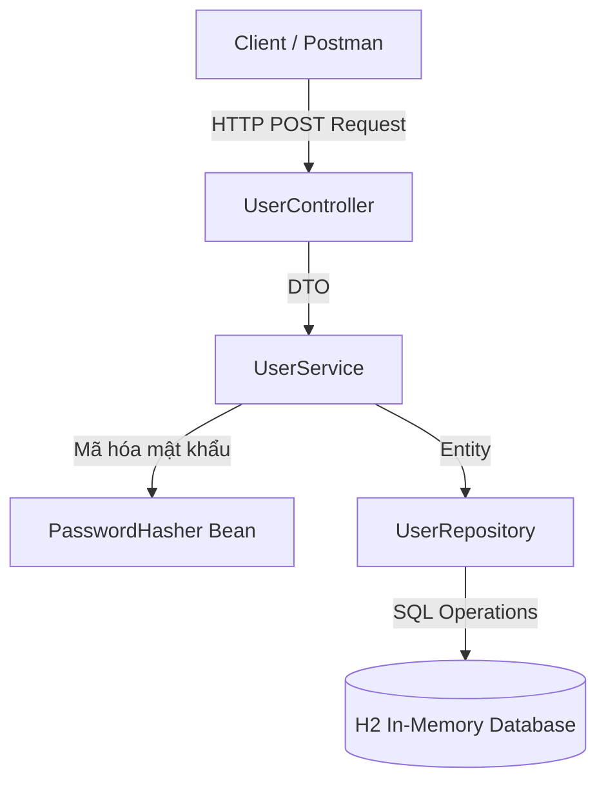

# Hướng Dẫn Thực Hành: Lưu Trữ Mật Khẩu An Toàn (Password Storage)

Tài liệu này hướng dẫn bạn thực hành chi tiết về **Case Study 1: Lưu trữ Mật khẩu an toàn** dựa trên lý thuyết tại [README.md](file:///d:/backend_docs/8.security/README.md). Dự án đã được tái cấu trúc thành một **ứng dụng backend thực tế** chuẩn doanh nghiệp với kiến trúc phân tầng đầy đủ.

---

## 1. Kiến Trúc Phân Tầng Của Dự Án (Enterprise Layered Architecture)

Trong các dự án thực tế, mã nguồn được chia nhỏ thành các tầng riêng biệt để quản lý trách nhiệm (Single Responsibility):



### Chi tiết các tầng đã triển khai:

1.  **Tầng Cấu Hình (Configuration)**:
    *   **[SecurityConfig.java](file:///d:/backend_docs/8.security/security/src/main/java/com/tamdao/security/config/SecurityConfig.java)**: Định nghĩa `PasswordHasher` dưới dạng một Spring Bean sử dụng thuật toán Argon2id làm mặc định để các Service có thể Inject dễ dàng.
2.  **Tầng Controller (REST API Layer)**:
    *   **[UserController.java](file:///d:/backend_docs/8.security/security/src/main/java/com/tamdao/security/controller/UserController.java)**: Định nghĩa các Rest Endpoint cho khách hàng (`/api/users/register`, `/api/users/login`) và xử lý lỗi tập trung.
3.  **Tầng DTO (Data Transfer Objects)**:
    *   **[UserRegisterDto.java](file:///d:/backend_docs/8.security/security/src/main/java/com/tamdao/security/dto/UserRegisterDto.java)**: Dữ liệu gửi lên khi đăng ký.
    *   **[UserLoginDto.java](file:///d:/backend_docs/8.security/security/src/main/java/com/tamdao/security/dto/UserLoginDto.java)**: Dữ liệu gửi lên khi đăng nhập.
    *   **[UserResponseDto.java](file:///d:/backend_docs/8.security/security/src/main/java/com/tamdao/security/dto/UserResponseDto.java)**: Cấu trúc phản hồi kết quả trả về Client (trả về cả chuỗi băm để tiện theo dõi học tập).
4.  **Tầng Service (Business Logic Layer)**:
    *   **[UserService.java](file:///d:/backend_docs/8.security/security/src/main/java/com/tamdao/security/service/UserService.java)**: Định nghĩa luồng nghiệp vụ đăng ký và đăng nhập.
    *   **[UserServiceImpl.java](file:///d:/backend_docs/8.security/security/src/main/java/com/tamdao/security/service/UserServiceImpl.java)**: Triển khai logic, kiểm tra trùng lặp tài khoản, băm mật khẩu thô trước khi lưu và so khớp mật khẩu bằng `PasswordHasher.verify(...)`.
5.  **Tầng Repository (Data Access Layer)**:
    *   **[UserRepository.java](file:///d:/backend_docs/8.security/security/src/main/java/com/tamdao/security/repository/UserRepository.java)**: Kế thừa `JpaRepository` của Spring Data JPA để tương tác trực tiếp với cơ sở dữ liệu.
6.  **Tầng Entity (Domain Model)**:
    *   **[User.java](file:///d:/backend_docs/8.security/security/src/main/java/com/tamdao/security/entity/User.java)**: Lớp ánh xạ xuống bảng `users` trong CSDL, chứa trường `passwordHash` dùng để lưu trữ chuỗi băm mật khẩu đã có Salt.

---

## 2. Hướng Dẫn Chạy & Kiểm Chứng REST API

### Bước 1: Khởi chạy dự án
Mở Terminal tại thư mục `d:\backend_docs\8.security\security\` và chạy lệnh:
```bash
.\mvnw spring-boot:run
```
*(Server REST API sẽ được khởi chạy mặc định tại cổng `http://localhost:8080`)*

### Bước 2: Thử nghiệm Đăng Ký Tài Khoản (User Registration)
Sử dụng công cụ cURL (hoặc Postman/Insomnia) để gửi yêu cầu đăng ký một tài khoản mới:

```bash
curl -X POST http://localhost:8080/api/users/register \
  -H "Content-Type: application/json" \
  -d "{\"username\": \"tamdao\", \"password\": \"mySecretPassword123!\", \"displayName\": \"Tam Dao\"}"
```

**Kết quả phản hồi (Response):**
```json
{
  "id": 1,
  "username": "tamdao",
  "displayName": "Tam Dao",
  "passwordHash": "$argon2id$v=19$m=16384,t=2,p=1$B2nB1yO...", 
  "statusMessage": "User registered successfully! Password stored as Hash."
}
```
> [!NOTE]
> Hãy quan sát trường `"passwordHash"`. Mật khẩu gốc `"mySecretPassword123!"` hoàn toàn biến mất và được lưu dưới dạng chuỗi băm Argon2id ngẫu nhiên.

---

### Bước 3: Thử nghiệm Đăng Nhập (User Login)

#### 1. Đăng nhập đúng mật khẩu:
```bash
curl -X POST http://localhost:8080/api/users/login \
  -H "Content-Type: application/json" \
  -d "{\"username\": \"tamdao\", \"password\": \"mySecretPassword123!\"}"
```
**Kết quả:** Trả về mã lỗi HTTP `200 OK` kèm thông báo đăng nhập thành công.

#### 2. Đăng nhập sai mật khẩu:
```bash
curl -X POST http://localhost:8080/api/users/login \
  -H "Content-Type: application/json" \
  -d "{\"username\": \"tamdao\", \"password\": \"wrongPassword123\"}"
```
**Kết quả:** Trả về mã lỗi HTTP `400 Bad Request` kèm thông báo:
```text
Invalid username or password!
```

---

## 3. Lý Thuyết Bảo Mật Ứng Dụng Thực Tế

1.  **Tuyệt đối không lưu Salt riêng biệt ở dạng dễ đoán**: Khi dùng BCrypt hoặc Argon2, chuỗi muối Salt tự động được tích hợp trực tiếp vào trong chuỗi Hash kết quả (ví dụ: phần nằm giữa các ký hiệu `$`). Spring Security tự động giải trích ra chuỗi Salt đó khi tiến hành so khớp (`verify`). Bạn không cần thiết kế một cột `salt` thủ công trong DB trừ khi dùng thuật toán cũ.
2.  **Khử trùng lặp Username tại Service**: Chúng ta sử dụng `userRepository.existsByUsername()` để chặn đăng ký trùng lặp tài khoản nhằm bảo vệ tính toàn vẹn của dữ liệu trước khi thực hiện lưu Hash mật khẩu.
3.  **Tách cấu hình Hasher**: Bằng cách khai báo `PasswordHasher` là `@Bean`, nếu sau này bạn muốn đổi từ `Argon2` sang `BCrypt`, bạn chỉ cần thay đổi định nghĩa `@Bean` trong `SecurityConfig` mà hoàn toàn không cần phải sửa đổi bất kỳ dòng mã nào trong `UserServiceImpl`. Điều này tuân thủ nguyên tắc SOLID: **Open/Closed Principle**.
