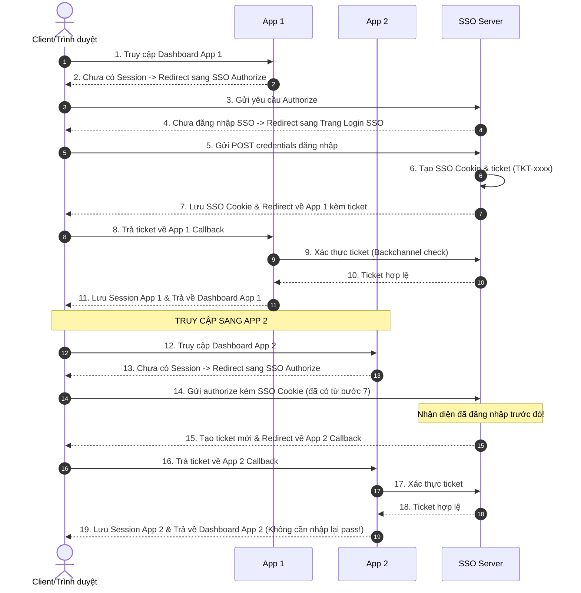

# Hướng Dẫn Thực Hành: Đăng Nhập Một Lần (Single Sign-On - SSO)

Tài liệu này hướng dẫn bạn thực hành mô phỏng cơ chế **SSO (Single Sign-On)** dựa trên luồng sequence diagram tại mục 3.6 của [README.md](file:///d:/backend_docs/8.security/README.md).

---

## 1. Cơ Chế Hoạt Động SSO (OIDC / OAuth2 Flow)

Mô hình thực hành này mô phỏng luồng đăng nhập một lần thông qua một máy chủ nhận diện tập trung (**SSO Identity Server**) và hai ứng dụng độc lập (**App 1** và **App 2**):



---

## 2. Các Thành Phần Mã Nguồn Đã Triển Khai

Trong file **[SsoDemoController.java](file:///d:/backend_docs/8.security/security/src/main/java/com/tamdao/security/controller/SsoDemoController.java)**, chúng ta đã giả lập:
1.  **SSO Server Endpoints**:
    *   `/api/sso/authorize`: Nhận yêu cầu xác thực chéo.
    *   `/api/sso/login-page`: Hiển thị trang đăng nhập.
    *   `/api/sso/login-submit`: Tạo cookie `SSO_COOKIE` và vé dùng một lần `ticket`.
    *   `/api/sso/verify-ticket`: Xác thực vé từ phía Backend.
2.  **App 1 Endpoints**:
    *   `/api/app1/dashboard`: Yêu cầu cookie `APP1_SESSION`.
    *   `/api/app1/callback`: Nhận vé `ticket`, kiểm tra với SSO rồi cấp cookie local.
3.  **App 2 Endpoints**:
    *   `/api/app2/dashboard`: Yêu cầu cookie `APP2_SESSION`.
    *   `/api/app2/callback`: Nhận vé `ticket`, kiểm tra với SSO rồi cấp cookie local.

---

## 3. Các Bước Thực Hành Từng Bước

Để theo dõi luồng Redirect chéo giữa các ứng dụng bằng `curl`, chúng ta dùng cờ `-L` (tự động đi theo Redirect) và một file lưu Cookie chung `sso_cookies.txt`.

### Bước 1: Khởi chạy Server
Mở Terminal tại thư mục `d:\backend_docs\8.security\security\` và chạy:
```bash
.\mvnw spring-boot:run
```

---

### Bước 2: Truy cập App 1 (Bắt buộc chuyển hướng đăng nhập)
Chúng ta cố gắng truy cập trực tiếp vào Dashboard của App 1:

```bash
# Thử truy cập Dashboard App 1 (chưa đăng nhập)
curl -L -c sso_cookies.txt -i http://localhost:8080/api/app1/dashboard
```

**Kết quả phản hồi (Response):**
1. Hệ thống thấy bạn chưa có Session App 1 -> Redirect sang `/api/sso/authorize`.
2. SSO thấy bạn chưa có Session SSO -> Redirect sang `/api/sso/login-page`.
3. Phản hồi hiển thị mã HTML trang đăng nhập SSO Central Server.

---

### Bước 3: Đăng nhập tại SSO Server
Gửi yêu cầu đăng nhập bằng tài khoản mẫu `user1` (được tạo tự động bởi `DataInitializer`):

```bash
# Gửi POST đăng nhập kèm url redirect quay lại App 1 callback
curl -L -b sso_cookies.txt -c sso_cookies.txt -i -X POST http://localhost:8080/api/sso/login-submit \
  -d "username=user1" \
  -d "password=userPass123" \
  -d "redirectUrl=/api/app1/callback"
```

**Kết quả chuỗi xử lý ngầm (được curl -L chạy tự động):**
1. SSO Server xác thực tài khoản -> cấp cookie `SSO_COOKIE` lưu vào `sso_cookies.txt` -> phát ticket `TKT-xxxx`.
2. SSO Server redirect về App 1 callback `/api/app1/callback?ticket=TKT-xxxx`.
3. App 1 kiểm tra ticket qua backchannel -> xác thực thành công -> cấp session cookie local `APP1_SESSION` -> redirect về Dashboard App 1.
4. Terminal hiển thị: **`Chào mừng bạn đến APP 1 Dashboard! Đang đăng nhập dưới quyền: user1`**

---

### Bước 4: Đăng nhập một lần sang App 2 (Không cần nhập mật khẩu)
Bây giờ, chúng ta truy cập Dashboard của App 2. Hãy nhớ rằng chúng ta đã có `SSO_COOKIE` trong file `sso_cookies.txt`:

```bash
# Truy cập App 2 Dashboard kèm file cookie hiện tại
curl -L -b sso_cookies.txt -c sso_cookies.txt -i http://localhost:8080/api/app2/dashboard
```

**Kết quả phản hồi:**
1. App 2 thấy bạn chưa có local cookie `APP2_SESSION` -> Redirect sang SSO Server `/api/sso/authorize`.
2. Trình duyệt gửi kèm `SSO_COOKIE`. SSO Server lập tức **nhận diện bạn đã đăng nhập trước đó** tại Bước 3!
3. SSO Server tự động phát ticket mới `TKT-yyyy` -> Redirect về App 2 callback `/api/app2/callback?ticket=TKT-yyyy`.
4. App 2 xác thực ticket -> tạo session cookie `APP2_SESSION` -> Redirect về Dashboard App 2.
5. Terminal hiển thị ngay lập tức: **`Chào mừng bạn đến APP 2 Dashboard! Đang đăng nhập dưới quyền: user1`** mà bạn hoàn toàn **không cần nhập lại mật khẩu**!
