# Thiết kế Bộ nhớ đệm (Caching Design Guide)

<details open>
<summary><b>Mục lục (Table of Contents)</b></summary>

- [1. Giới thiệu về Cache (Cache Introduction)](#1-giới-thiệu-về-cache-cache-introduction)
  - [1.1. Khái niệm cơ bản về Cache](#11-khái-niệm-cơ-bản-về-cache)
  - [1.2. Các lưu ý quan trọng (Cache Note)](#12-các-lưu-ý-quan-trọng-cache-note)
  - [1.3. Vị trí ứng dụng Cache (Where Is Cache Used)](#13-vị-trí-ứng-dụng-cache-where-is-cache-used)
- [2. Chiến lược Caching (Caching Strategies)](#2-chiến-lược-caching-caching-strategies)
  - [2.1. Chiến lược Đọc (Read Strategies)](#21-chiến-lược-đọc-read-strategies)
  - [2.2. Chiến lược Ghi (Write Strategies)](#22-chiến-lược-ghi-write-strategies)
  - [2.3. Bài toán Bất nhất dữ liệu & Thu hồi Cache (Data Inconsistency & Cache Invalidation)](#23-bài-toán-bất-nhất-dữ-liệu--thu-hồi-cache-data-inconsistency--cache-invalidation)
  - [2.4. Đi sâu vào Write-Around (Dive into Write-Around)](#24-đi-sâu-vào-write-around-dive-into-write-around)
  - [2.5. Nỗ lực đầu tiên: Cập nhật Cache (The First Try: Update Cache)](#25-nỗ-lực-đầu-tiên-cập-nhật-cache-the-first-try-update-cache)
  - [2.6. Nỗ lực thứ hai: Xóa Cache (The Second Try: Delete Cache)](#26-nỗ-lực-thứ-hai-xóa-cache-the-second-try-delete-cache)
  - [2.7. Nỗ lực thứ ba: RA + DWA (The Third Try)](#27-nỗ-lực-thứ-ba-ra--dwa-the-third-try)
- [3. Thử thách khi triển khai Cache (Challenges)](#3-thử-thách-khi-triển-khai-cache-challenges)
  - [3.1. Thử thách về Độ tin cậy (Reliability Challenges)](#31-thử-thách-về-độ-tin-cậy-reliability-challenges)
  - [3.2. Thử thách khi Hệ thống tải cao (High Traffic Challenges)](#32-thử-thách-khi-hệ-thống-tải-cao-high-traffic-challenges)

</details>

---

# 1. Giới thiệu về Cache (Cache Introduction)

## 1.1. Khái niệm cơ bản về Cache

*   **Định nghĩa:** Cache là một thành phần phần cứng hoặc phần mềm chuyên dụng được thiết kế để **lưu trữ dữ liệu tạm thời (temporarily stores data)**.
*   **Mục đích cốt lõi:** Giúp các yêu cầu truy vấn dữ liệu tương ứng trong tương lai có thể **được phục vụ nhanh hơn rất nhiều (be served faster)** so với việc truy cập trực tiếp vào nguồn dữ liệu gốc.
*   **Bản chất dữ liệu lưu trữ trong Cache:**
    *   **Bản sao dữ liệu (A copy of data):** Được lấy và đồng bộ từ nguồn dữ liệu gốc (ví dụ: Cơ sở dữ liệu quan hệ - Relational Database).
    *   **Kết quả của một tác vụ tính toán trước đó (The result of an earlier computation):** Lưu trữ kết quả của các phép tính phức tạp, các truy vấn tổng hợp tốn nhiều tài nguyên CPU/IO, giúp tránh việc phải thực hiện tính toán lại từ đầu.

### Lá chắn bảo vệ Database (Cache is a shield for DB):

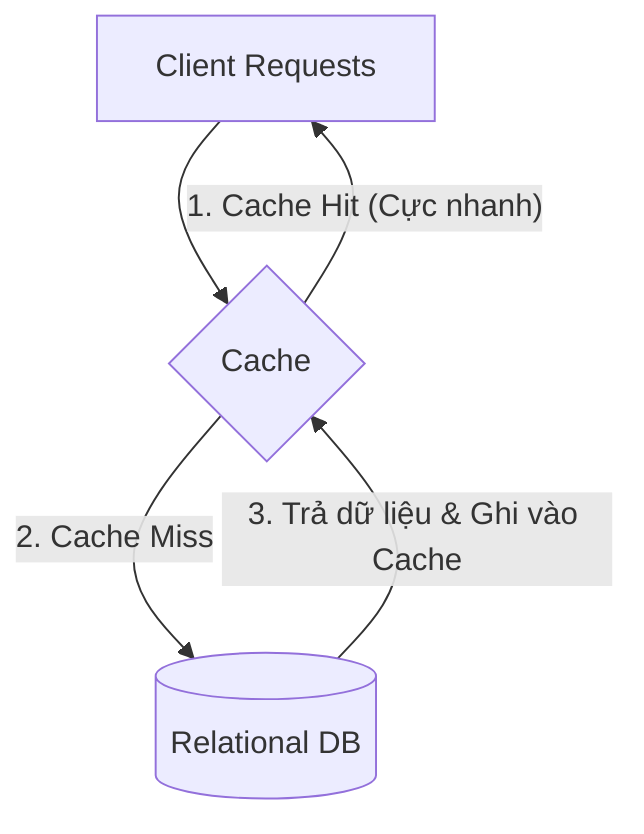

> [!IMPORTANT]
> **Vai trò "Lá chắn bảo vệ" (Shield for DB):**
> Trong các kiến trúc backend hiện đại, Cache đóng vai trò như một **tấm khiên bảo vệ** cho hệ thống cơ sở dữ liệu quan hệ (Database):
> 1. **Giảm tải truy vấn (Read Heavy):** Chuyển hướng phần lớn (tới 90%+) các truy vấn đọc dữ liệu từ Database sang RAM của Cache server (ví dụ: Redis, Memcached). Điều này giúp Database tránh được tình trạng cạn kiệt tài nguyên CPU và bộ nhớ đệm IO.
> 2. **Tránh nghẽn cổ chai (Bottleneck):** Giúp hệ thống duy trì độ trễ thấp (low latency) và băng thông xử lý cao, ngăn chặn việc quá tải hàng loạt yêu cầu truy vấn trực tiếp vào ổ đĩa cứng của DB.

---

## 1.2. Các lưu ý quan trọng (Cache Note)

*   **Sự đánh đổi (Trade-off):** Khi sử dụng Cache, hệ thống sẽ luôn phải đối mặt với các sự đánh đổi về mặt kiến trúc:
    *   **Hiệu năng vs Chi phí (Performance vs Cost/Space):** Bộ nhớ Cache (như RAM) mang lại tốc độ cực nhanh nhưng không gian lưu trữ hạn hẹp và đắt đỏ hơn rất nhiều so với ổ đĩa.
    *   **Hiệu năng vs Tính nhất quán (Performance vs Consistency):** Đôi khi (sometime) bạn phải chấp nhận độ trễ đồng bộ (khiến dữ liệu trên Cache tạm thời cũ hơn dưới DB) để đảm bảo tốc độ phản hồi tức thời cho client.
*   **Dữ liệu điểm nóng (Hotspot Data):** Cache đặc biệt phù hợp và phát huy sức mạnh tối đa khi lưu trữ các "điểm nóng" - những dữ liệu ít thay đổi nhưng được truy vấn với tần suất rất cao.
*   **Tỷ lệ trúng Cache (Cache Hit Rate):** Đây là chỉ số đánh giá quan trọng nhất (most important metric) của mọi hệ thống Caching.
    *   *Nguyên lý 80/20:* Hãy luôn tuân thủ nguyên lý này bằng cách cache 20% lượng dữ liệu quan trọng nhất nhưng phục vụ đến 80% lưu lượng truy cập để đạt được Hit Rate cao nhất.
*   **Phân biệt Cache và Buffer (Cache != Buffer):**
    *   **Buffer (Bộ đệm):** Là vùng lưu trữ tạm thời (có thể trên RAM hoặc đĩa cứng) dùng để gom dữ liệu trước khi chuyển tiếp (transmit) chung sang một thành phần khác.
    *   **Bản chất:** Buffer hoạt động có tính chất giống như một hàng đợi (Queue), nhằm mục đích xử lý chênh lệch tốc độ luân chuyển giữa các tiến trình, hoàn toàn không phải để lưu lại dữ liệu cho việc truy vấn nhiều lần giống như Cache.

---

## 1.3. Vị trí ứng dụng Cache (Where Is Cache Used)

Cache có thể được đặt ở rất nhiều tầng khác nhau trong một hệ thống, trải dài từ phía máy khách cho đến sâu bên trong cơ sở dữ liệu:

*   **Client (Trình duyệt/App):** Lưu trữ các kết quả phản hồi (Responses) để tránh tải lại trang web hoặc dữ liệu không cần thiết.
*   **CDN (Content Delivery Network):** Đặt tại các máy chủ biên (edge servers) gần người dùng nhất để phân phối siêu tốc các tệp tĩnh (Static files: html, js, css, config...) và tệp đa phương tiện (Media files: video, audio, image...).
*   **Proxy / API Gateway:** Đóng vai trò là cổng giao tiếp đứng trước Server, có khả năng cache lại các phản hồi tĩnh hoặc các file tĩnh (Static files).
*   **Server (Local Cache):** Bộ nhớ đệm cục bộ nằm ngay trên RAM của server ứng dụng. Thường dùng để lưu trữ các cấu hình (Configs) ít thay đổi, giúp server truy xuất ngay lập tức với độ trễ bằng 0.
*   **Remote Cache (Cache phân tán):** Một cụm máy chủ độc lập chuyên dụng cho việc lưu trữ (như Redis, Memcached). Thường được dùng để lưu trữ:
    *   Cấu hình chung (Configs).
    *   Kết quả truy vấn Database (Query Result).
    *   Kết quả của các phép tính phức tạp (Calculation Result).
    *   Dữ liệu chia sẻ giữa các server (Shared Information / Session).
*   **Database:** Bản thân các hệ quản trị CSDL (như MySQL, PostgreSQL) cũng có bộ nhớ đệm riêng (Query Cache) để tối ưu các câu truy vấn lặp lại nhiều lần.

### Sơ đồ kiến trúc phân tầng Cache:

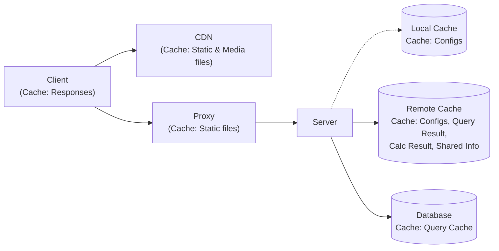

---

# 2. Chiến lược Caching (Caching Strategies)

Khi áp dụng Cache vào hệ thống, việc lựa chọn chiến lược đọc/ghi (Read/Write Strategies) phù hợp là vô cùng quan trọng để đảm bảo **tính nhất quán của dữ liệu (Data Consistency)** và **hiệu năng xử lý (Performance)** của ứng dụng.

---

## 2.1. Chiến lược Đọc (Read Strategies)

Chiến lược đọc xác định cách ứng dụng truy vấn dữ liệu từ Cache và Database để tối ưu hóa tốc độ phản hồi.

### 2.1.1. Read-Aside (Cache-Aside / Lazy Loading)

Đây là chiến lược đọc phổ biến nhất trong các ứng dụng web hiện đại.

*   **Cơ chế hoạt động:**
    1.  Ứng dụng nhận yêu cầu đọc dữ liệu từ Client.
    2.  Ứng dụng thực hiện kiểm tra dữ liệu trong Cache Server (ví dụ: Redis).
    3.  **Trường hợp 1 - Cache Hit (Trúng cache):** Lấy dữ liệu từ Cache và trả về trực tiếp cho Client.
    4.  **Trường hợp 2 - Cache Miss (Trượt cache):** Truy vấn dữ liệu từ Database, trả kết quả về cho Client, đồng thời lưu bản ghi này vào Cache để phục vụ cho các yêu cầu đọc sau đó.

*   **Sơ đồ hoạt động:**
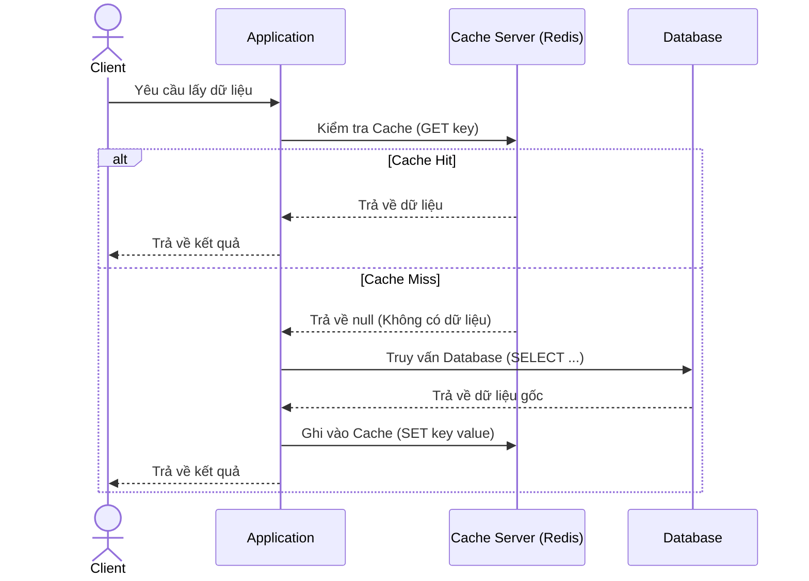

*   **Đánh giá chiến lược:**
    *   **Ưu điểm (Pros):**
        *   **Chịu lỗi tốt (Tolerate cache failures):** Nếu Cache Server bị sập (crash), hệ thống không bị gián đoạn hoàn toàn vì ứng dụng vẫn có thể truy vấn trực tiếp xuống Database (dù tốc độ sẽ chậm hơn).
        *   **Linh hoạt với mô hình dữ liệu (Flexible for data models):** Lập trình viên toàn quyền quyết định việc kết hợp dữ liệu phức tạp từ nhiều nguồn rồi mới định dạng lưu vào Cache, không bị gò bó bởi cấu trúc của Database gốc.
    *   **Nhược điểm (Cons):**
        *   **Phức tạp cho ứng dụng (Complex for app):** Ứng dụng phải tự thân gánh vác toàn bộ việc xử lý logic rẽ nhánh cho Cache Hit, truy vấn DB khi Cache Miss và thực hiện ghi kết quả ngược lại vào Cache.
        *   **Bất nhất dữ liệu (Data inconsistency):** Dữ liệu trong Cache có thể trở nên lỗi thời nếu Database bị thay đổi bởi một thành phần khác mà không có cơ chế thu hồi (invalidate) Cache kịp thời.

---

### 2.1.2. Read-Through (Đọc xuyên thấu)

Khác với Cache-Aside khi ứng dụng phải tự quản lý logic kiểm tra và nạp dữ liệu, Read-Through giao toàn bộ trách nhiệm này cho một Cache Provider/Library trung gian.

*   **Cơ chế hoạt động:**
    1.  Ứng dụng chỉ tương tác duy nhất với Cache Provider.
    2.  Cache Provider kiểm tra dữ liệu trong bộ nhớ đệm.
    3.  Nếu xảy ra **Cache Miss**, Cache Provider tự động truy vấn dữ liệu từ Database, lưu dữ liệu đó vào bộ nhớ đệm của mình rồi mới trả về cho Ứng dụng.

*   **Sơ đồ hoạt động:**
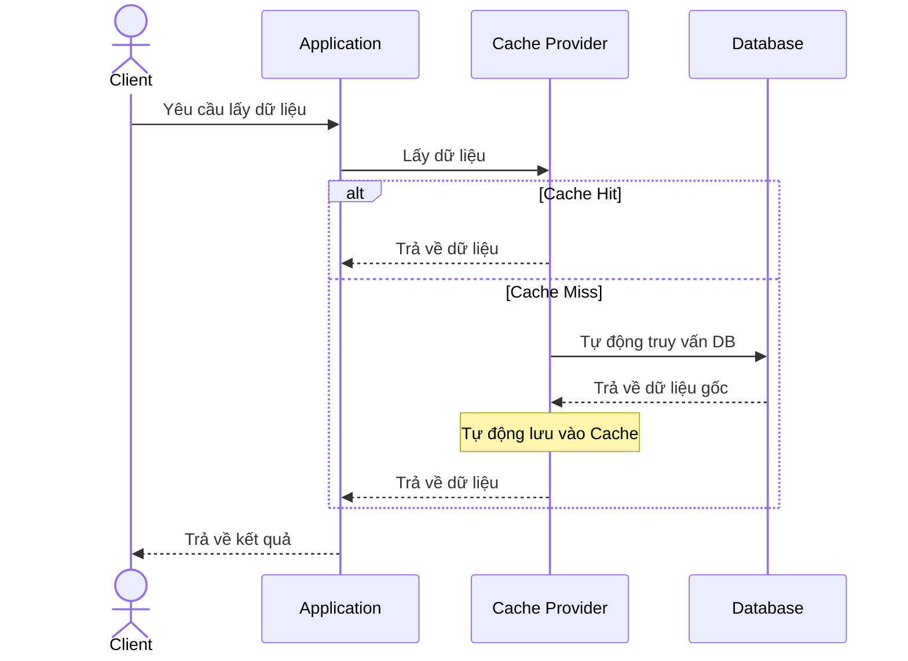

*   **Đánh giá chiến lược:**
    *   **Ưu điểm (Pros):**
        *   **Đơn giản hóa mã nguồn:** Mã nguồn của ứng dụng sạch hơn rất nhiều vì không cần xử lý logic rẽ nhánh Hit/Miss.
    *   **Nhược điểm (Cons):**
        *   **Phức tạp khi triển khai:** Đòi hỏi Cache Provider phải tích hợp sâu và hỗ trợ kết nối trực tiếp đến cơ sở dữ liệu tương ứng.

---

## 2.2. Chiến lược Ghi (Write Strategies)

Chiến lược ghi quyết định thời điểm và cách thức đồng bộ hóa dữ liệu mới hoặc dữ liệu thay đổi từ Ứng dụng vào Cache và Database.

### 2.2.1. Write-Through (Ghi xuyên thấu)

Dữ liệu được cập nhật đồng thời vào cả bộ nhớ đệm và cơ sở dữ liệu gốc trước khi thông báo thành công.

*   **Cơ chế hoạt động:**
    1.  Ứng dụng nhận yêu cầu ghi/cập nhật dữ liệu từ Client.
    2.  Ứng dụng ghi dữ liệu mới vào Cache Server.
    3.  Ứng dụng tiếp tục ghi dữ liệu mới vào Database.
    4.  Khi cả hai hành động ghi đều hoàn tất thành công, ứng dụng mới phản hồi kết quả cho Client.

*   **Sơ đồ hoạt động:**
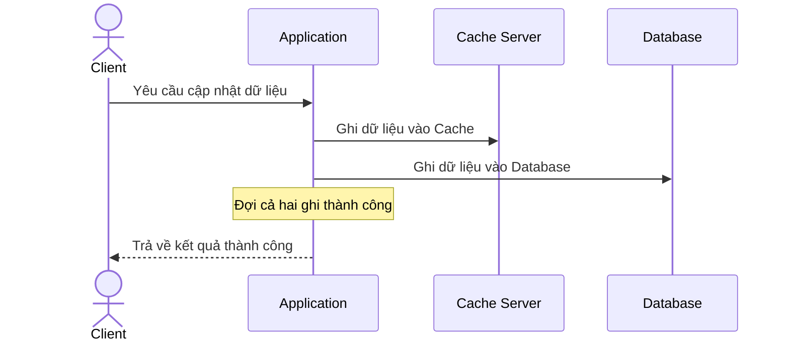

*   **Đánh giá chiến lược:**
    *   **Ưu điểm (Pros):**
        *   **Nhất quán dữ liệu tuyệt đối:** Loại bỏ hoàn toàn nguy cơ bất nhất dữ liệu (Stale Data) vì Cache và Database luôn chứa cùng một phiên bản dữ liệu mới nhất.
    *   **Nhược điểm (Cons):**
        *   **Độ trễ ghi cao (High Write Latency):** Phải chờ đợi hai kết nối mạng ghi dữ liệu hoàn tất (đặc biệt ghi xuống đĩa của DB thường tốn nhiều thời gian).

---

### 2.2.2. Write-Around (Ghi bỏ qua Cache)

Dữ liệu mới hoặc dữ liệu cập nhật sẽ được ghi trực tiếp vào Database, và đồng thời bộ nhớ đệm liên quan sẽ bị thu hồi (invalidate) một cách bất đồng bộ để tránh dữ liệu cũ.

*   **Cơ chế hoạt động (Invalid cache asynchronously):**
    1.  Ứng dụng tiến hành ghi dữ liệu thay đổi trực tiếp xuống Database (1. Write).
    2.  Ứng dụng phát tín hiệu thu hồi (xóa) bản ghi tương ứng trên Cache một cách bất đồng bộ (2. Invalidate).
    3.  Ứng dụng phản hồi kết quả thành công cho Client. (Lần đọc tiếp theo sẽ kích hoạt Cache Miss và dữ liệu mới sẽ được nạp lại vào Cache từ DB).

*   **Sơ đồ hoạt động:**
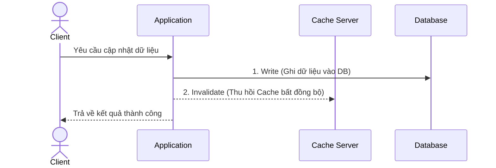

*   **Đánh giá chiến lược:**
    *   **Ưu điểm (Pros):**
        *   **Phân tách hệ thống (Decoupling cache and storage systems):** Hệ thống lưu trữ (DB) và bộ nhớ đệm (Cache) hoạt động tách biệt. Quá trình ghi không bị phụ thuộc khắt khe vào tình trạng khả dụng của Cache Server.
    *   **Nhược điểm (Cons):**
        *   **Kém hiệu quả với dữ liệu cập nhật liên tục (Inefficient for Frequently Updated Data):** Nếu một luồng dữ liệu vừa bị ghi/cập nhật liên tục lại vừa được yêu cầu đọc liên tục, hệ thống sẽ rơi vào trạng thái Cache Miss liên tiếp, dội ngược áp lực truy vấn xuống DB.
        *   **Bất nhất dữ liệu (Data inconsistency):** Vì quá trình *Invalidate* diễn ra bất đồng bộ, nếu tín hiệu xóa bị rớt hoặc chậm trễ, các luồng Client khác vẫn có nguy cơ đọc phải dữ liệu cũ đang tồn tại trong Cache.

---

### 2.2.3. Write-Behind / Write-Back (Ghi trì hoãn)

Ứng dụng ghi dữ liệu cực nhanh vào Cache Server rồi phản hồi ngay lập tức, việc đồng bộ xuống Database sẽ được xử lý bất đồng bộ phía sau.

*   **Cơ chế hoạt động:**
    1.  Ứng dụng ghi dữ liệu mới trực tiếp vào Cache Server (RAM).
    2.  Ứng dụng trả về kết quả thành công ngay lập tức cho Client (độ trễ cực thấp).
    3.  Một tác vụ chạy ngầm bất đồng bộ (Background Task / Worker) sẽ định kỳ quét hoặc gom các bản ghi thay đổi từ Cache Server để cập nhật theo lô (Batch Write) xuống Database.

*   **Sơ đồ hoạt động:**
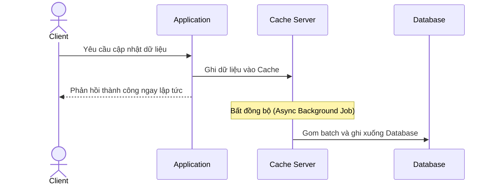

*   **Đánh giá chiến lược:**
    *   **Ưu điểm (Pros):**
        *   **Hiệu năng ghi cực khủng (High Write Performance):** Giảm độ trễ tối đa cho Client vì thao tác ghi trên RAM của Cache Server chỉ tốn vài mili-giây.
        *   **Giảm tải tối đa cho Database:** Gom hàng ngàn yêu cầu cập nhật nhỏ lẻ thành một câu lệnh Batch Update duy nhất xuống DB, giảm thiểu IOPS trên ổ cứng DB.
    *   **Nhược điểm (Cons):**
        *   **Nguy cơ mất mát dữ liệu (Data Loss Risk):** Nếu Cache Server bị sập nguồn đột ngột (crash/power outage) trước khi tiến trình ngầm kịp ghi dữ liệu đồng bộ xuống Database, những dữ liệu mới đó sẽ bị mất vĩnh viễn.

---

## 2.3. Bài toán Bất nhất dữ liệu & Thu hồi Cache (Data Inconsistency & Cache Invalidation)

### 2.3.1. Vấn đề cốt lõi (The Common Problem)
Vấn đề thường gặp và nhức nhối nhất khi sử dụng Cache chính là **Bất nhất dữ liệu (Data Inconsistency)**. Điều này xảy ra khi dữ liệu gốc dưới Database đã được cập nhật thành bản mới (ví dụ: `Age = 27`), nhưng Cache chưa kịp đồng bộ vẫn còn lưu giữ và trả về dữ liệu cũ (ví dụ: `Age = 26`).

**Giải pháp (Solution):** Sử dụng cơ chế **Thu hồi Cache (Cache Invalidation)**.
> **Cache Invalidation** là quá trình chủ động loại bỏ hoặc xóa các dữ liệu không còn hợp lệ (no longer valid) hoặc không còn hữu ích ra khỏi bộ nhớ đệm.

Các hình thức Thu hồi Cache phổ biến (Types of Cache Invalidation):
1.  **Time-based (Dựa trên thời gian):** Tự động xóa dựa trên thời gian sống quy định (TTL - Time To Live).
2.  **Command-based (Dựa trên lệnh):** Xóa thủ công hoặc lập trình qua các câu lệnh/API trực tiếp từ ứng dụng.
3.  **Event-based (Dựa trên sự kiện):** Xóa tự động thông qua việc lắng nghe luồng sự kiện (ví dụ: bắt CDC event qua Kafka khi DB vừa thay đổi).
4.  **Group-based (Dựa trên nhóm):** Thu hồi hàng loạt các bản ghi có mối liên hệ thông qua prefix (tiền tố) chung hoặc tagging.

### 2.3.2. Tại sao Thu hồi Cache lại khó? (Why Cache Invalidation is Hard?)

Xóa Cache nghe có vẻ đơn giản, nhưng thực tế đây là một trong những bài toán khó nhằn nhất bởi sự phức tạp (complexity) đến từ các yếu tố sau:

*   **Thời gian (Timing):** Thiết lập TTL bao lâu là đủ (How long is enough)? Quá ngắn thì mất tác dụng của Cache, quá dài thì người dùng đọc phải dữ liệu cũ.
*   **Tranh chấp đồng thời (Concurrency):** Rất dễ xảy ra hiện tượng **Race condition (Điều kiện tranh chấp)**. Ví dụ: Luồng A đang ghi DB và xóa Cache, cùng lúc đó luồng B không thấy Cache nên đọc DB (lấy được data cũ trước khi A commit) và ghi đè cái cũ đó lên lại Cache.
*   **Quan hệ dữ liệu (Data relationships):** Một bản ghi (Entity) bị thay đổi dưới DB có thể ảnh hưởng và cần phải invalidate hàng chục danh sách/View đã được cache trước đó. 
*   **Phân tán (Cache can be everywhere):** Khác với Database thường tập trung tại một nguồn, Cache có thể nằm rải rác ở khắp mọi nơi (Trình duyệt, CDN, Gateway, Redis...). Việc ra lệnh xóa sạch đồng loạt tất cả các tầng này cùng một lúc gần như là bất khả thi.
*   **Khó truy tìm nguyên nhân gốc (Hard to find root causes):** Khi phát hiện dữ liệu bất nhất, nguyên nhân có thể đến từ vô vàn các tình huống dị thường (Things can go wrong in a million different ways) như rớt mạng đoạn xóa cache, timeout, sai thứ tự event, v.v.

*(Hệ thống sẽ đi sâu vào cách giải quyết triệt để bài toán Data Inconsistency - "No more deal with Read-Aside" ở các kiến trúc chuyên sâu tiếp theo)*

---

## 2.4. Đi sâu vào Write-Around (Dive into Write-Around)

Để xử lý việc thu hồi Cache trong chiến lược Write-Around, ứng dụng thường sử dụng hình thức **Command-based Cache Invalidation** (Phát lệnh chủ động). Có hai cách tiếp cận để Invalidate:
1.  **Update (Replace):** Cập nhật đè dữ liệu mới thẳng vào Cache để sử dụng ngay.
2.  **Delete:** Xóa hẳn bản ghi cũ ra khỏi Cache, để lần truy cập sau ứng dụng tự động nạp lại từ DB qua luồng Cache Miss.

*(Phân tích chi tiết tại sao giải pháp Update Cache lại sinh ra lỗi ở mục 2.5 dưới đây).*

---

## 2.5. Nỗ lực đầu tiên: Cập nhật Cache (The First Try: Update Cache)

Thay vì xóa đi (Delete), các hệ thống ở giai đoạn đầu thường có xu hướng ngây thơ chọn giải pháp **Update (Cập nhật trực tiếp)** để dữ liệu trên Cache luôn ở trạng thái "nóng". 

Tuy nhiên, bài toán đặt ra là: **Update Cache First** (Ghi Cache trước, DB sau) hay **Update Cache Later** (Ghi DB trước, Cache sau)? Cả hai cách tiếp cận này đều dẫn đến thảm họa **Race Condition (Điều kiện tranh chấp)** khi có 2 luồng (request) cùng ghi dữ liệu đồng thời.

### 2.5.1. Update Cache First (Ghi Cache trước, DB sau)
Nếu ứng dụng ưu tiên cập nhật Cache trước rồi mới ghi xuống DB, **dữ liệu dưới DB có nguy cơ bị sai (DB is wrong)**.

*   **Kịch bản Race Condition (2 Write requests):**
    1.  **Request 1** ghi dữ liệu `Age = 1` vào **Cache**.
    2.  **Request 2** ghi dữ liệu `Age = 2` vào **Cache**.
    3.  **Request 2** ghi dữ liệu `Age = 2` vào **DB**.
    4.  **Request 1** (do mạng chậm/CPU gián đoạn) giờ mới thực hiện ghi `Age = 1` vào **DB**.
*   **Kết quả:** Cache lưu `Age = 2` (Đúng), nhưng DB lưu `Age = 1` (Sai hoàn toàn).

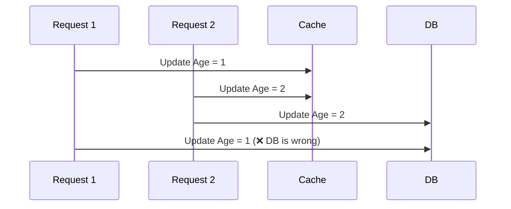

### 2.5.2. Update Cache Later (Ghi DB trước, Cache sau)
Nếu ứng dụng ưu tiên ghi DB trước cho an toàn, rồi mới vòng lên cập nhật Cache, **dữ liệu trên Cache có nguy cơ bị sai (Cache is wrong)**.

*   **Kịch bản Race Condition (2 Write requests):**
    1.  **Request 1** ghi dữ liệu `Age = 1` vào **DB**.
    2.  **Request 2** ghi dữ liệu `Age = 2` vào **DB**.
    3.  **Request 2** ghi dữ liệu `Age = 2` vào **Cache**.
    4.  **Request 1** (do chậm trễ) giờ mới thực hiện ghi `Age = 1` vào **Cache**.
*   **Kết quả:** DB lưu `Age = 2` (Đúng), nhưng Cache lưu `Age = 1` (Sai). Client sẽ tiếp tục đọc phải dữ liệu sai này từ Cache.

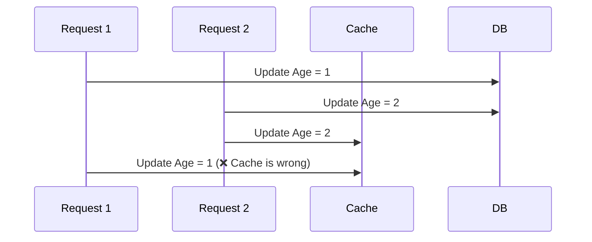

### 2.5.3. Kết luận về nỗ lực "Update Cache"
Việc cập nhật Cache trước hay sau DB (Updating cache first or later) **đều KHÔNG giải quyết được bài toán Data Inconsistency**. Lỗi *Race Condition* sinh ra bởi vì thứ tự thực thi lệnh (Timing) của các luồng mạng trong môi trường phân tán là hoàn toàn không thể đoán trước.

→ **The Second Try: Delete cache?** Liệu thay vì Update, chúng ta chuyển sang chiến lược Invalidate bằng lệnh **Delete** (xóa bản ghi khỏi Cache) thì có giải quyết triệt để được rủi ro này không? 

---

## 2.6. Nỗ lực thứ hai: Xóa Cache (The Second Try: Delete Cache)

Thay vì Update, nếu chúng ta sử dụng chiến lược **Write-Around kết hợp với lệnh Delete Cache**, bài toán đối với 2 luồng Ghi (2 Write requests) sẽ được giải quyết hoàn toàn.

Cho dù 2 luồng ghi có chạy đan xen (Race condition) và thực hiện việc xóa Cache ở bất kỳ thứ tự nào, kết quả cuối cùng luôn an toàn:
*   **DB is right:** Database luôn lưu giá trị của luồng ghi cuối cùng.
*   **No data in cache:** Cache luôn bị xóa rỗng sau khi cả 2 luồng kết thúc (nhờ 2 lệnh Delete). 

→ Dữ liệu sai không bao giờ bị kẹt lại trên Cache! Lần đọc tiếp theo chắc chắn sẽ vào thẳng DB lấy dữ liệu mới nhất.

Tuy nhiên, ứng dụng web không chỉ có luồng Ghi. Vậy điều gì sẽ xảy ra nếu ta kết hợp luồng Ghi (Write-Around) với luồng Đọc (Read-Aside)?
→ **The third try: Read-Aside + Delete Write-Around (gọi tắt là RA + DWA).**

---

## 2.7. Nỗ lực thứ ba: Read Aside + Delete Write Around (RA + DWA)

Ở kiến trúc kết hợp này:
*   **Luồng Ghi (Write Around):** App -> Delete Cache -> Update DB.
*   **Luồng Đọc (Read Aside):** App -> Miss Cache -> Read DB -> Write Back to Cache.

Tưởng chừng hoàn hảo, nhưng sự kết hợp này lại tiếp tục sinh ra **Race Condition giữa 1 luồng Ghi và 1 luồng Đọc**. 

### 2.7.1. Delete Cache First (Xóa Cache trước, Ghi DB sau)
Trường hợp luồng Ghi ưu tiên xóa Cache trước khi cập nhật DB.

*   **Kịch bản Race Condition (1 Write, 1 Read):**
    1.  **Request 1 (Write)** Xóa bản ghi trên Cache.
    2.  **Request 2 (Read)** vào tìm Cache -> Miss.
    3.  **Request 2 (Read)** chui xuống DB đọc và lấy được dữ liệu cũ `Age = 1`.
    4.  **Request 1 (Write)** bây giờ mới cập nhật xong DB thành dữ liệu mới `Age = 2`.
    5.  **Request 2 (Read)** mang dữ liệu cũ `Age = 1` ghi ngược lên Cache (bước Write Back của luồng Read).
*   **Kết quả:** DB lưu `Age = 2` (Đúng), Cache bị ghi đè lại thành `Age = 1` (Sai).

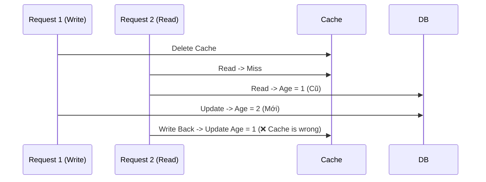

### 2.7.2. Delete Cache Later (Ghi DB trước, Xóa Cache sau)
Trường hợp luồng Ghi ưu tiên lưu DB trước cho an toàn rồi mới xóa Cache.

*   **Kịch bản Race Condition (1 Write, 1 Read):**
    1.  **Request 2 (Read)** tìm Cache -> Miss (do Cache vừa hết hạn hoặc bị xóa từ trước).
    2.  **Request 2 (Read)** xuống DB đọc và lấy được dữ liệu cũ `Age = 1`.
    3.  **Request 1 (Write)** thực hiện cập nhật DB thành `Age = 2`.
    4.  **Request 1 (Write)** thực hiện lệnh Xóa Cache.
    5.  **Request 2 (Read)** (do mạng chậm) bây giờ mới thực hiện bước cuối là ghi ngược lên Cache `Age = 1`.
*   **Kết quả:** DB lưu `Age = 2` (Đúng), Cache lại bị ghi đè thành `Age = 1` (Sai).

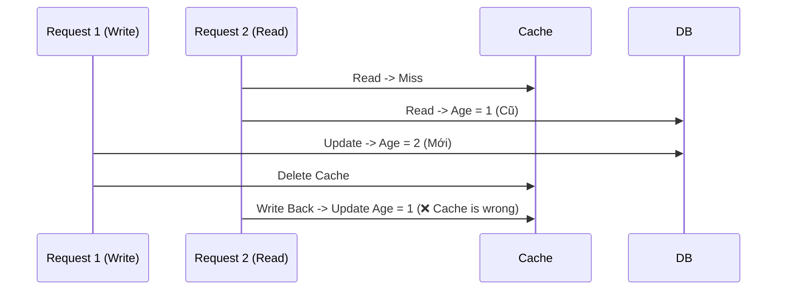

### 2.7.3. Giải pháp: Lựa chọn chiến lược nào? (The Answer)
Như đã chứng minh ở trên, cả 2 cách Delete Cache First và Delete Cache Later đều có khe hở (Race condition). Tuy nhiên, thực tế các hệ thống lớn luôn **chấp nhận và lựa chọn** chiến lược: **Delete Cache Later (Update DB first, delete cache later)** làm chuẩn mực.

**Lý do (Why?):**
*   Trong thực tế, tốc độ ghi vào bộ nhớ RAM (Cache writes) **nhanh hơn cực kỳ nhiều** so với tốc độ ghi xuống đĩa cứng (DB writes).
*   Do đó, khe hở thời gian để xảy ra kịch bản ở mục 2.7.2 là vô cùng hẹp. Xác suất để một luồng Write (bao gồm thao tác cập nhật DB chậm chạp) có thể lọt thỏm vào giữa khoảng thời gian ngắn ngủi khi luồng Read vừa đọc DB xong nhưng chưa kịp Write Back lên Cache là **rất thấp (very low)**.
*   Ngược lại, khe hở ở mục 2.7.1 (Delete Cache First) là rất rộng: Tốc độ Update DB cực chậm nên luồng Read dư sức chạy xen vào giữa để kéo dữ liệu cũ lên Cache.

### 2.7.4. Biện pháp giảm nhẹ (Mitigation)
Mặc dù xác suất xảy ra Race condition của chiến lược **Delete Cache Later** là rất thấp, nhưng dữ liệu sai vẫn có khả năng tồn tại (Data Inconsistency still!). Để giảm thiểu tối đa hậu quả (Mitigate the impact) trong trường hợp xui xẻo xảy ra lỗi ở kịch bản 2.7.2, giải pháp triệt để đi kèm là:

**Sử dụng TTL ngắn (Add short TTL to cache data):** 
Luôn luôn phải cài đặt thời gian sống (TTL) ngắn cho mọi dữ liệu Cache. Nếu luồng đọc lỡ ghi đè dữ liệu cũ lên Cache, dữ liệu sai lệch này cũng sẽ tự động "bốc hơi" sau một khoảng thời gian cực ngắn (ví dụ vài phút), thay vì tồn tại vĩnh viễn và làm hỏng logic của ứng dụng.

---

# 3. Thử thách khi triển khai Cache (Challenges)

Việc đưa Cache vào hệ thống giúp cải thiện hiệu năng, nhưng đồng thời cũng sinh ra vô số thách thức liên quan đến tính ổn định và khả năng chịu tải.

## 3.1. Thử thách về Độ tin cậy (Reliability Challenges)

Thử thách đầu tiên đến từ độ tin cậy của các thao tác tương tác qua mạng giữa Application, Cache và Database.

### 3.1.1. Problem 01: No Atomicity (Không có tính Nguyên tử)

Trong môi trường phân tán, không có gì đảm bảo việc Update DB và Invalidate Cache sẽ cùng thành công hoặc cùng thất bại (No Atomicity).

**Tình huống thực tế (Problem Context):**
*   Khách hàng X cập nhật tuổi từ `33 -> 34`.
*   Khách hàng X phàn nàn rằng hệ thống không cập nhật ngay, mà phải "đợi một lúc" (needs some time to take effect) thì tuổi mới hiển thị đúng.
*   Hệ thống đang sử dụng kiến trúc: **Read-Aside + Write-Around** (Xóa Cache).
*   Profile của khách hàng X đang được lưu trữ trên Cache.

**Nguyên nhân (Cause):**
Quá trình cập nhật Database diễn ra thành công (Updating DB is done), nhưng lệnh gọi xóa Cache qua mạng lại thất bại (Invalidating cache **failed**). 
→ Hậu quả: Giá trị cũ `33` vẫn còn nguyên trong Cache (Old value is in cache still). Client tiếp tục đọc phải giá trị cũ này cho đến khi bản ghi Cache tự động hết hạn (due to TTL) thì mới kéo được giá trị mới `34`.

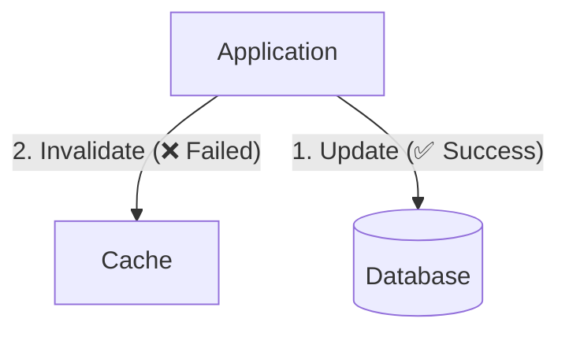

**Giải pháp (Solutions):**
1.  **Retry:** Xây dựng cơ chế gọi lại (Retry) khi thao tác xóa Cache thất bại.
2.  **Subscribe to binlog of DB:** Sử dụng cơ chế lắng nghe sự thay đổi trực tiếp từ Database Binlog (CDC - Change Data Capture) để chủ động phát đi event xóa Cache một cách bất đồng bộ và đáng tin cậy.

### 3.1.2. Problem 02: Cache Avalanche (Hiệu ứng Tuyết lở Cache)

**Vấn đề (Problem):** Hiện tượng "Tuyết lở" xảy ra khi một lượng request khổng lồ đồng loạt xuyên qua Cache và đập thẳng xuống Database, làm Database quá tải và sập (DB down). Có 2 nguyên nhân chính dẫn đến thảm họa này:
1.  **Cache sập đột ngột:** Toàn bộ hệ thống Cache (hoặc một node lớn) bị down (Cache goes down for some reason).
2.  **Đáo hạn diện rộng:** Một lượng khổng lồ dữ liệu Cache đồng loạt hết hạn tại cùng một thời điểm (A large amount of cached data expires at the same time).

Cả hai nguyên nhân trên đều dẫn đến một kết quả: Tại thời điểm có lượng lớn request (a large number of requests) đổ vào, Cache Miss xảy ra ồ ạt, biến DB thành nạn nhân lãnh trọn lượng traffic khổng lồ.

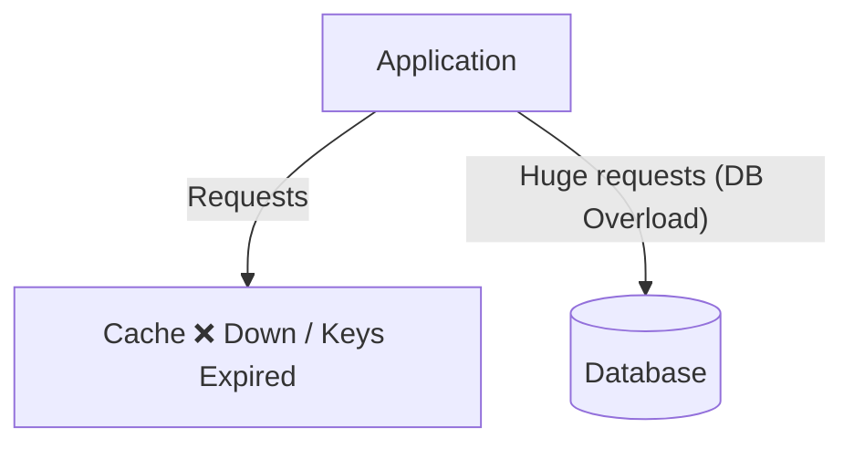

**Giải pháp (Solutions):**
*   **Đối với nguyên nhân "Cache Sập":**
    1.  **Cache Cluster (Cụm Cache):** Triển khai Cache dưới dạng Cluster (HA) để đảm bảo tính sẵn sàng cao.
    2.  **Rate Limit / Circuit Breaker:** Ngắt mạch hoặc giới hạn tốc độ ngay tại tầng Application để bảo vệ DB.
    3.  **Cache Recovery:** Có cơ chế phục hồi và làm nóng Cache (Cache warming) nhanh chóng.
*   **Đối với nguyên nhân "Đáo hạn diện rộng":**
    4.  **Phân bổ đều thời gian hết hạn (Even distribution for the expiration time):** Không cài đặt một mức TTL cố định cho toàn bộ batch dữ liệu. Thay vào đó, cộng thêm một khoảng thời gian ngẫu nhiên (random jitter) vào TTL để các key không bao giờ hết hạn cùng một lúc.
### 3.1.3. Problem 03: Cache Breakdown (Thủng Cache do Hotspot)

Khác với Tuyết lở (do rất nhiều key hết hạn), Cache Breakdown xảy ra chỉ vì **một key duy nhất**, nhưng đó lại là key mang dữ liệu cực kỳ "nóng" (Hotspot data - được truy cập vô số lần mỗi giây).

**Vấn đề (Problem):**
*   Một dữ liệu hotspot trên Cache vừa hết hạn (A hotspot data in the cache expires).
*   Chỉ trong tích tắc ngay sau khi nó hết hạn, hàng vạn request đang tìm kiếm đúng cái key (ví dụ: `k1`) đó không thấy dữ liệu trên Cache (Cache Miss).
*   Hàng vạn request đó đồng loạt lao thẳng xuống Database để truy vấn cùng một bản ghi.
→ **Hậu quả:** Database sập chỉ vì một bản ghi (DB down).

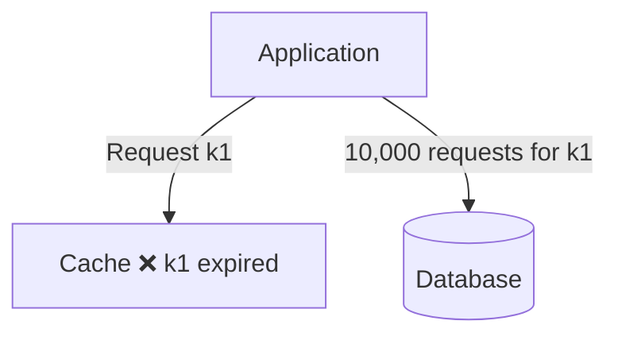

**Giải pháp (Solutions):**
1.  **Không set TTL (Do not set an expiration time):** Đối với các dữ liệu hotspot (như tỷ số bóng đá trực tiếp, flash sale), không set thời gian hết hạn hoặc set rất dài.
2.  **Background Job:** Chạy các tiến trình ngầm (Background job) để chủ động cập nhật dữ liệu Cache định kỳ *trước khi nó kịp hết hạn* (Update cache periodically or before the cache expires).
3.  **Locking / Mutex:** Khi Cache Miss xảy ra, không cho phép tất cả request chạy thẳng xuống DB. Thay vào đó, dùng cơ chế khóa (Mutex Lock). Chỉ cho phép 1 request duy nhất chui xuống DB lấy dữ liệu và cập nhật lên Cache, các request khác đứng đợi và lấy dữ liệu từ Cache sau khi đã được request đầu tiên nạp lên.

### 3.1.4. Problem 04: Cache Penetration (Xuyên thủng Cache)

Nếu Breakdown là do dữ liệu có thật nhưng bị hết hạn, thì Penetration là bài toán về **dữ liệu ma** (dữ liệu không hề tồn tại).

**Vấn đề (Problem):**
*   Một dữ liệu hoàn toàn không tồn tại (There is data neither in cache nor in DB). Ví dụ: user tìm kiếm ID = -1.
*   Kẻ tấn công (Attacker) cố tình tung ra một lượng lớn request truy vấn vào các key "ma" này.
*   Theo logic thông thường: Cache Miss -> Ứng dụng chui xuống DB tìm -> DB Miss -> Trả về rỗng. 
→ **Hậu quả:** Vì dữ liệu không bao giờ được ghi lên Cache (do DB không có), nên mọi request "ma" đều dễ dàng xuyên thẳng qua Cache và đâm liên tục vào DB (cache miss → DB miss → DB down).

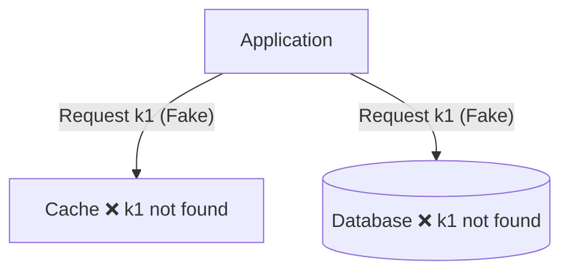

**Giải pháp (Solutions):**
1.  **Set default value (Set giá trị mặc định):** Ngay cả khi DB trả về rỗng (Miss), hãy lưu luôn kết quả "rỗng" đó (ví dụ: `0`, `null`, `[]`) lên Cache kèm một TTL ngắn. Các request ma sau đó sẽ bị chặn lại ở Cache.
2.  **Validate requests (Xác thực đầu vào):** Chặn các request có tham số phi lý ngay tại Application (Ví dụ: ID < 0, ID sai định dạng).
3.  **Bloom Filter:** Sử dụng cấu trúc dữ liệu Bloom Filter để kiểm tra siêu tốc xem một key *chắc chắn không tồn tại* trong hệ thống hay không. Nhờ đó, ứng dụng có thể từ chối request ngay ở cửa mà không cần đụng đến DB.

---

## 3.2. Thử thách khi Hệ thống tải cao (High Traffic Challenges)

Khi hệ thống đối mặt với lượng truy cập khổng lồ (High Traffic), cấu trúc dữ liệu lưu trong Cache bắt đầu bộc lộ những điểm yếu chí mạng.

### 3.2.1. Problem 05: Hot Keys (Key siêu nóng)

**Vấn đề (Problem):** 
Chỉ một số ít key (a few keys) nhưng lại gánh lượng truy cập cực kỳ khổng lồ (a lot of traffic). 
Ví dụ: Sản phẩm Flash Sale đang diễn ra, hoặc bài đăng của idol trên mạng xã hội. 
Mặc dù hệ thống Cache đã được chia thành nhiều node (Cache Cluster), nhưng do cơ chế hash, các truy vấn vào cùng 1 key luôn được điều hướng vào đúng 1 node duy nhất.
→ **Hậu quả:** Node Cache chứa Hot Key bị nghẽn cổ chai (Bottle-neck) và sập, trong khi các node khác lại rảnh rỗi.

```mermaid
graph TD
    App[Application]
    Node1[Cache Node 01 <br/> k34, k88 ❌ Sập]
    Node2[Cache Node 02]
    Node3[Cache Node 03]
    
    App -- "90% Traffic (k34, k88)" ==> Node1
    App -- "5% Traffic" --> Node2
    App -- "5% Traffic" --> Node3
```

**Giải pháp (Solutions):**
1.  **Replication / Sharding Hot Keys:** Sao chép một hot key thành nhiều bản sao (ví dụ: `k34_1`, `k34_2`, `k34_3`) và phân tán đều chúng ra nhiều node khác nhau. Phía Application sẽ tự động thêm hậu tố ngẫu nhiên (random suffix) khi truy vấn để dàn đều tải (Distribute the keys across multiple nodes).
2.  **Local Cache (Bộ nhớ đệm cục bộ):** Lưu trữ trực tiếp các Hot Key ngay trên bộ nhớ RAM của chính máy chủ Application (Local cache to hot keys). Lớp Local Cache này sẽ cản 99% lượng truy cập trước khi nó kịp chạm đến hệ thống Cache tập trung.

### 3.2.2. Problem 06: Large Key (Key quá khổ)

**Vấn đề (Problem):**
Dữ liệu của một key (size of value) có kích thước lớn bất thường (significantly large). Ví dụ: `key34` có value lên tới 5MB.
→ **Hậu quả:** Thao tác đọc/ghi một cục dữ liệu 5MB qua mạng (Network I/O) tốn rất nhiều thời gian, làm kẹt luồng xử lý của Cache Server (đặc biệt là Redis vốn chạy đơn luồng), dẫn đến **Timeout** cho chính request đó và gây độ trễ cho hàng loạt request khác đang xếp hàng chờ.

```mermaid
graph TD
    App[Application]
    Cache[Cache]
    
    App -- "1. Get key34" --> Cache
    Cache -- "2. Trả về dữ liệu 5MB (Chậm)" -.-> App
    App -- "3. ❌ Timeout" --> Cache
```

**Giải pháp (Solutions):**
1.  **Compress (Nén):** Nén dữ liệu trước khi lưu vào Cache và giải nén tại Application.
2.  **Split (Chia nhỏ):** Cắt dữ liệu 5MB thành nhiều cục nhỏ (ví dụ 5 cục 1MB), lưu dưới các key khác nhau và truy xuất song song.
3.  **Longer TTL:** Cài đặt TTL dài hơn (Set a longer TTL) cho các Large Key vì chi phí tạo lại (re-generate) chúng là rất đắt đỏ.
4.  **Limit Number:** Hạn chế tối đa việc sinh ra các Large Key trên hệ thống (Limit the number of large keys).
5.  **Right Storage:** Lựa chọn đúng loại storage (Choose the right storage). Những dữ liệu quá lớn không nên nhét vào In-memory Cache, mà nên lưu ở Object Storage (S3, MinIO) kết hợp CDN.

---

## 3.3. Thu hồi bộ nhớ (Cache Replacement)

Bộ nhớ RAM chứa Cache luôn đắt đỏ và có giới hạn. Hệ thống sẽ làm gì khi Cache cạn kiệt dung lượng (What if the cache is running out of memory)? 
Lúc này, các thuật toán "Trục xuất" (Cache Replacement / Eviction Policies) sẽ tự động xóa bớt dữ liệu cũ lấy chỗ cho dữ liệu mới:

*   **LRU (Least Recently Used):** Xóa những key *đã lâu không được truy cập* (thời gian truy cập cuối cùng xa nhất).
    *   *Use case:* Thích hợp giữ lại các **Hot Keys** (vì Hot Key luôn được truy cập liên tục, thời gian truy cập gần).
*   **LFU (Least Frequently Used):** Xóa những key *có tổng số lần được truy cập ít nhất*.
    *   *Use case:* Thích hợp cho **Hot Tweets** (những bài post có tần suất tương tác cao sẽ được giữ lại, bài viết ít người quan tâm bị xóa dù có mới được đọc gần đây).
*   **LRU + LFU:** Kết hợp cả 2 yếu tố để ra quyết định trục xuất.

---

# Tổng kết (Recap)

Việc thiết kế hệ thống Caching đòi hỏi sự am hiểu sâu sắc về ứng dụng, không có công thức chung hoàn hảo. Kỹ sư cần nhớ các nguyên tắc cốt lõi:

1.  **Evaluate data access patterns first:** Luôn đánh giá kỹ hành vi đọc/ghi của dữ liệu trước khi chọn chiến lược.
2.  **Popular combination:** Trong hầu hết các bài toán thực tế, sự kết hợp phổ biến và hiệu quả nhất là **Read-Aside + Write-Around (sử dụng lệnh Delete Cache)**.
3.  **Cache Invalidation is hard:** Bài toán vô hiệu hóa/thu hồi Cache cực kỳ khó vì sự bùng nổ của môi trường phân tán:
    *   *Timing:* Thời gian trễ của mạng không thể đoán trước.
    *   *Concurrency:* Xử lý tranh chấp dữ liệu (Race Condition).
    *   *Cache can be anywhere:* Cache không chỉ nằm ở backend server, mà còn phân bố ở CDN, Browser, Local RAM... 

> **Best Practice:** Bộ Cache lý tưởng là luôn giữ cho **Key nhỏ nhất có thể (Small keys)**, thiết lập **Vòng đời ngắn nhất có thể (Short TTL)**, và kết hợp với các **Background Job** chạy ngầm để tự động hóa việc đồng bộ dữ liệu.
