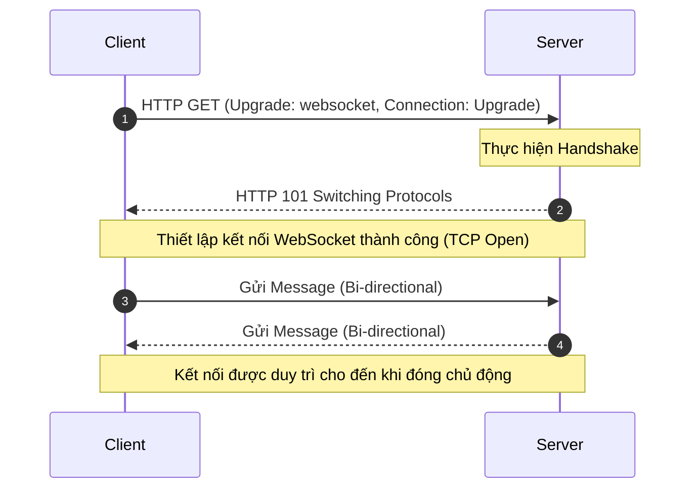
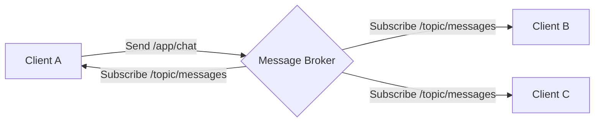

# Realtime Application & WebSocket

> **Tác giả:** ManhDX - EngineerPro  
> **Chuyên đề:** Thiết kế ứng dụng thời gian thực (Realtime Application) sử dụng giao thức WebSocket.

<b>Mục lục (Table of Contents)</b>

- [1. Giới thiệu về WebSocket](#1-giới-thiệu-về-websocket)
  - [1.1. Khái niệm cơ bản](#11-khái-niệm-cơ-bản)
  - [1.2. Cơ chế hoạt động (Handshake & Upgrade)](#12-cơ-chế-hoạt-động-handshake--upgrade)
- [2. So sánh Công nghệ](#2-so-sánh-công-nghệ)
  - [2.1. WebSocket vs HTTP](#21-websocket-vs-http)
  - [2.2. WebSocket vs REST API](#22-websocket-vs-rest-api)
- [3. Trường hợp sử dụng (Use Cases)](#3-trường-hợp-sử-dụng-use-cases)
- [4. Luồng xử lý dữ liệu (Flow of Messages)](#4-luồng-xử-lý-dữ-liệu-flow-of-messages)
- [5. Demo thực hành](#5-demo-thực-hành)

---

## 1. Giới thiệu về WebSocket

### 1.1. Khái niệm cơ bản
*   **Giao thức WebSocket** cung cấp một tiêu chuẩn để thiết lập kênh liên lạc hai chiều (Full-Duplex) giữa client và máy chủ thông qua một kết nối TCP duy nhất.
*   Giải quyết triệt để hạn chế của cơ chế HTTP request-response truyền thống (vốn đòi hỏi client phải liên tục gửi yêu cầu để kiểm tra dữ liệu mới - Polling).

### 1.2. Cơ chế hoạt động (Handshake & Upgrade)
*   **Bắt đầu bằng HTTP Request:** Kết nối WebSocket được khởi tạo bằng cách gửi một HTTP Request từ client lên server sử dụng header đặc biệt `Upgrade: websocket` để yêu cầu chuyển đổi giao thức.
*   **Duy trì kết nối (Persistent Connection):** Sau khi quá trình Handshake thành công, kết nối TCP phía dưới sẽ được giữ mở liên tục. Client và Server có thể chủ động gửi và nhận các thông điệp (messages) bất cứ lúc nào với độ trễ tối thiểu.

---

## 2. So sánh Công nghệ

### 2.1. WebSocket vs HTTP

| Đặc tính | HTTP | WebSocket |
| :--- | :--- | :--- |
| **URL** | Nhiều URLs khác nhau (mỗi endpoint thực hiện một nhiệm vụ). Server sẽ định tuyến request dựa trên đường dẫn URL. | Thường chỉ sử dụng **1 URL duy nhất** để kết nối. |
| **Ngữ nghĩa (Semantics)** | Tuân thủ nghiêm ngặt các quy tắc định dạng, phương thức (GET, POST, PUT, DELETE) và mã trạng thái của giao thức HTTP. | Thuộc lớp cấp thấp (Low-level). Giao thức không quy định bất kỳ ngữ nghĩa cụ thể nào đối với nội dung của thông điệp. |
| **Giao thức lớp trên** | Thường chạy trực tiếp payload JSON/XML trên nền HTTP. | Client và Server có thể thoả thuận sử dụng chung một giao thức lớp trên (Higher-level protocol) như **STOMP** hoặc **WAMP** để chuẩn hóa định dạng message. |

### 2.2. WebSocket vs REST API

*   **REST APIs:**
    *   Dựa trên giao thức HTTP, hoạt động theo cơ chế phi trạng thái (Stateless communication).
    *   Mô hình Request-Response (Client hỏi - Server trả lời).
    *   Phù hợp cho các thao tác CRUD truyền thống và các dữ liệu cập nhật không quá thường xuyên.
*   **WebSockets:**
    *   Duy trì kết nối liên tục (Persistent connection).
    *   Liên lạc thời gian thực (Real-time communication).
    *   Phù hợp nhất cho các ứng dụng yêu cầu cập nhật trạng thái liên tục (ví dụ: Chat apps, Live Notifications, Dashboard chỉ số trực tuyến).

---

## 3. Trường hợp sử dụng (Use Cases)

Giao thức WebSocket cực kỳ hiệu quả đối với các **Real-time Applications** có các đặc trưng:
1.  **Độ trễ thấp (Low Latency):** Cập nhật ngay lập tức.
2.  **Tần suất cao (High Frequency):** Nhiều thông điệp được truyền đi liên tục.
3.  **Tải trọng cao (High Volume):** Truyền tải lượng lớn dữ liệu hai chiều.

**Các ứng dụng thực tế điển hình:**
*   Game trực tuyến nhiều người chơi (Online Multiplayer Games).
*   Bảng theo dõi thị trường tài chính, chứng khoán, tiền số (Financial & Crypto Dashboards).
*   Ứng dụng làm việc cộng tác thời gian thực (Collaboration Apps như Google Docs, Figma).
*   Ứng dụng trò chuyện trực tuyến (Chat Applications, Call Center).

---

## 4. Luồng xử lý dữ liệu (Flow of Messages)

Khi ứng dụng sử dụng các thư viện như Spring WebSocket kết hợp với STOMP, luồng thông điệp được chia sẻ qua các Message Broker:

---

## 5. Demo thực hành

Học phần này đi kèm các mã nguồn demo thực tế:
*   **Realtime Scoreboard:** Ứng dụng cập nhật bảng điểm thể thao thời gian thực tự động push từ máy chủ.
*   **Realtime Chat:** Ứng dụng phòng trò chuyện trực tuyến cho phép các client gửi nhận tin nhắn tức thời.
